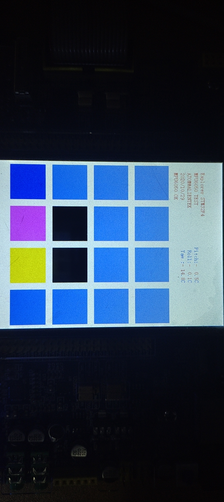

# yjc-stm32f407zg学习

[](.)

***
## 改变学习策略，不再注重底层驱动实现

欢迎懂行的兄弟(*说的就是你*)update


本仓库包含以下内容：

1. stm32学习笔记(虽然是搬运的，但是好歹看了一遍)
2. 自己写的一些stm32 **toy**

​                                                                                      

## 内容列表

- [TODO](#TODO)
- [更新](#更新)
- [前言](#前言)
- [目录](#目录)
- [背景](#背景)
- [安装](#安装)
- [示例](#示例)
- [相关仓库](#相关仓库)
- [维护者](#维护者)
- [如何贡献](#如何贡献)
- [使用许可](#使用许可)

## TODO

- 游戏
    - 俄罗斯方块
    - 2048(已完成)
    - 八分音符酱
    - 贪吃蛇必须要安排(已完成)
- 基础很多不会

## 更新

- 2020年10月29日20:52:12 更新  [2048](demo\2048) 
    - 若有bug 欢迎提交issue
  
- 2020年10月28日10:46:04 更新  [ch02-stm32HardWare](contents\ch02-stm32HardWare) 
  
    - 复习了一下硬件基础，准备干活
    
- 2020年10月27日13:06:29更新  [chi-DAC](contents\chi-DAC) 
  
    1. #### **开启** **PA** **口时钟，设置** **PA4** **为模拟输入。**
    2. **使能** **DAC1** **时钟。** 
    3. **初始化** **DAC,****设置** **DAC** **的工作模式。** 
    4. **使能** **DAC** **转换通道**
    5. **设置** **DAC** **的输出值。** 
    
- 2020年10月27日13:06:23 更新 [chh-lightSensor](contents\chh-lightSensor) 
  
    - 读取` LIGHT_SENSOR（PF7）`上面的电压，即可得到环境光线的强弱。光线越强，电压越低，光 线越暗，电压越高。 
    
- 2020年10月27日13:06:04 更新  [chg-tempSensor](contents\chg-tempSensor) 
    1. **设置** **ADC1****，开启内部温度传感器。**
    2. **读取通道** **16** **的** **AD** **值，计算结果。** 
    
- 2020年10月27日13:05:54 更新  [chf-ADC](contents\chf-ADC) 
    1. 使能随机数发生器时钟。
    2. **使能随机数发生器。** 
    3. **判断** **DRDY** **位**
    4. **读取随机数值。** 
    
-  2020年10月27日13:05:39 更新[che-wakeup](contents\che-wakeup) 
    1. 禁止 RTC 中断（ALRAIE、ALRBIE、WUTIE、TAMPIE 和 TSIE 等）。 
    2. 清零对应中断标志位。 
    3. 清除 PWR 唤醒(WUF)标志（通过设置 PWR_CR 的 CWUF 位实现）。 
    4. 重新使能 RTC 对应中断。 
    5. 进入低功耗模式。 
    
- 2020年10月27日12:44:05 更新 [chd-random](contents\chd-random) 
    - 随机数发生器操作步骤如下： 
        1. 使能随机数发生器时钟。
        2. **使能随机数发生器。** 
        3. **判断** **DRDY** **位**
        4. **读取随机数值。** 
    
- 2020年10月27日12:43:15 自暴自弃了，**改变学习策略，不再注重底层驱动实现**
    - 太累了，而且关键是看不懂！！
    - stm32的知识海量繁杂，我想..这样做是明智的
    - 前面的还能看懂，后面开始的就太超纲了
    
- 2020年10月27日12:43:05 更新  [chc-RTC](contents\chc-RTC) 
    - RTC 一般配置步骤
        1. **使能电源时钟，并使能** **RTC** **及** **RTC** **后备寄存器写访问。**
        2. **开启外部低速振荡器，选择** **RTC** **时钟，并使能。**
        3. **初始化** **RTC****，设置** **RTC** **的分频，以及配置** **RTC** **参数。**
        4. **设置** **RTC** **的时间。** 
        5. **设置** **RTC** **的日期。** 
        6. **获取** **RTC** **当前日期和时间。**
    
- 2020年10月27日11:22:48 更新  [chb-usmart](contents\chb-usmart) 
    - 使用串口调试的步骤:
        - 第一步，添加需要调用的函数（在 usmart_config.c 里 面的 usmart_nametab 数组里面添加）；
        - 第二步，初始化串口；
        - 第三步，初始化 USMART（通过 usmart_init 函数实现）；
        - 第四步，轮询 usmart_scan 函数，处理串口数据。 
    
- 2020年10月26日19:41:56 更新 [ch7-PWM](contents\ch7-PWM) 
    - 显然PWM我们已经接触过两次了，那么32就比较复杂了
    - 开启PWM步骤为
        - **开启** **TIM14** **和** **GPIO** **时钟，配置** **PF9** **选择复用功能** **AF9****（****TIM14****）输出。** 
        - **初始化** **TIM14,****设置** **TIM14** **的** **ARR** **和** **PSC** **等参数。**
            - arr=自动重装载值
            - psc=预分频值 
        - **设置** **TIM14_CH1** **的** **PWM** **模式，使能** **TIM14** **的** **CH1** **输出。**
            - `TIM_OC1Init()。 `
            - `TIM_OCMode= TIM_OCMode_PWM1`
        - **使能** **TIM14****。** 
            - `TIM_Cmd(TIM14, ENABLE); `
        - **修改** **TIM14_CCR1** **来控制占空比。**
            - `TIM_SetComparex(x=1,2,3,4)`
    
- 2020年10月26日12:11:29 了解了32的[定时器中断](contents\ch6-timer) 
    - 发现也是差不多的，大概步骤一样
        1. ****TIM3** **时钟使能。**
        2. **初始化定时器参数****,****设置自动重装值，分频系数，计数方式等。** 
        3. **设置** **TIM3_DIER** **允许更新中断。**
        4. **TIM3** **中断优先级设置。** 
        5. **允许** **TIM3** **工作，也就是使能** **TIM3****。**
        6. **编写中断服务函数。**
    
- 2020年10月25日22:37:35 学了一下32的中断[外部中断实验](./contents/ch5-interruption)
    - 和51的思路是一样的，就是细化了一点，有了更多自由空间，大体步骤为
        1. 使能 IO 口时钟，初始化 IO 口为输入。
        2. 使能 SYSCFG 时钟，设置 IO 口与中断线的映射关系。
        3. 初始化线上中断，设置触发条件等。
        4. 配置中断分组（NVIC），并使能中断。
        5. 编写中断服务函数。
    
- 2020年10月25日15:19:42 成功运行[贪吃蛇](./demo/mYsnake)
    - 如有bug请提交issue麻烦了
    - 目前已知bug：
        - 随机数食物生成有bug
            - 因为不知道怎么生成随机数
    
- 2020年10月23日20:51:08 update cha-[TFTLCD显示屏](./contents/cha-TFTLCD) 
  
    - 这一章很难,推荐选读，我们只需要去知道怎么调函数就好hhh
    
- 2020年10月22日22:19:14 update ch4-[串口通信实验](./contents/ch4-serialPort) 和 ch01-[快速组织代码](./contents/ch01-quickExample)
    - 串口设置的一般步骤可以总结为如下几个步骤：
        1. 串口时钟使能，GPIO 时钟使能。 设置引脚复用器映射：调用` GPIO_PinAFConfig `函数。 
        3. GPIO 初始化设置：要设置模式为复用功能。 
        4. 串口参数初始化：设置波特率，字长，奇偶校验等参数。 
        5. 开启中断并且初始化 NVIC，使能中断（如果需要开启中断才需要这个步骤）。 
        6. 使能串口。 
        7. 编写中断处理函数：函数名格式为 `USARTxIRQHandler(x 对应串口号)。 `
    
- 2020年10月22日19:02:19 update ch2-[蜂鸣器](./contents/ch2-beep)和ch3-[键盘输入](./contents/ch3-keyinput)
    - 蜂鸣器
        - `#define BEEP PFout(8)`
        -  `GPIO_ResetBits(GPIOF,GPIO_Pin_8);  //蜂鸣器对应引脚GPIOF8拉低， `
    - 键盘输入
        - KEY0 连接在 PE4 上
        - KEY1 连接在 PE3 上
        - KEY2 连接在 PE2 上
        - KEY_UP连接在 PA0 上
        - **KEY0、KEY1 和 KEY2 是低电平有效的，而 KEY_UP 是高电平有效**
        - 使能GPIOA,GPIOE对应的脚即可
    
- 2020年10月21日23:25:30 update ch1-[跑马灯](./contents/ch1-ledwater)
    - **在配置 STM32 外设的时候，任何时候都要先使能该外设的时钟！**
    - 可使用3种方法获取引脚变量
        - `GPIO_SetBits(GPIOF, GPIO_Pin_9);`
            - GPIOX在原理图上已标注
        - `#define LED0 PFout(9)`
        - `GPIOF->BSRRH=GPIO_Pin_9;`
    
- 2020年10月21日12:08:58 update readme.md

## 前言

在学习前，推荐阅读

1.  [ch0-template](contents\ch0-template) 
2.  [ch02-stm32HardWare](contents\ch02-stm32HardWare) 
3.  [ch03-stm32standard](contents\ch03-stm32standard) 
4.  [ch04-system](contents\ch04-system) 
5.  [快速组织代码技巧](./contents/ch01-quickexample)

### **STM32F4** **学习方法** 

为 STM32F4 作为目前最热门的 ARM Cortex M4 处理器，由于其强大的功能，可替代 DSP等特性，正在被越来越多的公司选择使用。

学习 STM32F4 的朋友也越来越多，初学者，可能会认为 STM32F4 很难学，以前可能只学过 51，或者甚至连 51 都没学过的，一看到 STM32F4 那么多寄存器，就懵了。

其实，万事开头难，只要掌握了方法，学好 STM32F4，还是非常简单的，这里我们总结学习 STM32F4 的几个要点： 

#### **1****，一款实用的开发板。** 

这个是实验的基础，有个开发板在手，什么东西都可以直观的看到。但开发板不宜多，多了的话连自己都不知道该学哪个了，觉得这个也还可以，那个也不错，那就这个学半天，那个学半天，结果学个四不像。倒不如从一而终，学完一个在学另外一个。 

#### **2****，三本参考资料

即《STM32F4xx** **中文参考手册》、《****STM32F3** **与** **F4** **系列** **Cortex M4** **内核编程手册》和《****Cortex M3** **与** **M4** **权威指南》。** 

《STM32F4xx 中文参考手册》是 ST 出的官方资料，有 STM32F4 的详细介绍，包括了 STM32F4 的各种寄存器定义以及功能等，是学习 STM32F4 的必备资料之一。而《STM32F3 与 F4 系列 Cortex M4 内核编程手册》则是对《STM32F4xx 中文参考手册》的补充，很多关于 Cortex  M4 内核的介绍（寄存器等），都可以在这个文档找到答案，该文档同样是 ST 的官方资料，专 门针对 ST 的 Cortex M4 产品。

最后，《Cortex M3 与 M4 权威指南》则针对 Cortex M4 内核进行 了详细介绍，并配有简单实例，对于想深入了解Cortex M4 内核的朋友，此文档是非常好的参考资料

### **3****，掌握方法，勤学善悟。** 

STM32F4 不是妖魔鬼怪，不要畏难，STM32F4 的学习和普通单片机一样，基本方法就是： 

#### a) 掌握时钟树图（见《STM32F4xx 中文参考手册》图 13）。 

任何单片机，必定是靠时钟驱动的，时钟就是单片机的动力，STM32F4 也不例外，通过时钟树，我们可以知道，各种外设的时钟是怎么来的？有什么限制？从而理清思路，方便理解。 

#### b) 多思考，多动手。 

所谓熟能生巧，先要熟，才能巧。如何熟悉？这就要靠大家自己动手，多多练习了，光看说，是没什么太多用的，很多人问我，STM32F4 这么多寄存器，如何记得啊？

回答是：不需要 全部记住。学习 STM32F4，不是应试教育，不需要考试，不需要你倒背如流。

你只需要知道这 些寄存器，在哪个地方，用到的时候，可以迅速查找到，就可以了。完全是可以翻书，可以查 资料的，可以抄袭的，不需要死记硬背。

掌握学习的方法，远比掌握学习的内容重要的多。 

熟悉了之后，就应该进一步思考，也就是所谓的巧了。我们提供了几十个例程，供大家学 习，跟着例程走，无非就是熟悉 STM32F4 的过程，只有进一步思考，才能更好的掌握 STM32F4， 也即所谓的举一反三。

例程是死的，人是活的，所以，可以在例程的基础上，自由发挥，实现 更多的其他功能，并总结规律，为以后的学习/使用打下坚实的基础，如此，方能信手拈来。 

所以，学习一定要自己动手，光看视频，光看文档，是不行的。举个简单的例子，你看视 频，教你如何煮饭，几分钟估计你就觉得学会了。

实际上你可以自己测试下，是否真能煮好？ 机会总是留给有准备的人，只有平时多做准备，才可能抓住机会。

## 目录

0. [项目模板](./contents/ch0-template)
1. [快速组织代码](./contents/ch01-quickexample)
2. [跑马灯](./contents/ch1-ledwater)
3. [蜂鸣器](./contents/ch2-beep)
4. [键盘输入](./contents/ch3-keyinput)
5. [串口通信实验](./contents/ch4-serialport)
6. [TFTLCD显示屏](./contents/cha-TFTLCD)  
7. [外部中断实验](./contents/ch5-interruption)
8. [贪吃蛇](./demo/mYsnake)
9.  [chb-usmart](contents\chb-usmart) 
10.  [chc-RTC](contents\chc-RTC) 
11.  [chd-random](contents\chd-random) 
12.  [che-wakeup](contents\che-wakeup) 
13.  [chf-ADC](contents\chf-ADC) 
14.  [chg-tempSensor](contents\chg-tempSensor) 
15.  [chh-lightSensor](contents\chh-lightSensor) 
16.  [chi-DAC](contents\chi-DAC) 
17.  [2048](demo\2048) 


## 背景

感谢兴爷，感谢苍天，感谢父母，让我遇见如此的小幸运  

我一定不会辜负兴爷的


这个仓库的目标是：

1. 贪吃蛇（已完成)
2. 俄罗斯方块

## 安装

参考[这个比较全，啥都有](https://www.bilibili.com/video/BV1Rx411R75t?p=6)

```sh
如果出现问题，请提交issue！！
```

## 示例

### 陀螺仪2048



### Rainbowsnake


## 相关仓库

- [yjc-BST-M51-learning](https://github.com/yujiecong/yjc-BST-M51-learning)
- [yjc-PrechinA2-learning](https://github.com/yujiecong/yjc-PrechinA2-learning)

## 维护者

[@yujiecong](https://github.com/yujiecong)。

## 如何贡献

非常欢迎你的加入！[提一个 Issue](https://github.com/ZHKU-Robot/yjc-stm32f407-learning/issues/new) 或者提交一个 Pull Request。


本 Readme 遵循 [Contributor Covenant](http://contributor-covenant.org/version/1/3/0/) 行为规范。

### 贡献者

感谢以下参与项目的人：  
<a href="graphs/contributors"></a>


## 使用许可
[MIT License](./LICENSE)