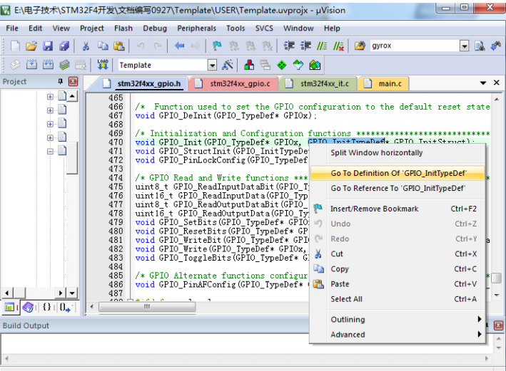

# MDK 固件库快速组织代码技巧

这一节主要讲解在使用 MDK 固件库开发的时候的一些小技巧，仅供初学者参考。

这节的知识大家可以在学习第一个跑马灯实验的时候参考一下，对初学者应该很有帮助。
我们就用最简单的 GPIO 初始化函数为例。

现在我们要初始化某个 GPIO 端口，我们要怎样快速操作呢？在头文件 stm32f4xx_gpio.h
头文件中，定义 GPIO 初始化函数为：
```
void GPIO_Init(GPIO_TypeDef* GPIOx, GPIO_InitTypeDef* GPIO_InitStruct);
```
现在我们想写初始化函数，那么我们在不参考其他代码的前提下，怎么组织代码呢？
首先，我们可以看出，函数的入口参数是 GPIO_TypeDef 类型指针和 GPIO_InitTypeDef 类
型 指 针 ， 因 为 GPIO_TypeDef 入 口 参 数 比 较 简 单 ， 所 以 我 们 通 过 第 二 个 入 口 参 数
GPIO_InitTypeDef 类型指针来讲解。双击 GPIO_InitTypeDef 后右键选择“Go to definition…”，如
下图



来决定的。

首先得问，什么是GPIO(General Purpose Input and Output)？

> GPIO（英语：General-purpose input/output），通用型之输入输出的简称，功能类似8051的P0—P3，其接脚可以供使用者由程控自由使用，PIN脚依现实考量可作为通用输入（GPI）或通用输出（GPO）或通用输入与输出（GPIO），如当clk generator, chip select等。

在使用这些IO的时候，需要初始化，在32里在头文件 stm32f4xx_gpio.h头文件中，定义 GPIO 初始化函数为：
```
void GPIO_Init(GPIO_TypeDef* GPIOx, GPIO_InitTypeDef* GPIO_InitStruct);
```

首先，我们可以看出，函数的入口参数是 GPIO_TypeDef 类型指针和 GPIO_InitTypeDef 类
型指针

因 为 GPIO_TypeDef 入 口 参 数 比 较 简 单 ， 所 以 我 们 通 过 第 二 个 入口参数
GPIO_InitTypeDef 类型指针来讲解。

容易找到
```
typedef struct
{
  uint32_t GPIO_Pin;              /*!< Specifies the GPIO pins to be configured.
                                       This parameter can be any value of @ref GPIO_pins_define */

  GPIOMode_TypeDef GPIO_Mode;     /*!< Specifies the operating mode for the selected pins.
                                       This parameter can be a value of @ref GPIOMode_TypeDef */

  GPIOSpeed_TypeDef GPIO_Speed;   /*!< Specifies the speed for the selected pins.
                                       This parameter can be a value of @ref GPIOSpeed_TypeDef */

  GPIOOType_TypeDef GPIO_OType;   /*!< Specifies the operating output type for the selected pins.
                                       This parameter can be a value of @ref GPIOOType_TypeDef */

  GPIOPuPd_TypeDef GPIO_PuPd;     /*!< Specifies the operating Pull-up/Pull down for the selected pins.
                                       This parameter can be a value of @ref GPIOPuPd_TypeDef */
}GPIO_InitTypeDef;
```
这里的英文不难，容易看出

这个结构体有 5 个成员变量，这也告诉我们一个信息，一个 GPIO 口的状态是由以下属性来决定的。
- 模式（GPIO_Mode）
- 速度(GPIO_Speed)
- 输出类型（GPIO_OType）
- 上下拉属性（GPIO_PuPd）

接下来就比较明显了，我们定义这个初始化函数的结构体填入数据即可
```
GPIO_InitTypeDef GPIO_InitStructure;
```
但是都不知道填什么都，那咋办嘛  
首先我们要初始化成员变量 GPIO_Pin,这个时候我们就有点迷糊了，这个变量到底可以设置哪些值呢？这些值的范围有什么规定吗？

这里我们就要找到 GPIO_Init()函数的实现处，同样，双击 GPIO_Init，右键点击“Go to 
definition of …”,这样光标定位到 stm32f4xx_gpio.c 文件中的 GPIO_Init 函数体开始处，我们可以看到在函数的开始处有如下几行：
```
  /* Check the parameters */
  assert_param(IS_GPIO_ALL_PERIPH(GPIOx));
  assert_param(IS_GPIO_PIN(GPIO_InitStruct->GPIO_Pin));
  assert_param(IS_GPIO_MODE(GPIO_InitStruct->GPIO_Mode));
  assert_param(IS_GPIO_PUPD(GPIO_InitStruct->GPIO_PuPd));

```
注意到是检查有效性的函数，那么我们就可以继续看看了
```
#define IS_GPIO_ALL_PERIPH(PERIPH) (((PERIPH) == GPIOA) || \
                                    ((PERIPH) == GPIOB) || \
                                    ((PERIPH) == GPIOC) || \
                                    ((PERIPH) == GPIOD) || \
                                    ((PERIPH) == GPIOE) || \
                                    ((PERIPH) == GPIOF) || \
                                    ((PERIPH) == GPIOG) || \
                                    ((PERIPH) == GPIOH) || \
                                    ((PERIPH) == GPIOI) || \
                                    ((PERIPH) == GPIOJ) || \
                                    ((PERIPH) == GPIOK))

```
很明显可以看出，GPIOx 的取值规定只允许是 GPIOA~GPIOK。具体调用哪个就要看时钟树了  


同样的办法，我们双击“IS_GPIO_MODE” 右键点击“go to defition of…”,定位到下面的定义：

```
typedef enum
{ 
 GPIO_Mode_IN = 0x00, /*!< GPIO Input Mode */
 GPIO_Mode_OUT = 0x01, /*!< GPIO Output Mode */
 GPIO_Mode_AF = 0x02, /*!< GPIO Alternate function Mode */
 GPIO_Mode_AN = 0x03 /*!< GPIO Analog Mode */
}GPIOMode_TypeDef;
#define IS_GPIO_MODE(MODE) (((MODE) == GPIO_Mode_IN) || 
((MODE) == GPIO_Mode_OUT) || \
 ((MODE) == GPIO_Mode_AF)||
((MODE) == GPIO_Mode_AN))
```
所以 GPIO_InitStruct->GPIO_Mode 成员的取值范围只能是上面定义的 4 种。这 4 种模式是通过
一个枚举类型组织在一起的。

同样的方法我们双击“IS_GPIO_PIN” 右键点击“go to defition of…”,定位到下面的定义：
```
#define IS_GPIO_PIN(PIN) ((((PIN) & (uint16_t)0x00) == 0x00) && ((PIN) != 
(uint16_t)0x00))
```
可以看出，GPIO_Pin 成员变量的取值范围为 0x0000 到 0xffff，那么是不是我们写代码初始化就
是直接给一个 16 位的数字呢？

这也是可以的，但是大多数情况下，MDK 不会让你直接在入口参数处设置一个简单的数字，因为这样代码的可读性太差，MDK 会将这些数字的意思通过宏定义定义出来，这样可读性大大增强。

我们可以看到在 IS_GPIO_PIN(PIN)宏定义的上面还有数行宏定义
```
#define GPIO_Pin_0 ((uint16_t)0x0001) /*!< Pin 0 selected */
#define GPIO_Pin_1 ((uint16_t)0x0002) /*!< Pin 1 selected */
#define GPIO_Pin_2 ((uint16_t)0x0004) /*!< Pin 2 selected */
#define GPIO_Pin_3 ((uint16_t)0x0008) /*!< Pin 3 selected */
#define GPIO_Pin_4 ((uint16_t)0x0010) /*!< Pin 4 selected */
……
#define GPIO_Pin_14 ((uint16_t)0x4000) /*!< Pin 14 selected */
#define GPIO_Pin_15 ((uint16_t)0x8000) /*!< Pin 15 selected */
#define GPIO_Pin_All ((uint16_t)0xFFFF) /*!< All pins selected */
#define IS_GPIO_PIN(PIN) ((((PIN) & (uint16_t)0x00) == 0x00) && ((PIN) != 
(uint16_t)0x00))
```
这些宏定义 GPIO_Pin_0~GPIO_Pin_ All 就是 MDK 事先定义好的，我们写代码的时候初始化GPIO_Pin 的时候入口参数可以是这些宏定义。对于这种情况，MDK 一般把取值范围的宏定义
在判断有效性语句的上方，这样是为了方便大家查找  

说到这，就可以主要说说这个init了
```
GPIO_InitTypeDef GPIO_InitStructure;
 GPIO_InitStructure.GPIO_Pin = GPIO_Pin_9 ;
 GPIO_InitStructure.GPIO_Mode = GPIO_Mode_OUT;//普通输出模式
 GPIO_InitStructure.GPIO_OType = GPIO_OType_PP;//推挽输出
 GPIO_InitStructure.GPIO_Speed = GPIO_Speed_100MHz;//100MHz
 GPIO_InitStructure.GPIO_PuPd = GPIO_PuPd_UP;//上拉
 GPIO_Init(GPIOF, &GPIO_InitStructure);//初始化
```
接着又有一个问题会被提出来，这个初始化函数一次只能初始化一个 IO 口吗？我要同时
初始化很多个 IO 口，是不是要复制很多次这样的初始化代码呢？

这里又有一个小技巧了。从上面的 GPIO_Pin_x 的宏定义我们可以看出，这些值是 0,1,2,4
这样的数字，所以每个 IO 口选定都是对应着一个位，16 位的数据一共对应 16 个 IO 口。

这个位为 0 那么这个对应的 IO 口不选定，这个位为 1 对应的 IO 口选定。如果多个 IO 口，他们都是对应同一个 GPIOx，那么我们可以通过|（或）的方式同时初始化多个 IO 口。

这样操作的前提是，他们的 Mode 和 Speed 参数相同，因为 Mode 和 Speed 参数并不能一次定义多种。所以

初始化多个 IO 口的方式可以是如下：
```
GPIO_InitTypeDef GPIO_InitStructure;
 GPIO_InitStructure.GPIO_Pin = GPIO_Pin_9 | GPIO_Pin_10| GPIO_Pin_11;
 GPIO_InitStructure.GPIO_Mode = GPIO_Mode_OUT;//普通输出模式
 GPIO_InitStructure.GPIO_OType = GPIO_OType_PP;//推挽输出
 GPIO_InitStructure.GPIO_Speed = GPIO_Speed_100MHz;//100MHz
 GPIO_InitStructure.GPIO_PuPd = GPIO_PuPd_UP;//上拉
 GPIO_Init(GPIOF, &GPIO_InitStructure);//初始化
```
这个很容易理解，因为是或操作是二进制的+搞在一起就是100+10+1=111这样的了，所以真不错嗷嗷  
对于那些参数可以通过|(或)的方式连接，这既有章可循，同时也靠大家在开发过程中不断积累。

