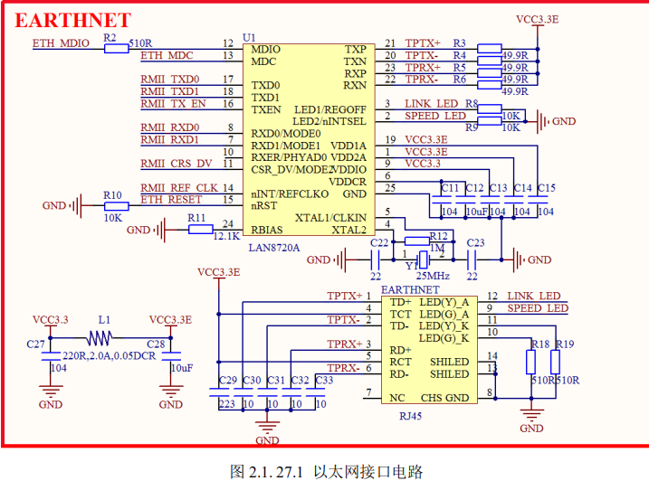

# **实验平台硬件资源详解** 

本章，我们将节将向大家详细介绍 ALIENTEK 探索者 STM32F4 开发板各部分的硬件原理 图，让大家对该开发板的各部分硬件原理有个深入理解，并向大家介绍开发板的使用注意事项， 为后面的学习做好准备。 

本章将分为如下两节： 

1.1，开发板原理图详解； 

1.2，开发板使用注意事项； 

## **2.1** **开发板原理图详解** 

### **2.1.1 MCU**  

ALIENTEK 探索者 STM32F4 开发板选择的是 STM32F407ZGT6 作为 MCU，该芯片是 STM32F407 里面配置非常强大的了，它拥有的资源包括：

集成 FPU 和 DSP 指令，并具有 192KB  SRAM、1024KB FLASH、12 个 16 位定时器、2 个 32 位定时器、2 个 DMA 控制器（共 16 个 通道）、3 个 SPI、2 个全双工 I2S、3 个 IIC、6 个串口、2 个 USB（支持 HOST /SLAVE）、2 个 CAN、3 个 12 位 ADC、2 个 12 位 DAC、1 个 RTC（带日历功能）、1 个 SDIO 接口、1 个 FSMC 接口、1 个 10/100M 以太网 MAC 控制器、1 个摄像头接口、1 个硬件随机数生成器、以及 112 个通用 IO 口等。

该芯片的配置十分强悍.很多功能相对 STM32F1 来说进行了重大改进，比如 FSMC 的速度，F4 刷屏速度可达 3300W 像素/秒，而 F1 的速度则只有 500W 左右。 

MCU 部分的原理图如图 2.1.1.1（因为原理图比较大，缩小下来可能有点看不清，请大家 打开开发板光盘的原理图进行查看）所示：

上图中 U4 为我们的主芯片：STM32F407ZGT6。 

这里主要讲解以下 3 个地方： 

- 1，后备区域供电脚 VBAT 脚的供电采用 CR1220 纽扣电池和 VCC3.3 混合供电的方式，在 有外部电源（VCC3.3）的时候，CR1220 不给 VBAT 供电，而在外部电源断开的时候，则由 CR1220 给其供电。这样，VBAT 总是有电的，以保证 RTC 的走时以及后备寄存器的内容不丢失。 
- 2，图中的 R31 和 R32 用隔离 MCU 部分和外部的电源，这样的设计主要是考虑了后期维 护，如果 3.3V 电源短路，可以断开这两个电阻，来确定是 MCU 部分短路，还是外部短路，有 助于生产和维修。当然大家在自己的设计上，这两个电阻是完全可以去掉的。 
- 3，图中 P7 是参考电压选择端口。我们开发板默认是接板载的 3.3V 作为参考电压，如果 大家想用自己的参考电压，则把你的参考电压接入 Vref+即可。 

### **2.1.2** **引出** **IO** **口** 

ALIENTEK 探索者 STM32F4 开发板引出了 STM32F407ZGT6 的所有 IO 口，如图 2.1.2.1 所示

图中P3、P4和P5为MCU主IO引出口，这三组排针共引出了102个IO口，STM32F407ZGT6 总共有 112 个 IO，除去 RTC 晶振占用的 2 个，还剩 110 个，这三组主引出排针，总共引出了 102 个 IO，剩下的 8 个 IO 口分别通过：P6（PA9&PA10）、P9（PA2&PA3）、P10（PB10&PB11） 和 P11（PA11&PA12）等 4 组排针引出。 

### **2.1.3 USB** **串口****/****串口** **1** **选择接口** 

ALIENTEK 探索者 STM32F4 开发板板载的 USB 串口和 STM32F407ZGT6 的串口是通过 P6 连接起来的，如图 2.1.3.1 所示： 

图中 TXD/RXD 是相对 CH340G 来说的，也就是 USB 串口的发送和接受脚。

而 USART1_RX 和 USART1_TX 则是相对于 STM32F407ZGT6 来说的。

这样，通过对接，就可以实现 USB 串 口和 STM32F407ZGT6 的串口通信了。同时，P6 是 PA9 和 PA10 的引出口。 

**这样设计的好处就是使用上非常灵活。**

比如需要用到外部TTL串口和STM32通信的时候只需要拔了跳线帽，通过杜邦线连接外部 TTL 串口，就可以实现和外部设备的串口通信了

；又 比如我有个板子需要和电脑通信，但是电脑没有串口，那么你就可以使用开发板的 RXD 和 TXD 来连接你的设备，把我们的开发板当成 USB 转串口用了。 

### **2.1.4 JTAG/SWD** 

ALIENTEK 探索者 STM32F4 开发板板载的标准 20 针 JTAG/SWD 接口电路如图 2.1.4.1 所 示： 

这里，我们采用的是标准的 JTAG 接法，但是 STM32 还有 SWD 接口，SWD 只需要最少 2 根线（SWCLK 和 SWDIO）就可以下载并调试代码了，这同我们使用串口下载代码差不多，而 且速度非常快，能调试。

所以建议大家在设计产品的时候，可以留出 SWD 来下载调试代码， 而摒弃 JTAG。

STM32 的 SWD 接口与 JTAG 是共用的，只要接上 JTAG，你就可以使用 SWD 模式了（其实并不需要 JTAG 这么多线），当然，你的调试器必须支持 SWD 模式，JLINK V7/V8、 ULINK2 和 ST LINK 等都支持 SWD 调试。 

特别提醒，JTAG 有几个信号线用来接其他外设了，但是 SWD 是完全没有接任何其他外设 的，所以在使用的时候，**推荐大家一律使用** **SWD** **模式！！！** 

### **2.1.5 SRAM**

ALIENTEK 探索者 STM32F4 开发板外扩了 1M 字节的 SRAM 芯片，如图 2.1.5.1 所示，注 意图中的地址线标号，是以 XM8A51216 为模版的，但是和 XM8A51216 的 datasheet 标号有出 入，不过，因为地址的唯一性，这并不会影响我们使用 XM8A51216（特别提醒：地址线可以乱，但是数据线必须一致！！）

因此，该原理图对这两个芯片都是可以正常使用的。

图中 U3 为外扩的 SRAM 芯片，型号为：XM8A51216，容量为 1M 字节，该芯片挂在 STM32 的 FSMC 上。

这样大大扩展了 STM32 的内存（芯片本身有 192K 字节），从而在需要大内存的 场合，探索者 STM32F4 开发板也可以胜任

### **2.1.6 LCD** **模块接口** 

ALIENTEK 探索者 STM32F4 开发板板载的 LCD 模块接口电路如图 2.1.6.1 所示： 

图中TFT_LCD是一个通用的液晶模块接口，支持ALIENTEK全系列TFTLCD 模块，包括：2.4 寸、2.8 寸、3.5 寸、4.3 寸和 7 寸等尺寸的 TFTLCD 模块。

LCD 接口连接在 STM32F407ZGT6 的 FSMC 总线上面，可以显著提高 LCD 的刷屏速度。 

图中的 T_MISO/T_MOSI/T_PEN/T_CS/T_CS 用来实现对液晶触摸屏的控制（支持电阻屏和 电容屏）。

LCD_BL 则控制 LCD 的背光。

液晶复位信号 RESET 则是直接连接在开发板的复位按钮上，和 MCU 共用一个复位电路。 

### **2.1.7** **复位电路** 

ALIENTEK 探索者 STM32F4 开发板的复位电路如图 2.1.7.1 所示： 

因为 STM32 是低电平复位的，所以我们设计的电路也是低电平复位的，这里的 R24 和 C48 构成了上电复位电路。

同时，开发板把 TFT_LCD 的复位引脚也接在 RESET 上，这样这个复位 按钮不仅可以用来复位 MCU，还可以复位 LCD。 

### **2.1.8** **启动模式设置接口** 

ALIENTEK 探索者 STM32F4 开发板的启动模式设置端口电路如图 2.1.8.1 所示：

上图的BOOT0和BOOT1用于设置STM32的启动方式，其对应启动模式如表2.1.8.1所示：

按照表2. 1.8.1，一般情况下如果我们想用用串口下载代码，则必须配置BOOT0为1，BOOT1 为 0，而如果想让 STM32 一按复位键就开始跑代码，则需要配置 BOOT0 为 0，BOOT1 随便设 置都可以。

这里 ALIENTEK 探索者 STM32F4 开发板专门设计了一键下载电路，通过串口的 DTR 和 RTS 信号，来自动配置 BOOT0 和 RST 信号，因此不需要用户来手动切换他们的状态， 直接串口下载软件自动控制，可以非常方便的下载代码。

### **2.1.9 RS232** **串口** 

ALIENTEK 探索者 STM32F4 开发板板载了一公一母两个 RS232 接口，电路原理图如图 2.1.9.1 所示：

因为 RS232 电平不能直接连接到 STM32，所以需要一个电平转换芯片。

这里我们选择的 是 SP3232（也可以用 MAX3232）来做电平转接，同时图中的 P9 用来实现 RS232(COM2)/RS485 的选择，P10 用来实现 RS232(COM3)/ATK 模块接口的选择，以满足不同实验的需要。 

图中 USART2_TX/USART2_RX 连接在 MCU 的串口 2 上（PA2/PA3），所以这里的 RS232(COM2)/RS485 都是通过串口 2 来实现的。

图中 RS485_TX 和 RS485_RX 信号接在 SP3485 的 DI 和 RO 信号上。 

而图中的 USART3_TX/USART3_RX 则是连接在 MCU 的串口 3 上（PB10/PB11），所以 RS232(COM3)/ATK 模块接口都是通过串口 3 来实现的。

图中 GBC_RX 和 GBC_TX 连接在 ATK 模块接口 U7 上面。 

因为 P9/P10 的存在，其实还带来另外一个好处，就是我们可以把开发板变成一个 RS232 电平转换器，或者 RS485 电平转换器，比如你买的核心板，可能没有板载 RS485/RS232 接口， 通过连接探索者 STM32F4 开发板的 P9/P10 端口，就可以让你的核心板拥有 RS232/RS485 的功 能。 

### **2.1.10 RS485** **接口** 

ALIENTEK 探索者 STM32F4 开发板板载的 RS485 接口电路如图 2.1.10.1 所示： 

RS485 电平也不能直接连接到 STM32，同样需要电平转换芯片。这里我们使用 SP3485 来 做 485 电平转换，其中 R44 为终端匹配电阻，而 R38 和 R40，则是两个偏置电阻，以保证静默状态时，485 总线维持逻辑 1。 

RS485_RX/RS485_TX 连接在 P9 上面，通过 P9 跳线来选择是否连接在 MCU 上面， 

RS485_RE 则是直接连接在 MCU 的 IO 口（PG8）上的，该信号用来控制 SP3485 的工作模式（高 电平为发送模式，低电平为接收模式）。 

另外，**特别注意**：RS485_RE 和 NRF_IRQ 共同接在 PG8 上面，在同时用到这两个外设的 时候，需要注意下

### **2.1.11 CAN/USB** **接口** 

ALIENTEK 探索者 STM32F4 开发板板载的 CAN 接口电路以及 STM32 USB 接口电路如图 2.1.11.1 所示： 

CAN 总线电平也不能直接连接到 STM32，同样需要电平转换芯片。这里我们使用 TJA1050 来做 CAN 电平转换，其中 R51 为终端匹配电阻。 

USB_D+/USB_D-连接在 MCU 的 USB 口（PA12/PA11）上，同时，因为 STM32 的 USB 和 CAN 共用这组信号，所以我们通过 P11 来选择使用 USB 还是 CAN。 

图中共有 2 个 USB 口：USB_SLAVE 和 USB_HOST，前者是用来做 USB 从机通信的，后 者则是用来做 USB 主机通信的。 

USB_SLAVE 可以用来连接电脑，实现 USB 读卡器或声卡等 USB 从机实验。另外，该接 口还具有供电功能，VUSB 为开发板的 USB 供电电压，通过这个 USB 口，就可以给整个开发 板供电了。 

USB HOST 可以用来接如：U 盘、USB 鼠标、USB 键盘和 USB 手柄等设备，实现 USB 主 机功能。

该接口可以对从设备供电，且供电可控，通过 USB_PWR 控制，该信号连接在 MCU 的 PA15 引脚上与 JTDI 共用 PA15，所以用 JTAG 仿真的时候，USB_PWR 就不受控了，这也是 我们**推荐大家使用** **SWD** **模式**而不用 JTAG 模式的另外一个原因。

### **2.1.12 EEPROM** 

ALIENTEK 探索者 STM32F4 开发板板载的 EEPROM 电路如图 2.1.12.1 所示

EEPROM 芯片我们使用的是 24C02，该芯片的容量为 2Kb，也就是 256 个字节，对于我们普通应用来说是足够了的。当然，你也可以选择换大的芯片，因为我们的电路在原理上是兼容 24C02~24C512 全系列 EEPROM 芯片的。 

这里我们把 A0~A2 均接地，对 24C02 来说也就是把地址位设置成了 0 了，写程序的时候要注意这点。IIC_SCL 接在 MCU 的 PB8 上，IIC_SDA 接在 MCU 的 PB9 上，这里我们虽然接到了 STM32 的硬件 IIC 上，但是我们并不提倡使用硬件 IIC，因为 STM32 的 IIC 是鸡肋！

请谨 慎使用。IIC_SCL/IIC_SDA 总线上总共挂了 3 个器件：24C02、MPU6050 和 WM8978，后续我 们将向大家介绍另外两个器件。 

### **2.1.13** **光敏传感器** 

ALIENTEK 探索者 STM32F4 开发板板载了一个光敏传感器，可以用来感应周围光线的变化，该部分电路如图 2.1.13.1 所示：

图中的 LS1 就是光敏传感器，其实就是一个光敏二极管，周围环境越亮，电流越大，反之电流越小，即可等效为一个电阻，环境越亮阻值越小，反之越大，从而通过读取 `LIGHT_SENSOR `的电压，即可知道周围环境光线强弱。`LIGHT_SENSOR `连接在 `MCU `的 `ADC3_IN5`（ADC3 通 道 5）上面，即 PF7 引脚。 

### **2.1.14 SPI FLASH** 

ALIENTEK 探索者 STM32F4 开发板板载的 SPI FLASH 电路如图 2.1.14.1 所示：

SPI FLASH 芯片型号为 W25Q128，该芯片的容量为 128Mb，也就是 16M 字节。

该芯片和 NRF24L01 共用一个 SPI（SPI1），通过片选来选择使用某个器件，在使用其中一个器件的时候， 请务必禁止另外一个器件的片选信号。 

图中 F_CS 连接在 MCU 的 PB14 上，SPI1_SCK/SPI1_MOSI/SPI1_MISO 则分别连接在 MCU 的 PB3/PB5/PB4 上，其中 PB3/PB4 又是 JTAG 的 JTDO 和 JTRST 信号，所以在 JTAG 仿真的时候，SPI 就用不了了，但是用 SWD 仿真，则不存在任何问题，所以我们**推荐大家使用** **SWD** **仿**真！** 

### **2.1.15** **六轴加速度传感器** 

ALIENTEK 探索者 STM32F4 开发板板载的六轴加速度传感器电路如图 2.1.15.1 所示

六轴加速度传感器芯片型号为：MPU6050，该芯片内部集成一个三轴加速度传感器和一个 三轴陀螺仪，并且自带 DMP(Digital Motion Processor)，该传感器可以用于四轴飞行器的姿态控制和解算。

这里我们使用 IIC 接口来访问。 同 24C02 一样，该芯片的 IIC_SCL 和 IIC_SDA 同样是挂在 PB8 和 PB9 上，他们共享一个 IIC 总线

### **2.1.16** **温湿度传感器接口** 

ALIENTEK 探索者 STM32F4 开发板板载的温湿度传感器接口电路如图 2.1.16.1 所示：

该接口支持 DS18B20/DS1820/DHT11 等单总线数字温湿度传感器。1WIRE_DQ 是传感器 的数据线，该信号连接在 MCU 的 PG9 上，**特别注意：**该引脚同时还接到了摄像头模块的 DCMI_PWDN 信号上面，他们不能同时使用，但可以分时复用。 

### **2.1.17** **红外接收头** 

ALIENTEK 探索者 STM32F4 开发板板载的红外接收头电路如图 2.1.17.1 所示：

HS0038 是一个通用的红外接收头，几乎可以接收市面上所有红外遥控器的信号，有了它， 就可以用红外遥控器来控制开发板了。

REMOTE_IN 为红外接收头的输出信号，该信号连接在MCU 的 PA8 上。**特别注意：**PA8 同时连接了 DCMI_XCLK，如果要用到 DCMI_XCLK 的时候， HS0038 就不能同时使用了，但可以分时复用

### **2.1.18** **无线模块接口** 

ALIENTEK 探索者 STM32F4 开发板板载的无线模块接口电路如图 2.1.18.1 所示

该接口用来连接 NRF24L01 等 2.4G 无线模块，从而实现开发板与其他设备的无线数据传输（注意：NRF24L01 不能和蓝牙/WIFI 连接）。

NRF24L01 无线模块的最大传输速度可以达到 2Mbps，传输距离最大可以到 30 米左右（空旷地，无干扰）。 

NRF_CE/NRF_CS/NRF_IRQ 连接在 MCU 的 PG6/PG7/PG8 上，而另外 3 个 SPI 信号则和 SPI FLASH 共用，接 MCU 的 SPI1。

这里**需要注意**的是 PG8 还接了 RS485 的 RE 信号，所以在使用 NRF24L01 中断引脚的时候，不能和 RS485 同时使用，不过，如果没用到 NRF24L01 的 中断引脚，那么 RS485 和 NRF24L01 模块就可以同时使用了。

**2.1.19 LED**  

ALIENTEK 探索者 STM32F4 开发板板载总共有 3 个 LED，其原理图如图 2.1.19.1 所示

其中 PWR 是系统电源指示灯，为蓝色。LED0(DS0)和 LED1(DS1)分别接在 PF9 和 PF10 上。为了方便大家判断，我们选择了 DS0 为红色的 LED，DS1 为绿色的 LED。 

**2.1.20** **按键** 

ALIENTEK 探索者 STM32F4 开发板板载总共有 4 个输入按键，其原理图如图 2.1.20.1 所示：

KEY0、KEY1 和 KEY2 用作普通按键输入，分别连接在 PE4、PE3 和 PE2 上，这里并没有使用外部上拉电阻，但是 STM32 的 IO 作为输入的时候，可以设置上下拉电阻，所以我们使用 STM32 的内部上拉电阻来为按键提供上拉。 KEY_UP 按键连接到 PA0(STM32 的 WKUP 引脚)，它除了可以用作普通输入按键外，还可 以用作 STM32 的唤醒输入。注意：这个按键是高电平触发的。 

### **2.1.21 TPAD** **电容触摸按键** 

ALIENTEK 探索者 STM32F4 开发板板载了一个电容触摸按键，其原理图如图 2.1.21.1 所 示： 

图中 1M 电阻是电容充电电阻，TPAD 并没有直接连接在 MCU 上，而是连接在多功能端口 （P12）上面，通过跳线帽来选择是否连接到 STM32。多功能端口，我们将在 2.1.26 节介绍。 

电容触摸按键的原理我们将在后续的实战篇里面介绍。

### **2.1.22 OLED/****摄像头模块接口**  

ALIENTEK 探索者 STM32F4 开发板板载了一个 OLED/摄像头模块接口，其原理图如图 2.1.22.1 所示： 

图中 P8 是接口可以用来连接 ALIENTEK OLED 模块或者 ALIENTEK 摄像头模块。如果是 OLED 模块，则 DCMI_PWDN 和 DCMI_XCLK 不需要接（在板上靠左插即可），如果是摄像头模块，则需要用到全部引脚。 

其中，DCMI_SCL/DCMI_SDA/DCMI_RESET/DCMI_PWDN/DCMI_XCLK 这 5 个信号是不属于 STM32F4 硬件摄像头接口的信号，通过普通 IO 控制即可，分别接在 MCU 的：PD6/PD7/PG15/PG9/PA8 上面。

**特别注意：**DCMI_PWDN 和 1WIRE_DQ 信号共用 PG9 这个 IO， 所以摄像头和 DS18B20/DHT11 不能同时使用，但是可以分时复用。

另外，DCMI_XCLK 和 REMOTE_IN 共用，在用到 DCMI_XCLK 信号的时候，则红外接收和摄像头不可同时使用，不 过同样是可以分时复用的。 

其他信号全接在 STM32F4 的硬件摄像头接口上，DCMI_VSYNC/DCMI_HREF/DCMI_D0/ DCMI_D1/ DCMI_D2/ DCMI_D3/ DCMI_D4/ DCMI_D5/ DCMI_D6/ DCMI_D7/ DCMI_PCLK 分 别连接在：PB7/PA4/PC6/PC7/PC8/PC9/PC11/PB6/PE5/PE6/PA6 上。

**特别注意：**这些信号和 DAC1 输出以及 SD 卡，I2S 音频等有 IO 共用，所以在使用 OLED 模块或摄像头模块的时候，不能和 DAC1 的输出、SD 卡使用和 I2S 音频播放等三个功能同时使用，只能分时复用。 

### **2.1.23** **有源蜂鸣器**  

ALIENTEK 探索者 STM32F4 开发板板载了一个有源蜂鸣器，其原理图如图 2.1.23.1 所示：

有源蜂鸣器是指自带了震荡电路的蜂鸣器，这种蜂鸣器一接上电就会自己震荡发声。而如 果是无源蜂鸣器，则需要外加一定频率（2~5Khz）的驱动信号，才会发声。

这里我们选择使用 有源蜂鸣器，方便大家使用。 

图中 Q1 是用来扩流，R61 则是一个下拉电阻，避免 MCU 复位的时候，蜂鸣器可能发声的 现象。

BEEP 信号直接连接在 MCU 的 PF8 上面，PF8 可以做 PWM 输出，所以大家如果想玩高 级点（如：控制蜂鸣器“唱歌”），就可以使用 PWM 来控制蜂鸣器。 

### **2.1.24 SD** **卡接口** 

ALIENTEK 探索者 STM32F4 开发板板载了一个 SD 卡（大卡/相机卡）接口，其原理图如 图 2.1.24.1 所示： 

图中 SD_CARD 为 SD 卡接口，该接口在开发板的底面，这也是探索者 STM32F4 开发板底面唯一的元器件。 

SD 卡采用 4 位 SDIO 方式驱动，理论上最大速度可以达到 24MB/S，非常适合需要高速存 储的情况。

图中：SDIO_D0/SDIO_D1/SDIO_D2/SDIO_D3/SDIO_SCK/SDIO_CMD 分别连接在 MCU 的 PC8/PC9/PC10/PC11/PC12/PD2 上面。

**特别注意：**SDIO 和 OLED/摄像头的部分 IO 有 共用，所以在使用 OLED 模块或摄像头模块的时候，只能和 SDIO 分时复用，不能同时使用。

### **2.1.25 ATK** **模块接口** 

ALIENTEK 探索者 STM32F4 开发板板载了 ATK 模块接口，其原理图如图 2.1.25.1 所示

如图所示，U7 是一个 1*6 的排座，可以用来连接 ALIENTEK 推出的一些模块，比如：蓝 牙串口模块、GPS 模块等。

有了这个接口，我们连接模块就非常简单，插上即可工作。 

图中：GBC_TX/GBC_RX 可通过 P10 排针，选择接入 PB11/PB10（即串口 3），详见 2.1.9 节。

而 GBC_KEY 和 GBC_LED 则分别连接在 MCU 的 PF6 和 PC0 上面。

**特别注意：**GBC_LED 和 3D_INT 共用 PC0，所以同时使用 ATK 模块接口和 MPU6050 的时候，要注意这个 IO 的设 

置

### **2.1.26** **多功能端口**  

ALIENTEK 探索者 STM32F4 开发板板载的多功能端口，是由 P12 和 P2 构成的一个 6PIN 端口，其原理图如图 2.1.26.1 所示： 

从上图，大家可能还看不出这个多功能端口的全部功能，别担心，下面我们会详细介绍。 首先介绍左侧的 P12，其中 TPAD 为电容触摸按键信号，连接在电容触摸按键上。

STM_ADC 和 STM_DAC 则分别连接在 PA5 和 PA4 上，用于 ADC 采集或 DAC 输出。

当需要电容触摸按 键的时候，我们通过跳线帽短接 TPAD 和 STM_ADC，就可以实现电容触摸按键（利用定时器 的输入捕获）。

STM_DAC 信号则既可以用作 DAC 输出，也可以用作 ADC 输入，因为 STM32 的该管脚同时具有这两个复用功能。

**特别注意：**STM_DAC 与摄像头的 DCMI_HREF 共用 PA4， 所以他们不可以同时使用，但是可以分时复用。 

我们再来看看 P2，PWM_DAC 连接在 MCU 的 PA3，是定时器 2/5 的通道 4 输出，后面跟 一个二阶 RC 滤波电路，其截止频率为 33.8Khz。

经过这个滤波电路，MCU 输出的方波就变为直流信号了。PWM_AUDIO 是一个音频输入通道，它连接到 WM8978 的 AUX 输入，可通过配 置 WM8978，输出到耳机/扬声器。

**特别注意：**PWM_DAC 和 USART2_RX 共用 PA3，所以 PWM_DAC 和串口 2 的接收，不可以同时使用，不过，可以分时复用。 

单独介绍完了 P12 和 P2，我们再来看看他们组合在一起的多功能端口，如图 2.1.26.2 所示：

图中 AIN 是 PWM_AUDIO，PDC 是滤波后的 PWM_DAC 信号。下面我们来看看通过 1 个 跳线帽，这个多功能接口可以实现哪些功能。 

- 当不用跳线帽的时候：
    - 1，AIN 和 GND 组成一个音频输入通道。
    - 2，PDC 和 GND 组成一 个 PWM_DAC 输出；
    - 3，DAC 和 GND 组成一个 DAC 输出/ADC 输入（因为 DAC 脚也刚好也 可以做 ADC 输入）；
    - 4，ADC 和 GND 组成一组 ADC 输入；
    - 5，TPAD 和 GND 组成一个触摸按 键接口，可以连接其他板子实现触摸按键。 

- 当使用 1 个跳线帽的时候：
    - 1，AIN 和 PDC 组成一个 MCU 的音频输出通道，实现 PWM DAC 播放音乐。
    - 2，AIN 和 DAC 同样可以组成一个 MCU 的音频输出通道，也可以用来播放音乐。 
    - 3，DAC 和 ADC 组成一个自输出测试，用 MCU 的 ADC 来测试 MCU 的 DAC 输出。
    - 4，PDC 和 ADC，组成另外一个子输出测试，用 MCU 的 ADC 来测试 MCU 的 PWM DAC 输出。
    - 5， ADC 和 TPAD，组成一个触摸按键输入通道，实现 MCU 的触摸按键功能。 

**从上面的分析，可以看出，这个多功能端口可以实现 10 个功能，所以，只要设计合理，1+1 是大于 2 的。** 

### **2.1.27** **以太网接口（****RJ45****）**  

ALIENTEK 探索者 STM32F4 开发板板载了一个以太网接口(RJ45)，其原理图如图 2.1.27.1 所示：

STM32F4 内部自带网络 MAC 控制器，所以只需要外加一个 PHY 芯片，即可实现网络通 信功能。

这里我们选择的是 LAN8720A 这颗芯片作为 STM32F4 的 PHY 芯片，该芯片采用 RMII 接口与 STM32F4 通信，占用 IO 较少，且支持 auto mdix（即可自动识别交叉/直连网线）功能。 

板载一个自带网络变压器的 RJ45 头（HR91105A），一起组成一个 10M/100M 自适应网卡。 

图中：

ETH_MDIO/ETH_MDC/RMII_TXD0/RMII_TXD1/RMII_TX_EN/RMII_RXD0/RMII_RXD1/RMII_CRS_DV/RMII_REF_CLK/ETH_RESET 

分别接在 MCU 的：

PA2/PC1/PG13/ PG14/PG11/PC4/PC5/PA7/PA1/PD3 上。

**特别注意：**网络部分 ETH_MDIO 与 USART2_TX 共用 PA2，所以网络和串口 2 的发送，不可以同时使用，但是可以分时复用。 

**2.1.28 I2S** **音频编解码器**  

ALIENTEK 探索者 STM32F4 开发板板载 WM8978 高性能音频编解码芯片，其原理图如图 2.1.28.1 所

WM8978 是一颗低功耗、高性能的立体声多媒体数字信号编解码器。该芯片内部集成了 24 位高性能 DAC&ADC，可以播放最高 192K@24bit 的音频信号，并且自带段 EQ 调节，支持 3D 音效等功能。

不仅如此，该芯片还结合了立体声差分麦克风的前置放大与扬声器、耳机和差分、 立体声线输出的驱动，减少了应用时必需的外部组件，直接可以驱动耳机（16Ω@40mW）和 喇叭（8Ω/0.9W），无需外加功放电路。 

图中，SPK-和 SPK+连接了一个板载的 8Ω 2W 小喇叭（在开发板背面），另外，可以通过 P1 接口外接其他喇叭，以获得更好音质。

- MIC 是板载的咪头，可用于录音机实验，实现录音。 
- PHONE 是 3.5mm 耳机输出接口，可以用来插耳机。
- LINE_IN 则是线路输入接口，可以用来外 接线路输入，实现立体声录音。 

该芯片采用 I2S 接口与 MCU 连接，图中：

I2S_LRCK/I2S_SCLK/I2S_SDOUT/I2S_SDIN /I2S_MCLK/IIC_SCL/IIC_SDA 

分别接在 MCU 的：

PB12/PB13/PC2/PC3/PC6/PB8/PB9 上。

**特别** 注意：**I2S_MCLK 和 DCMI_D0 共用 PC6，所以 I2S 音频播放和 OLED 模块/摄像头模块不可以 同时使用。

另外，IIC_SCL 和 IIC_SDA 是与 24C02/MPU6050 等共用一个 IIC 接口。

### **2.1.29** **电源**  

ALIENTEK 探索者 STM32F4 开发板板载的电源供电部分，其原理图如图 2.1.29.1 所示

图中，总共有 3 个稳压芯片：U15/U16/U18，DC_IN 用于外部直流电源输入，经过 U15 DC-DC 芯片转换为 5V 电源输出，其中 D4 是防反接二极管，避免外部直流电源极性搞错的时候，烧坏开发板。

K1 为开发板的总电源开关，F1 为 1000ma 自恢复保险丝，用于保护 USB。

U16 和 U18 均为 3.3V 稳压芯片，给开发板提供 3.3V 电源，其中 U16 输出的 3.3V 给数字部分用，U18 输 出的 3.3V 给模拟部分（WM8978）使用，分开供电，以得到最佳音质。 

这里还有 USB 供电部分没有列出来，其中 VUSB 就是来自 USB 供电部分，我们将在相应 章节进行介绍

### **2.1.30** **电源输入输出接口**  

ALIENTEK 探索者 STM32F4 开发板板载了两组简单电源输入输出接口，其原理图如图 2.1.30.1 所示：

图中，VOUT1 和 VOUT2 分别是 3.3V 和 5V 的电源输入输出接口，有了这 2 组接口，我们 可以通过开发板给外部提供 3.3V 和 5V 电源了，虽然功率不大（最大 1000ma），但是一般情况都够用了，大家在调试自己的小电路板的时候，有这两组电源还是比较方便的。同时这两组端口，也可以用来由外部给开发板供电。 

图中 D5 和 D6 为 TVS 管，可以有效避免 VOUT 外接电源/负载不稳的时候（尤其是开发板外接电机/继电器/电磁阀等感性负载的时候），对开发板造成的损坏。

同时还能一定程度防止外 接电源接反，对开发板造成的损坏

### **2.1.31 USB** **串口**  

ALIENTEK 探索者 STM32F4 开发板板载了一个 USB 串口，其原理图如图 2.1.31.1 所示：

USB 转串口，我们选择的是 CH340G，是国内芯片公司南京沁恒的产品，稳定性经测试还 不错，**所以还是多支持下国产**。 

图中 Q3 和 Q4 的组合构成了我们开发板的一键下载电路，**只需要在** **flymcu** **软件设置：****DTR** 的低电平复位，RTS** **高电平进** **BootLoader****。

**就可以一键下载代码了，而不需要手动设置 B0 和 按复位了。其中，RESET 是开发板的复位信号，BOOT0 则是启动模式的 B0 信号。 

**一键下载电路的具体实现过程：**首先，mcuisp 控制 DTR 输出低电平，则 DTR_N 输出高， 然后 RTS 置高，则 RTS_N 输出低，这样 Q4 导通了，BOOT0 被拉高，即实现设置 BOOT0 为 1， 同时 Q3 也会导通，STM32F4 的复位脚被拉低，实现复位。

然后，延时 100ms 后，mcuisp 控制 DTR为高电平，则DTR_N输出低电平，RTS维持高电平，则RTS_N继续为低电平，此时STM32F4 的复位引脚，由于 Q3 不再导通，变为高电平，STM32F4 结束复位，但是 BOOT0 还是维持为 1，

从而进入 ISP 模式，接着 mcuisp 就可以开始连接 STM32F4，下载代码了，从而实现一键下 载。 

USB_232 是一个 MiniUSB 座，提供 CH340G 和电脑通信的接口，同时可以给开发板供电， VUSB 就是来自电脑 USB 的电源，USB_232 是本开发板的主要供电口

### **2.2** **开发板使用注意事项** 

为了让大家更好的使用 ALIENTEK 探索者 STM32F4 开发板，我们在这里总结该开发板使 用的时候尤其要注意的一些问题，希望大家在使用的时候多多注意，以减少不必要的问题。 

1， 开发板一般情况是由 USB_232 口供电，在第一次上电的时候由于 CH340G 在和电脑建 立连接的过程中，导致DTR/RTS 信号不稳定，会引起 STM32 复位 2~3 次左右，这个 现象是正常的，后续按复位键就不会出现这种问题了

2， 1 个 USB 供电最多 500mA，且由于导线电阻存在，供到开发板的电压，一般都不会有 5V，如果使用了很多大负载外设，比如 4.3 寸屏、网络、摄像头模块等，那么可能引 起 USB 供电不够，所以如果是使用 4.3 屏的朋友，或者同时用到多个模块的时候，**建** **议大家使用一个独立电源供电**。 

如果没有独立电源，建议可以同时插 2 个 USB 口， 并插上 JTAG，这样供电可以更足一些。 

3， JTAG 接口有几个信号（JTDI/JTDO/JTRST）被 USB_PWR（USB HOST）/SPI1（W25Q128 和 NRF24L01）占用了，所以在调试这几个模块的时候，请大家选择 SWD 模式，其实 最好就是一直用** **SWD** **模式。** 

4， 当你想使用某个 IO 口用作其他用处的时候，请先看看开发板的原理图，该 IO 口是否 有连接在开发板的某个外设上，如果有，该外设的这个信号是否会对你的使用造成干扰，先确定无干扰，再使用这个 IO。

比如 PF8 就不怎么适合再用做其他输出，因为他接了蜂鸣器，如果你输出高电平就会听到蜂鸣器的叫声了。 

5， 开发板上的跳线帽比较多，大家在使用某个功能的时候，要先查查这个是否需要设置跳线帽，以免浪费时间。 

6， 当液晶显示白屏的时候，请先检查液晶模块是否插好（拔下来重新插试试），如果还不 行，可以通过串口看看 LCD ID 是否正常，再做进一步的分析。 

7， 开发板的 USB SLAVE 和 USB HOST 共用同一个 USB 口，所以，他们不可以同时使用。 使用的时候多加注意。 

