​	

# **STM32F4** **开发基础知识入门** 

这一章，我们将着重 STM32 开发的一些基础知识，让大家对 STM32 开发有一个初步的了 解，为后面 STM32 的学习做一个铺垫，方便后面的学习。

这一章的内容大家第一次看的时候 可以只了解一个大概，后面需要用到这方面的知识的时候再回过头来仔细看看。

这章我们分 7 个小结， 

- 1 MDK 下 C 语言基础复习 
- 2 STM32F4 系统架构 
- 3 STM32F4 时钟系统 
- 4 IO 引脚复用器和映射 
- 5 STM32F4 NVIC 中断优先级管理 
- 6 MDK 中寄存器地址名称映射分析 
- 7 MDK 固件库快速开发技巧

## **1 MDK** **下** **C** **语言基础复习** 

这一节我们主要讲解一下 C 语言基础知识。C 语言知识博大精深，也不是我们三言两语能 讲解清楚，同时我们相信学 STM32F4 这种级别 MCU 的用户，C 语言基础应该都是没问题的。

我 们这里主要是简单的复习一下几个 C 语言基础知识点，引导那些 C 语言基础知识不是很扎实的 用户能够快速开发 STM32 程序。同时希望这些用户能够多去复习一下 C 语言基础知识，C 语言 毕竟是单片机开发中的必备基础知识。对于 C 语言基础比较扎实的用户，这部分知识可以忽略 不看。 

### **1.1** **位操作** 

C 语言位操作相信学过 C 语言的人都不陌生了,简而言之，就是对基本类型变量可以在位级 别进行操作。这节的内容很多朋友都应该很熟练了，我这里也就点到为止，不深入探讨。

下面 我们先讲解几种位操作符，然后讲解位操作使用技巧。 

C 语言支持如下 6 种位操作

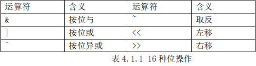

这些与或非，取反，异或，右移，左移这些到底怎么回事，这里我们就不多做详细，相信 大家学 C 语言的时候都学习过了。

如果不懂的话，可以百度一下，非常多的知识讲解这些操作符。下面我们想着重讲解位操作在单片机开发中的一些实用技巧。 

#### 1) 不改变其他位的值的状况下，对某几个位进行设值。

这个场景单片机开发中经常使用，方法就是先对需要设置的位用&操作符进行清零操作， 然后用|操作符设值。比如我要改变 GPIOA-> BSRRL 的状态,可以先对寄存器的值进行& 清零操作

```C
GPIOA-> BSRRL &=0XFF0F; //将第 4-7 位清 0
//然后再与需要设置的值进行|或运算
GPIOA-> BSRRL |=0X0040;//设置相应位的值，不改变其他位的值
```

#### 2) 移位操作提高代码的可读性。

移位操作在单片机开发中也非常重要，我们来看看下面一行代码 

`GPIOx->ODR = (((uint32_t)0x01) << pinpos); `

这个操作就是将 ODR 寄存器的第 pinpos 位设置为 1，为什么要通过左移而不是直接设 置一个固定的值呢？其实，这是为了提高代码的可读性以及可重用性。

这行代码可以 很直观明了的知道，是将第 `pinpos `位设置为 1。如果你写成 

`GPIOx->ODR =0x0030; `

这样的代码就不好看也不好重用了。 

#### 3) ~取反操作使用技巧

SR 寄存器的每一位都代表一个状态，某个时刻我们希望去设置某一位的值为 0，同时 其他位都保留为 1，简单的作法是直接给寄存器设置一个值： 

`TIMx->SR=0xFFF7； `

这样的作法设置第 3 位为 0，但是这样的作法同样不好看，并且可读性很差。看看库函数 代码中怎样使用的： 

`TIMx->SR = (uint16_t)~TIM_FLAG; `

而 TIM_FLAG 是通过宏定义定义的值： 

```C
#define TIM_FLAG_Update ((uint16_t)0x0001) 

#define TIM_FLAG_CC1 ((uint16_t)0x0002) 
```

看这个应该很容易明白，可以直接从宏定义中看出 TIM_FLAG_Update 就是设置的第 0 位了， 可读性非常强

### **1.2 define** **宏定义**

define 是 C 语言中的预处理命令，它用于宏定义，可以提高源代码的可读性，为编程提供 方便。常见的格式： 

`\#define 标识符 字符串 `

“标识符”为所定义的宏名。“字符串”可以是常数、表达式、格式串等。例如： 

`\#define PLL_M 8 `

定义标识符 PLL_M 的值为 8。 

至于 define 宏定义的其他一些知识，比如宏定义带参数这里我们就不多讲解。 

#### **4.1.3 ifdef** **条件编译** 

单片机程序开发过程中，经常会遇到一种情况，当满足某条件时对一组语句进行编译，而 当条件不满足时则编译另一组语句。条件编译命令最常见的形式为： 

```C
\#ifdef 标识符 

程序段 1  

\#else  

程序段 2  

\#endif  
```

它的作用是：当标识符已经被定义过(一般是用#define 命令定义)，则对程序段 1 进行编译， 

否则编译程序段 2。 其中#else 部分也可以没有，即： 

```
#ifdef  

程序段 1  

\#endif
```

这个条件编译在MDK里面是用得很多的，在stm32f4xx.h这个头文件中经常会看到这样的语句： 

`\#if defined (STM32F40_41xxx) `

STM32F40x 系列和 STM32F41x 系列芯片需要的一些变量定义 

`\#end `

而(STM32F40_41xxx 则是我们通过#define 来定义的。条件编译也是 c 语言的基础知识，这里 也就点到为止吧。


### **1.4 extern** **变量申明** 

C 语言中 extern 可以置于变量或者函数前，以表示变量或者函数的定义在别的文件中，提示编 译器遇到此变量和函数时在其他模块中寻找其定义。

这里面要注意，对于 extern 申明变量可以多次，但定义只有一次。在我们的代码中你会看到看到这样的语句： 

`extern u16 USART_RX_STA;  `

这个语句是申明 USART_RX_STA 变量在其他文件中已经定义了，在这里要使用到。

所以，你肯定 可以找到在某个地方有变量定义的语句： 

`u16 USART_RX_STA;  `的出现。

下面通过一个例子说明一下使用方法。 

在 Main.c 定义的全局变量 id，id 的初始化都是在 Main.c 里面进行的。 

Main.c 文件 

```C
u8 id;//定义只允许一次 

main() 

{ 

id=1; 

printf("d%",id);//id=1 

test(); 

printf("d%",id);//id=2 

} 
```

但是我们希望在main.c的 changeId(void)函数中使用变量id,这个时候我们就需要在main.c 里面去申明变量 id 是外部定义的了，因为如果不申明，变量 id 的作用域是到不了 main.c 文件 中。

看下面 main.c 中的代码： 

```C
extern u8 id;//申明变量 id 是在外部定义的，申明可以在很多个文件中进行 

void test(void){ 

id=2; 

} 
```

在 main.c 中申明变量 id 在外部定义，然后在 main.c 中就可以使用变量 id 了。 

对于 extern 申明函数在外部定义的应用，这里我们就不多讲解了。 

**1.5 typedef** **类型别名** 

typedef 用于为现有类型创建一个新的名字，或称为类型别名，用来简化变量的定义。 

typedef 在 MDK 用得最多的就是定义结构体的类型别名和枚举类型了。 

```c
struct _GPIO 

{ 

 __IO uint32_t MODER; 

 __IO uint32_t OTYPER
  …
};C
```

定义了一个结构体 GPIO，这样我们定义变量的方式为： 

`struct _GPIO GPIOA;//定义结构体变量 GPIOA `

但是这样很繁琐，MDK 中有很多这样的结构体变量需要定义。

这里我们可以为结体定义一个别 名 `GPIO_TypeDef`，这样我们就可以在其他地方通过别名 `GPIO_TypeDef `来定义结构体变量了。 

方法如下： 

```c
typedef struct
{
 __IO uint32_t MODER;
 __IO uint32_t OTYPER; …
} GPIO_TypeDef;
```

Typedef 为结构体定义一个别名 GPIO_TypeDef，这样我们可以通过 GPIO_TypeDef 来定义结构体 

变量： 

`GPIO_TypeDef _GPIOA,_GPIOB; `

这里的 GPIO_TypeDef 就跟 struct _GPIO 是等同的作用了。 这样是不是方便很多？

**1.6** **结构体** 

经常很多用户提到，他们对结构体使用不是很熟悉，但是 MDK 中太多地方使用结构体以及 结构体指针，这让他们一下子摸不着头脑，学习 STM32 的积极性大大降低，其实结构体并不是 那么复杂，这里我们稍微提一下结构体的一些知识，还有一些知识我们会在下一节的“寄存器 地址名称映射分析”中讲到一些。 

声明结构体类型： 

```c
Struct 结构体名{ 

成员列表; 

}变量名列表； 
```

例如： 

```c
Struct U_TYPE { 

Int BaudRate 

Int WordLength;  

}usart1,usart2; 
```

在结构体申明的时候可以定义变量，也可以申明之后定义，方法是： 

`Struct 结构体名字 结构体变量列表 ; `

例如：`struct U_TYPE usart1,usart2; `

结构体成员变量的引用方法是： 

结构体变量名字.成员名 

比如要引用 usart1 的成员 BaudRate，方法是：`usart1.BaudRate; `

结构体指针变量定义也是一样的，跟其他变量没有啥区别。 

例如：`struct U_TYPE *usart3；`//定义结构体指针变量 usart1; 

结构体指针成员变量引用方法是通过“->”符号实现，比如要访问 usart3 结构体指针指向的结 构体的成员变量 BaudRate,方法是： 

`Usart3->BaudRate;`

上面讲解了结构体和结构体指针的一些知识，其他的什么初始化这里就不多讲解了。

讲到这里， 有人会问，结构体到底有什么作用呢？为什么要使用结构体呢？下面我们将简单的通过一个实 例回答一下这个问题。 

在我们单片机程序开发过程中，经常会遇到要初始化一个外设比如串口，它的初始化状态 是由几个属性来决定的，比如串口号，波特率，极性，以及模式等。对于这种情况，在我们没 有学习结构体的时候，我们一般的方法是： 

`void USART_Init(u8 usartx,u32 u32 BaudRate,u8 parity,u8 mode); `

这种方式是有效的同时在一定场合是可取的。

但是试想，如果有一天，我们希望往这个函数里 面再传入一个参数，那么势必我们需要修改这个函数的定义，重新加入字长这个入口参数。

于 是我们的定义被修改为： 

`void USART_Init (u8 usartx,u32 BaudRate, u8 parity,u8 mode,u8 wordlength ); `

但是如果我们这个函数的入口参数是随着开发不断的增多，那么是不是我们就要不断的修改函 数的定义呢？这是不是给我们开发带来很多的麻烦？那又怎样解决这种情况呢？ 

这样如果我们使用到结构体就能解决这个问题了。我们可以在不改变入口参数的情况下， 只需要改变结构体的成员变量，就可以达到上面改变入口参数的目的。 

结构体就是将多个变量组合为一个有机的整体。

上面的函数，`BaudRate,wordlength, Parity,mode,wordlength `这些参数，他们对于串口而言，是一个有机整体，都是来设置串口参 数的，所以我们可以将他们通过定义一个结构体来组合在一个。

MDK 中是这样定义的： 

```c
typedef struct 

{ 

uint32_t USART_BaudRate;  

uint16_t USART_WordLength;  

uint16_t USART_StopBits;  

uint16_t USART_Parity;  

uint16_t USART_Mode;  

uint16_t USART_HardwareFlowControl;  

} USART_InitTypeDef; 
```

于是，我们在初始化串口的时候入口参数就可以是 USART_InitTypeDef 类型的变量或者指针变 量了，MDK 中是这样做的： 

`void USART_Init(USART_TypeDef* USARTx, USART_InitTypeDef* USART_InitStruct); `

这样，任何时候，我们只需要修改结构体成员变量，往结构体中间加入新的成员变量，而不需 要修改函数定义就可以达到修改入口参数同样的目的了。这样的好处是不用修改任何函数定义 就可以达到增加变量的目的。 

 理解了结构体在这个例子中间的作用吗？在以后的开发过程中，如果你的变量定义过多， 如果某几个变量是用来描述某一个对象，你可以考虑将这些变量定义在结构体中，这样也许可 以提高你的代码的可读性。 

使用结构体组合参数，可以提高代码的可读性，不会觉得变量定义混乱。

当然结构体的作 用就远远不止这个了，同时，MDK 中用结构体来定义外设也不仅仅只是这个作用，这里我们只 是举一个例子，通过最常用的场景，让大家理解结构体的一个作用而已。后面一节我们还会讲 解结构体的一些其他知识。

## **2 STM32F4** **总线架构** 

STM32F4 的总线架构比 51 单片机就要强大很多了。STM32F4 总线架构的知识可以在 《STM32F4XX 中文参考手册》第二章有讲解，这里我们也把这一部分知识抽取出来讲解，是 为了大家在学习 STM32F4 之前对系统架构有一个初步的了解。

这里的内容基本也是从中文参 考手册中参考过来的，让大家能通过我们手册也了解到，免除了到处找资料的麻烦吧。如果需 要详细深入的了解 STM32 的系统架构，还需要多看看《STM32F4XX 中文参考手册》或者在网 上搜索其他相关资料学习。 

我们这里所讲的 STM32F4 系统架构主要针对的 STM32F407 系列芯片。

### STM32 的总线架构图：

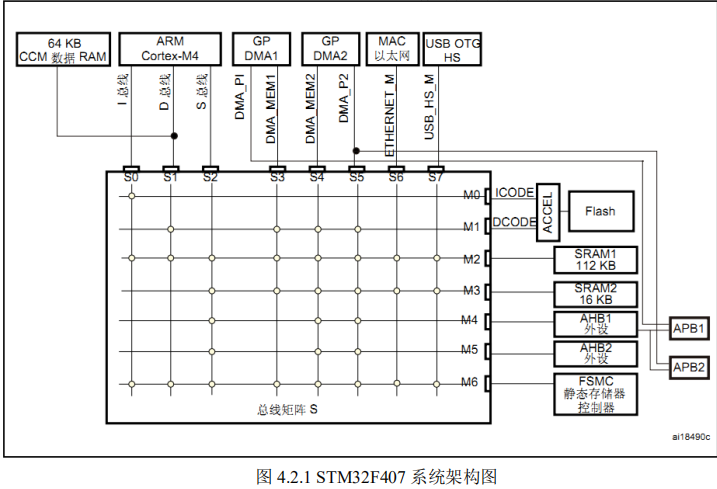

主系统由 32 位多层 AHB 总线矩阵构成。总线矩阵用于主控总线之间的访问仲裁管理。

仲裁采 取循环调度算法。总线矩阵可实现以下部分互联： 

- 八条主控总线是： 
- Cortex-M4 内核 I 总线, D 总线和 S 总线; 
- DMA1 存储器总线, DMA2 存储器总线; 
- DMA2 外设总线; 
- 以太网 DMA 总线; 
- USB OTG HS DMA 总线; 

七条被控总线： 

- 内部 FLASH ICode 总线; 
- 内部 FLASH DCode 总线; 
- 主要内部 SRAM1(112KB) 
- 辅助内部 SRAM2(16KB); 
- 辅助内部 SRAM3(64KB) (仅适用 STM32F42xx 和 STM32F43xx 系列器件)
- AHB1 外设 和 AHB2 外设; 
- FSMC 

下面我们具体讲解一下图中几个总线的知识。 

① I 总线(S0)：此总线用于将 Cortex-M4 内核的指令总线连接到总线矩阵。内核通过此总 线获取指令。此总线访问的对象是包括代码的存储器。 

② D 总线(S1)：此总线用于将 Cortex-M4 数据总线和 64KB CCM 数据 RAM 连接到总线矩 阵。内核通过此总线进行立即数加载和调试访问。 

③ S 总线(S2)：此总线用于将 Cortex-M4 内核的系统总线连接到总线矩阵。此总线用于访 问位于外设或 SRAM 中的数据。 

④ DMA 存储器总线（S3,S4）：此总线用于将 DMA 存储器总线主接口连接到总线矩阵。 DMA 通过此总线来执行存储器数据的传入和传出。 

⑤ DMA 外设总线：此总线用于将 DMA 外设主总线接口连接到总线矩阵。DMA 通过此 总线访问 AHB 外设或执行存储器之间的数据传输。 

⑥ 以太网 DMA 总线:此总线用于将以太网 DMA 主接口连接到总线矩阵。以太网 DMA 通过此总线向存储器存取数据。 

⑦ USB OTG HS DMA 总线(S7)：此总线用于将 USB OTG HS DMA 主接口连接到总线矩 阵。USB OTG HS DMA 通过此总线向存储器加载/存储数据。 

对于系统架构的知识，在刚开始学习 STM32 的时候只需要一个大概的了解，大致知道是个 什么情况即可。对于寻址之类的知识，这里就不做深入的讲解，中文参考手册都有很详细的讲 解。 

## **3 STM32F4** **时钟系统** 

STM32F4 时钟系统的知识在《STM32F4 中文参考手册》第六章复位和时钟控制章节有非 常详细的讲解，网上关于时钟系统的讲解也基本都是参考的这里，讲不出啥特色，不过作为一 个完整的参考手册，我们必然要提到时钟系统的知识。这些知识也不是什么原创，纯粹根据官 方提供的中文参考手册和自己的应用心得来总结的，如有不合理之处望大家谅解。 

**3.1 STM32F4** **时钟树概述** 

众所周知，时钟系统是 CPU 的脉搏，就像人的心跳一样。所以时钟系统的重要性就不言而喻了。 STM32F4 的时钟系统比较复杂，不像简单的 51 单片机一个系统时钟就可以解决一切。

于是有人要问，采用一个系统时钟不是很简单吗？为什么 STM32 要有多个时钟源呢？ 

因为首 先 STM32 本身非常复杂，外设非常的多，但是并不是所有外设都需要系统时钟这么高的频率， 比如看门狗以及 RTC 只需要几十 k 的时钟即可。同一个电路，时钟越快功耗越大，同时抗电磁干扰能力也会越弱，所以对于较为复杂的 MCU 一般都是采取多时钟源的方法来解决这些问题。 

首先让我们来看看 STM32F4 的时钟系统图：

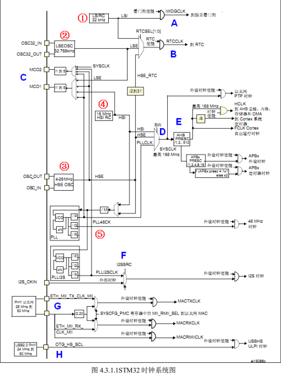

在 STM32F4 中，有 5 个最重要的时钟源，为 HSI、HSE、LSI、LSE、PLL。其中 PLL 实 际是分为两个时钟源，分别为主 PLL 和专用 PLL。

从时钟频率来分可以分为高速时钟源和低速 时钟源，在这 5 个中 HSI，HSE 以及 PLL 是高速时钟，LSI 和 LSE 是低速时钟。

从来源可分为 外部时钟源和内部时钟源，外部时钟源就是从外部通过接晶振的方式获取时钟源，其中 HSE 和 LSE 是外部时钟源，其他的是内部时钟源。下面我们看看 STM32F4 的这 5 个时钟源，我们讲 解顺序是按图中红圈标示的顺序：

#### ①、LSI 是低速内部时钟，RC 振荡器，频率为 32kHz 左右。供独立看门狗和自动唤醒单元使用。 

#### ②、LSE 是低速外部时钟，接频率为 32.768kHz 的石英晶体。这个主要是 RTC 的时钟源。 

#### ③、HSE 是高速外部时钟，可接石英/陶瓷谐振器，或者接外部时钟源，频率范围为 4MHz~26MHz。 

我们的开发板接的是 8M 的晶振。HSE 也可以直接做为系统时钟或者 PLL 输入。 

#### ④、HSI 是高速内部时钟，RC 振荡器，频率为 16MHz。可以直接作为系统时钟或者用作 PLL 

输入。 

#### ⑤、PLL 为锁相环倍频输出。STM32F4 有两个 PLL: 

##### 1） 主 PLL(PLL)由 HSE 或者 HSI 提供时钟信号，并具有两个不同的输出时钟。

第一个输出 PLLP 用于生成高速的系统时钟（最高 168MHz） 

第二个输出 PLLQ 用于生成 USB OTG FS 的时钟（48MHz），随机数发生器的时钟和 SDIO 时钟。 

##### 2）专用 PLL(PLLI2S)用于生成精确时钟，从而在 I2S 接口实现高品质音频性能

这里我们着重看看主 PLL 时钟第一个高速时钟输出 PLLP 的计算方法。图 4.3.1.2 是主 PLL 的 时钟图。 

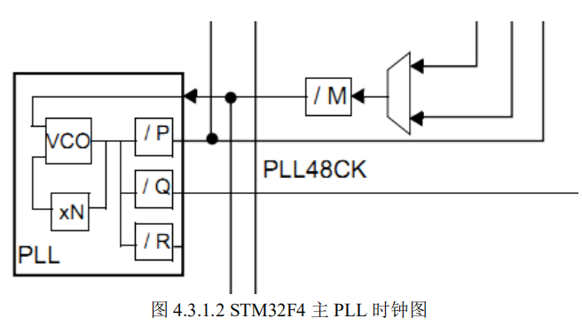

从图 4.3.1.2 可以看出。主 PLL 时钟的时钟源要先经过一个分频系数为 M 的分频器，然后经过 倍频系数为 N 的倍频器出来之后的时候还需要经过一个分频系数为 P（第一个输出 PLLP）或者 Q（第二个输出 PLLQ）的分频器分频之后，最后才生成最终的主 PLL 时钟。 

例如我们的外部晶振选择 8MHz。同时我们设置相应的分频器 M=8，倍频器倍频系数 N=336，分频器分频系数 P=2，那么主 PLL 生成的第一个输出高速时钟 PLLP 为： 

`PLL=8MHz * N/ (M*P)=8MHz* 336 /(8*2) = 168MHz `

如果我们选择HSE为PLL时钟源，同时SYSCLK时钟源为PLL，那么SYSCLK时钟为 168MHz。 

这对于我们后面的实验都是采用这样的配置。 

上面我们简要概括了 STM32 的时钟源，那么这 5 个时钟源是怎么给各个外设以及系统提 供时钟的呢？这里我们选择一些比较常用的时钟知识来讲解。 


图 4.3.1.1 中我们用 A~G 标示我们要讲解的地方。 

- A. 这里是看门狗时钟输入。从图中可以看出，看门狗时钟源只能是低速的 LSI 时钟。 
- B. 这里是 RTC 时钟源，从图上可以看出，RTC 的时钟源可以选择 LSI，LSE，以及 HSE 分频后的时钟，HSE 分频系数为 2~31。 
- C. 这里是 STM32F4 输出时钟 MCO1 和 MCO2。MCO1 是向芯片的 PA8 引脚输出时 钟。它有四个时钟来源分别为：HSI,LSE,HSE 和 PLL 时钟。MCO2 是向芯片的PC9 输出时钟，它同样有四个时钟来源分别为：HSE,PLL，SYSCLK 以及 PLLI2S 时钟。MCO 输出时钟频率最大不超过 100MHz。 
- D. 这里是系统时钟。从图 4.3.1 可以看出，SYSCLK 系统时钟来源有三个方面： HSI,HSE 和 PLL。在我们实际应用中，因为对时钟速度要求都比较高我们才会选 用 STM32F4 这种级别的处理器，所以一般情况下，都是采用 PLL 作为 SYSCLK 时钟源。根据前面的计算公式，大家就可以算出你的系统的 SYSCLK 是多少。 
- E. 这里我们指的是以太网 PTP 时钟，AHB 时钟，APB2 高速时钟，APB1 低速时钟。 这些时钟都是来源于 SYSCLK 系统时钟。其中以太网 PTP 时钟是使用系统时钟。 AHB,APB2 和 APB1 时钟是经过 SYSCLK 时钟分频得来。这里大家记住，AHB 最大时钟为168MHz, APB2高速时钟最大频率为84MHz,而APB1低速时钟最大频 率为 42MHz。 
- F. 这里是指 I2S 时钟源。从图 4.3.1 可以看出，I2S 的时钟源来源于 PLLI2S 或者映 射到 I2S_CKIN 引脚的外部时钟。I2S 出于音质的考虑，对时钟精度要求很高。探 索者 STM32F4 开发板使用的是内部 PLLI2SCLK。 
- G. 这是 STM32F4 内部以太网 MAC 时钟的来源。对于 MII 接口来说，必须向外部 PHY 芯片提供 25Mhz 的时钟，这个时钟，可以由 PHY 芯片外接晶振，或者使用 STM32F4 的 MCO 输 出 来 提 供 。 然 后 ， PHY 芯 片 再 给 STM32F4 提 供 ETH_MII_TX_CLK 和 ETH_MII_RX_CLK 时钟。
    - 对于 RMII 接口来说，外部必须 提供 50Mhz 的时钟驱动 PHY 和 STM32F4 的 ETH_RMII_REF_CLK，这个 50Mhz 时钟可以来自 PHY、有源晶振或者 STM32F4 的 MCO。我们的开发板使用的是 RMII 接 口 ， 使 用 PHY 芯 片 提 供 50Mhz 时 钟 驱 动 STM32F4 的 ETH_RMII_REF_CLK。 
- H. 这里是指外部 PHY 提供的 USB OTG HS（60MHZ）时钟。 

这里还需要说明一下，Cortex 系统定时器 Systick 的时钟源可以是 AHB 时钟 HCLK 或 HCLK 的 8 分频。具体配置请参考 Systick 定时器配置，我们后面会在 小节讲解 delay 文件 夹代码的时候讲解。 

在以上的时钟输出中，有很多是带使能控制的，例如 AHB 总线时钟、内核时钟、各种 APB1 外设、APB2 外设等等。当需要使用某模块时，记得一定要先使能对应的时钟。后面我们讲解 实例的时候会讲解到时钟使能的方法。 

**3.2 STM32F4** **时钟初始化配置** 

上一小节我们对 STM32F4 时钟树进行了初步的讲解，接下来我们来讲解一下 STM32F4 的系统时钟配置。 

STM32F4 时钟系统初始化是在 system_stm32f4xx.c 中的 `SystemInit`()函数中完成的。对于系 统时钟关键寄存器设置主要是在 SystemInit 函数中调用 SetSysClock()函数来设置的。

我们可以 先看看 SystemInit ()函数体： 

```c
void SystemInit(void)
{
 /* FPU settings ------------------------------------------------------------*/
 #if (__FPU_PRESENT == 1) && (__FPU_USED == 1)
 SCB->CPACR |= ((3UL << 10*2)|(3UL << 11*2)); /* set CP10 and CP11 Full Access */
 #endif/* Reset the RCC clock configuration to the default reset state ------------*/
 /* Set HSION bit */
 RCC->CR |= (uint32_t)0x00000001;
 /* Reset CFGR register */
 RCC->CFGR = 0x00000000;
 /* Reset HSEON, CSSON and PLLON bits */
 RCC->CR &= (uint32_t)0xFEF6FFFF;
 /* Reset PLLCFGR register */
 RCC->PLLCFGR = 0x24003010;
 /* Reset HSEBYP bit */
 RCC->CR &= (uint32_t)0xFFFBFFFF;
 /* Disable all interrupts */
 RCC->CIR = 0x00000000;
#if defined (DATA_IN_ExtSRAM) || defined (DATA_IN_ExtSDRAM)
 SystemInit_ExtMemCtl(); 
#endif /* DATA_IN_ExtSRAM || DATA_IN_ExtSDRAM */
 
 /* Configure the System clock source, PLL Multiplier and Divider factors, 
 AHB/APBx prescalers and Flash settings ----------------------------------*/
SetSysClock();
 /* Configure the Vector Table location add offset address ------------------*/
#ifdef VECT_TAB_SRAM
 SCB->VTOR = SRAM_BASE | VECT_TAB_OFFSET; /* Vector Table Relocation in Internal 
SRAM */
#else
 SCB->VTOR = FLASH_BASE | VECT_TAB_OFFSET; /* Vector Table Relocation in 
Internal FLASH */
#endif
}
```

SystemInit 函数开始先进行浮点运算单元设置，然后是复位 PLLCFGR,CFGR 寄存器，同时 通过设置 CR 寄存器的 HSI 时钟使能位来打开 HSI 时钟。

默认情况下如果 CFGR 寄存器复位， 那么是选择 HSI 作为系统时钟，这点大家可以查看 RCC->CFGR 寄存器的位描述最低 2 位可以 得知，当低两位配置为 00 的时候（复位之后），会选择 HSI 振荡器为系统时钟。

也就是说，调用 SystemInit 函数之后，首先是选择 HSI 作为系统时钟。下面是 RCC->CFGR 寄存器的位 1:0 配置描述（CFGR 寄存器详细描述请参考《STM32F4 中文参考手册》6.3.31CFGR 寄存器配置 表）如下表 4.3.2.1：

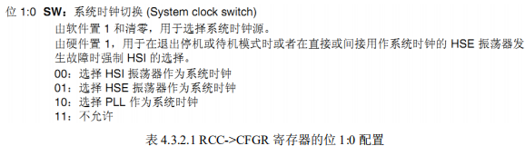

在设置完相关寄存器后，接下来 SystemInit 函数内部会调用 SetSysClock 函数。

这个函数比 较长，我们就把函数一些关键代码行截取出来给大家讲解一下。这里我们省略一些宏定义标识 符值的判断而直接把针对 STM32F407 比较重要的内容贴出来： 

```c
static void SetSysClock(void)
{
 __IO uint32_t StartUpCounter = 0, HSEStatus = 0;
 /*使能 HSE*/
 RCC->CR |= ((uint32_t)RCC_CR_HSEON);
 /* 等待 HSE 稳定*/
 do
 {
 HSEStatus = RCC->CR & RCC_CR_HSERDY;
 StartUpCounter++;
 } while((HSEStatus == 0) && (StartUpCounter != HSE_STARTUP_TIMEOUT));
 if ((RCC->CR & RCC_CR_HSERDY) != RESET)
 {
 HSEStatus = (uint32_t)0x01;
 }
 else
 {
 HSEStatus = (uint32_t)0x00;
 }
 if (HSEStatus == (uint32_t)0x01)
 {
 /* Select regulator voltage output Scale 1 mode */
 RCC->APB1ENR |= RCC_APB1ENR_PWREN;
 PWR->CR |= PWR_CR_VOS;
 /* HCLK = SYSCLK / 1*/
 RCC->CFGR |= RCC_CFGR_HPRE_DIV1;
 
 /* PCLK2 = HCLK / 2*/
 RCC->CFGR |= RCC_CFGR_PPRE2_DIV2;
 
 /* PCLK1 = HCLK / 4*/
 RCC->CFGR |= RCC_CFGR_PPRE1_DIV4;
 /* PCLK2 = HCLK / 2*/
 RCC->CFGR |= RCC_CFGR_PPRE2_DIV1;
 
 /* PCLK1 = HCLK / 4*/
 RCC->CFGR |= RCC_CFGR_PPRE1_DIV2;
 /* Configure the main PLL */
 RCC->PLLCFGR = PLL_M | (PLL_N << 6) | (((PLL_P >> 1) -1) << 16) |
 (RCC_PLLCFGR_PLLSRC_HSE) | (PLL_Q << 24);
 /* 使能主 PLL*/
 RCC->CR |= RCC_CR_PLLON;
 /* 等待主 PLL 就绪 */
 while((RCC->CR & RCC_CR_PLLRDY) == 0)
 {
 }
 
 /* Configure Flash prefetch, Instruction cache, Data cache and wait state */
 FLASH->ACR = FLASH_ACR_PRFTEN | FLASH_ACR_ICEN 
|FLASH_ACR_DCEN |FLASH_ACR_LATENCY_5WS;
 /* 设置主 PLL 时钟为系统时钟源 */
 RCC->CFGR &= (uint32_t)((uint32_t)~(RCC_CFGR_SW));
 RCC->CFGR |= RCC_CFGR_SW_PLL;
 /* 等待设置稳定（主 PLL 作为系统时钟源）*/
 while ((RCC->CFGR & (uint32_t)RCC_CFGR_SWS ) != RCC_CFGR_SWS_PLL);
 {
 }
 }
 else
 { /* If HSE fails to start-up, the application will have wrong clock
 configuration. User can add here some code to deal with this error */
 } }
```

这段代码的大致流程是这样的：先使能外部时钟 HSE，等待 HSE 稳定之后，配置 AHB,APB1,APB2 时钟相关的分频因子，也就是相关外设的时钟。

等待这些都配置完成之后， 打开主 PLL 时钟，然后设置主 PLL 作为系统时钟 SYSCLK 时钟源。

如果 HSE 不能达到就绪状 态（比如外部晶振不能稳定或者没有外部晶振），那么依然会是 HSI 作为系统时钟。 

在这里要特别提出来，在设置主 PLL 时钟的时候，会要设置一系列的分频系数和倍频系数 参数。大家可以从 SetSysClock 函数的这行代码看出： 

```c
RCC->PLLCFGR = PLL_M | (PLL_N << 6) | (((PLL_P >> 1) -1) << 16) |
 (RCC_PLLCFGR_PLLSRC_HSE) | (PLL_Q << 24);
```

这些参数是通过宏定义标识符的值来设置的。默认的配置在 System_stm32f4xx.c 文件开头的地 方配置。对于我们开发板，我们的设置参数值如下： 

```c
#define PLL_M 8
#define PLL_Q 7
#define PLL_N 336
#define PLL_P 2
```

所以我们的主 PLL 时钟为： 

`PLL=8MHz * N/ (M*P)=8MHz* 336 /(8*2) = 168MHz `

在开发过程中，我们可以通过调整这些值来设置我们的系统时钟。 

这里还有个特别需要注意的地方，就是我们还要同步修改 stm32f4xx.h 中宏定义标识符 

HSE_VALUE 的值为我们的外部时钟： 

```c
#if !defined (HSE_VALUE)  

**#define HSE_VALUE ((uint32_t)8000000) /\*!< Value of the External oscillator in Hz \*/**
\#endif /* HSE_VALUE */ 
```

这里默认固件库配置的是 25000000，我们外部时钟为 8MHz，所以我们根据我们硬件情况修改 为 8000000 即可。 

讲到这里，大家对 SystemInit 函数的流程会有个比较清晰的理解。

那么 SystemInit 函数是 怎么被系统调用的呢？SystemInit 是整个设置系统时钟的入口函数。这个函数对于我们使用 ST 提供的 STM32F4 固件库的话，会在系统启动之后先执行 main 函数，然后再接着执行 SystemInit 函数实现系统相关时钟的设置。

这个过程设置是在启动文件 startup_stm32f40_41xxx.s 中间设置的，我们接下来看看启动文件中这段启动代码： 

```c
; Reset handler 

Reset_Handler PROC 

 EXPORT Reset_Handler [WEAK] 

 IMPORT SystemInit 

 IMPORT __main 

 LDR R0, =SystemInit 

 BLX R0 

 LDR R0, =__main 

 BX R0 

 ENDP 
```

这段代码的作用是在系统复位之后引导进入 main 函数，同时在进入 main 函数之前，首先 要调用 SystemInit 系统初始化函数完成系统时钟等相关配置。

最后我们总结一下 SystemInit()函数中设置的系统时钟大小：

```c

SYSCLK（系统时钟） =168MHz
AHB 总线时钟(HCLK=SYSCLK) =168MHz
APB1 总线时钟(PCLK1=SYSCLK/4) =42MHz
APB2 总线时钟(PCLK2=SYSCLK/2) =84MHz
PLL 主时钟 =168MHz
```

## **3.3 STM32F4** **时钟使能和配置** 

上小节我们讲解了系统复位之后调用 SystemInit 函数之后相关时钟的默认配置。如果在系 统初始化之后，我们还需要修改某些时钟源配置，或者我们要使能相关外设的时钟该怎么设置 呢？

这些设置实际是在 RCC 相关寄存器中配置的。因为 RCC 相关寄存器非常多，有兴趣的同 学可以直接打开《STM32F4 中文参考手册》6.3 小节查看所有 RCC 相关寄存器的配置。

所以这 里我们不直接讲解寄存器配置，而是通过 STM32F4 标准固件库配置方法给大家讲解。 在 STM32F4 标准固件库里，时钟源的选择以及时钟使能等函数都是在 RCC 相关固件库文 件 stm32f4xx_rcc.h 和 stm32f4xx_rcc.c 中声明和定义的。

大家打开 stm32f4xx_rcc.h 文件可以看 到文件开头有很多宏定义标识符，然后是一系列时钟配置和时钟使能函数申明。这些函数大致 可以归结为三类

1. 一类是外设时钟使能函数
2. 一类是时钟源和分频因子配置函数
3. 还有一类是 外设复位函数。

当然还有几个获取时钟源配置的函数。下面我们以几种常见的操作来简要介绍 一下这些库函数的使用。 

首先是时钟使能函数。时钟使能相关函数包括外设设置使能和时钟源使能两类。首先我们 来看看外设时钟使能相关的函数： 

```c
void RCC_AHB1PeriphClockCmd(uint32_t RCC_AHB1Periph, FunctionalState NewState); 

void RCC_AHB2PeriphClockCmd(uint32_t RCC_AHB2Periph, FunctionalState NewState); 

void RCC_AHB3PeriphClockCmd(uint32_t RCC_AHB3Periph, FunctionalState NewState); 

void RCC_APB1PeriphClockCmd(uint32_t RCC_APB1Periph, FunctionalState NewState); 

void RCC_APB2PeriphClockCmd(uint32_t RCC_APB2Periph, FunctionalState NewState); 
```

这里主要有 5 个外设时钟使能函数。5 个函数分别用来使能 5 个总线下面挂载的外设时钟，这 些总线分别为：AHB1 总线，AHB2 总线，AHB3 总线，APB1 总线以及 APB2 总线。

要使能某 个外设，调用对应的总线外设时钟使能函数即可。 

这里我们要特别说明一下，STM32F4 的外设在使用之前，必须对时钟进行使能，如果没有 使能时钟，那么外设是无法正常工作的。

对于哪个外设是挂载在哪个总线之下，虽然我们也可 以查手册查询到，但是这里如果大家使用的是库函数的话，实际上是没有必要去查询手册的， 

这里我们给大家介绍一个小技巧。 

比如我们要使能 GPIOA,我们只需要在 stm32f4xx_rcc.h 头文件里面搜索 GPIOA，就可以搜索到对应的时钟使能函数的第一个入口参数为 `RCC_AHB1Periph_GPIOA`，从这个宏定义标识 符一眼就可以看出，GPIOA 是挂载在 AHB1 下面。同理，对于串口 1 我们可以搜索 USART1， 

找到标识符为 `RCC_APB2Periph_USART1`，那么很容易知道串口 1 是挂载在 APB2 之下。这个 知识在我们后面的“4.7 快速组织代码技巧”小节也有讲解，这里顺带提一下。 

如果我们要使能 GPIOA，那么我们可以在头文件 stm32f4xx_rcc.h 里面查看到宏定义标识 `RCC_AHB1Periph_GPIOA`，顾名思义 GPIOA 是挂载在 AHB1 总线之下，所以，我们调用 AHB1 总线下外设时钟使能函数 `RCC_AHB1PeriphClockCmd `即可。具体调用方式入如下： 

`RCC_AHB1PeriphClockCmd(RCC_AHB1Periph_GPIOA,ENABLE);//使能 GPIOA 时钟`

同理，如果我们要使能串口 1 的时钟，那么我们调用的函数为： 

`void RCC_AHB2PeriphClockCmd(uint32_t RCC_AHB1Periph, FunctionalState NewState); `

具体的调用方法是： 

`RCC_APB2PeriphClockCmd(RCC_APB2Periph_USART1,ENABLE); `

还有一类时钟使能函数是时钟源使能函数，前面我们已经讲解过 STM32F4 有 5 大类时钟 源。

这里我们列出来几种重要的时钟源使能函数： 

```c
void RCC_HSICmd(FunctionalState NewState); 

void RCC_LSICmd(FunctionalState NewState); 

void RCC_PLLCmd(FunctionalState NewState); 

void RCC_PLLI2SCmd(FunctionalState NewState); 

void RCC_PLLSAICmd(FunctionalState NewState); 

void RCC_RTCCLKCmd(FunctionalState NewState); 
```

这些函数是用来使能相应的时钟源。比如我们要使能 PLL 时钟，那么调用的函数为： 

`void RCC_PLLCmd(FunctionalState NewState); `

具体调用方法如下： 

`RCC_PLLCmd(ENABLE); `

我们要使能相应的时钟源，调用对应的函数即可。 

接下来我们要讲解的是第二类时钟功能函数：时钟源选择和分频因子配置函数。

这些函数 是用来选择相应的时钟源以及配置相应的时钟分频系数。

比如我们之前讲解过系统时钟 SYSCLK，我们可以选择 HSI,HSE 以及 PLL 三个中的一个时钟源为系统时钟。

那么到底选择哪 一个，这是可以配置的。下面我们列举几种时钟源配置函数： 

```c
void RCC_LSEConfig(uint8_t RCC_LSE); 

void RCC_SYSCLKConfig(uint32_t RCC_SYSCLKSource); 

void RCC_HCLKConfig(uint32_t RCC_SYSCLK); 

void RCC_PCLK1Config(uint32_t RCC_HCLK); 

void RCC_PCLK2Config(uint32_t RCC_HCLK); 

void RCC_RTCCLKConfig(uint32_t RCC_RTCCLKSource); 

void RCC_PLLConfig(uint32_t RCC_PLLSource, uint32_t PLLM,  

uint32_t PLLN, uint32_t PLLP, uint32_t PLLQ); 
```

比如我们要设置系统时钟源为 HSI，那么我们可以调用系统时钟源配置函数： 

`void RCC_HCLKConfig(uint32_t RCC_SYSCLK); `

具体配置方法如下： 

`RCC_HCLKConfig(RCC_SYSCLKSource_HSI);//配置时钟源为 HSI `

又如我们要设置 APB1 总线时钟为 HCLK 的 2 分频，也就是设置分频因子为 2 分频，那么如果我们要使能 HSI，那么调用的函数为： 

`void RCC_PCLK1Config(uint32_t RCC_HCLK); `

具体配置方法如下： 

`RCC_PCLK1Config(RCC_HCLK_Div2); `

接下来我们看看第三类外设复位函数。如下： 

```c
void RCC_AHB1PeriphResetCmd(uint32_t RCC_AHB1Periph, FunctionalState NewState); 

void RCC_AHB2PeriphResetCmd(uint32_t RCC_AHB2Periph, FunctionalState NewState); 

void RCC_AHB3PeriphResetCmd(uint32_t RCC_AHB3Periph, FunctionalState NewState); 

void RCC_APB1PeriphResetCmd(uint32_t RCC_APB1Periph, FunctionalState NewState);
```

`void RCC_APB2PeriphResetCmd(uint32_t RCC_APB2Periph, FunctionalState NewState); `

这类函数跟前面讲解的外设时钟函数使用方法基本一致，不同的是一个是用来使能外设时 钟，一个是用来复位对应的外设。

这里大家在调用函数的时候一定不要混淆。 对于这些时钟操作函数，我们就不一一列举出来，大家可以打开 RCC 对应的文件仔细了解。 


## **4.4 IO** **引脚复用器和映射** 

STM32F4 有很多的内置外设，这些外设的外部引脚都是与 GPIO 复用的。也就是说，一个 GPIO 如果可以复用为内置外设的功能引脚，那么当这个 GPIO 作为内置外设使用的时候，就叫做复用。 

这部分知识在《STM32F4 中文参考手册》第七章和芯片数据手册有详细的讲解哪些 GPIO 管脚是 可以复用为哪些内置外设。 

对于本小节知识，STM32F4 中文参考手册讲解比较详细，我们同样会从中抽取重要的知识点 罗列出来。

同时，我们会以串口使用为例给大家讲解具体的引脚复用的配置。 

STM32F4 系列微控制器 IO 引脚通过一个复用器连接到内置外设或模块。

该复用器一次只允 许一个外设的复用功能（AF）连接到对应的 IO 口。

这样可以确保共用同一个 IO 引脚的外设之间不会发生冲突。 

每个 IO 引脚都有一个复用器，该复用器采用 16 路复用功能输入（AF0 到 AF15），可通过 `GPIOx_AFRL`(针对引脚 0-7)和 `GPIOx_AFRH`（针对引脚 8-15）寄存器对这些输入进行配置，每四 位控制一路复用： 

- 1）完成复位后，所有 IO 都会连接到系统的复用功能 0（AF0）。 
- 2）外设的复用功能映射到 AF1 到 AF13。 
- 3）Cortex-M4 EVENTOUT 映射到 AF15

复用器示意图如下图 4.4.1： 

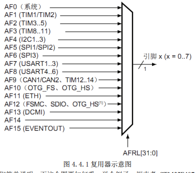

接下来，我们简单说明一下这个图要如何看，举个例子，探索者 STM32F407 开发板的原 理图上 PC11 的原理图如图 4.4.2 所示：

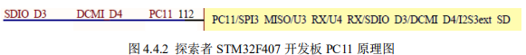

如上图所示，PC11 可以作为 SPI3_MISO/U3_RX/U4_RX/SDIO_D3/DCMI_D4/I2S3ext_SD 等复用功能输出，这么多复用功能，如果这些外设都开启了，那么对 STM32F1 来说，那就可能乱套了，外设之间可互相干扰

但是 STM32F4，由于有复用功能选择功能，可以让 PC11 仅 连接到某个特定的外设，因此不存在互相干扰的情况。 

上图 4.4.1 是针对引脚 0-7，对于引脚 8-15，控制寄存器为 `GPIOx_AFRH`。从图中可以看出。 

当需要使用复用功能的时候，我们配置相应的寄存器 `GPIOx_AFRL `或者 `GPIOx_AFRH`，让对应引 脚通过复用器连接到对应的复用功能外设。

这里我们列出 `GPIOx_AFRL `寄存器的描述， `GPIOx_AFRH `的作用跟 `GPIOx_AFRL `类似，只不过 `GPIOx_AFRH `控制的是一组 IO 口的高八位， `GPIOx_AFRL `控制的是一组 IO 口的低八位。 

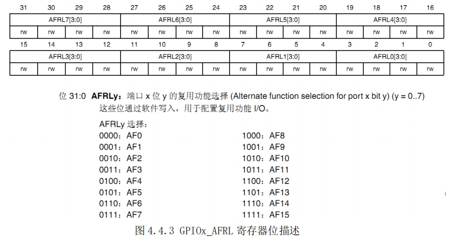

从表中可以看出，32 位寄存器 GPIOx_AFRL 每四个位控制一个 IO 口，所以每个寄存器控制 32/4=8 个 IO 口。寄存器对应四位的值配置决定这个 IO 映射到哪个复用功能 AF。 

在微控制器完成复位后，所有 IO 口都会连接到系统复用功能 0（AF0）。这里大家需要注意， 对于系统复用功能 AF0，我们将 IO 口连接到 AF0 之后，还要根据所用功能进行配置： 

1) JTAG/SWD:在器件复位之后，会将这些功能引脚指定为专用引脚。也就是说，这些引脚 在复位后默认就是 JTAG/SWD 功能。如果我们要作为 GPIO 来使用，就需要对对应的 IO 口复用器进行配置。 

2) RTC_REFIN:此引脚在系统复位之后要使用的话要配置为浮空输入模式。 

3) MCO1 和 MCO2：这些引脚在系统复位之后要使用的话要配置为复用功能模式。 

对于外设复用功能的配置，**除了 ADC 和 DAC 要将 IO 配置为模拟通道之外其他外设功能一律** 要配置为复用功能模式**，这个配置是在 IO 口对应的 GPIOx_MODER 寄存器中配置的。

同时要配 置 GPIOx_AFRH 或者 GPIOx_AFRL 寄存器，将 IO 口通过复用器连接到所需要的复用功能对应的 AFx。 

不是每个 IO 口都可以复用为任意复用功能外设。到底哪些 IO 可以复用为相关外设呢？这 在芯片对应的数据手册(请参考光盘目录：)上面会有详细的表格列出来。对于 STM32F407，数 据手册里面的 Table 9.Alternate function mapping 表格列出了所有的端口 AF 映射表，因为表格比较大，所以这里只列出 PORTA 的几个端口为例方便大家理解：

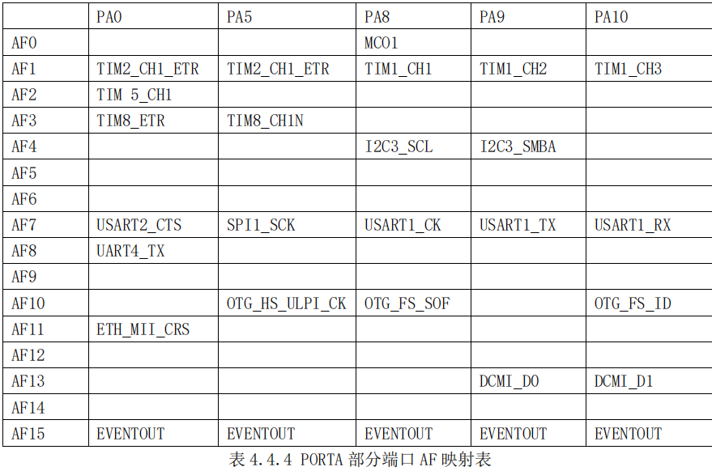

从表 4.4.4 可以看出，PA9 连接 AF7 可以复用为串口 1 的发送引脚 USART1_TX，PA10 连接 AF7 可以复用为串口 2 的接受引脚 USART1_RX。 

### 接下来我们以串口 1 为例来讲解怎么配置 GPOPA.9,GPIOA.10 口为串口 1 复用功能。 

#### 1）首先,我们要使用 IO 复用功能外设，必须先打开对应的 IO 时钟和复用功能外设时钟。 

```c
/*使能 GPIOA 时钟*/ 

RCC_AHB1PeriphClockCmd(RCC_AHB1Periph_GPIOA,ENABLE);  

/*使能 USART1 时钟*/ 

RCC_APB2PeriphClockCmd(RCC_APB2Periph_USART1,ENABLE); 
```

####  这里需要说明一下，官方库提供了五个打开 GPIO 和外设时钟的函数分别为： 

```c
void RCC_AHB1PeriphClockCmd(uint32_t RCC_AHB1Periph, FunctionalState NewState); 

void RCC_AHB2PeriphClockCmd(uint32_t RCC_AHB2Periph, FunctionalState NewState); 

void RCC_AHB3PeriphClockCmd(uint32_t RCC_AHB3Periph, FunctionalState NewState); 

void RCC_APB1PeriphClockCmd(uint32_t RCC_APB1Periph, FunctionalState NewState); 

void RCC_APB2PeriphClockCmd(uint32_t RCC_APB2Periph, FunctionalState NewState); 
```

 这五个函数分别用来打开相应的总线下 GPIO 和外设时钟。比如我们的串口 1 是挂载在 APB2 总线之下，所以我们调用对应的 APB2 总线下外设时钟使能函数 RCC_APB2PeriphClockCmd 来使能串口 1 时钟。

对于其他外设我们调用相应的函数即可。具体库函数要怎么快速找到对应 的外设使能函数，大家可以参考我们接下来的 4.7 小节快速组织代码技巧，我们有详细的举例 说明。 

#### 2）其次，我们在 GIPOx_MODER 寄存器中将所需 IO（对于串口 1 是 PA9,PA10）配置为复用功能（**ADC 和 DAC 设置为模拟通道**）。

#### 3）再次,我们还需要对 IO 口的其他参数，例如类型，上拉/下拉以及输出速度。 

上面两步，在我们库函数中是通过 GPIO_Init 函数来实现的，参考代码如下： 

```c
GPIO_InitStructure.GPIO_Pin = GPIO_Pin_9 | GPIO_Pin_10; 
 GPIO_InitStructure.GPIO_Mode = GPIO_Mode_AF;//复用功能
 GPIO_InitStructure.GPIO_Speed = GPIO_Speed_50MHz;//速度 50MHz
 GPIO_InitStructure.GPIO_OType = GPIO_OType_PP; //推挽复用输出
 GPIO_InitStructure.GPIO_PuPd = GPIO_PuPd_UP; //上拉
 GPIO_Init(GPIOA,&GPIO_InitStructure); //初始化 PA9，PA10
```

#### 4）最后，我们配置 GPIOx_AFRL 或者 GPIOx_AFRH 寄存器，将 IO 连接到所需的 AFx。 这些步骤对于我们使用库函数来操作的话，是调用的 GPIO_PinAFConfig 函数来实现的。具 体操作代码如下： 

```c
/*PA9 连接 AF7，复用为 USART1_TX */
GPIO_PinAFConfig(GPIOA,GPIO_PinSource9,GPIO_AF_USART1); 
/* PA10 连接 AF7,复用为 USART1_RX*/
GPIO_PinAFConfig(GPIOA,GPIO_PinSource10,GPIO_AF_USART1);
```

对于函数 GPIO_PinAFConfig 函数，入口第一个第二个参数很好理解，可以确定是哪个 IO， 对于第三个参数，实际上我们确定了这个 IO 到底是复用为哪种功能之后，这个参数也很好选 择，因为可选的参数在 stm32f4xx_gpio.h 列出来非常详细，如下

```c
#define IS_GPIO_AF(AF) (((AF) == GPIO_AF_RTC_50Hz) ||((AF) == GPIO_AF_TIM14) || \
 ((AF) == GPIO_AF_MCO) || ((AF) == GPIO_AF_TAMPER) || \
 ((AF) == GPIO_AF_SWJ) || ((AF) == GPIO_AF_TRACE) || \
 ((AF) == GPIO_AF_TIM1) || ((AF) == GPIO_AF_TIM2) || \
 ((AF) == GPIO_AF_TIM3) || ((AF) == GPIO_AF_TIM4) || \
 ((AF) == GPIO_AF_TIM5) || ((AF) == GPIO_AF_TIM8) || \
 ((AF) == GPIO_AF_I2C1) || ((AF) == GPIO_AF_I2C2) || \
 ((AF) == GPIO_AF_I2C3) || ((AF) == GPIO_AF_SPI1) || \
 ((AF) == GPIO_AF_SPI2) || ((AF) == GPIO_AF_TIM13) || \
 ((AF) == GPIO_AF_SPI3) || ((AF) == GPIO_AF_TIM14) || \
 ((AF) == GPIO_AF_USART1) || ((AF) == GPIO_AF_USART2) || \
 ((AF) == GPIO_AF_USART3) || ((AF) == GPIO_AF_UART4) || \
 ((AF) == GPIO_AF_UART5) || ((AF) == GPIO_AF_USART6) || \
 ((AF) == GPIO_AF_CAN1) || ((AF) == GPIO_AF_CAN2) || \
 ((AF) == GPIO_AF_OTG_FS) || ((AF) == GPIO_AF_OTG_HS) || \
 ((AF) == GPIO_AF_ETH) || ((AF) == GPIO_AF_OTG_HS_FS) || \
 ((AF) == GPIO_AF_SDIO) || ((AF) == GPIO_AF_DCMI) || \
 ((AF) == GPIO_AF_EVENTOUT) || ((AF) == GPIO_AF_FSMC))
```

### 参考这些宏定义标识符，能很快找到函数的入口参数。 

ST32F4 的端口复用和映射就给大家讲解到这里，希望大家课余结合相关实验工程和手册巩 固本小节知识。 

## **4.5 STM32 NVIC** **中断优先级管理** 

CM4 内核支持 256 个中断，其中包含了 16 个内核中断和 240 个外部中断，并且具有 256 级的可编程中断设置。但 STM32F4 并没有使用 CM4 内核的全部东西，而是只用了它的一 部分

STM32F40xx/STM32F41xx 总共有 92 个中断，STM32F42xx/STM32F43xx 则总共有 96 个 中断，以下仅以 STM32F40xx/41xx 为例讲解。 

STM32F40xx/STM32F41xx 的 92 个中断里面，包括 10 个内核中断和 82 个可屏蔽中断，具 有 16 级可编程的中断优先级，而我们常用的就是这 82 个可屏蔽中断。

在 MDK 内，与 NVIC 相关的寄存器，MDK 为其定义了如下的结构体：

```c
typedef struct
{
 __IO uint32_t ISER[8]; /*!< Interrupt Set Enable Register */
 uint32_t RESERVED0[24];
 __IO uint32_t ICER[8]; /*!< Interrupt Clear Enable Register */
 uint32_t RSERVED1[24];
 __IO uint32_t ISPR[8]; /*!< Interrupt Set Pending Register */
 uint32_t RESERVED2[24];
 __IO uint32_t ICPR[8]; /*!< Interrupt Clear Pending Register */
 uint32_t RESERVED3[24];
 __IO uint32_t IABR[8]; /*!< Interrupt Active bit Register */
 uint32_t RESERVED4[56];
 __IO uint8_t IP[240]; /*!< Interrupt Priority Register, 8Bit wide */
 uint32_t RESERVED5[644];
 __O uint32_t STIR; /*!< Software Trigger Interrupt Register */
} NVIC_Type;
```

 STM32F4 的中断在这些寄存器的控制下有序的执行的。

### 只有了解这些中断寄存器，才能方便的使用 STM32F4 的中断。下面重点介绍这几个寄存器： 

#### ISER[8]：

ISER 全称是：Interrupt Set-Enable Registers，这是一个中断使能寄存器组。上面 说了 CM4 内核支持 256 个中断，这里用 8 个 32 位寄存器来控制，每个位控制一个中断。但是 STM32F4 的可屏蔽中断最多只有 82 个，所以对我们来说，有用的就是三个（ISER[0~2]），总 共可以表示 96 个中断。而 STM32F4 只用了其中的前 82 个。ISER[0]的 bit0~31 分别对应中断 0~31；ISER[1]的 bit0~32 对应中断 32~63；ISER[2]的 bit0~17 对应中断 64~81；这样总共 82 个 中断就分别对应上了。

你要使能某个中断，必须设置相应的 ISER 位为 1，使该中断被使能(这里仅仅是使能，还要配合中断分组、屏蔽、IO 口映射等设置才算是一个完整的中断设置)。

具 体每一位对应哪个中断，请参考 stm32f4xx.h 里面的第 188 行处。 

#### ICER[8]：

全称是：Interrupt Clear-Enable Registers，是一个中断除能寄存器组。该寄存器组 与 ISER 的作用恰好相反，是用来清除某个中断的使能的。其对应位的功能，也和 ICER 一样。 

这里要专门设置一个 ICER 来清除中断位，而不是向 ISER 写 0 来清除，是因为 NVIC 的这些寄 存器都是写 1 有效的，写 0 是无效的。 

#### ISPR[8]：

全称是：Interrupt Set-Pending Registers，是一个中断挂起控制寄存器组。每个位 对应的中断和 ISER 是一样的。通过置 1，可以将正在进行的中断挂起，而执行同级或更高级别 的中断。写 0 是无效的。 

#### ICPR[8]：

全称是：Interrupt Clear-Pending Registers，是一个中断解挂控制寄存器组。其作 用与 ISPR 相反，对应位也和 ISER 是一样的。通过设置 1，可以将挂起的中断接挂。写 0 无效。 

#### IABR[8]：

全称是：Interrupt Active Bit Registers，是一个中断激活标志位寄存器组。对应位 所代表的中断和 ISER 一样，如果为 1，则表示该位所对应的中断正在被执行。这是一个只读寄 存器，通过它可以知道当前在执行的中断是哪一个。在中断执行完了由硬件自动清零。

#### IP[240]：

全称是：Interrupt Priority Registers，是一个中断优先级控制的寄存器组。这个寄 存器组相当重要！STM32F4 的中断分组与这个寄存器组密切相关。

IP 寄存器组由 240 个 8bit 的寄存器组成，每个可屏蔽中断占用 8bit，这样总共可以表示 240 个可屏蔽中断。

而 STM32F4 只用到了其中的 82 个。IP[81]~IP[0]分别对应中断 81~0。

而每个可屏蔽中断占用的 8bit 并没有 全部使用，而是只用了高 4 位。这 4 位，又分为抢占优先级和响应优先级。抢占优先级在前， 响应优先级在后。而这两个优先级各占几个位又要根据 SCB->AIRCR 中的中断分组设置来决定。 

这里简单介绍一下 STM32F4 的中断分组：STM32F4 将中断分为 5 个组，组 0~4。该分组 的设置是由 SCB->AIRCR 寄存器的 bit10~8 来定义的。具体的分配关系如表 4.5.1 所示： 

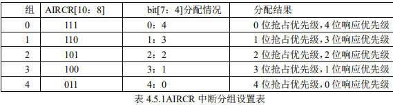

通过这个表，我们就可以清楚的看到组 0~4 对应的配置关系，例如组设置为 3，那么此时 所有的 82 个中断，每个中断的中断优先寄存器的高四位中的最高 3 位是抢占优先级，低 1 位是 响应优先级。

每个中断，你可以设置抢占优先级为 0~7，响应优先级为 1 或 0。抢占优先级的 级别高于响应优先级。而数值越小所代表的优先级就越高。 

这里需要注意两点：

第一，如果两个中断的抢占优先级和响应优先级都是一样的话，则看哪个中断先发生就先执行；

第二，高优先级的抢占优先级是可以打断正在进行的低抢占优先级中断的。

而抢占优先级相同的中断，高优先级的响应优先级不可以打断低响应优先级的中断。 

结合实例说明一下：假定设置中断优先级组为 2，然后

**设置中断 3(RTC_WKUP 中断)的**

抢 占优先级为 2，响应优先级为 1。

**中断 6（外部中断 0）的**

抢占优先级为 3，响应优先级为 0。

中 断 7（外部中断 1）的

**抢占优先级为 2，响应优先级为 0。**

那么这 3 个中断的优先级顺序为：

**中 断 7>中断 3>中断 6。** 

上面例子中的中断 3 和中断 7 都可以打断中断 6 的中断。而中断 7 和中断 3 却不可以相互 打断！ 

通过以上介绍，我们熟悉了 STM32F4 中断设置的大致过程。接下来我们介绍如何使用函 数实现以上中断设置，使得我们以后的中断设置简单化。 

通过以上介绍，我们熟悉了 STM32F4 中断设置的大致过程。接下来我们介绍如何使用库函数 实现以上中断分组设置以及中断优先级管理，使得我们以后的中断设置简单化。

NVIC 中断管 理函数主要在 misc.c 文件里面。 

首先要讲解的是中断优先级分组函数 `NVIC_PriorityGroupConfig`，其函数申明如下： 

`void NVIC_PriorityGroupConfig(uint32_t NVIC_PriorityGroup); `

这个函数的作用是对中断的优先级进行分组，这个函数在系统中只能被调用一次，一旦分 组确定就最好不要更改。这个函数我们可以找到其实现： 

```c
void NVIC_PriorityGroupConfig(uint32_t NVIC_PriorityGroup) 

{ 

 assert_param(IS_NVIC_PRIORITY_GROUP(NVIC_PriorityGroup)); 

 SCB->AIRCR = AIRCR_VECTKEY_MASK | NVIC_PriorityGroup; 

} 
```

从函数体可以看出，这个函数唯一目的就是通过设置 SCB->AIRCR 寄存器来设置中断优先级分组，这在前面寄存器讲解的过程中已经讲到。而其入口参数通过双击选中函数体里面的 

“IS_NVIC_PRIORITY_GROUP”然后右键“Go to defition of …”可以查看到为： 

```c
#define IS_NVIC_PRIORITY_GROUP(GROUP)
(((GROUP) == NVIC_PriorityGroup_0) || 
((GROUP) == NVIC_PriorityGroup_1) || \
((GROUP) == NVIC_PriorityGroup_2) || \
((GROUP) == NVIC_PriorityGroup_3) || \
((GROUP) == NVIC_PriorityGroup_4))
```

这也是我们上面表 4.5.1 讲解的，分组范围为 0-4。比如我们设置整个系统的中断优先级分组值 为 2，那么方法是：

```c
NVIC_PriorityGroupConfig(NVIC_PriorityGroup_2);
```

这样就确定了一共为“2 位抢占优先级，2 位响应优先级”。 

设置好了系统中断分组，那么对于每个中断我们又怎么确定他的抢占优先级和响应优先级 呢？

下面我们讲解一个重要的函数为中断初始化函数 NVIC_Init，其函数申明为： 

`void NVIC_Init(NVIC_InitTypeDef* NVIC_InitStruct) `

其中 NVIC_InitTypeDef 是一个结构体，我们可以看看结构体的成员变量

```c
typedef struct
{
 uint8_t NVIC_IRQChannel; 
 uint8_t NVIC_IRQChannelPreemptionPriority;
 uint8_t NVIC_IRQChannelSubPriority; 
 FunctionalState NVIC_IRQChannelCmd; 
} NVIC_InitTypeDef;
```

`NVIC_InitTypeDef `结构体中间有四个成员变量，接下来我们一一来看看这些成员变量的含义。 

`NVIC_IRQChannel`：定义初始化的是哪个中断，这个我们可以在 stm32f10x.h 中找到每个中断对应的名字。例如 `USART1_IRQn`。

`NVIC_IRQChannelPreemptionPriority`：定义这个中断的 抢占优先级别。

`NVIC_IRQChannelSubPriority`：定义这个中断的子优先级别,也叫响应优先级。 

`NVIC_IRQChannelCmd`：该中断通道是否使能。 

比如我们要使能串口 1 的中断，同时设置抢占优先级为 1，响应优先级位 2，初始化的方法 是： 

```c
NVIC_InitTypeDef NVIC_InitStructure;;
 NVIC_InitStructure.NVIC_IRQChannel = USART1_IRQn;//串口 1 中断
NVIC_InitStructure.NVIC_IRQChannelPreemptionPriority=1 ;// 抢占优先级为 1
NVIC_InitStructure.NVIC_IRQChannelSubPriority = 2;// 响应优先级位 2
NVIC_InitStructure.NVIC_IRQChannelCmd = ENABLE; //IRQ 通道使能
NVIC_Init(&NVIC_InitStructure); //根据上面指定的参数初始化 NVIC 寄存器
```

这里我们讲解了中断分组的概念以及设置单个中断优先级的方法。对于每个中断，还有一些类 似清除中断，查看中断状态的操作，这在后面我们讲解每个中断的时候会详细讲解怎么使用。 

### 最后我们总结一下中断优先级设置的步骤： 

#### 1. 运行开始的时候设置中断分组。确定组号，也就是确定抢占优先级和响应优先级 的分配位数。调用函数为 `NVIC_PriorityGroupConfig`();

#### 2. 设置所用到的中断的中断优先级别。对每个中断调用函数为 `NVIC_Init`();

**4.6 MDK** **中寄存器地址名称映射分析** 

之所以要讲解这部分知识，是因为经常会遇到客户提到不明白 MDK 中那些结构体是怎么与寄存器地址对应起来的。这里我们就做一个简要的分析吧。 

首先我们看看 51 中是怎么做的。51 单片机开发中经常会引用一个 reg51.h 的头文件，下 面我们看看他是怎么把名字和寄存器联系起来的： 

`sfr P0 =0x80; `

sfr 也是一种扩充数据类型，点用一个内存单元，值域为 0～255。

利用它可以访问 51 单片 机内部的所有特殊功能寄存器。

如用 sfr P1 = 0x90 这一句定义 P1 为 P1 端口在片内的寄存器。然后我们往地址为 0x80 的寄存器设值的方法是：`P0=value; `

那么在 STM32 中，是否也可以这样做呢？？

答案是肯定的。肯定也可以通过同样的方 式来做，但是 STM32 因为寄存器太多太多，如果一一以这样的方式列出来，那要好大的篇 幅，既不方便开发，也显得太杂乱无序的感觉。

所以 MDK 采用的方式是通过结构体来将 寄存器组织在一起。下面我们就讲解 MDK 是怎么把结构体和地址对应起来的，为什么我 们修改结构体成员变量的值就可以达到操作对应寄存器的值。

这些事情都是在 stm32f4xx.h 文件中完成的。我们通过 GPIOA 的几个寄存器的地址来讲解吧。 

首先我们可以查看《STM32F4 中文参考手册》中的寄存器地址映射表(P193)。这里我 们选用 GPIOA 为例来讲解。GPIOA 寄存器地址映射如下表 4.6.1：

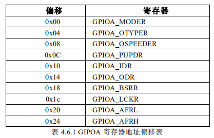

从这个表我们可以看出，因为 GIPO 寄存器都是 32 位，所以每组 GPIO 的 10 个寄存器中，每个寄存器占有 4 个地址，一共占用 40 个地址，地址偏移范围为（0x00~0x24）。

这个 地址偏移是相对 GPIOA 的基地址而言的。GPIOA 的基地址是怎么算出来的呢？因为 GPIO 都是挂载在 AHB1 总线之上，所以它的基地址是由 AHB1 总线的基地址+GPIOA 在 AHB1 总线上的偏移地址决定的。同理依次类推，我们便可以算出 GPIOA 基地址了。

下面我们打 开 stm32f4xx.h 定位到 GPIO_TypeDef 定义处： 


```c
typedef struct
{
 __IO uint32_t MODER; 
 __IO uint32_t OTYPER;
    __IO uint32_t OSPEEDR; 
 __IO uint32_t PUPDR; 
 __IO uint32_t IDR; 
 __IO uint32_t ODR; 
 __IO uint16_t BSRRL;
 __IO uint16_t BSRRH; 
 __IO uint32_t LCKR; 
 __IO uint32_t AFR[2]; 
} GPIO_TypeDef;
```

然后定位到： 

`\#define GPIOA ((GPIO_TypeDef *) GPIOA_BASE) `

可以看出，`GPIOA `是将 `GPIOA_BASE `强制转换为 `GPIO_TypeDef `指针，这句话的意思是， 

`GPIOA `指向地址 `GPIOA_BASE`，`GPIOA_BASE `存放的数据类型为 GPIO_TypeDef。

然后双 击“GPIOA_BASE”选中之后右键选中“Go to definition of ”，便可一查看 GPIOA_BASE 的宏定义： 

`\#define GPIOA_BASE (AHB1PERIPH_BASE + 0x0000) `

依次类推，可以找到最顶层： 

`\#define AHB1PERIPH_BASE (PERIPH_BASE + 0x00020000) `

`\#define PERIPH_BASE ((uint32_t)0x40000000) `

所以我们便可以算出 GPIOA 的基地址位： 

`GPIOA_BASE= 0x40000000+0x00020000+0x0000=0x40020000  `

下面我们再跟《STM32F 中文参考手册》比较一下看看 GPIOA 的基地址是不是 0x40020000 。 

截图 P53 存储器映射表我们可以看到，GPIOA 的起始地址也就是基地址确实是 0x40020000： 

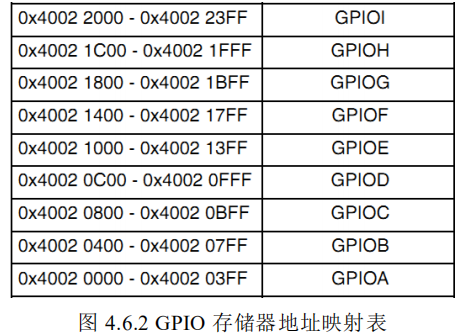

同样的道理，我们可以推算出其他外设的基地址。 

上面我们已经知道 GPIOA 的基地址，那么那些 GPIOA 的 10 个寄存器的地址又是怎么 算出来的呢？？在上面我们讲过 GPIOA 的各个寄存器对于 GPIOA 基地址的偏移地址，所 以我们自然可以算出来每个寄存器的地址。 

GPIOA 的寄存器的地址=GPIOA 基地址+寄存器相对 GPIOA 基地址的偏移值 

这个偏移值在上面的寄存器地址映像表中可以查到。 

那么在结构体里面这些寄存器又是怎么与地址一一对应的呢？这里涉及到结构体成员 变量地址对齐方式方面的知识，这方面的知识大家可以在网上查看相关资料复习一下，这 里我们不做详细讲解。

在我们定义好地址对齐方式之后，每个成员变量对应的地址就可以根据其基地址来计算。

对于结构体类型 GPIO_TypeDef，他的所有成员变量都是 32 位，成员变量地址具有连续性。所以自然而然我们就可以算出 GPIOA 指向的结构体成员变量对应 地址了。

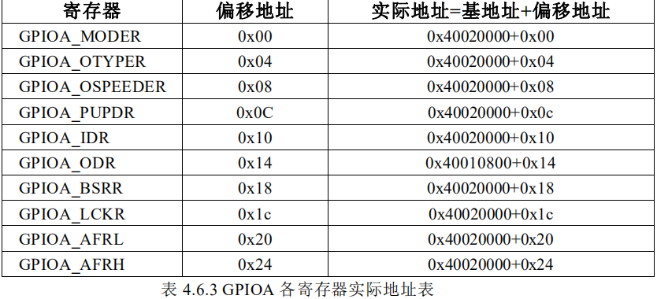

我们可以把 GPIO_TypeDef 的定义中的成员变量的顺序和 GPIOx 寄存器地址映像对比 可以发现，他们的顺序是一致的，如果不一致，就会导致地址混乱了。 

这就是为什么固件库里面：GPIOA->BSRR=value;就是设置地址为 0x40020000 +0x18 (BSRR 偏移量)=0x40020018 的寄存器 BSRR 的值了。

它和 51 里面 P0=value 是设置 地址为 0x80 的 P0 寄存器的值是一样的道理。 

看到这里你是否会学起来踏实一点呢？STM32 使用的方式虽然跟 51 单片机不一样， 但是原理都是一致的

**4.7 MDK** **固件库快速组织代码技巧**  [ch01-quickExample](ch01-quickExample) 