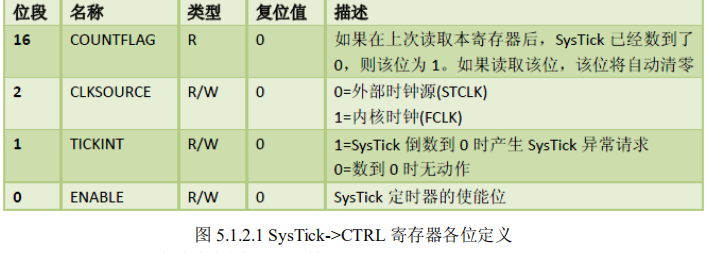
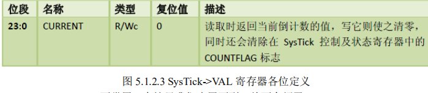
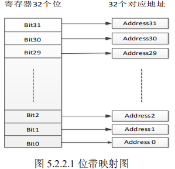
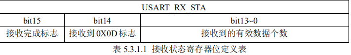

# **SYSTEM** **文件夹介绍**

此文件夹里面的代码由 ALIENTEK 提供，是 STM32F4xx 系列的底层核心驱动函数，可以用在 STM32F4xx 系列的各个型号上面，方便大家 快速构建自己的工程。 

SYSTEM 文件夹下包含了 delay、sys、usart 等三个文件夹。

分别包含了 delay.c、sys.c、usart.c 及其头文件。通过这 3 个 c 文件，可以快速的给任何一款 STM32F4 构建最基本的框架。使用 起来是很方便的。 

本章，我们将向大家介绍这些代码，通过这章的学习，大家将了解到这些代码的由来，也 希望大家可以灵活使用 SYSTEM 文件夹提供的函数，来快速构建工程，并实际应用到自己的项 目中去。 

## **1 delay** **文件夹代码介绍** 

delay 文件夹内包含了 delay.c 和 delay.h 两个文件，这两个文件用来实现系统的延时功能， 

其中包含 7 个函数： 

```c
void delay_osschedlock(void); 

void delay_osschedunlock(void); 

void delay_ostimedly(u32 ticks); 

void SysTick_Handler(void);  

void delay_init(u8 SYSCLK); 

void delay_ms(u16 nms); 

void delay_us(u32 nus); 
```

前面 4 个函数，仅在支持操作系统（OS）的时候，需要用到，而后面 3 个函数，则不论是否支持 OS 都需要用到。 

在介绍这些函数之前，我们先了解一下编程思想：CM4 内核的处理和 CM3 一样，内部都包含了一个 SysTick 定时器，SysTick 是一个 24 位的倒计数定时器，当计到 0 时，将从 RELOAD 寄存器中自动重装载定时初值。

只要不把它在 SysTick 控制及状态寄存器中的使能位清除，就永不停息。SysTick 在《STM32xx 中文参考手册》里面基本没有介绍，其详细介绍，请参阅 《STM32F3与 F4 系列Cortex M4内核编程手册》第230 页。

我们就是利用 STM32的内部 SysTick来实现延时的，这样既不占用中断，也不占用系统定时器。 

这里我们将介绍的是 ALIENTEK 提供的最新版本的延时函数，该版本的延时函数支持在任 意操作系统（OS）下面使用，它可以和操作系统共用 SysTick 定时器。 

#### 这里，我们以 UCOSII 为例，介绍如何实现操作系统和我们的 delay 函数共用 SysTick 定时 器。

首先，我们简单介绍下 UCOSII 的时钟：ucos 运行需要一个系统时钟节拍（类似 “心跳”）， 而这个节拍是固定的（由 OS_TICKS_PER_SEC 宏定义设置），比如要求 5ms 一次（即可设置： OS_TICKS_PER_SEC=200），在 STM32 上面，一般是由 SysTick 来提供这个节拍，也就是 SysTick 要设置为 5ms 中断一次，为 ucos 提供时钟节拍，而且这个时钟一般是不能被打断的（否则就不 准了）。

因为在 ucos 下 systick 不能再被随意更改，如果我们还想利用 systick 来做 delay_us 或者 delay_ms 的延时，就必须想点办法了，这里我们利用的是时钟摘取法。

以 delay_us 为例，比如 delay_us（50），在刚进入 delay_us 的时候先计算好这段延时需要等待的 systick 计数次数，这里 为 50*21（假设系统时钟为 168Mhz，因为 systick 的频率为系统时钟频率的 1/8，那么 systick 

每增加 1，就是 1/21us），然后我们就一直统计 systick 的计数变化，直到这个值变化了 50*21， 一旦检测到变化达到或者超过这个值，就说明延时 50us 时间到了。这样，我们只是抓取 SysTick 计数器的变化，并不需要修改 SysTick 的任何状态，完全不影响 SysTick 作为 UCOS 时钟节拍 的功能，**这就是实现 delay 和操作系统共用 SysTick 定时器的原理**。 

下面我们开始介绍这几个函数

### 1** **操作系统支持宏定义及相关函数** 

当需要 delay_ms 和 delay_us 支持操作系统（OS）的时候，我们需要用到 3 个宏定义和 4 个函数，宏定义及函数代码如下： 

```c
//本例程仅作 UCOSII 和 UCOSIII 的支持,其他 OS,请自行参考着移植
//支持 UCOSII 
#ifdef OS_CRITICAL_METHOD
//OS_CRITICAL_METHOD 定义了,说明要支持 UCOSII
#define delay_osrunning OSRunning //OS 是否运行标记,0,不运行;1,在运行
#define delay_ostickspersec OS_TICKS_PER_SEC //OS 时钟节拍,即每秒调度次数
#define delay_osintnesting OSIntNesting //中断嵌套级别,即中断嵌套次数
#endif
//支持 UCOSIII
#ifdef CPU_CFG_CRITICAL_METHOD
//CPU_CFG_CRITICAL_METHOD 定义了,说明要支持 UCOSIII
#define delay_osrunning OSRunning //OS 是否运行标记,0,不运行;1,在运行
#define delay_ostickspersec OSCfg_TickRate_Hz //OS 时钟节拍,即每秒调度次数
#define delay_osintnesting OSIntNestingCtr //中断嵌套级别,即中断嵌套次数
#endif
//us 级延时时,关闭任务调度(防止打断 us 级延迟)
void delay_osschedlock(void)
{
#ifdef CPU_CFG_CRITICAL_METHOD //使用 UCOSIII
OS_ERR err; 
OSSchedLock(&err); //UCOSIII 的方式,禁止调度，防止打断 us 延时
#else //否则 UCOSII
OSSchedLock(); //UCOSII 的方式,禁止调度，防止打断 us 延时
#endif
}
//us 级延时时,恢复任务调度
void delay_osschedunlock(void)
{#ifdef CPU_CFG_CRITICAL_METHOD //使用 UCOSIII
OS_ERR err; 
OSSchedUnlock(&err); //UCOSIII 的方式,恢复调度
#else //否则 UCOSII
OSSchedUnlock(); //UCOSII 的方式,恢复调度
#endif
}
//调用 OS 自带的延时函数延时
//ticks:延时的节拍数
void delay_ostimedly(u32 ticks)
{
#ifdef CPU_CFG_CRITICAL_METHOD //使用 UCOSIII 时
OS_ERR err; 
OSTimeDly(ticks,OS_OPT_TIME_PERIODIC,&err);//UCOSIII 延时采用周期模式
#else
OSTimeDly(ticks); //UCOSII 延时
#endif 
} 
//systick 中断服务函数,使用 ucos 时用到
void SysTick_Handler(void)
{
if(delay_osrunning==1) //OS 开始跑了,才执行正常的调度处理
{
OSIntEnter(); //进入中断
OSTimeTick(); //调用 ucos 的时钟服务程序 
OSIntExit(); //触发任务切换软中断
} }
```

以上代码，仅支持 UCOSII 和 UCOSIII，不过，对于其他 OS 的支持，也只需要对以上代 码进行简单修改即可实现。 

### **支持** **OS** **需要用到的三个宏定义（以** **UCOSII** **为例）即**： 

```c
#define delay_osrunning 

OSRunning 

//OS 是否运行标记,0,不运行;1,在运行 

#define delay_ostickspersec OS_TICKS_PER_SEC //OS 时钟节拍,即每秒调度次数 

#define delay_osintnesting OSIntNesting 

//中断嵌套级别,即中断嵌套次数 
```

宏定义：`delay_osrunning`，用于标记 OS 是否正在运行，当 OS 已经开始运行时，该宏定义 值为 1，当 OS 还未运行时，该宏定义值为 0。 

宏定义：`delay_ostickspersec`，用于表示 OS 的时钟节拍，即 OS 每秒钟任务调度次数。 

宏定义：`delay_osintnesting`，用于表示 OS 中断嵌套级别，即中断嵌套次数，每进入一个 中断，该值加 1，每退出一个中断，该值减 1。 

### **支持** **OS** **需要用到的** **4** **个函数，即**： 

函数：`delay_osschedlock`，用于 delay_us 延时，作用是禁止 OS 进行调度，以防打断 us 级 延时，导致延时时间不准。 

函数：`delay_osschedunlock`，同样用于 delay_us 延时，作用是在延时结束后恢复 OS 的调度，继续正常的 OS 任务调度。 

函数：`delay_ostimedly`，则是调用 OS 自带的延时函数，实现延时。该函数的参数为时钟节 拍数。 

函数：`SysTick_Handler`，则是 systick 的中断服务函数，该函数为 OS 提供时钟节拍，同时 可以引起任务调度。 

以上就是 delay_ms 和 delay_us 支持操作系统时，需要实现的 3 个宏定义和 4 个函数。 

### **2 delay_init** **函数**

该函数用来初始化 2 个重要参数：fac_us 以及 fac_ms；同时把 SysTick 的时钟源选择为外部时 钟，如果需要支持操作系统（OS）

只需要在 sys.h 里面，设置 SYSTEM_SUPPORT_OS 宏的值 为 1 即可，然后，该函数会根据 delay_ostickspersec 宏的设置，来配置 SysTick 的中断时间，并 开启 SysTick 中断。具体代码如下：

```c
//初始化延迟函数
//当使用 OS 的时候,此函数会初始化 OS 的时钟节拍
//SYSTICK 的时钟固定为 HCLK 时钟的 1/8
void delay_init()
{
#if SYSTEM_SUPPORT_OS //如果需要支持 OS.
u32 reload;
#endif
SysTick_CLKSourceConfig(SysTick_CLKSource_HCLK_Div8);
//选择外部时钟 HCLK/8
fac_us=SystemCoreClock/8000000; //为系统时钟的 1/8 
#if SYSTEM_SUPPORT_OS //如果需要支持 OS.
reload=SystemCoreClock/8000000; //每秒钟的计数次数 单位为 M 
reload*=1000000/delay_ostickspersec; //根据 delay_ostickspersec 设定溢出时间
//reload 为 24 位寄存器,最大值:16777216,在 168M 下,约合 0.7989s 左右
fac_ms=1000/delay_ostickspersec; //代表 OS 可以延时的最少单位 
SysTick->CTRL|=SysTick_CTRL_TICKINT_Msk; //开启 SYSTICK 中断
SysTick->LOAD=reload; //每 1/delay_ostickspersec 秒中断一次
SysTick->CTRL|=SysTick_CTRL_ENABLE_Msk; //开启 SYSTICK 
#else
fac_ms=(u16)fac_us*1000; //非 OS 下,代表每个 ms 需要的 systick 时钟数 
#endif
}
```

可以看到，delay_init 函数使用了条件编译，来选择不同的初始化过程，如果不使用 OS 的时候，只是设置一下 SysTick 的时钟源以及确定 fac_us 和 fac_ms 的值。而如果使用 OS 的时候，则会进行一些不同的配置，这里的条件编译是根据 SYSTEM_SUPPORT_OS 这个宏来确定的， 

该宏在 sys.h 里面定义。 SysTick 是 MDK 定义了的一个结构体（在 core_m4.h 里面），里面包含 CTRL、LOAD、VAL、 CALIB 等 4 个寄存器， 

SysTick->CTRL 的各位定义如图 5.1.2.1 所示



SysTick-> LOAD 的定义如图 5.1.2.2 所示：


SysTick-> VAL 的定义如图 5.1.2.3 所示：



SysTick-> CALIB 不常用，在这里我们也用不到，故不介绍了。 

`SysTick_CLKSourceConfig(SysTick_CLKSource_HCLK_Div8);`

这一句把SysTick的时钟选择 外部时钟，这里需要注意的是：SysTick 的时钟源自 HCLK 的 8 分频，假设我们外部晶振为 8M， 然后倍频到 168M，那么 SysTick 的时钟即为 21Mhz，也就是 SysTick 的计数器 VAL 每减 1，就 代表时间过了 1/21us 。

所以 `fac_us=SystemCoreClock/8000000; `这句话就是计算在 SystemCoreClock 时 钟 频 率 下 延 时 1us 需 要 多 少 个 SysTick 时 钟 周 期 。 

同 理 ，` fac_ms=(u16)fac_us*1000;`就是计算延时 1ms需要多少个 SysTick时钟周期，它自然是1us 的1000 倍。

初始化将计算出 fac_us 和 fac_ms 的值。 

在不使用 OS 的时候：fac_us，为 us 延时的基数，也就是延时 1us，SysTick->LOAD 所应 设置的值。fac_ms 为 ms 延时的基数，也就是延时 1ms，SysTick->LOAD 所应设置的值。

fac_us 为 8 位整形数据，fac_ms 为 16 位整形数据。Systick 的时钟来自系统时钟 8 分频，正因为如此， 系统时钟如果不是 8 的倍数(不能被 8 整除)，则会导致延时函数不准确，这也是我们推荐外部 时钟选择 8M 的原因。这点大家要特别留意。 

当使用 OS 的时候，fac_us，还是 us 延时的基数，不过这个值不会被写到 SysTick->LOAD 寄存器来实现延时，而是通过时钟摘取的办法实现的（前面已经介绍了）。

而 fac_ms 则代表 ucos 自带的延时函数所能实现的最小延时时间（如 delay_ostickspersec=200，那么 fac_ms 就是 5ms）。

### **3 delay_us** **函数** 

该函数用来延时指定的 us，其参数 nus 为要延时的微秒数。该函数有使用 OS 和不使用 OS 

两个版本，这里我们分别介绍，首先是不使用 OS 的时候，实现函数如下： 

```c
//nus 为要延时的 us 数. 
void delay_us(u32 nus)
{
u32 temp; 
SysTick->LOAD=nus*fac_us; //时间加载 
SysTick->VAL=0x00; //清空计数器
SysTick->CTRL|=SysTick_CTRL_ENABLE_Msk ; //开始倒数
do
{
temp=SysTick->CTRL;
}while((temp&0x01)&&!(temp&(1<<16)));//等待时间到达 
SysTick->CTRL&=~SysTick_CTRL_ENABLE_Msk; //关闭计数器
SysTick->VAL =0X00; //清空计数器
}
```

有了上面对 SysTick 寄存器的描述，这段代码不难理解。其实就是先把要延时的 us 数换算 成 SysTick 的时钟数，然后写入 LOAD 寄存器。

然后清空当前寄存器 VAL 的内容，再开启倒数功能。等到倒数结束，即延时了 nus。

最后关闭 SysTick，清空 VAL 的值。实现一次延时 nus 的操作，但是这里要注意 nus 的值，不能太大，必须保证 nus<=（2^24）/fac_us，否则将导致 延时时间不准确。这里特别说明一下：

`temp&0x01`，这一句是用来判断 systick 定时器是否还处 于开启状态，可以防止 systick 被意外关闭导致的死循环。 

再来看看使用 OS 的时候，delay_us 的实现函数如下： 

```c
//延时 nus
//nus 为要延时的 us 数. 
void delay_us(u32 nus)
{
u32 ticks;
u32 told,tnow,tcnt=0;
u32 reload=SysTick->LOAD; //LOAD 的值 
ticks=nus*fac_us; //需要的节拍数 
delay_osschedlock(); //阻止 OS 调度，防止打断 us 延时
told=SysTick->VAL; //刚进入时的计数器值
while(1)
{
tnow=SysTick->VAL;
if(tnow!=told)
{ 
if(tnow<told)tcnt+=told-tnow; //注意 SYSTICK 是一个递减的计数器.
else tcnt+=reload-tnow+told; 
told=tnow;
if(tcnt>=ticks)break; //时间超过/等于要延迟的时间,则退出.
} 
};
delay_osschedunlock(); //恢复 OS 调度
    }
```

这里就正是利用了我们前面提到的时钟摘取法，ticks 是延时 nus 需要等待的 SysTick 计数 次数（也就是延时时间），told 用于记录最近一次的 SysTick->VAL 值，然后 tnow 则是当前的 SysTick->VAL 值，通过他们的对比累加，实现 SysTick 计数次数的统计，统计值存放在 tcnt 里 面，然后通过对比 tcnt 和 ticks，来判断延时是否到达，从而达到不修改 SysTick 实现 nus 的延 时，从而可以和 OS 共用一个 SysTick。 

上面的 `delay_osschedlock `和 `delay_osschedunlock `是 OS 提供的两个函数，用于调度上锁和 解锁，这里为了防止 OS 在 delay_us 的时候打断延时，可能导致的延时不准，所以我们利用这 两个函数来实现免打断，从而保证延时精度！

同时，此时的 delay_us，，可以实现最长 2^32/fac_us， 在 168M 主频下，最大延时，大概是 204 秒

### **4 delay_xms** **函数** 

该函数仅在没用到 OS 的时候使用，用来延时指定的 ms，其参数 nms 为要延时的毫秒数。 

该函数代码如下：

```c
//延时 nms 
//注意 nms 的范围
//SysTick->LOAD 为 24 位寄存器,所以,最大延时为:
//nms<=0xffffff*8*1000/SYSCLK
//SYSCLK 单位为 Hz,nms 单位为 ms
//对 168M 条件下,nms<=798ms 
void delay_xms(u16 nms)
{ 
u32 temp; 
SysTick->LOAD=(u32)nms*fac_ms;//时间加载(SysTick->LOAD 为 24bit)
SysTick->VAL =0x00; //清空计数器
SysTick->CTRL|=SysTick_CTRL_ENABLE_Msk ; //开始倒数
do
{
temp=SysTick->CTRL;
}while((temp&0x01)&&!(temp&(1<<16)));//等待时间到达 
SysTick->CTRL&=~SysTick_CTRL_ENABLE_Msk; //关闭计数器
SysTick->VAL =0X00; //清空计数器 
}
```

此部分代码和 5.1.3 节的 delay_us（非 OS 版本）大致一样，但是要注意因为 LOAD 仅仅是 一个 24bit 的寄存器，延时的 ms 数不能太长。

否则超出了 LOAD 的范围，高位会被舍去，导致 延时不准。

最大延迟 ms 数可以通过公式：nms<=0xffffff*8*1000/SYSCLK 计算。SYSCLK 单位为 Hz，nms 的单位为 ms。如果时钟为 168M，那么 nms 的最大值为 798ms。

超过这个值，建 议通过多次调用 delay_xms 实现，否则就会导致延时不准确。 

很显然，仅仅提供 delay_xms 函数，是不够用的，很多时候，我们延时都是大于 798ms 的， 所以需要再做一个 delay_ms 函数，下面将介绍该函数。 

### **5 delay_ms** **函数** 

该函数同 delay_xms 一样，也是用来延时指定的 ms 的，其参数 nms 为要延时的毫秒数。

该函数有使用 OS 和不使用 OS 两个版本，这里我们分别介绍，首先是不使用 OS 的时候，实现 函数如下： 

```c
//延时 nms 
//nms:0~65535
void delay_ms(u16 nms)
{
u8 repeat=nms/540;//这里用 540,是考虑到某些客户可能超频使用,
//比如超频到 248M 的时候,delay_xms 最大只能延时 541ms 左右了
u16 remain=nms%540;
while(repeat)
{
delay_xms(540);
repeat--; }
if(remain)delay_xms(remain);
}
```

该函数其实就是多次调用前面所讲的 delay_xms 函数，来实现毫秒级延时的。注意下，这里以 540ms 为周期是考虑到 MCU 超频使用的情况。 

再来看看使用 OS 的时候，delay_ms 的实现函数如下

```c
//延时 nms
//nms:要延时的 ms 数
//nms:0~65535
void delay_ms(u16 nms)
{
if(delay_osrunning&&delay_osintnesting==0)//如果 OS 已经在跑了,且不是在中断里面
{
if(nms>=fac_ms) //延时的时间大于 OS 的最少时间周期
{ 
 delay_ostimedly(nms/fac_ms); //OS 延时
}
nms%=fac_ms; //OS 已经无法提供这么小的延时了,采用普通方式延时 
}
delay_us((u32)(nms*1000)); //普通方式延时
}
```

该函数中，delay_osrunning 是 OS 正在运行的标志，delay_osintnesting 则是 OS 中断嵌套次 数，必须 delay_osrunning 为真，且 delay_osintnesting 为 0 的时候，才可以调用 OS 自带的延时 

函数进行延时（可以进行任务调度），delay_ostimedly 函数就是利用 OS 自带的延时函数，实现 任 务级 延时 的， 其参数 代表 延时 的时 钟节拍 数（ 假设 delay_ostickspersec=200 ，那 么 delay_ostimedly (1)，就代表延时 5ms）。 

当 OS 还未运行的时候，我们的 delay_ms 就是直接由 delay_us 实现的，OS 下的 delay_us 可以实现很长的延时（达到 204 秒）而不溢出！，所以放心的使用 delay_us 来实现 delay_ms， 

不过由于 delay_us 的时候，任务调度被上锁了，所以还是建议不要用 delay_us 来延时很长的时 间，否则影响整个系统的性能

当 OS 运行的时候，我们的 delay_ms 函数将先判断延时时长是否大于等于 1 个 OS 时钟节 拍（fac_ms）,当大于这个值的时候，我们就通过调用 OS 的延时函数来实现（此时任务可以调 度），不足 1 个时钟节拍的时候，直接调用 delay_us 函数实现（此时任务无法调度）。 

## **2 sys** **文件夹代码介绍** 

sys 文件夹内包含了 sys.c 和 sys.h 两个文件。在 sys.h 里面定义了 STM32F4 的 IO 口输 入读取宏定义和输出宏定义。sys.c 里面主要是一些汇编函数。

下面我们主要向大家介绍 sys.h 头文件里面的 IO 口位操作。 

### **2.1 IO** **口的位操作实现** 

该部分代码在 sys.h 文件中，实现对 STM32F4 各个 IO 口的位操作，包括读入和输出。 

当然在这些函数调用之前，必须先进行 IO 口时钟的使能和 IO 口功能定义。此部分仅仅对 IO 口进行输入输出读取和控制。 

位带操作简单的说，就是把每个比特膨胀为一个 32 位的字，当访问这些字的时候就达到了访问比特的目的，比如说 GPIO 的 ODR 寄存器有 32 个位，那么可以映射到 32 个地址 上，我们去访问这 32 个地址就达到访问 32 个比特的目的。

这样我们往某个地址写 1 就达 到往对应比特位写 1 的目的，同样往某个地址写 0 就达到往对应的比特位写 0 的目的。 



对于上图，我们往 Address0 地址写入 1，那么就可以达到往寄存器的第 0 位 Bit0 赋值 1 的目的。这里我们不想讲得过于复杂，因为位带操作在实际开发中可能只是用来 IO 口的 输入输出还比较方便，其他操作在日常开发中也基本很少用。

下面我们看看 sys.h 中位带 操作的定义。 

```c
//位带操作,实现 51 类似的 GPIO 控制功能
//具体实现思想,参考<<CM3 权威指南>>第五章(87 页~92 页).M4 同 M3 类似,
//只是寄存器地址变了.
//IO 口操作宏定义
#define BITBAND(addr, bitnum) ((addr & 0xF0000000)+0x2000000+((addr 
&0xFFFFF)<<5)+(bitnum<<2)) 
#define MEM_ADDR(addr) *((volatile unsigned long *)(addr)) 
#define BIT_ADDR(addr, bitnum) MEM_ADDR(BITBAND(addr, bitnum))
//IO 口地址映射
#define GPIOA_ODR_Addr (GPIOA_BASE+20) //0x40020014
#define GPIOB_ODR_Addr (GPIOB_BASE+20) //0x40020414 
……//省略部分代码 
#define GPIOH_ODR_Addr (GPIOH_BASE+20) //0x40021C14 
#define GPIOI_ODR_Addr (GPIOI_BASE+20) //0x40022014 
#define GPIOA_IDR_Addr (GPIOA_BASE+16) //0x40020010 
#define GPIOB_IDR_Addr (GPIOB_BASE+16) //0x40020410 
……//省略部分代码
#define GPIOH_IDR_Addr (GPIOH_BASE+16) //0x40021C10 
#define GPIOI_IDR_Addr (GPIOI_BASE+16) //0x40022010 
//IO 口操作,只对单一的 IO 口!
//确保 n 的值小于 16!
#define PAout(n) BIT_ADDR(GPIOA_ODR_Addr,n) //输出
#define PAin(n) BIT_ADDR(GPIOA_IDR_Addr,n) //输入
#define PBout(n) BIT_ADDR(GPIOB_ODR_Addr,n) //输出
#define PBin(n) BIT_ADDR(GPIOB_IDR_Addr,n) //输入
……//省略部分代码
#define PHout(n) BIT_ADDR(GPIOH_ODR_Addr,n) //输出
#define PHin(n) BIT_ADDR(GPIOH_IDR_Addr,n) //输入
#define PIout(n) BIT_ADDR(GPIOI_ODR_Addr,n) //输出
#define PIin(n) BIT_ADDR(GPIOI_IDR_Addr,n) //输入
```

以上代码的便是 GPIO 位带操作的具体实现，位带操作的详细说明，在权威指南中有 详细讲解，请参考<<CM3 权威指南>>第五章(87 页~92 页)。

比如说，我们调用 PAout(1)=1 是设置了 GPIOA 的第一个管脚 GPIOA.1 为 1，实际是设置了寄存器的某个位，但是我们 的定义中可以跟踪过去看到却是通过计算访问了一个地址。

上面一系列公式也就是计算 GPIO 的某个 io 口对应的位带区的地址了。 

有了上面的代码，我们就可以像51/AVR一样操作STM32的IO口了。

比如，我要PORTA 的第七个 IO 口输出 1，则可以使用 `PAout（6）=1；`即可实现。我要判断 PORTA 的第 15 个位是否等于 1，则可以使用` if（PAin（14）==1）…；`就可以了。 

这里顺便说一下，在 sys.h 中的还有个全局宏定义： 

```c
//0,不支持 ucos
//1,支持 ucos
#define SYSTEM_SUPPORT_OS 0 //定义系统文件夹是否支持 UCOS
```

SYSTEM_SUPPORT_OS，这个宏定义用来定义 SYSTEM 文件夹是否支持 ucos，如果 在 ucos 下面使用 SYSTEM 文件夹，那么设置这个值为 1 即可，否则设置为 0（默认）。 

## **3 usart** **文件夹介绍** 

usart 文件夹内包含了 usart.c 和 usart.h 两个文件。这两个文件用于串口的初始化和中 

断接收。这里只是针对串口 1，比如你要用串口 2 或者其他的串口，只要对代码稍作修改 

就可以了。usart.c 里面包含了 2 个函数一个是 `void USART1_IRQHandler(void);`另外一个是`void uart_init(u32 bound);`里面还有一段对串口 printf 的支持代码，如果去掉，则会导致 printf 无法使用，虽然软件编译不会报错，但是硬件上 STM32 是无法启动的，这段代码不要去 修改。

### **3.1 printf** **函数支持** 

这段引入 printf 函数支持的代码在 usart.c 文件的最上方，这段代码加入之后便可以通 过 printf 函数向串口发送我们需要的内容，方便开发过程中查看代码执行情况以及一些变 量值。

**这段代码如果要修改一般也只是用来改变 printf 函数针对的串口号，大多情况我们 都不需要修改。** 

这段代码为： 

```c
//加入以下代码,支持 printf 函数,而不需要选择 use MicroLIB
#if 1
#pragma import(__use_no_semihosting) 
//标准库需要的支持函数 
struct __FILE 
{ 
int handle; 
}; 
FILE __stdout; 
//定义_sys_exit()以避免使用半主机模式 
_sys_exit(int x) 
{ 
x = x; 
} 
//重定义 fputc 函数
int fputc(int ch, FILE *f)
{ 
while(USART_GetFlagStatus(USART1,USART_FLAG_TC)==RESET); 
 USART_SendData(USART1,(uint8_t)ch); 
return ch;
}
#endif
```

### **3.2 uart_init** **函数** 

`void uart_init(u32 bound)`

函数是串口 1 初始化函数。该函数有 1 个参数为波特率，波特 率这个参数对于大家来说应该不陌生，这里就不多说了。uart_init 函数代码如下： 

```c
//初始化 IO 串口 1 
//bound:波特率
void uart_init(u32 bound){
 //GPIO 端口设置
 GPIO_InitTypeDef GPIO_InitStructure;
    USART_InitTypeDef USART_InitStructure;
NVIC_InitTypeDef NVIC_InitStructure;
RCC_AHB1PeriphClockCmd(RCC_AHB1Periph_GPIOA,ENABLE); 
//使能 GPIOA 时钟
RCC_APB2PeriphClockCmd(RCC_APB2Periph_USART1,ENABLE);
//使能 USART1 时钟
GPIO_PinAFConfig(GPIOA,GPIO_PinSource9,GPIO_AF_USART1);
//GPIOA9 复用为 USART1
GPIO_PinAFConfig(GPIOA,GPIO_PinSource10,GPIO_AF_USART1); 
//GPIOA10 复用为 USART1
//USART1 PA.9 PA.10
 GPIO_InitStructure.GPIO_Pin = GPIO_Pin_9 | GPIO_Pin_10; //GPIOA9 与 GPIOA10
GPIO_InitStructure.GPIO_Mode = GPIO_Mode_AF;//复用功能
GPIO_InitStructure.GPIO_Speed = GPIO_Speed_50MHz; //速度 50MHz
GPIO_InitStructure.GPIO_OType = GPIO_OType_PP; //推挽复用输出
GPIO_InitStructure.GPIO_PuPd = GPIO_PuPd_UP; //上拉
GPIO_Init(GPIOA,&GPIO_InitStructure); //初始化 PA9，PA10
 //USART 初始化设置
USART_InitStructure.USART_BaudRate = bound;//一般设置为 9600;
USART_InitStructure.USART_WordLength = USART_WordLength_8b;//字长为 8 位
 USART_InitStructure.USART_StopBits = USART_StopBits_1;//一个停止位
USART_InitStructure.USART_Parity = USART_Parity_No;//无奇偶校验位
USART_InitStructure.USART_HardwareFlowControl =
USART_HardwareFlowControl_None;//无硬件数据流控制
USART_InitStructure.USART_Mode = USART_Mode_Rx | USART_Mode_Tx;//收发
 USART_Init(USART1, &USART_InitStructure); //初始化串口
 USART_Cmd(USART1, ENABLE); //使能串口
USART_ClearFlag(USART1, USART_FLAG_TC);
#if EN_USART1_RX
USART_ITConfig(USART1, USART_IT_RXNE, ENABLE);//开启中断
//Usart1 NVIC 配置
 NVIC_InitStructure.NVIC_IRQChannel = USART1_IRQn;
NVIC_InitStructure.NVIC_IRQChannelPreemptionPriority=3;//抢占优先级 3
NVIC_InitStructure.NVIC_IRQChannelSubPriority =3; //响应优先级 3
NVIC_InitStructure.NVIC_IRQChannelCmd = ENABLE; //IRQ 通道使能
NVIC_Init(&NVIC_InitStructure); //根据指定的参数初始化 VIC 寄存器、
#endif
}
```

下面我们一一分析一下这段初始化代码。首先是时钟使能代码： 

```c
RCC_AHB1PeriphClockCmd(RCC_AHB1Periph_GPIOA,ENABLE); //使能 GPIOA 时钟 

RCC_APB2PeriphClockCmd(RCC_APB2Periph_USART1,ENABLE);//使能 USART1 时钟 
```

这个时钟使能我们在端口复用的时候已经讲解过，大家可以翻到端口复用那一章节，有详细的 讲解。

在使用一个内置外设的时候，我们首先要使能相应的 GPIO 时钟，然后使能复用功能外设时钟。 

然后我们要配置相应的引脚复用器映射。这里我们调用函数为： 

```c
GPIO_PinAFConfig(GPIOA,GPIO_PinSource9,GPIO_AF_USART1); //PA9 复用为 USART1 

GPIO_PinAFConfig(GPIOA,GPIO_PinSource10,GPIO_AF_USART1); //PA10复用为USART1 
```

把 PA9 和 PA10 复用为串口 1。 

接下来我们要初始化相应的 GPIO 端口模式（GPIO_Mode）为复用功能。配置方法如下： 

```c
 GPIO_InitStructure.GPIO_Pin = GPIO_Pin_9 | GPIO_Pin_10; //GPIOA9 与 GPIOA10 

GPIO_InitStructure.GPIO_Mode = GPIO_Mode_AF;//复用功能 

GPIO_InitStructure.GPIO_Speed = GPIO_Speed_50MHz; //速度 50MHz 

GPIO_InitStructure.GPIO_OType = GPIO_OType_PP; //推挽复用输出 

GPIO_InitStructure.GPIO_PuPd = GPIO_PuPd_UP; //上拉 

GPIO_Init(GPIOA,&GPIO_InitStructure); //初始化 PA9，PA10 
```

对于 GPIO 的知识我们在跑马灯实例会讲解到，这里暂时不做深入的讲解。 紧接着，我们要进行 usart1 的中断初始化，设置抢占优先级值和响应优先级的值： 

```c
 NVIC_InitStructure.NVIC_IRQChannel = USART1_IRQn; //Usart1 中断配置 

NVIC_InitStructure.NVIC_IRQChannelPreemptionPriority=3 ;//抢占优先级 3 

NVIC_InitStructure.NVIC_IRQChannelSubPriority = 3; 
```

```c
//响应优先级 3 

NVIC_InitStructure.NVIC_IRQChannelCmd = ENABLE; 

//IRQ 通道使能 

NVIC_Init(&NVIC_InitStructure); 

//根据指定的参数初始化 VIC 寄存器 
```

这段代码在我们的中断管理函数章节 4.5 有讲解中断管理相关的知识，大家可以翻阅一下。 

在设置完中断优先级之后，接下来我们要设置串口 1 的初始化参数： 

```c
USART_InitStructure.USART_BaudRate = bound;//一般设置为 9600; 

USART_InitStructure.USART_WordLength = USART_WordLength_8b;//字长为 8 位 

USART_InitStructure.USART_StopBits = USART_StopBits_1;//一个停止位 

USART_InitStructure.USART_Parity = USART_Parity_No; //无奇偶校验位 

USART_InitStructure.USART_HardwareFlowControl=  

USART_HardwareFlowControl_None;//无硬件数据流控制 

USART_InitStructure.USART_Mode = USART_Mode_Rx | USART_Mode_Tx;//收发 

 USART_Init(USART1, &USART_InitStructure); //初始化串口 
```

从上面的源码我们可以看出，串口的初始化是通过调用 USART_Init()函数实现，而这个函 数重要的参数就是就是结构体指针变量 USART_InitStructure，下面我们看看结构体定义： 

```c
typedef struct
{ 
uint32_t USART_BaudRate; 
 uint16_t USART_WordLength; 
 uint16_t USART_StopBits; 
 uint16_t USART_Parity; 
 uint16_t USART_Mode;
    uint16_t USART_HardwareFlowControl; 
} USART_InitTypeDef;
```

这个结构体有 6 个成员变量，所以我们有 6 个参数需要初始化。 

- 第一个参数 `USART_BaudRate `为串口波特率，波特率可以说是串口最重要的参数了，我们 这里通过初始化传入参数 baund 来设定。
- 第二个参数 USART_WordLength 为字长，这里我们设置为 8 位字长数据格式。
- 第三个参数 USART_StopBits 为停止位设置，我们设置为 1 位停止位。 
- 第四个参数 USART_Parity 设定是否需要奇偶校验，我们设定为无奇偶校验位。
- 第五个参数 USART_Mode 为串口模式，我们设置为全双工收发模式。
- 第六个参数为是否支持硬件流控制， 我们设置为无硬件流控制。 

在设置完成串口中断优先级以及串口初始化之后，接下来就是开启串口中断以及使能串口 了：

```c
 USART_ITConfig(USART1, USART_IT_RXNE, ENABLE);//开启中断
 USART_Cmd(USART1, ENABLE); //使能串口
```

在开启串口中断和使能串口之后接下来就是写中断处理函数了，下面一节我们将着重讲解 

中断处理函数。 

### **3.3 USART1_IRQHandler** **函数**

`void USART1_IRQHandler(void)`函数是串口 1 的中断响应函数，当串口 1 发生了相应 的中断后，就会跳到该函数执行。

中断相应函数的名字是不能随便定义的，一般我们都遵循 MDK 定义的函数名。这些函数名字在启动文件 startup_stm32f40_41xxx.s 中可以找到。 

函数体里面通过函数： 

```CQL
if(USART_GetITStatus(USART1, USART_IT_RXNE) != RESET) 

Res =USART_ReceiveData(USART1);//(USART1->DR); //读取接收到的数据 
```

读到数据后接下来就对数据进行分析。 

`void USART1_IRQHandler(void)`函数是串口 1 的中断响应函数，当串口 1 发生了相应的中 断后，就会跳到该函数执行。这里我们设计了一个小小的接收协议：通过这个函数，配合一个 数组 USART_RX_BUF[]，一个接收状态寄存器 USART_RX_STA（此寄存器其实就是一个全局 变量，由作者自行添加。

由于它起到类似寄存器的功能，这里暂且称之为寄存器）实现对串口 数据的接收管理。USART_RX_BUF 的大小由 USART_REC_LEN 定义，也就是一次接收的数据 最大不能超过 USART_REC_LEN 个字节。

USART_RX_STA 是一个接收状态寄存器其各的定义 

如表 5.3.1.1 所示： 



设计思路如下： 

当接收到从电脑发过来的数据，把接收到的数据保存在 USART_RX_BUF 中，同时在接收 状态寄存器（USART_RX_STA）中计数接收到的有效数据个数

当收到回车（回车的表示由 2 个字节组成：0X0D 和 0X0A）的第一个字节 0X0D 时，计数器将不再增加，等待 0X0A 的到来， 而如果 0X0A 没有来到，则认为这次接收失败，重新开始下一次接收。

如果顺利接收到 0X0A， 则标记 USART_RX_STA 的第 15 位，这样完成一次接收，并等待该位被其他程序清除，从而开 始下一次的接收，而如果迟迟没有收到0X0D，那么在接收数据超过USART_REC_LEN的时候，则会丢弃前面的数据，重新接收。函数代码如下： 

```c
void USART1_IRQHandler(void) //串口 1 中断服务程序
{
u8 Res;
#if SYSTEM_SUPPORT_OS //如果 SYSTEM_SUPPORT_OS 为真，则需要支持 OS.
 OSIntEnter(); 
#endif
if(USART_GetITStatus(USART1, USART_IT_RXNE) != RESET) 
//接收中断(接收到的数据必须是 0x0d 0x0a 结尾) {
Res =USART_ReceiveData(USART1);//(USART1->DR); //读取接收到的数据
if((USART_RX_STA&0x8000)==0)//接收未完成
{
if(USART_RX_STA&0x4000)//接收到了 0x0d
{
if(Res!=0x0a)USART_RX_STA=0;//接收错误,重新开始
else USART_RX_STA|=0x8000; //接收完成了
}
else //还没收到 0X0D
{
if(Res==0x0d)USART_RX_STA|=0x4000;
else
{
USART_RX_BUF[USART_RX_STA&0X3FFF]=Res ;
USART_RX_STA++;
if(USART_RX_STA>(USART_REC_LEN-1))USART_RX_STA=0;
//接收数据错误,重新开始接收 
} }
} 
 } 
#if SYSTEM_SUPPORT_OS //如果 SYSTEM_SUPPORT_OS 为真，则需要支持 OS.
OSIntExit(); 
#endif
} 
#endif
```

`EN_USART1_RX `和 `USART_REC_LEN `都是在 usart.h 文件里面定义的，当需要使用串口接收的时候，我们只要在 usart.h 里面设置 `EN_USART1_RX `为 1 就可以了。

不使用的时候，设置， `EN_USART1_RX `为 0 即可，这样可以省出部分 sram 和 flash，我们默认是设置 `EN_USART1_RX `为 1，也就是开启串口接收的。 

`SYSTEM_SUPPORT_OS`，则是用来判断是否使用 OS，如果使用了 OS，则调用 `OSIntEnter `和 `OSIntExit `函数，如果没有使用 ucos，则不调用这两个函数（这两个函数用于实现中断嵌套 处理，这里我们先不理会）。

