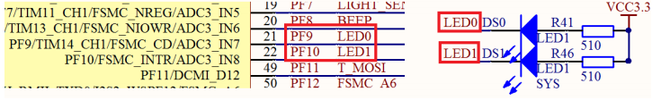
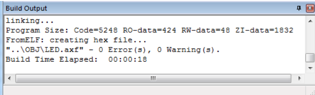

# 跑马灯实验

- 实验器材:
	- 探索者STM32F4开发板
	
- 实验目的:
	- 学习GPIO作为输出的使用
	
- 硬件资源:
	- 1,DS0(连接在PF9) 
	- 2,DS1(连接在PF10)
	
- 实验现象:
	- 本实验通过代码控制开发板上的两个LED：
        - DS0和DS1交替闪烁，实现类似跑马灯的效果 
## 1 前言
多看看[ch01-quickexample](../ch01-quickexample),很多事情你就懂了
## 2 硬件设计
本章用到的硬件只有 LED（DS0 和 DS1）。其电路在 ALIENTEK 探索者 STM32F4 开发板
上默认是已经连接好了的。DS0 接 PF9，DS1 接 PF10。所以在硬件上不需要动任何东西。其连
接原理图如图下：


## 3 软件设计
当然最重要是理解代码

来看看hardware下的文件led.c
```
void LED_Init(void)
{    	 
  GPIO_InitTypeDef  GPIO_InitStructure;

  RCC_AHB1PeriphClockCmd(RCC_AHB1Periph_GPIOF, ENABLE);//使能GPIOF时钟

  //GPIOF9,F10初始化设置
  GPIO_InitStructure.GPIO_Pin = GPIO_Pin_9 | GPIO_Pin_10;//LED0和LED1对应IO口
  GPIO_InitStructure.GPIO_Mode = GPIO_Mode_OUT;//普通输出模式
  GPIO_InitStructure.GPIO_OType = GPIO_OType_PP;//推挽输出
  GPIO_InitStructure.GPIO_Speed = GPIO_Speed_100MHz;//100MHz
  GPIO_InitStructure.GPIO_PuPd = GPIO_PuPd_UP;//上拉
  GPIO_Init(GPIOF, &GPIO_InitStructure);//初始化GPIO
	
	GPIO_SetBits(GPIOF,GPIO_Pin_9 | GPIO_Pin_10);//GPIOF9,F10设置高，灯灭

}
```


**在配置 STM32 外设的时候，任何时候都要先使能该外设的时钟！**
___GPIO 是挂载在 AHB1 总线上的外设，在固件库中对挂载在 AHB1 总线上的外设时钟使能是通过函数 RCC_AHB1PeriphClockCmd ()来实现的___  

一定要记得使能外部时钟哦！！  

## 那么现在初始化结束，来设置对应值
在上面已经把9,10,11引脚给初始化了，我们还需要用一个变量取他然后复制，就像51那样。  

那么接下来肯定是赋值了,你可以用自带的库来操作  

__你可以这样，用固件库操作__
```
GPIO_SetBits(GPIOF, GPIO_Pin_9); //设置 GPIOF.9 输出 1,等同 LED0=1;
GPIO_ResetBits (GPIOF, GPIO_Pin_9); //设置 GPIOF.9 输出 0,等同 LED0=0;
```
__或者像这样用位操作，不过先要设置一下类似51的sbit变量__
```
#define LED0 PFout(9)	// DS0
#define LED1 PFout(10)	// DS1	
```
是用这个PFout()来设置引脚值的，不错吧~  

```
int main(void)
{ 
 
	delay_init(168);		  //初始化延时函数
	LED_Init();		        //初始化LED端口
  while(1)
	{
     LED0=0;			  //LED0亮
	   LED1=1;				//LED1灭
		 delay_ms(500);
		 LED0=1;				//LED0灭
		 LED1=0;				//LED1亮
		 delay_ms(500);
	 }
}
```
__甚至还有寄存器操作法__
```
int main(void)
{ 
 
	delay_init(168);		  //初始化延时函数
	LED_Init();		        //初始化LED端口
	while(1)
	{
     GPIOF->BSRRH=GPIO_Pin_9;//LED0亮
	   GPIOF->BSRRL=GPIO_Pin_10;//LED1灭  

		 delay_ms(500);
     GPIOF->BSRRL=GPIO_Pin_9;//LED0灭
	   GPIOF->BSRRH=GPIO_Pin_10;//LED1亮
		 delay_ms(500);

	 }
 }	 
```

来到keil里跑一下，一定要是这个结果哦



可以看到没有错误，也没有警告。

从编译信息可以看出，我们的代码占用 FLASH 大小为：5672 字节（5248+424）

所用的 SRAM 大小为：1880 个字节（1832+48）。

这里我们解释一下，编译结果里面的几个数据的意义：
- Code：表示程序所占用 FLASH 的大小（FLASH）。
- RO-data：即 Read Only-data，表示程序定义的常量（FLASH）。
- RW-data：即 Read Write-data，表示已被初始化的变量（SRAM）
- ZI-data：即 Zero Init-data，表示未被初始化的变量(SRAM)

有了这个就可以知道你当前使用的 flash 和 sram 大小了，所以，一定要注意的是程序的大
小不是.hex 文件的大小，而是编译后的 Code 和 RO-data 之和

再用keil的一键烧录就好了，真不错

## 第一感觉太复杂了！！！