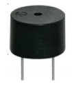
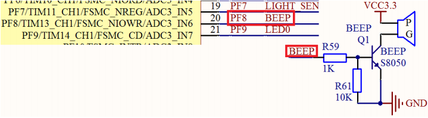

# 蜂鸣器实验

上一章，我们介绍了 STM32F4 的 IO 口作为输出的使用，这一章，我们将通过另外一个例
子讲述 STM32F4 的 IO 口作为输出的使用。

在本章中，我们将利用一个 IO 口来控制板载的有
源蜂鸣器，实现蜂鸣器控制。通过本章的学习，你将进一步了解 STM32F4 的 IO 口作为输出口
使用的方法。

相信已经对蜂鸣器很熟悉了，但还是再介绍一下



这里的有源不是指电源的“源”，而是指有没有自带震荡电路，有源蜂鸣器自带了震荡电路，一通电就会发声；无源蜂鸣器则没有自带震荡电路，必须外部提供 2~5Khz 左右的方波驱动，才能发声。

前面我们已经对 STM32F4 的 IO 做了简单介绍，上一章，我们就是利用 STM32 的 IO 口直
接驱动 LED 的，本章的蜂鸣器，我们能否直接用 STM32 的 IO 口驱动呢？

让我们来分析下：STM32F4 的单个 IO 最大可以提供 25mA 电流（来自数据手册），而蜂鸣器的驱动电流是 30mA左右，两者十分相近，但是全盘考虑，STM32F4 整个芯片的电流，最大也就 150mA，如果用IO 口直接驱动蜂鸣器，其他地方用电就得省着点了…

所以，我们不用 STM32F4 的 IO 直接驱动
蜂鸣器，而是通过三极管扩流后再驱动蜂鸣器，这样 STM32F4 的 IO 只需要提供不到 1mA 的
电流就足够了。

**我只能说，妙啊**

IO 口使用虽然简单，但是和外部电路的匹配设计，还是要十分讲究的，考虑越多，设计就
越可靠，可能出现的问题也就越少。

本章将要实现的是控制 ALIENTEK 探索者 STM32F4 开发板上的蜂鸣器发出：“嘀”… “ 嘀”…的间隔声，进一步熟悉 STM32F4 IO 口的使用。

## 2 硬件设计
本章需要用到的硬件有：
- 1）指示灯 DS0
- 2）蜂鸣器

DS0 在上一章已有介绍，而蜂鸣器在硬件上也是直接连接好了的，不需要经过任何设置，
直接编写代码就可以了。蜂鸣器的驱动信号连接在 STM32F4 的 PF8 上。如图所示：



图中我们用到一个 NPN 三极管（S8050）来驱动蜂鸣器，R61 主要用于防止蜂鸣器的误发
声。当 PF.8 输出高电平的时候，蜂鸣器将发声，当 PF.8 输出低电平的时候，蜂鸣器停止发声

## 3 软件设计

**beep.h**
```
#ifndef __BEEP_H
#define __BEEP_H	 
#include "sys.h" 

//LED端口定义
#define BEEP PFout(8)	// 蜂鸣器控制IO 

void BEEP_Init(void);//初始化		 				    
#endif

```
看到蜂鸣器和上一章的铺垫，相信已经非常熟悉了，用PFout可以控制引脚的变量

*beep.c*
```
#include "beep.h" 
//初始化PF8为输出口		    
//BEEP IO初始化
void BEEP_Init(void)
{   
  GPIO_InitTypeDef  GPIO_InitStructure;

  RCC_AHB1PeriphClockCmd(RCC_AHB1Periph_GPIOF, ENABLE);//使能GPIOF时钟
  
  //初始化蜂鸣器对应引脚GPIOF8
  GPIO_InitStructure.GPIO_Pin = GPIO_Pin_8;
  GPIO_InitStructure.GPIO_Mode = GPIO_Mode_OUT;//普通输出模式
  GPIO_InitStructure.GPIO_OType = GPIO_OType_PP;//推挽输出
  GPIO_InitStructure.GPIO_Speed = GPIO_Speed_100MHz;//100MHz
  GPIO_InitStructure.GPIO_PuPd = GPIO_PuPd_DOWN;//下拉
  GPIO_Init(GPIOF, &GPIO_InitStructure);//初始化GPIO
	
  GPIO_ResetBits(GPIOF,GPIO_Pin_8);  //蜂鸣器对应引脚GPIOF8拉低， 
}
```
看原理图看看要初始化哪一个引脚再传入这个经常用到的函数即可  
来到主函数
*main.c*
```
#include "sys.h"
#include "delay.h"
#include "usart.h"
#include "led.h"
#include "beep.h"
int main(void)
{ 
delay_init(168); //初始化延时函数
LED_Init(); //初始化 LED 端口
BEEP_Init(); //初始化蜂鸣器端口
while(1)
{ 
GPIO_ResetBits(GPIOF,GPIO_Pin_9); // DS0 拉低，亮 等同 LED0=0;
GPIO_ResetBits(GPIOF,GPIO_Pin_8); //BEEP 引脚拉低， 等同 BEEP=0;
delay_ms(300); //延时 300ms
GPIO_SetBits(GPIOF,GPIO_Pin_9); // DS0 拉高，灭 等同 LED0=1;
GPIO_SetBits(GPIOF,GPIO_Pin_8); //BEEP 引脚拉高， 等同 BEEP=1;
delay_ms(300); //延时 300ms
} }
```
注意要将 BEEP 文件夹加入头文件包含路径，不能少，否则编译的时候会报错。这段代码
就是通过库函数 GPIO_ResetBits 和 GPIO_SetBits 两个函数实现前面 7.1 节所阐述的功能，同时

加入了 DS0（LED0）的闪烁来提示程序运行（后面的代码，我们基本都会加入这个），整个代
码比较简单。 

..完
```
        *   *   *   *    
       *     * *     *     
      *  ★   *  ★   *    
       *      ★     *     
>>>------I love you!   ---->
         *         *      
           *  ★ *       
            *   *          
             * *          
              *  
```