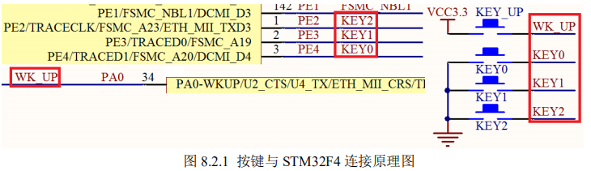

# 按键输入实验
上两章，我们介绍了 STM32F4 的 IO 口作为输出的使用，这一章，我们将向大家介绍如何
使用 STM32F4 的 IO 口作为输入用。在本章中，我们将利用板载的 4 个按键，来控制板载的两
个 LED 的亮灭和蜂鸣器的开关。

通过本章的学习，你将了解到 STM32F4 的 IO 口作为输入口 的使用方法。


## 1 STM32F4 IO 口简介
STM32F4 的 IO 口在上两章已经有了比较详细的介绍，这里我们不再多说。STM32F4 的 IO
口做输入使用的时候，是通过调用函数 GPIO_ReadInputDataBit()来读取 IO 口的状态的。了解
了这点，就可以开始我们的代码编写了。

这一章，我们将通过 ALIENTEK 探索者 STM32F4 开发板上载有的 4 个按钮

（KEY_UP、KEY0、KEY1 和 KEY2）

来控制板上的 2 个 LED（DS0 和 DS1）和蜂鸣器

其中 KEY_UP 控 制蜂鸣器，按一次叫，再按一次停；KEY2 控制 DS0，按一次亮，再按一次灭；KEY1 控制 DS1，效果同 KEY2；KEY0 则同时控制 DS0 和 DS1，按一次，他们的状态就翻转一次

## 2 硬件设计
本实验用到的硬件资源有：
- 1） 指示灯 DS0、DS1
- 2） 蜂鸣器
- 3） 4 个按键：KEY0、KEY1、KEY2、和 KEY_UP。

DS0、DS1 以及蜂鸣器和 STM32F4 的连接在上两章都已经分别介绍了，在探索者 STM32F4
开发板上的按键 KEY0 连接在 PE4 上、KEY1 连接在 PE3 上、KEY2 连接在 PE2 上、KEY_UP
连接在 PA0 上。如图 8.2.1 所示：



这里需要注意的是：  
**KEY0、KEY1 和 KEY2 是低电平有效的，而 KEY_UP 是高电平有效**

的，并且外部都没有上下拉电阻，所以，需要在 STM32F4 内部设置上下拉。


## 3 软件设计
*key.c*

有了前面的基础，下面就说快点了

```
#include "key.h"
#include "delay.h" 
//////////////////////////////////////////////////////////////////////////////////	 
//本程序只供学习使用，未经作者许可，不得用于其它任何用途
//ALIENTEK STM32F407开发板
//按键输入驱动代码	   
//正点原子@ALIENTEK
//技术论坛:www.openedv.com
//创建日期:2014/5/3
//版本：V1.0
//版权所有，盗版必究。
//Copyright(C) 广州市星翼电子科技有限公司 2014-2024
//All rights reserved									  
////////////////////////////////////////////////////////////////////////////////// 	 

//按键初始化函数
void KEY_Init(void)
{
	
	GPIO_InitTypeDef  GPIO_InitStructure;

  RCC_AHB1PeriphClockCmd(RCC_AHB1Periph_GPIOA|RCC_AHB1Periph_GPIOE, ENABLE);//使能GPIOA,GPIOE时钟//
  //原理图里有PE的就是使能GPIOE的时钟，以此类推
 
  GPIO_InitStructure.GPIO_Pin = GPIO_Pin_2|GPIO_Pin_3|GPIO_Pin_4; //KEY0 KEY1 KEY2对应引脚
  GPIO_InitStructure.GPIO_Mode = GPIO_Mode_IN;//普通输入模式
  GPIO_InitStructure.GPIO_Speed = GPIO_Speed_100MHz;//100M
  GPIO_InitStructure.GPIO_PuPd = GPIO_PuPd_UP;//上拉
  GPIO_Init(GPIOE, &GPIO_InitStructure);//初始化GPIOE2,3,4
	
	 
  GPIO_InitStructure.GPIO_Pin = GPIO_Pin_0;//WK_UP对应引脚PA0
  GPIO_InitStructure.GPIO_PuPd = GPIO_PuPd_DOWN ;//下拉
  GPIO_Init(GPIOA, &GPIO_InitStructure);//初始化GPIOA0
 
} 

//按键处理函数
//返回按键值
//mode:0,不支持连续按;1,支持连续按;
//0，没有任何按键按下
//1，KEY0按下
//2，KEY1按下
//3，KEY2按下 
//4，WKUP按下 WK_UP
//注意此函数有响应优先级,KEY0>KEY1>KEY2>WK_UP!!
u8 KEY_Scan(u8 mode)
{	 
	static u8 key_up=1;//按键按松开标志
	if(mode)key_up=1;  //支持连按		  
	if(key_up&&(KEY0==0||KEY1==0||KEY2==0||WK_UP==1))
	{
		delay_ms(10);//去抖动 
		key_up=0;
		if(KEY0==0)return 1;
		else if(KEY1==0)return 2;
		else if(KEY2==0)return 3;
		else if(WK_UP==1)return 4;
	}else if(KEY0==1&&KEY1==1&&KEY2==1&&WK_UP==0)key_up=1; 	    
 	return 0;// 无按键按下
}
```

这段代码包含 2 个函数，void KEY_Init(void)和 u8 KEY_Scan(u8 mode)，KEY_Init 是用来
初始化按键输入的 IO 口的。实现 PA0、PE2~4 的输入设置

相信这些都很熟悉了，就不说力

KEY_Scan 函数，则是用来扫描这 4 个 IO 口是否有按键按下。KEY_Scan 函数，支持两种
扫描方式，通过 mode 参数来设置。

当 mode 为 0 的时候，KEY_Scan 函数将不支持连续按，扫描某个按键，该按键按下之后必
须要松开，才能第二次触发，否则不会再响应这个按键，这样的好处就是可以防止按一次多次
触发，而坏处就是在需要长按的时候比较不合适。

当 mode 为 1 的时候，KEY_Scan 函数将支持连续按，如果某个按键一直按下，则会一直返
回这个按键的键值，这样可以方便的实现长按检测。

有了 mode 这个参数，大家就可以根据自己的需要，选择不同的方式。这里要提醒大家，
因为该函数里面有 static 变量，所以该函数不是一个可重入函数，在有 OS 的情况下，这个大家
要留意下。

同时还有一点要注意的就是，该函数的按键扫描是有优先级的，最优先的是 KEY0，
第二优先的是 KEY1，接着 KEY2，最后是 KEY3（KEY3 对应 KEY_UP 按键）。该函数有返回
值，如果有按键按下，则返回非 0 值，如果没有或者按键不正确，则返回 0

__接下来我们看看头文件 key.h 里面的代码：__
```
#ifndef __KEY_H
#define __KEY_H
#include "sys.h" 
/*下面的方式是通过直接操作库函数方式读取 IO*/
#define KEY0 GPIO_ReadInputDataBit(GPIOE,GPIO_Pin_4) //PE4
#define KEY1 GPIO_ReadInputDataBit(GPIOE,GPIO_Pin_3) //PE3 
#define KEY2 GPIO_ReadInputDataBit(GPIOE,GPIO_Pin_2) //PE2
#define WK_UP GPIO_ReadInputDataBit(GPIOA,GPIO_Pin_0) //PA0
#define KEY0_PRES 1
#define KEY1_PRES 2
#define KEY2_PRES 3
#define WKUP_PRES 4
void KEY_Init(void); //IO 初始化
u8 KEY_Scan(u8); //按键扫描函数
#endif
```
```
#define KEY0 GPIO_ReadInputDataBit(GPIOE,GPIO_Pin_4) //PE4
#define KEY1 GPIO_ReadInputDataBit(GPIOE,GPIO_Pin_3) //PE3 
#define KEY2 GPIO_ReadInputDataBit(GPIOE,GPIO_Pin_2) //PE2
#define WK_UP GPIO_ReadInputDataBit(GPIOA,GPIO_Pin_0) //PA0
```
要知道上面这是调用了库函数来 实现的IO口变量,同输出一样，上面的功能也
同样可以通过位带操作来简单的实现：
```
#define KEY0 PEin(4) //PE4
#define KEY1 PEin(3) //PE3 
#define KEY2 PEin(2) //P32
#define WK_UP PAin(0) //PA0
```
### 用库函数实现的好处是在各个 STM32 芯片上面的移植性非常好，不需要修改任何代码。
### 用位带操作的好处是简洁，至于使用哪种方法，看各位的爱好了

在 key.h 中，我们还定义了 KEY0_PRES / KEY1_PRES/ KEY2_PRES/WKUP_PRESS 等 4
个宏定义，分别对应开发板四个按键（KEY0/KEY1/KEY2/ KEY_UP）按键按下时 KEY_Scan
返回的值。通过宏定义的方式判断返回值，方便记忆和使用。

_最后来看看main_
```
#include "sys.h"
#include "delay.h"
#include "usart.h"
#include "led.h"
#include "beep.h"
#include "key.h"


//ALIENTEK 探索者STM32F407开发板 实验3
//按键输入实验-库函数版本 
//技术支持：www.openedv.com
//淘宝店铺：http://eboard.taobao.com
//广州市星翼电子科技有限公司    
//作者：正点原子 @ALIENTEK 


int main(void)
{ 
 
  u8 key;           //保存键值
	delay_init(168);  //初始化延时函数
	LED_Init();				//初始化LED端口 
	BEEP_Init();      //初始化蜂鸣器端口
	KEY_Init();       //初始化与按键连接的硬件接口
	LED0=0;				  	//先点亮红灯
	while(1)
	{
		key=KEY_Scan(0);		//得到键值
	   	if(key)
		{						   
			switch(key)
			{				 
				case WKUP_PRES:	//控制蜂鸣器
					BEEP=!BEEP;
					break;
				case KEY0_PRES:	//控制LED0翻转
					LED0=!LED0;
					break;
				case KEY1_PRES:	//控制LED1翻转	 
					LED1=!LED1;
					break;
				case KEY2_PRES:	//同时控制LED0,LED1翻转 
					LED0=!LED0;
					LED1=!LED1;
					break;
			}
		}else delay_ms(10); 
	}

}

```

这种结合了前两章的内容，可以看到调用了LED init和beepinit，也就初始化了对应的脚，那么逻辑也很自然了，很容易


只要先进行一系列的初始化操作，然后在死循环中调用按键扫描函数
KEY_Scan()扫描按键值，最后根据按键值控制 LED 和蜂鸣器的翻转。
