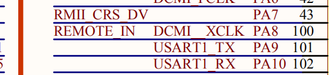
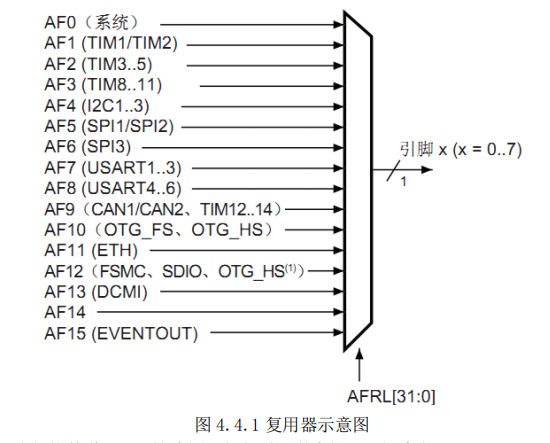
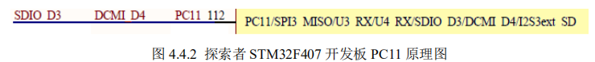
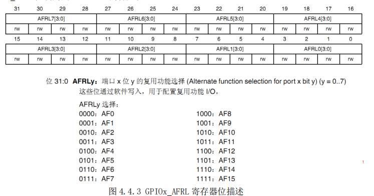
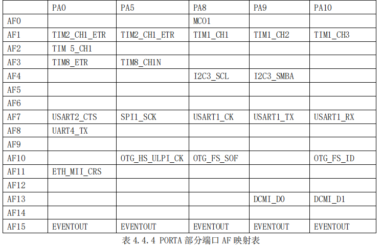
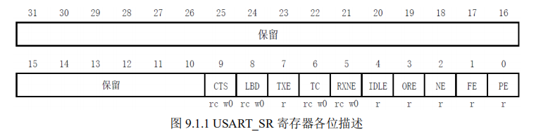
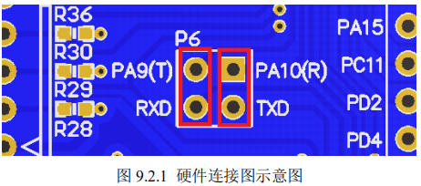
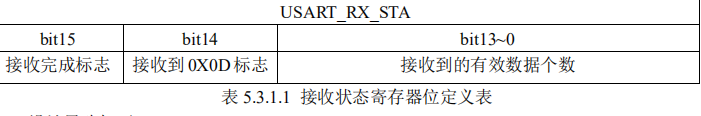

# 串口通信实验
前面三章介绍了 STM32F4 的 IO 口操作。这一章我们将学习 STM32F4 的串口，教大家如
何使用 STM32F4 的串口来发送和接收数据。

本章将实现如下功能：STM32F4 通过串口和上位
机的对话，STM32F4 在收到上位机发过来的字符串后，原原本本的返回给上位机。

## 1 STM32F4 串口简介
串口作为 MCU 的重要外部接口，同时也是软件开发重要的调试手段，其重要性不言而喻。
现在基本上所有的 MCU 都会带有串口，STM32 自然也不例外。

STM32F4 的串口资源相当丰富的，功能也相当强劲。ALIENTEK 探索者 STM32F4 开发板
所使用的 STM32F407ZGT6 最多可提供 6 路串口，有分数波特率发生器、支持同步单线通信和
半双工单线通讯、支持 LIN、支持调制解调器操作、智能卡协议和 IrDA SIR ENDEC 规范、具
有 DMA 等。

5.3 节对串口有过简单的介绍，大家看这个实验的时候记得翻过去看看。接下来我们将主要
从库函数操作层面结合寄存器的描述，告诉你如何设置串口，以达到我们最基本的通信功能。

本章，我们将实现利用串口 1 不停的打印信息到电脑上，同时接收从串口发过来的数据，把发
送过来的数据直接送回给电脑。探索者 STM32F4 开发板板载了 1 个 USB 串口和 2 个 RS232 串
口，我们本章介绍的是通过 USB 串口和电脑通信。

在 4.4.章节端口复用功能已经讲解过，对于复用功能的 IO，我们首先要使能 GPIO 时钟，
然后使能相应的外设时钟，同时要把 GPIO 模式设置为复用。这些准备工作做完之后，剩下的
当然是串口参数的初始化设置，包括波特率，停止位等等参数。

在设置完成只能接下来就是使
能串口，这很容易理解。同时，如果我们开启了串口的中断，当然要初始化 NVIC 设置中断优先
级别，最后编写中断服务函数。

串口设置的一般步骤可以总结为如下几个步骤：
1) 串口时钟使能，GPIO 时钟使能。
2) 设置引脚复用器映射：调用 GPIO_PinAFConfig 函数。
3) GPIO 初始化设置：要设置模式为复用功能。
4) 串口参数初始化：设置波特率，字长，奇偶校验等参数。
5) 开启中断并且初始化 NVIC，使能中断（如果需要开启中断才需要这个步骤）。
6) 使能串口。
7) 编写中断处理函数：函数名格式为 USARTxIRQHandler(x 对应串口号)。

下面，我们就简单介绍下这几个与串口基本配置直接相关的几个固件库函数。这些函数和
定义主要分布在 stm32f4xx_usart.h 和 stm32f4xx_usart.c 文件中。

### ① 串口时钟和 GPIO 时钟使能。
  
串口是挂载在 APB2 下面的外设，所以使能函数为：
```
RCC_APB2PeriphClockCmd(RCC_APB2Periph_USART1,ENABLE);//使能 USART1 时钟
```
GPIO 时钟使能，就非常简单，因为我们使用的是串口 1，串口 1 对应着芯片引脚 PA9,PA10  

所以这里我们只需要使能 GPIOA 时钟即可：
```
RCC_AHB1PeriphClockCmd(RCC_AHB1Periph_GPIOA,ENABLE); //使能 GPIOA 时钟
```
### ② 设置引脚复用器映射
我们先来看看什么是这个引脚复用  

STM32F4 有很多的内置外设，这些外设的外部引脚都是与 GPIO 复用的。也就是说，一个 GPIO
如果可以复用为内置外设的功能引脚，那么当这个 GPIO 作为内置外设使用的时候，就叫做复用。
这部分知识在《STM32F4 中文参考手册》第七章和芯片数据手册有详细的讲解哪些 GPIO 管脚是
可以复用为哪些内置外设。

对于本小节知识，STM32F4 中文参考手册讲解比较详细，我们同样会从中抽取重要的知识点
罗列出来。同时，我们会以串口使用为例给大家讲解具体的引脚复用的配置。

STM32F4 系列微控制器 IO 引脚通过一个复用器连接到内置外设或模块。该复用器一次只允
许一个外设的复用功能（AF）连接到对应的 IO 口。这样可以确保共用同一个 IO 引脚的外设之
间不会发生冲突。

每个 IO 引脚都有一个复用器，该复用器采用 16 路复用功能输入（AF0 到 AF15），可通过
GPIOx_AFRL(针对引脚 0-7)和 GPIOx_AFRH（针对引脚 8-15）寄存器对这些输入进行配置，每四
位控制一路复用：

- 1）完成复位后，所有 IO 都会连接到系统的复用功能 0（AF0）。 
- 2）外设的复用功能映射到 AF1 到 AF13。 
- 3）Cortex-M4 EVENTOUT 映射到 AF15。

  

接下来，我们简单说明一下这个图要如何看，举个例子，探索者 STM32F407 开发板的原理图上 PC11 的原理图如图 4.4.2 所示：
   
如上图所示，PC11 可以作为 SPI3_MISO/U3_RX/U4_RX/SDIO_D3/DCMI_D4/I2S3ext_SD
等复用功能输出，这么多复用功能，如果这些外设都开启了，那么对 STM32F1 来说，那就可
能乱套了，外设之间可互相干扰

但是 STM32F4，由于有复用功能选择功能，可以让 PC11 仅
连接到某个特定的外设，因此不存在互相干扰的情况


上图 4.4.1 是针对引脚 0-7，对于引脚 8-15，控制寄存器为 GPIOx_AFRH。

从图中可以看出。
当需要使用复用功能的时候，我们配置相应的寄存器 GPIOx_AFRL 或者 GPIOx_AFRH，让对应引
脚通过复用器连接到对应的复用功能外设。

这里我们列出 GPIOx_AFRL 寄存器的描述，
GPIOx_AFRH 的作用跟 GPIOx_AFRL 类似，只不过 GPIOx_AFRH 控制的是一组 IO 口的高八位，
GPIOx_AFRL 控制的是一组 IO 口的低八位。
  

从表中可以看出，32 位寄存器 GPIOx_AFRL 每四个位控制一个 IO 口，所以每个寄存器控制
32/4=8 个 IO 口。寄存器对应四位的值配置决定这个 IO 映射到哪个复用功能 AF。
在微控制器完成复位后，所有 IO 口都会连接到系统复用功能 0（AF0）。

这里大家需要注意，
对于系统复用功能 AF0，我们将 IO 口连接到 AF0 之后，还要根据所用功能进行配置：

1) JTAG/SWD:在器件复位之后，会将这些功能引脚指定为专用引脚。也就是说，这些引脚
在复位后默认就是 JTAG/SWD 功能。如果我们要作为 GPIO 来使用，就需要对对应的 IO
口复用器进行配置。
2) RTC_REFIN:此引脚在系统复位之后要使用的话要配置为浮空输入模式。
3) MCO1 和 MCO2：这些引脚在系统复位之后要使用的话要配置为复用功能模式

对于外设复用功能的配置，除了 ADC 和 DAC 要将 IO 配置为模拟通道之外其他外设功能一律 
要配置为复用功能模式，这个配置是在 IO 口对应的 GPIOx_MODER 寄存器中配置的。同时要配
置 GPIOx_AFRH 或者 GPIOx_AFRL 寄存器，将 IO 口通过复用器连接到所需要的复用功能对应的
AFx。

调用函数为：
```
GPIO_PinAFConfig(GPIOA,GPIO_PinSource9,GPIO_AF_USART1); //PA9 复用为 USART1
GPIO_PinAFConfig(GPIOA,GPIO_PinSource10,GPIO_AF_USART1);//PA10 复用为 USART1
```
那么就要问了，什么是USART?

> USART:(Universal Synchronous/Asynchronous Receiver/Transmitter)  
> 通用同步/异步串行接收/发送器

> USART是一个全双工通用同步/异步串行收发模块，该接口是一个高度灵活的串行通信设备。  

因为串口使用到 PA9,PA10，所以我们要把 PA9 和 PA10 都映射到串口 1。所以这里我们要调用
两次函数。
对于 GPIO_PinAFConfig 函数的第一个和第二个参数很好理解，就是设置对应的 IO 口，如
果是 PA9 那么第一个参数是 GPIOA,第二个参数就是 GPIO_PinSource9。

第二个参数，实际我们不需要去记忆，只需要根据[快速组织代码技巧](../ch01-quickexample)里面，去相应的配置文件找到外设对应的 AF 配置宏定义标识符即可，串口 1 为 GPIO_AF_USART1。

不是每个 IO 口都可以复用为任意复用功能外设。到底哪些 IO 可以复用为相关外设呢？这
在芯片对应的数据手册(请参考光盘目录：)上面会有详细的表格列出来。

对于 STM32F407，数
据手册里面的 Table 9.Alternate function mapping 表格列出了所有的端口 AF 映射表，因为表格比较大，所以这里只列出 PORTA 的几个端口为例方便大家理解：
  

从表 4.4.4 可以看出，PA9 连接 AF7 可以复用为串口 1 的发送引脚 USART1_TX，PA10 连接 AF7
可以复用为串口 2 的接受引脚 USART1_RX。

接下来我们以串口 1 为例来讲解怎么配置 GPOPA.9,GPIOA.10 口为串口 1 复用功能。

### 1）首先,我们要使用 IO 复用功能外设，必须先打开对应的 IO 时钟和复用功能外设时钟。
```
/*使能 GPIOA 时钟*/
RCC_AHB1PeriphClockCmd(RCC_AHB1Periph_GPIOA,ENABLE); 
/*使能 USART1 时钟*/
RCC_APB2PeriphClockCmd(RCC_APB2Periph_USART1,ENABLE);
```
这里需要说明一下，官方库提供了五个打开 GPIO 和外设时钟的函数分别为：
```
void RCC_AHB1PeriphClockCmd(uint32_t RCC_AHB1Periph, FunctionalState NewState);
void RCC_AHB2PeriphClockCmd(uint32_t RCC_AHB2Periph, FunctionalState NewState);
void RCC_AHB3PeriphClockCmd(uint32_t RCC_AHB3Periph, FunctionalState NewState);
void RCC_APB1PeriphClockCmd(uint32_t RCC_APB1Periph, FunctionalState NewState);
void RCC_APB2PeriphClockCmd(uint32_t RCC_APB2Periph, FunctionalState NewState);
```
这五个函数分别用来打开相应的总线下 GPIO 和外设时钟。比如我们的串口 1 是挂载在
APB2 总线之下，所以我们调用对应的 APB2 总线下外设时钟使能函数 RCC_APB2PeriphClockCmd
来使能串口 1 时钟。

对于其他外设我们调用相应的函数即可。具体库函数要怎么快速找到对应
的外设使能函数，大家可以参考[快速组织代码技巧](../ch01-quickexample)，我们有详细的举例 说明

### 2）其次，我们在 GIPOx_MODER 寄存器中将所需 IO（对于串口 1 是 PA9,PA10）配置为复用功能（ADC 和 DAC 设置为模拟通道）。

 ### 3）再次,我们还需要对 IO 口的其他参数，例如类型，上拉/下拉以及输出速度。
上面两步，在我们库函数中是通过 GPIO_Init 函数来实现的，参考代码如下：
```
/*GPIOA9 与 GPIOA10 初始化*/
GPIO_InitStructure.GPIO_Pin = GPIO_Pin_9 | GPIO_Pin_10; 
 GPIO_InitStructure.GPIO_Mode = GPIO_Mode_AF;//复用功能
 GPIO_InitStructure.GPIO_Speed = GPIO_Speed_50MHz;//速度 50MHz
 GPIO_InitStructure.GPIO_OType = GPIO_OType_PP; //推挽复用输出
 GPIO_InitStructure.GPIO_PuPd = GPIO_PuPd_UP; //上拉
 GPIO_Init(GPIOA,&GPIO_InitStructure); //初始化 PA9，PA10
```
### 4）最后，我们配置 GPIOx_AFRL 或者 GPIOx_AFRH 寄存器，将 IO 连接到所需的 AFx。
这些步骤对于我们使用库函数来操作的话，是调用的 GPIO_PinAFConfig 函数来实现的。具
体操作代码如下：
```
/*PA9 连接 AF7，复用为 USART1_TX */
GPIO_PinAFConfig(GPIOA,GPIO_PinSource9,GPIO_AF_USART1); 
/* PA10 连接 AF7,复用为 USART1_RX*/
GPIO_PinAFConfig(GPIOA,GPIO_PinSource10,GPIO_AF_USART1); 
```
对于函数 GPIO_PinAFConfig 函数，入口第一个第二个参数很好理解，可以确定是哪个 IO，
对于第三个参数，实际上我们确定了这个 IO 到底是复用为哪种功能之后，这个参数也很好选
择，因为可选的参数在 stm32f4xx_gpio.h 列出来非常详细，如下
```
#define IS_GPIO_AF(AF) (((AF) == GPIO_AF_RTC_50Hz) ||((AF) == GPIO_AF_TIM14) || \
 ((AF) == GPIO_AF_MCO) || ((AF) == GPIO_AF_TAMPER) || \
 ((AF) == GPIO_AF_SWJ) || ((AF) == GPIO_AF_TRACE) || \
 ((AF) == GPIO_AF_TIM1) || ((AF) == GPIO_AF_TIM2) || \
 ((AF) == GPIO_AF_TIM3) || ((AF) == GPIO_AF_TIM4) || \
 ((AF) == GPIO_AF_TIM5) || ((AF) == GPIO_AF_TIM8) || \
 ((AF) == GPIO_AF_I2C1) || ((AF) == GPIO_AF_I2C2) || \
 ((AF) == GPIO_AF_I2C3) || ((AF) == GPIO_AF_SPI1) || \
 ((AF) == GPIO_AF_SPI2) || ((AF) == GPIO_AF_TIM13) || \
 ((AF) == GPIO_AF_SPI3) || ((AF) == GPIO_AF_TIM14) || \
 ((AF) == GPIO_AF_USART1) || ((AF) == GPIO_AF_USART2) || \
 ((AF) == GPIO_AF_USART3) || ((AF) == GPIO_AF_UART4) || \
 ((AF) == GPIO_AF_UART5) || ((AF) == GPIO_AF_USART6) || \
 ((AF) == GPIO_AF_CAN1) || ((AF) == GPIO_AF_CAN2) || \
 ((AF) == GPIO_AF_OTG_FS) || ((AF) == GPIO_AF_OTG_HS) || \
 ((AF) == GPIO_AF_ETH) || ((AF) == GPIO_AF_OTG_HS_FS) || \
 ((AF) == GPIO_AF_SDIO) || ((AF) == GPIO_AF_DCMI) || \
 ((AF) == GPIO_AF_EVENTOUT) || ((AF) == GPIO_AF_FSMC))
```
参考这些宏定义标识符，能很快找到函数的入口参数

说到这，想必聪明的你也知道，串口1的AF配置为 GPIO_AF_USART1。
***
## 回到正题
### ③ GPIO 端口模式设置：PA9 和 PA10 要设置为复用功能。
```
GPIO_InitStructure.GPIO_Pin = GPIO_Pin_9 | GPIO_Pin_10; //GPIOA9 与 GPIOA10
GPIO_InitStructure.GPIO_Mode = GPIO_Mode_AF;//复用功能
GPIO_InitStructure.GPIO_Speed = GPIO_Speed_50MHz; //速度 50MHz
GPIO_InitStructure.GPIO_OType = GPIO_OType_PP; //推挽复用输出
GPIO_InitStructure.GPIO_PuPd = GPIO_PuPd_UP; //上拉
GPIO_Init(GPIOA,&GPIO_InitStructure); //初始化 PA9，PA10
```

### ④ 串口参数初始化：设置波特率，字长，奇偶校验等参数
串口初始化是调用函数 USART_Init 来实现的，具体设置方法如下：
```
USART_InitStructure.USART_BaudRate = bound;//一般设置为 9600;
USART_InitStructure.USART_WordLength = USART_WordLength_8b;//字长为 8 位数据格式
USART_InitStructure.USART_StopBits = USART_StopBits_1;//一个停止位
USART_InitStructure.USART_Parity = USART_Parity_No;//无奇偶校验位
USART_InitStructure.USART_HardwareFlowControl = USART_HardwareFlowControl_None;
USART_InitStructure.USART_Mode = USART_Mode_Rx | USART_Mode_Tx;//收发模式
USART_Init(USART1, &USART_InitStructure); //初始化串口
```

### ⑤ 使能串口
使能串口调用函数 USART_Cmd 来实现，具体使能串口 1 方法如下：
USART_Cmd(USART1, ENABLE); //使能串口
### ⑥ 串口数据发送与接收。
STM32F4 的发送与接收是通过数据寄存器 USART_DR 来实现的，这是一个双寄存器，包
含了 TDR 和 RDR。当向该寄存器写数据的时候，串口就会自动发送，当收到数据的时候，也
是存在该寄存器内。

STM32 库函数操作 USART_DR 寄存器发送数据的函数是：
```
void USART_SendData(USART_TypeDef* USARTx, uint16_t Data);
```
通过该函数向串口寄存器 USART_DR 写入一个数据。

STM32 库函数操作 USART_DR 寄存器读取串口接收到的数据的函数是：
```
uint16_t USART_ReceiveData(USART_TypeDef* USARTx);
```
通过该函数可以读取串口接受到的数据

### ⑦ 串口状态
串口的状态可以通过状态寄存器 USART_SR 读取。USART_SR 的各位描述如图 9.1.1 所示
  

RXNE（读数据寄存器非空），当该位被置 1 的时候，就是提示已经有数据被接收到了，并
且可以读出来了。这时候我们要做的就是尽快去读取 USART_DR，通过读 USART_DR 可以将
该位清零，也可以向该位写 0，直接清除。

TC（发送完成），当该位被置位的时候，表示 USART_DR 内的数据已经被发送完成了。如
果设置了这个位的中断，则会产生中断。该位也有两种清零方式：1）读 USART_SR，写
USART_DR。2）直接向该位写 0。

状态寄存器的其他位我们这里就不做过多讲解，大家需要可以查看中文参考手册(在主目录下)。

在我们固件库函数里面，读取串口状态的函数是：
```
FlagStatus USART_GetFlagStatus(USART_TypeDef* USARTx, uint16_t USART_FLAG)；
```
这个函数的第二个入口参数非常关键，它是标示我们要查看串口的哪种状态，比如上面讲解的
RXNE(读数据寄存器非空)以及 TC(发送完成)。例如我们要判断读寄存器是否非空(RXNE)，操
作库函数的方法是：
```
USART_GetFlagStatus(USART1, USART_FLAG_RXNE);
```
我们要判断发送是否完成(TC)，操作库函数的方法是：
```
USART_GetFlagStatus(USART1, USART_FLAG_TC);
```
这些标识号在 MDK 里面是通过宏定义定义的：
```
#define USART_IT_PE ((uint16_t)0x0028)
#define USART_IT_TC ((uint16_t)0x0626)
#define USART_IT_RXNE ((uint16_t)0x0525)
……//(省略部分代码)
#define USART_IT_NE ((uint16_t)0x0260)
#define USART_IT_FE ((uint16_t)0x0160)
```

### ⑧ 开启中断并且初始化 NVIC，使能相应中断
这一步如果我们要开启串口中断才需要配置 NVIC 中断优先级分组。通过调用函数
NVIC_Init 来设置。
#### NVIC_Init
```
NVIC_InitStructure.NVIC_IRQChannel = USART1_IRQn;
NVIC_InitStructure.NVIC_IRQChannelPreemptionPriority=3;//抢占优先级 3
NVIC_InitStructure.NVIC_IRQChannelSubPriority =3; //响应优先级 3
NVIC_InitStructure.NVIC_IRQChannelCmd = ENABLE; //IRQ 通道使能
NVIC_Init(&NVIC_InitStructure); //根据指定的参数初始化 VIC 寄存器、
```
同时，我们还需要使能相应中断,使能串口中断的函数是：
```
void USART_ITConfig(USART_TypeDef* USARTx, uint16_t USART_IT, 
FunctionalState NewState)
```
这个函数的第二个入口参数是标示使能串口的类型，也就是使能哪种中断，因为串口的中断类
型有很多种。比如在接收到数据的时候（RXNE 读数据寄存器非空），我们要产生中断，那么我们开启中断的方法是：
```
USART_ITConfig(USART1, USART_IT_RXNE, ENABLE);//开启中断，接收到数据中断
```
我们在发送数据结束的时候（TC，发送完成）要产生中断，那么方法是：
```
USART_ITConfig(USART1，USART_IT_TC，ENABLE);
```
这里还要特别提醒，因为我们实验开启了串口中断，所以我们在系统初始化的时候需要先设置
系统的中断优先级分组，我们是在我们 main 函数开头设置的，代码如下：
```
NVIC_PriorityGroupConfig(NVIC_PriorityGroup_2);//设置系统中断优先级分组 2
```
我们设置分组为 2，也就是 2 位抢占优先级，2 位响应优先级。

### ⑨ 获取相应中断状态
当我们使能了某个中断的时候，当该中断发生了，就会设置状态寄存器中的某个标志位。
经常我们在中断处理函数中，要判断该中断是哪种中断，使用的函数是：
```
ITStatus USART_GetITStatus(USART_TypeDef* USARTx, uint16_t USART_IT)
```
比如我们使能了串口发送完成中断，那么当中断发生了， 我们便可以在中断处理函数中调用这
个函数来判断到底是否是串口发送完成中断，方法是：
```
USART_GetITStatus(USART1, USART_IT_TC)
```
返回值是 SET，说明是串口发送完成中断发生

### ⑩ 中断服务函数
串口 1 中断服务函数为：
```
void USART1_IRQHandler(void) ;
```
当发生中断的时候，程序就会执行中断服务函数。然后我们在中断服务函数中编写我们相应的
逻辑代码即可。

通过以上一些寄存器的操作外加一下 IO 口的配置，我们就可以达到串口最基本的配置了，
关于串口更详细的介绍，请参考《STM32F4XX 中文参考手册》第 676 页至 720 页，通用同步
异步收发器这一章节。

## 2 硬件设计
本实验需要用到的硬件资源有：
1. 指示灯 DS0
2. 串口 1
串口 1 之前还没有介绍过，本实验用到的串口 1 与 USB 串口并没有在 PCB 上连接在一起，
需要通过跳线帽来连接一下。这里我们把 P6 的 RXD 和 TXD 用跳线帽与 PA9 和 PA10 连接起
来。如图 9.2.1 所示

  

连接上这里之后，我们在硬件上就设置完成了，可以开始软件设计了。
## 3 软件设计
本章的代码设计，比前两章简单很多，因为我们的串口初始化代码和接收代码就是用我们
之前介绍的 SYSTEM 文件夹下的串口部分的内容。这里我们对代码部分稍作讲解。

打开串口实验工程，然后在SYSTEM组下双击usart.c，我们就可以看到该文件里面的代码，
先介绍 uart_init 函数，该函数代码如下：
```
void uart_init(u32 bound)
{
    GPIO_InitTypeDef GPIO_InitStructure;
    USART_InitTypeDef USART_InitStructure;
    NVIC_InitTypeDef NVIC_InitStructure;
    //GPIOA 和 USART1 时钟使能①
    RCC_AHB1PeriphClockCmd(RCC_AHB1Periph_GPIOA,ENABLE); //使能 GPIOA 时钟
    RCC_APB2PeriphClockCmd(RCC_APB2Periph_USART1,ENABLE);//使能 USART1 时钟
    //USART_DeInit(USART1); //复位串口 1 ②
    GPIO_PinAFConfig(GPIOA,GPIO_PinSource9,GPIO_AF_USART1); //PA9 复用为 USART1
    GPIO_PinAFConfig(GPIOA,GPIO_PinSource10,GPIO_AF_USART1); //PA10复用为USART1
    //USART1_TX PA.9 PA.10 ③
    GPIO_InitStructure.GPIO_Pin = GPIO_Pin_9 | GPIO_Pin_10; //GPIOA9 与 GPIOA10
    GPIO_InitStructure.GPIO_Mode = GPIO_Mode_AF;//复用功能
    GPIO_InitStructure.GPIO_Speed = GPIO_Speed_50MHz; //速度 50MHz
    GPIO_InitStructure.GPIO_OType = GPIO_OType_PP; //推挽复用输出
    GPIO_InitStructure.GPIO_PuPd = GPIO_PuPd_UP; //上拉
    GPIO_Init(GPIOA,&GPIO_InitStructure); //初始化 PA9，PA10
    //USART 初始化设置 ④
    USART_InitStructure.USART_BaudRate = bound;//一般设置为 9600;
    USART_InitStructure.USART_WordLength = USART_WordLength_8b;//字长为 8 位数据格式
    USART_InitStructure.USART_StopBits = USART_StopBits_1;//一个停止位
    USART_InitStructure.USART_Parity = USART_Parity_No;//无奇偶校验位
    USART_InitStructure.USART_HardwareFlowControl =USART_HardwareFlowControl_None; 
    USART_InitStructure.USART_Mode = USART_Mode_Rx | USART_Mode_Tx; //收发模式
    USART_Init(USART1, &USART_InitStructure); //初始化串口
    #if EN_USART1_RX //NVIC 设置，使能中断 ⑤
    USART_ITConfig(USART1, USART_IT_RXNE, ENABLE);//开启中断
    //Usart1 NVIC 配置
    NVIC_InitStructure.NVIC_IRQChannel = USART1_IRQn;
    NVIC_InitStructure.NVIC_IRQChannelPreemptionPriority=2;//抢占优先级 2
    NVIC_InitStructure.NVIC_IRQChannelSubPriority =2; //响应优先级 2
    NVIC_InitStructure.NVIC_IRQChannelCmd = ENABLE; //IRQ 通道使能
    NVIC_Init(&NVIC_InitStructure); //根据指定的参数初始化 VIC 寄存器、
#endif
}
 USART_Cmd(USART1, ENABLE); //使能串口 ⑥
```
从该代码可以看出，其初始化串口的过程，和我们前面介绍的一致。我们用标号①~⑥标示了顺序： 

① 串口时钟使能，GPIO 时钟使能

② 设置引脚复用器映射

③ GPIO 端口初始化设置

④ 串口参数初始化

⑤ 初始化 NVIC 并且开启中断

⑥ 使能串口

这里需要注意一点，因为我们使用到了串口的中断接收，必须在 usart.h 里面设置EN_USART1_RX 为 1（默认设置就是 1 的）。
该函数才会配置中断使能，以及开启串口 1 的 NVIC中断。这里我们把串口 1 中断放在组 2，优先级设置为组 2 里面的最低。

串口 1 的中断服务函数 USART1_IRQHandler是什么？我们来看看

### 5.3.3 USART1_IRQHandler 函数
void USART1_IRQHandler(void)函数是串口 1 的中断响应函数，当串口 1 发生了相应
的中断后，就会跳到该函数执行。中断相应函数的名字是不能随便定义的，一般我们都遵循
MDK 定义的函数名。这些函数名字在启动文件 startup_stm32f40_41xxx.s 中可以找到。
函数体里面通过函数：
```
if(USART_GetITStatus(USART1, USART_IT_RXNE) != RESET) 
```
判断是否接受中断，如果是串口接受中断，则读取串口接受到的数据：
```
Res =USART_ReceiveData(USART1);//(USART1->DR); //读取接收到的数据
```
读到数据后接下来就对数据进行分析。
```
void USART1_IRQHandler(void)
```
函数是串口 1 的中断响应函数，当串口 1 发生了相应的中断后，就会跳到该函数执行。这里我们设计了一个小小的接收协议：
通过这个函数，配合一个数组 USART_RX_BUF[]，一个接收状态寄存器 USART_RX_STA（此寄存器其实就是一个全局变量，由作者自行添加。

由于它起到类似寄存器的功能，这里暂且称之为寄存器）实现对串口数据的接收管理。USART_RX_BUF 的大小由 USART_REC_LEN 定义，也就是一次接收的数据最大不能超过 USART_REC_LEN 个字节。USART_RX_STA 是一个接收状态寄存器其各的定义

如表 5.3.1.1 所示


设计思路如下：

当接收到从电脑发过来的数据，把接收到的数据保存在 USART_RX_BUF 中，同时在接收
状态寄存器（USART_RX_STA）中计数接收到的有效数据个数，当收到回车（回车的表示由 2
个字节组成：0X0D 和 0X0A）的第一个字节 0X0D 时，计数器将不再增加，等待 0X0A 的到来，

而如果 0X0A 没有来到，则认为这次接收失败，重新开始下一次接收。如果顺利接收到 0X0A，
则标记 USART_RX_STA 的第 15 位，这样完成一次接收，并等待该位被其他程序清除，从而开
始下一次的接收，而如果迟迟没有收到0X0D，那么在接收数据超过USART_REC_LEN的时候
则会丢弃前面的数据，重新接收。函数代码如下
```
void USART1_IRQHandler(void) //串口 1 中断服务程序
{
    u8 Res;
    #if SYSTEM_SUPPORT_OS //如果 SYSTEM_SUPPORT_OS 为真，则需要支持 OS.
    OSIntEnter(); 
    #endif
    if(USART_GetITStatus(USART1, USART_IT_RXNE) != RESET) 
    //接收中断(接收到的数据必须是 0x0d 0x0a 结尾) {
    Res =USART_ReceiveData(USART1);//(USART1->DR); //读取接收到的数据
    if((USART_RX_STA&0x8000)==0)//接收未完成
    {
    if(USART_RX_STA&0x4000)//接收到了 0x0d
    {
    if(Res!=0x0a)USART_RX_STA=0;//接收错误,重新开始
    else USART_RX_STA|=0x8000; //接收完成了
    }
    else //还没收到 0X0D
    {
    if(Res==0x0d)USART_RX_STA|=0x4000;
    else
    {
    USART_RX_BUF[USART_RX_STA&0X3FFF]=Res ;
    USART_RX_STA++;
    if(USART_RX_STA>(USART_REC_LEN-1))USART_RX_STA=0;
    //接收数据错误,重新开始接收 
    } }
    } 
    } 
    #if SYSTEM_SUPPORT_OS //如果 SYSTEM_SUPPORT_OS 为真，则需要支持 OS.
    OSIntExit(); 
    #endif
    } 
#endif
```

EN_USART1_RX 和 USART_REC_LEN 都是在 usart.h 文件里面定义的，当需要使用串口接
收的时候，我们只要在 usart.h 里面设置 EN_USART1_RX 为 1 就可以了。不使用的时候，设置，
EN_USART1_RX 为 0 即可，这样可以省出部分 sram 和 flash，我们默认是设置 EN_USART1_RX
为 1，也就是开启串口接收的。

SYSTEM_SUPPORT_OS，则是用来判断是否使用 OS，如果使用了 OS，则调用 OSIntEnter
和 OSIntExit 函数，如果没有使用 ucos，则不调用这两个函数（这两个函数用于实现中断嵌套
处理，这里我们先不理会）。
***

介绍完了这两个函数，我们回到 main.c，对于 main.c 前面引入的头文件为了篇幅考虑，我
们后面的实验不再列出，详情请参考我们实验代码即可。主函数代码如下：
```
#include "sys.h"
#include "delay.h"
#include "usart.h"
#include "led.h"
#include "beep.h"
#include "key.h"


//ALIENTEK 探索者STM32F407开发板 实验4
//串口通信实验 -库函数版本
//技术支持：www.openedv.com
//淘宝店铺：http://eboard.taobao.com
//广州市星翼电子科技有限公司  
//作者：正点原子 @ALIENTEK


int main(void)
{ 
 
	u8 t;
	u8 len;	
	u16 times=0;  
	NVIC_PriorityGroupConfig(NVIC_PriorityGroup_2);//设置系统中断优先级分组2
	delay_init(168);		//延时初始化 
	uart_init(115200);	//串口初始化波特率为115200
	LED_Init();		  		//初始化与LED连接的硬件接口  
	while(1)
	{
		if(USART_RX_STA&0x8000)
		{					   
			len=USART_RX_STA&0x3fff;//得到此次接收到的数据长度
			printf("\r\n您发送的消息为:\r\n");
			for(t=0;t<len;t++)
			{
				USART_SendData(USART1, USART_RX_BUF[t]);         //向串口1发送数据
				while(USART_GetFlagStatus(USART1,USART_FLAG_TC)!=SET);//等待发送结束
			}
			printf("\r\n\r\n");//插入换行
			USART_RX_STA=0;
		}else
		{
			times++;
			if(times%5000==0)
			{
				printf("\r\nALIENTEK 探索者STM32F407开发板 串口实验\r\n");
				printf("正点原子@ALIENTEK\r\n\r\n\r\n");
			}
			if(times%200==0)printf("请输入数据,以回车键结束\r\n");  
			if(times%30==0)LED0=!LED0;//闪烁LED,提示系统正在运行.
			delay_ms(10);   
		}
	}
}


```
来解析一下代码，关于NVIC_PriorityGroupConfig  

这是STM32设置中断的优先级分配函数，其函数申明如下：
```
void NVIC_PriorityGroupConfig(uint32_t NVIC_PriorityGroup);
```

这个函数的作用是对中断的优先级进行分组，这个函数在系统中只能被调用一次，一旦分
组确定就最好不要更改。这个函数我们可以找到其实现：

```
void NVIC_PriorityGroupConfig(uint32_t NVIC_PriorityGroup)
{
 assert_param(IS_NVIC_PRIORITY_GROUP(NVIC_PriorityGroup));
 SCB->AIRCR = AIRCR_VECTKEY_MASK | NVIC_PriorityGroup;
}
```
从函数体可以看出，这个函数唯一目的就是通过设置 SCB->AIRCR 寄存器来设置中断优先级分组，这在前面寄存器讲解的过程中已经讲到。而其入口参数通过双击选中函数体里面的
“IS_NVIC_PRIORITY_GROUP”然后右键“Go to defition of …”可以查看到为：
```
#define IS_NVIC_PRIORITY_GROUP(GROUP)
(((GROUP) == NVIC_PriorityGroup_0) || 
((GROUP) == NVIC_PriorityGroup_1) || \
((GROUP) == NVIC_PriorityGroup_2) || \
((GROUP) == NVIC_PriorityGroup_3) || \
((GROUP) == NVIC_PriorityGroup_4))
```
这也是我们上面表 4.5.1 讲解的，分组范围为 0-4。比如我们设置整个系统的中断优先级分组值
为 2，那么方法是：
```
NVIC_PriorityGroupConfig(NVIC_PriorityGroup_2);
```
这样就确定了一共为“2 位抢占优先级，2 位响应优先级”。
设置好了系统中断分组，那么对于每个中断我们又怎么确定他的抢占优先级和响应优先级
呢？

这里上面稍微提及了一下中断初始化函数，也就是在[NVIC_Init](#NVIC_Init)这里

下面我们讲解一个重要的函数为中断初始化函数 NVIC_Init，其函数申明为：
```
void NVIC_Init(NVIC_InitTypeDef* NVIC_InitStruct)
```
其中 NVIC_InitTypeDef 是一个结构体，我们可以看看结构体的成员变量
```
typedef struct
{
 uint8_t NVIC_IRQChannel; 
 uint8_t NVIC_IRQChannelPreemptionPriority;
 uint8_t NVIC_IRQChannelSubPriority; 
 FunctionalState NVIC_IRQChannelCmd; 
} NVIC_InitTypeDef;
```

NVIC_InitTypeDef 结构体中间有四个成员变量，接下来我们一一来看看这些成员变量的含
义。

- NVIC_IRQChannel：定义初始化的是哪个中断，这个我们可以在 stm32f10x.h 中找到每个
中断对应的名字。
- NVIC_IRQChannelPreemptionPriority：定义这个中断的抢占优先级别。
- NVIC_IRQChannelSubPriority：定义这个中断的子优先级别,也叫响应优先级。
- NVIC_IRQChannelCmd：该中断通道是否使能。

比如我们要使能串口 1 的中断，同时设置抢占优先级为 1，响应优先级位 2，初始化的方法
是：
```
NVIC_InitTypeDef NVIC_InitStructure;;
 NVIC_InitStructure.NVIC_IRQChannel = USART1_IRQn;//串口 1 中断
NVIC_InitStructure.NVIC_IRQChannelPreemptionPriority=1 ;// 抢占优先级为 1
NVIC_InitStructure.NVIC_IRQChannelSubPriority = 2;// 响应优先级位 2
NVIC_InitStructure.NVIC_IRQChannelCmd = ENABLE; //IRQ 通道使能
NVIC_Init(&NVIC_InitStructure); //根据上面指定的参数初始化 NVIC 寄存器
```

这里我们讲解了中断分组的概念以及设置单个中断优先级的方法。对于每个中断，还有一些类
似清除中断，查看中断状态的操作，这在后面我们讲解每个中断的时候会详细讲解怎么使用。

## 最后我们总结一下中断优先级设置的步骤：
### 1. 系统运行开始的时候设置中断分组。确定组号，也就是确定抢占优先级和响应优先级的分配位数。调用函数为 NVIC_PriorityGroupConfig();
### 2. 设置所用到的中断的中断优先级别。对每个中断调用函数为 NVIC_Init();