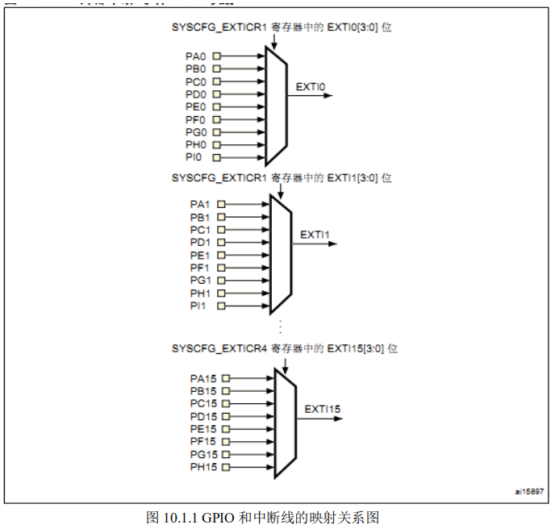

# 外部中断实验
## 1 STM32F4 外部中断简介
STM32F4 的 IO 口在第六章有详细介绍，而中断管理分组管理在前面也有详细的阐述。这
里我们将介绍 STM32F4 外部 IO 口的中断功能，通过中断的功能，达到第八章实验的效果，即：
通过板载的 4 个按键，控制板载的两个 LED 的亮灭以及蜂鸣器的发声。

这章的代码主要分布在固件库的 stm32f4xx_exti.h 和 stm32f4xx_exti.c 文件中。

这里我们首先讲解 STM32F4 IO 口中断的一些基础概念。STM32F4 的每个 IO 都可以作为
外部中断的中断输入口，这点也是 STM32F4 的强大之处。

STM32F407 的中断控制器支持 22个外部中断/事件请求。每个中断设有状态位，每个中断/事件都有独立的触发和屏蔽设置。
STM32F407 的 22 个外部中断为：

```
EXTI 线 0~15：对应外部 IO 口的输入中断。
EXTI 线 16：连接到 PVD 输出。
EXTI 线 17：连接到 RTC 闹钟事件。
EXTI 线 18：连接到 USB OTG FS 唤醒事件。
EXTI 线 19：连接到以太网唤醒事件。
EXTI 线 20：连接到 USB OTG HS(在 FS 中配置)唤醒事件。
EXTI 线 21：连接到 RTC 入侵和时间戳事件。
```
EXTI 线 22：连接到 RTC 唤醒事件。
从上面可以看出，STM32F4 供 IO 口使用的中断线只有 16 个，但是 STM32F4 的 IO 口却
远远不止 16 个，那么 STM32F4 是怎么把 16 个中断线和 IO 口一一对应起来的呢？

于是 STM32就这样设计，GPIO 的管脚 GPIOx.0~GPIOx.15(x=A,B,C,D,E，F,G,H,I)分别对应中断线 0~15。

这样每个中断线对应了最多 9 个 IO 口，以线 0 为例：它对应了 GPIOA.0、GPIOB.0、GPIOC.0、
GPIOD.0、GPIOE.0、GPIOF.0、GPIOG.0,GPIOH.0,GPIOI.0。而中断线每次只能连接到 1 个 IO
口上，这样就需要通过配置来决定对应的中断线配置到哪个 GPIO 上了。

下面我们看看 GPIO跟中断线的映射关系图：



接下来我们讲解使用库函数配置外部中断的步骤。 

### **1)** **使能** **IO** **口时钟，初始化** **IO** **口为输入**

首先，我们要使用 IO 口作为中断输入，所以我们要使能相应的 IO 口时钟，以及初始化相 

应的 IO 口为输入模式，具体的使用方法跟我们按键实验是一致的。这里就不做过多讲解。 

### **2)** **开启** **SYSCFG** **时钟，设置** **IO** **口与中断线的映射关系。**

接下来，我们要配置 GPIO 与中断线的映射关系，那么我们首先需要打开 SYSCFG 时钟。 

RCC_APB2PeriphClockCmd(RCC_APB2Periph_SYSCFG, ENABLE);//使能 SYSCFG 时钟 

这里大家一定要注意，只要我们使用到外部中断，就必须打开 SYSCFG 时钟。 


接下来，我们配置 GPIO 与中断线的映射关系。在库函数中，配置 GPIO 与中断线的映射 

关系的函数 SYSCFG_EXTILineConfig ()来实现的： 

`void SYSCFG_EXTILineConfig(uint8_t EXTI_PortSourceGPIOx, uint8_t EXTI_PinSourcex);` 

该函数将 GPIO 端口与中断线映射起来，使用范例是： 

`SYSCFG_EXTILineConfig(EXTI_PortSourceGPIOA, EXTI_PinSource0);` 

将中断线 0 与 GPIOA 映射起来，那么很显然是 GPIOA.0 与 EXTI1 中断线连接了。


设置好中断线映射之后，那么到底来自这个 IO 口的中断是通过什么方式触发的呢？接下来我们就要设置 

该中断线上中断的初始化参数了。 

### **3)** **初始化线上中断，设置触发条件等。** 

中断线上中断的初始化是通过函数 EXTI_Init()实现的。EXTI_Init()函数的定义是：

`void EXTI_Init(EXTI_InitTypeDef* EXTI_InitStruct);` 

下面我们用一个使用范例来说明这个函数的使用： 

```c
EXTI_InitTypeDef EXTI_InitStructure; 

 EXTI_InitStructure.EXTI_Line=EXTI_Line4; 

 EXTI_InitStructure.EXTI_Mode = EXTI_Mode_Interrupt; 

 EXTI_InitStructure.EXTI_Trigger = EXTI_Trigger_Falling; 

 EXTI_InitStructure.EXTI_LineCmd = ENABLE; 

 EXTI_Init(&EXTI_InitStructure); //初始化外设 EXTI 寄存器 
```

上面的例子设置中断线 4 上的中断为下降沿触发。STM32 的外设的初始化都是通过结构体来设 置初始值的，这里就不再讲解结构体初始化的过程了。我们来看看结构体 EXTI_InitTypeDef 的 成员变量： 

```c
typedef struct 

{ uint32_t EXTI_Line;  

 EXTIMode_TypeDef EXTI_Mode;  

 EXTITrigger_TypeDef EXTI_Trigger;  

 FunctionalState EXTI_LineCmd;  

}EXTI_InitTypeDef; 
```

从定义可以看出，有 4 个参数需要设置。第一个参数是中断线的标号，对于我们的外部中断， 取值范围为 EXTI_Line0~EXTI_Line15。这个在上面已经讲过中断线的概念。

也就是说，这个函数配置的是某个中断线上的中断参数。第二个参数是中断模式，可选值为中断 

EXTI_Mode_Interrupt 和事件 EXTI_Mode_Event。

第三个参数是触发方式，可以是下降沿触发 

EXTI_Trigger_Falling，上升沿触发 EXTI_Trigger_Rising，或者任意电平（上升沿和下降沿）触 发 EXTI_Trigger_Rising_Falling，相信学过 51 的对这个不难理解。最后一个参数就是使能中断 线了。 

还好学过51，对这个可太了解力！！哈哈

### **4)** **配置中断分组（****NVIC****），并使能中断。** 

我们设置好中断线和 GPIO 映射关系，然后又设置好了中断的触发模式等初始化参数。既 

然是外部中断，涉及到中断我们当然还要设置 NVIC 中断优先级。这个在前面已经讲解过，这 

里我们就接着上面的范例， 设置中断线 2 的中断优先级。 

```c
NVIC_InitTypeDef NVIC_InitStructure; 

NVIC_InitStructure.NVIC_IRQChannel = EXTI2_IRQn; //使能按键外部中断通道 

NVIC_InitStructure.NVIC_IRQChannelPreemptionPriority = 0x02; //抢占优先级 2， 

NVIC_InitStructure.NVIC_IRQChannelSubPriority = 0x02; 

//响应优先级 2 

NVIC_InitStructure.NVIC_IRQChannelCmd = ENABLE; 

//使能外部中断通道 

NVIC_Init(&NVIC_InitStructure); //中断优先级分组初始化 
```

上面这段代码相信大家都不陌生，我们在前面的串口实验的时候讲解过，这里不再讲解。 

### 5) 编写中断服务函数。** 

我们配置完中断优先级之后，接着要做的就是编写中断服务函数。中断服务函数的名字是 

在 MDK 中事先有定义的。这里需要说明一下，STM32F4 的 IO 口外部中断函数只有 7 个，分 

别为： 

```c
EXPORT EXTI0_IRQHandler  

EXPORT EXTI1_IRQHandler  

EXPORT EXTI2_IRQHandler  

EXPORT EXTI3_IRQHandler 

EXPORT EXTI4_IRQHandler  

EXPORT EXTI9_5_IRQHandler  

EXPORT EXTI15_10_IRQHandler  
```

中断线 0-4 每个中断线对应一个中断函数，中断线 5-9 共用中断函数 EXTI9_5_IRQHandler，中 

断线 10-15 共用中断函数 EXTI15_10_IRQHandler。在编写中断服务函数的时候会经常使用到两 

个函数，第一个函数是判断某个中断线上的中断是否发生（标志位是否置位）： 

`ITStatus EXTI_GetITStatus(uint32_t EXTI_Line)；` 

这个函数一般使用在中断服务函数的开头判断中断是否发生。另一个函数是清除某个中断线上 的中断标志位： 

`void EXTI_ClearITPendingBit(uint32_t EXTI_Line)；` 

这个函数一般应用在中断服务函数结束之前，清除中断标志位。 

常用的中断服务函数格式为： 

```c
void EXTI3_IRQHandler(void) 

{ 

if(EXTI_GetITStatus(EXTI_Line3)!=RESET)//判断某个线上的中断是否发生  

{ …中断逻辑… 

EXTI_ClearITPendingBit(EXTI_Line3); //清除 LINE 上的中断标志位  

} 

} 
```

在这里需要说明一下，固件库还提供了两个函数用来判断外部中断状态以及清除外部状态 

标志位的函数 EXTI_GetFlagStatus 和 EXTI_ClearFlag，他们的作用和前面两个函数的作用类似。 

只是在 EXTI_GetITStatus 函数中会先判断这种中断是否使能，使能了才去判断中断标志位，而 

EXTI_GetFlagStatus 直接用来判断状态标志位。 

讲到这里，相信大家对 STM32 的 IO 口外部中断已经有了一定的了解。下面我们再总结一下 

使用 IO 口外部中断的一般步骤： 

1. 使能 IO 口时钟，初始化 IO 口为输入。 
2. 使能 SYSCFG 时钟，设置 IO 口与中断线的映射关系。 
3. 初始化线上中断，设置触发条件等。 
4. 配置中断分组（NVIC），并使能中断。 
5. 编写中断服务函数。 

通过以上几个步骤的设置，我们就可以正常使用外部中断了。 

是不是觉得比51复杂很多呢，我也这么觉得，不过无所谓，我们要记住步骤就行，然后调用赌赢函数

本章，我们要实现同第八章差不多的功能，但是这里我们使用的是中断来检测按键，还是 

KEY_UP 控制蜂鸣器，按一次叫，再按一次停；KEY2 控制 DS0，按一次亮，再按一次灭；KEY1 

控制 DS1，效果同 KEY2；KEY0 则同时控制 DS0 和 DS1，按一次，他们的状态就翻转一次。 

## 2 **硬件设计** 

本实验用到的硬件资源和上一章实验的一模一样，不再多做介绍了。 

## 3 **软件设计** 

可以看到相比上一个工程，我们的 HARDWARE 目录下面增加了 exti.c 文件，同时固件库目录增加了 stm32f4xx_exti.c 文件。 

exit.c 文件总共包含 5 个函数。一个是外部中断初始化函数 void EXTIX_Init(void)，另外 4 个都是中断服务函数。

```
void EXTI0_IRQHandler(void)是外部中断 0 的服务函数，负责 WK_UP 按键的中断检测； 

void EXTI2_IRQHandler(void)是外部中断 2 的服务函数，负责 KEY2 按键的中断检测； 

void EXTI3_IRQHandler(void)是外部中断 3 的服务函数，负责 KEY1 按键的中断检测； 

void EXTI4_IRQHandler(void)是外部中断 4 的服务函数，负责 KEY0 按键的中断检测； 
```

```c

//外部中断0服务程序
void EXTI0_IRQHandler(void)
{
	delay_ms(10); //消抖
	if (WK_UP == 1)
	{
		BEEP = !BEEP; //蜂鸣器翻转
	}
	EXTI_ClearITPendingBit(EXTI_Line0); //清除LINE0上的中断标志位
}
//外部中断2服务程序
void EXTI2_IRQHandler(void)
{
	delay_ms(10); //消抖
	if (KEY2 == 0)
	{
		LED0 = !LED0;
	}
	EXTI_ClearITPendingBit(EXTI_Line2); //清除LINE2上的中断标志位
}
//外部中断3服务程序
void EXTI3_IRQHandler(void)
{
	delay_ms(10); //消抖
	if (KEY1 == 0)
	{
		LED1 = !LED1;
	}
	EXTI_ClearITPendingBit(EXTI_Line3); //清除LINE3上的中断标志位
}
//外部中断4服务程序
void EXTI4_IRQHandler(void)
{
	delay_ms(10); //消抖
	if (KEY0 == 0)
	{
		LED0 = !LED0;
		LED1 = !LED1;
	}
	EXTI_ClearITPendingBit(EXTI_Line4); //清除LINE4上的中断标志位
}
```

是不是感觉非常的熟悉呢？没错了没错了  在51中，中断名是无所谓的，但是在32，函数名就是特定的中断，所以一定要注意这一点，调用哪个中断就使能哪一个中断

例如这里都是一一对应的，记住,使用的是以下这个函数，能够把对应IO映射到中断检测的线上

`SYSCFG_EXTILineConfig`

```c

//外部中断初始化程序
//初始化PE2~4,PA0为中断输入.
void EXTIX_Init(void)
{
	NVIC_InitTypeDef NVIC_InitStructure;
	EXTI_InitTypeDef EXTI_InitStructure;

	KEY_Init(); //按键对应的IO口初始化

	RCC_APB2PeriphClockCmd(RCC_APB2Periph_SYSCFG, ENABLE); //使能SYSCFG时钟

	SYSCFG_EXTILineConfig(EXTI_PortSourceGPIOE, EXTI_PinSource2); //PE2 连接到中断线2
	SYSCFG_EXTILineConfig(EXTI_PortSourceGPIOE, EXTI_PinSource3); //PE3 连接到中断线3
	SYSCFG_EXTILineConfig(EXTI_PortSourceGPIOE, EXTI_PinSource4); //PE4 连接到中断线4
	SYSCFG_EXTILineConfig(EXTI_PortSourceGPIOA, EXTI_PinSource0); //PA0 连接到中断线0

	/* 配置EXTI_Line0 */
	EXTI_InitStructure.EXTI_Line = EXTI_Line0;			   //LINE0
	EXTI_InitStructure.EXTI_Mode = EXTI_Mode_Interrupt;	   //中断事件
	EXTI_InitStructure.EXTI_Trigger = EXTI_Trigger_Rising; //上升沿触发
	EXTI_InitStructure.EXTI_LineCmd = ENABLE;			   //使能LINE0
	EXTI_Init(&EXTI_InitStructure);						   //配置

	/* 配置EXTI_Line2,3,4 */
	EXTI_InitStructure.EXTI_Line = EXTI_Line2 | EXTI_Line3 | EXTI_Line4;
	EXTI_InitStructure.EXTI_Mode = EXTI_Mode_Interrupt;		//中断事件
	EXTI_InitStructure.EXTI_Trigger = EXTI_Trigger_Falling; //下降沿触发
	EXTI_InitStructure.EXTI_LineCmd = ENABLE;				//中断线使能
	EXTI_Init(&EXTI_InitStructure);							//配置

	NVIC_InitStructure.NVIC_IRQChannel = EXTI0_IRQn;			 //外部中断0
	NVIC_InitStructure.NVIC_IRQChannelPreemptionPriority = 0x00; //抢占优先级0
	NVIC_InitStructure.NVIC_IRQChannelSubPriority = 0x02;		 //子优先级2
	NVIC_InitStructure.NVIC_IRQChannelCmd = ENABLE;				 //使能外部中断通道
	NVIC_Init(&NVIC_InitStructure);								 //配置

	NVIC_InitStructure.NVIC_IRQChannel = EXTI2_IRQn;			 //外部中断2
	NVIC_InitStructure.NVIC_IRQChannelPreemptionPriority = 0x03; //抢占优先级3
	NVIC_InitStructure.NVIC_IRQChannelSubPriority = 0x02;		 //子优先级2
	NVIC_InitStructure.NVIC_IRQChannelCmd = ENABLE;				 //使能外部中断通道
	NVIC_Init(&NVIC_InitStructure);								 //配置

	NVIC_InitStructure.NVIC_IRQChannel = EXTI3_IRQn;			 //外部中断3
	NVIC_InitStructure.NVIC_IRQChannelPreemptionPriority = 0x02; //抢占优先级2
	NVIC_InitStructure.NVIC_IRQChannelSubPriority = 0x02;		 //子优先级2
	NVIC_InitStructure.NVIC_IRQChannelCmd = ENABLE;				 //使能外部中断通道
	NVIC_Init(&NVIC_InitStructure);								 //配置

	NVIC_InitStructure.NVIC_IRQChannel = EXTI4_IRQn;			 //外部中断4
	NVIC_InitStructure.NVIC_IRQChannelPreemptionPriority = 0x01; //抢占优先级1
	NVIC_InitStructure.NVIC_IRQChannelSubPriority = 0x02;		 //子优先级2
	NVIC_InitStructure.NVIC_IRQChannelCmd = ENABLE;				 //使能外部中断通道
	NVIC_Init(&NVIC_InitStructure);								 //配置
}

```

exti.c 文件总共包含 5 个函数。一个是外部中断初始化函数 void EXTIX_Init(void)，另外 4 个都是中断服务函数。

`void EXTI0_IRQHandler(void)`

是外部中断 0 的服务函数，负责 KEY_UP 按键的中断检测；

`void EXTI2_IRQHandler(void)`

是外部中断 2 的服务函数，负责 KEY2 按键的 中断检测；

 `void EXTI3_IRQHandler(void)`

是外部中断 3 的服务函数，负责 KEY1 按键的中断检 测； 

`void EXTI4_IRQHandler(void)`

是外部中断 4 的服务函数，负责 KEY0 按键的中断检测；

下 面我们分别介绍这几个函数。 

首先是外部中断初始化函数

 `void EXTIX_Init(void)`

该函数严格按照我们之前的步骤来初 始化外部中断，首先调用 KEY_Init，利用第八章按键初始化函数，来初始化外部中断输入的 IO口，接着调用 RCC_APB2PeriphClockCmd 函数来使能 SYSCFG 时钟。

接着调用函数 SYSCFG_EXTILineConfig 配置中断线和 GPIO 的映射关系，然后初始化中断线和配置中断优先 级。

需要说明的是因为我们的 KEY_UP 按键是高电平有效的，而 KEY0、KEY1 和 KEY2 是低 电平有效的，所以我们设置 KEY_UP 为上升沿触发中断，而 KEY0、KEY1 和 KEY2 则设置为 下降沿触发。

这里我们，把按键的抢占优先级设置成一样，而响应优先级不同，这四个按键， KEY0 的优先级最高。 

接下来我们介绍各个按键的中断服务函数，一共 4 个。

先看 KEY_UP 的中断服务函数 

`void  EXTI0_IRQHandler(void)`

该函数代码比较简单，先延时 10ms 以消抖，再检测 KEY_UP 是否 还是为高电平，如果是，则执行此次操作（翻转蜂鸣器控制信号），如果不是，则直接跳过，在 

最后有一句 

`EXTI_ClearITPendingBit(EXTI_Line0);`

通过该句清除已经发生的中断请求。同样， 我们可以发现 KEY0、KEY1 和 KEY2 的中断服务函数和 KEY_UP 按键的十分相似，我们就不 逐个介绍了。 

这里向大家重申一下，STM32F4的外部中断 0~4 都有单独的中断服务函数，但是从 5 开始， 他们就没有单独的服务函数了，而是多个中断共用一个服务函数，比如外部中断 5~9 的中断服 务函数为：

`void EXTI9_5_IRQHandler(void)`

类似的，void EXTI15_10_IRQHandler(void)就是 外部中断 10~15 的中断服务函数。

另外，STM32F4 所有中断服务函数的名字，都已经在 startup_stm32f40_41xx.s 里面定义好了，如果有不知道的，去这个文件里面找就可以了。 

exti.h 头文件里面主要是一个函数申明，比较简单，这里不做过多讲解。 

接下来我们看看主函数，main 函数代码如下：

```c
#include "sys.h"
#include "delay.h"
#include "usart.h"
#include "led.h"
#include "beep.h"
#include "key.h"
#include "exti.h"

//ALIENTEK 探索者STM32F407开发板 实验5
//外部中断实验-库函数版本
//技术支持：www.openedv.com
//淘宝店铺：http://eboard.taobao.com
//广州市星翼电子科技有限公司    
//作者：正点原子 @ALIENTEK 

int main(void)
{ 
	NVIC_PriorityGroupConfig(NVIC_PriorityGroup_2);//设置系统中断优先级分组2
	delay_init(168);    //初始化延时函数
	uart_init(115200); 	//串口初始化 
	LED_Init();				  //初始化LED端口  
	BEEP_Init();        //初始化蜂鸣器端口
	EXTIX_Init();       //初始化外部中断输入 
	LED0=0;					    //先点亮红灯
	while(1)
	{
  	printf("OK\r\n");	//打印OK提示程序运行
		delay_ms(1000);	  //每隔1s打印一次
	}
}
```

该部分代码很简单，先设置系统优先级分组，延时函数以及串口等外设。然后在初始化完 中断后，点亮 LED0，就进入死循环等待了，这里死循环里面通过一个 printf 函数来告诉我们系 统正在运行，在中断发生后，就执行相应的处理，从而实现第八章类似的功能。