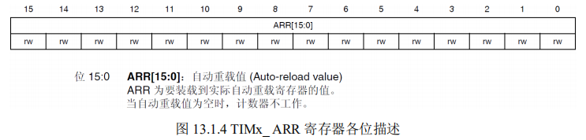

# 定时器中断实验

## **1 STM32F4** **通用定时器简介**

STM32F4 的通用定时器包含一个 16 位或 32 位自动重载计数器（CNT），该计数器由可编 程预分频器（PSC）驱动。

STM32F4 的通用定时器可以被用于：测量输入信号的脉冲长度(输入捕获)或者产生输出波形(**输出比较和 PWM**)等。 使用定时器预分频器和 RCC 时钟控制器预分频器，脉冲长度和波形周期可以在几个微秒到几个毫秒间调整。

STM32F4 的每个通用定时器都 是完全独立的，没有互相共享的任何资源。 

### STM3 的通用 TIMx (TIM2~TIM5 和 TIM9~TIM14)定时器功能包括：

1. 16 位/32 位(仅 TIM2 和 TIM5)向上、向下、向上/向下自动装载计数器（TIMx_CNT）
    1. 注意：TIM9~TIM14 只支持向上（递增）计数方式。 
2. 16 位可编程(可以实时修改)预分频器(TIMx_PSC)，计数器时钟频率的分频系数为 1～ 65535 之间的任意数值。 
3. 4 个独立通道（TIMx_CH1~4，TIM9~TIM14 最多 2 个通道），这些通道可以用来作为：
    1. 输入捕获 
    2. 输出比较 
    3. PWM 生成(边缘或中间对齐模式) ，注意：TIM9~TIM14 不支持中间对齐模式 
    4. 脉冲模式输出 

4. 可使用外部信号（TIMx_ETR）控制定时器和定时器互连（可以用 1 个定时器控制另外 一个定时器）的同步电路。 
5. 如下事件发生时产生中断/DMA（TIM9~TIM14 不支持 DMA）： 
    1. 更新：计数器向上溢出/向下溢出，计数器初始化(通过软件或者内部/外部触发)  
    2. 触发事件(计数器启动、停止、初始化或者由内部/外部触发计数)  
    3. 输入捕获 
    4. 输出比较
    5. 支持针对定位的增量(正交)编码器和霍尔传感器电路（TIM9~TIM14 不支持） 
    6. 触发输入作为外部时钟或者按周期的电流管理（TIM9~TIM14 不支持） 

由于 STM32F4 通用定时器比较复杂，这里我们不再多介绍，请大家直接参考《STM32F4xx 中文参考手册》第 392 页，通用定时器一章。

下面我们介绍一下与我们这章的实验密切相关的 几个通用定时器的寄存器（以下均以 TIM2~TIM5 的寄存器介绍，TIM9~TIM14 的略有区别， 具体请看《STM32F4xx 中文参考手册》对应章节）。 

首先是控制寄存器 1（TIMx_CR1），该寄存器的各位描述如图 13.1.1 所示：


在本实验中，我们只用到了 TIMx_CR1 的最低位，**也就是计数器使能位，该位必须置 1， 才能让定时器开始计数**。

接下来介绍第二个与我们这章密切相关的寄存器：DMA/中断使能寄 存器（TIMx_DIER）。

该寄存器是一个 16 位的寄存器，其各位描述如图 13.1.2 所示： 


这里我们同样仅关心它的第 0 位，该位是更新中断允许位，本章用到的是定时器的更新中断，所以该位要设置为 1，来允许由于更新事件所产生的中断。 

接下来我们看第三个与我们这章有关的寄存器：预分频寄存器（TIMx_PSC）。

该寄存器用 设置对时钟进行分频，然后提供给计数器，作为计数器的时钟。该寄存器的各位描述如图 13.1.3 

所示： 


**这里，定时器的时钟来源有 4 个：** 

1. 内部时钟
    1. （CK_INT） 
2. 外部时钟模式 1：
    1. 外部输入脚（TIx） 
3. 外部时钟模式 2：
    1. 外部触发输入（ETR），仅适用于 TIM2、TIM3、TIM4 
4. 内部触发输入（ITRx）
    1. 使用 A 定时器作为 B 定时器的预分频器（A 为 B 提供时钟）。 

这些时钟，具体选择哪个可以通过 TIMx_SMCR 寄存器的相关位来设置。

这里的 CK_INT 时钟是从 APB1 倍频的来的，除非 APB1 的时钟分频数设置为 1（一般都不会是 1），否则通用 

定时器 TIMx 的时钟是 APB1 时钟的 2 倍，当 APB1 的时钟不分频的时候，通用定时器 TIMx 的时钟就等于 APB1 的时钟。

这里还要注意的就是高级定时器以及 TIM9~TIM11 的时钟不是来 自 APB1，而是来自 APB2 的。 

这里顺带介绍一下 TIMx_CNT 寄存器，该寄存器是定时器的计数器，该寄存器存储了当前 

定时器的计数值。 

接着我们介绍自动重装载寄存器（TIMx_ARR），该寄存器在物理上实际对应着 2 个寄存器。 

一个是程序员可以直接操作的，另外一个是程序员看不到的，这个看不到的寄存器在《STM32F4xx 中文参考手册》里面被叫做影子寄存器。

事实上真正起作用的是影子寄存器。根 据 TIMx_CR1 寄存器中 APRE 位的设置：APRE=0 时，预装载寄存器的内容可以随时传送到影 子寄存器，此时 2 者是连通的；

而 APRE=1 时，在每一次更新事件（UEV）时，才把预装载寄 存器（ARR）的内容传送到影子寄存器。 

自动重装载寄存器的各位描述如图 13.1.4 所示



最后，我们要介绍的寄存器是：状态寄存器（TIMx_SR）。该寄存器用来标记当前与定时 器相关的各种事件/中断是否发生。该寄存器的各位描述如图 13.1.5 所示


关于这些位的详细描述，请参考《STM32F4xx 中文参考手册》第 429 页。 

只要对以上几个寄存器进行简单的设置，我们就可以使用通用定时器了，并且可以产生中 断。 

这一章，我们将使用定时器产生中断，然后在中断服务函数里面翻转 DS1 上的电平，来指 示定时器中断的产生。接下来我们以通用定时器 TIM3 为实例，来说明要经过哪些步骤，才能 达到这个要求，并产生中断。

这里我们就对每个步骤通过库函数的实现方式来描述。首先要提到的是，定时器相关的库函数主要集中在固件库文件 stm32f4xx_tim.h 和 stm32f4xx_tim.c 文件中。

### 定时器配置步骤如下：

#### 1）TIM3时钟使能。

TIM3 是挂载在 APB1 之下，所以我们通过 APB1 总线下的时钟使能函数来使能 TIM3。调 

用的函数是： 

RCC_APB1PeriphClockCmd(RCC_APB1Periph_TIM3,ENABLE); ///使能 TIM3 时钟 

#### **2****）初始化定时器参数****,****设置自动重装值，分频系数，计数方式等。**

在库函数中，定时器的初始化参数是通过初始化函数 TIM_TimeBaseInit 实现的： 

`voidTIM_TimeBaseInit(TIM_TypeDef*TIMx, TIM_TimeBaseInitTypeDef* TIM_TimeBaseInitStruct);` 

第一个参数是确定是哪个定时器，这个比较容易理解。第二个参数是定时器初始化参数结 构体指针，结构体类型为 TIM_TimeBaseInitTypeDef，下面我们看看这个结构体的定义： 

```c
typedef struct

{ 

 uint16_t TIM_Prescaler;  

 uint16_t TIM_CounterMode;  

 uint16_t TIM_Period;  

 uint16_t TIM_ClockDivision;  

 uint8_t TIM_RepetitionCounter;  

} TIM_TimeBaseInitTypeDef;  
```

这个结构体一共有 5 个成员变量，要说明的是，对于通用定时器只有前面四个参数有用， 

最后一个参数 TIM_RepetitionCounter 是高级定时器才有用的，这里不多解释。 

第一个参数 TIM_Prescaler 是用来设置分频系数的，刚才上面有讲解。 

第二个参数 TIM_CounterMode 是用来设置计数方式，上面讲解过，可以设置为

- 向上计数
- 向下计数方式
- 中央对齐计数方式

比较常用的是向上计数模式 TIM_CounterMode_Up 向下计数模式 TIM_CounterMode_Down。 

第三个参数是设置自动重载计数周期值，这在前面也已经讲解过。 

第四个参数是用来设置时钟分频因子。 

针对 TIM3 初始化范例代码格式： 

```c
TIM_TimeBaseInitTypeDef TIM_TimeBaseStructure; 

TIM_TimeBaseStructure.TIM_Period = 5000; 

TIM_TimeBaseStructure.TIM_Prescaler =7199;  

TIM_TimeBaseStructure.TIM_ClockDivision = TIM_CKD_DIV1;  

TIM_TimeBaseStructure.TIM_CounterMode = TIM_CounterMode_Up; 

TIM_TimeBaseInit(TIM3, &TIM_TimeBaseStructure);  
```

#### **3****）设置** **TIM3_DIER** **允许更新中断。**

因为我们要使用 TIM3 的更新中断，寄存器的相应位便可使能更新中断。在库函数里面定 时器中断使能是通过 TIM_ITConfig 函数来实现的： 

`void TIM_ITConfig(TIM_TypeDef* TIMx, uint16_t TIM_IT, FunctionalState NewState)； `

第一个参数是选择定时器号，这个容易理解，取值为 TIM1~TIM17。 

第二个参数非常关键，是用来指明我们使能的定时器中断的类型，定时器中断的类型有很 多种，包括更新中断 TIM_IT_Update，触发中断 TIM_IT_Trigger，以及输入捕获中断等等。 

第三个参数就很简单了，就是失能还是使能。 

例如我们要使能 TIM3 的更新中断，格式为： 

`TIM_ITConfig(TIM3,TIM_IT_Update,ENABLE );  `

#### **4****）****TIM3** **中断优先级设置。**

在定时器中断使能之后，因为要产生中断，必不可少的要设置 NVIC 相关寄存器，设置中断优先级。之前多次讲解到用 NVIC_Init 函数实现中断优先级的设置，这里就不重复讲解。 

#### **5****）允许** **TIM3** **工作，也就是使能** **TIM3****。**

光配置好定时器还不行，没有开启定时器，照样不能用。我们在配置完后要开启定时器， 

通过 TIM3_CR1 的 CEN 位来设置。在固件库里面使能定时器的函数是通过 TIM_Cmd 函数来实 现的： 

`void TIM_Cmd(TIM_TypeDef* TIMx, FunctionalState NewState) `

这个函数非常简单，比如我们要使能定时器 3，方法为： 

`TIM_Cmd(TIM3, ENABLE); //使能 TIMx 外设 `

#### **6****）编写中断服务函数**

在最后，还是要编写定时器中断服务函数，通过该函数来处理定时器产生的相关中断。在 中断产生后，通过状态寄存器的值来判断此次产生的中断属于什么类型,然后执行相关的操作

我们这里使用的是更新（溢出）中断，所以在状态寄存器 SR 的最低位。在处理完中断之后应 该向 TIM3_SR 的最低位写 0，来清除该中断标志。 

在固件库函数里面，用来读取中断状态寄存器的值判断中断类型的函数是： 

`ITStatus TIM_GetITStatus(TIM_TypeDef* TIMx, uint16_t) `

该函数的作用是，判断定时器 TIMx 的中断类型 TIM_IT 是否发生中断。比如，我们要判断定 时器 3 是否发生更新（溢出）中断，方法为： 

`if (TIM_GetITStatus(TIM3, TIM_IT_Update) != RESET){} `

固件库中清除中断标志位的函数是： 

`void TIM_ClearITPendingBit(TIM_TypeDef* TIMx, uint16_t TIM_IT) `

该函数的作用是，清除定时器 TIMx 的中断 TIM_IT 标志位。使用起来非常简单，比如我们在 

TIM3 的溢出中断发生后，我们要清除中断标志位，方法是： 

`TIM_ClearITPendingBit(TIM3, TIM_IT_Update ); `

这里需要说明一下，固件库还提供了两个函数用来判断定时器状态以及清除定时器状态标 志位的函数 TIM_GetFlagStatus 和 TIM_ClearFlag，他们的作用和前面两个函数的作用类似。

只是在 TIM_GetITStatus 函数中会先判断这种中断是否使能，使能了才去判断中断标志位，而 TIM_GetFlagStatus 直接用来判断状态标志位。 

通过以上几个步骤，我们就可以达到我们的目的了，使用通用定时器的更新中断，来控制 DS1 的亮灭

## **2** **硬件设计**

### 本实验用到的硬件资源有： 

#### 1） 指示灯 DS0 和 DS1 

#### 2） 定时器 TIM3 

本章将通过 TIM3 的中断来控制 DS1 的亮灭，DS1 是直接连接到 PF10 上的，这个前面已 经有介绍了。而 TIM3 属于 STM32F4 的内部资源，只需要软件设置即可正常工作。 

## **3** **软件设计** 

打开我们光盘实验 8 定时器中断实验可以看到，我们的工程中的 HARDWARE 下面比以前 多了一个 time.c 文件（包括头文件 time.h），这两个文件是我们自己编写。同时还引入了定时器相关的固件库函数文件 stm32f4xx_tim.c 和头文件 stm32f4xx_tim.h。

下面我们来看看我们的 time.c 文件。timer.c 文件代码如下：

```c

//通用定时器3中断初始化
//arr：自动重装值。
//psc：时钟预分频数
//定时器溢出时间计算方法:Tout=((arr+1)*(psc+1))/Ft us.
//Ft=定时器工作频率,单位:Mhz
//这里使用的是定时器3!
void TIM3_Int_Init(u16 arr,u16 psc)
{
	TIM_TimeBaseInitTypeDef TIM_TimeBaseInitStructure;
	NVIC_InitTypeDef NVIC_InitStructure;
	
	RCC_APB1PeriphClockCmd(RCC_APB1Periph_TIM3,ENABLE);  ///使能TIM3时钟
	
  TIM_TimeBaseInitStructure.TIM_Period = arr; 	//自动重装载值
	TIM_TimeBaseInitStructure.TIM_Prescaler=psc;  //定时器分频
	TIM_TimeBaseInitStructure.TIM_CounterMode=TIM_CounterMode_Up; //向上计数模式
	TIM_TimeBaseInitStructure.TIM_ClockDivision=TIM_CKD_DIV1; 
	
	TIM_TimeBaseInit(TIM3,&TIM_TimeBaseInitStructure);//初始化TIM3
	
	TIM_ITConfig(TIM3,TIM_IT_Update,ENABLE); //允许定时器3更新中断
	TIM_Cmd(TIM3,ENABLE); //使能定时器3
	
	NVIC_InitStructure.NVIC_IRQChannel=TIM3_IRQn; //定时器3中断
	NVIC_InitStructure.NVIC_IRQChannelPreemptionPriority=0x01; //抢占优先级1
	NVIC_InitStructure.NVIC_IRQChannelSubPriority=0x03; //子优先级3
	NVIC_InitStructure.NVIC_IRQChannelCmd=ENABLE;
	NVIC_Init(&NVIC_InitStructure);
	
}

//定时器3中断服务函数
void TIM3_IRQHandler(void)
{
	if(TIM_GetITStatus(TIM3,TIM_IT_Update)==SET) //溢出中断
	{
		LED1=!LED1;//DS1翻转
	}
	TIM_ClearITPendingBit(TIM3,TIM_IT_Update);  //清除中断标志位
```

该文件下包含一个中断服务函数和一个定时器 3 中断初始化函数，中断服务函数比较简单， 在每次中断后，判断 TIM3 的中断类型，如果中断类型正确，则执行 LED1（DS1）的翻转。 

TIM3_Int_Init 函数就是执行我们上面介绍的那 5 个步骤，使得 TIM3 开始工作，并开启中 断。这里我们分别用标号①~⑤来标注定时器初始化的五个步骤。该函数的 2 个参数用来设置 TIM3 的溢出时间。

因为系统初始化 SystemInit 函数里面已经初始化 APB1 的时钟为 4 分频，所 以 APB1 的时钟为 42M，而从 STM32F4 的内部时钟树图（图 4.3.1.1）得知：


当 APB1 的时钟 分频数为 1 的时候，TIM2~7 以及 TIM12~14 的时钟为 APB1 的时钟，而如果 APB1 的时钟分频 数不为 1，那么 TIM2~7 以及 TIM12~14 的时钟频率将为 APB1 时钟的两倍。

因此，TIM3 的时钟为 84M，再根据我们设计的 arr 和 psc 的值，就可以计算中断时间了。

计算公式如下： 

`Tout= ((arr+1)*(psc+1))/Tclk； `

其中： 

- Tclk：TIM3 的输入时钟频率（单位为 Mhz）。 
- Tout：TIM3 溢出时间（单位为 us）。 

timer.h 头文件内容比较简单，这里我们就不做讲解。

最后，我们看看主函数代码如下： ： 

```c
#include "sys.h"
#include "delay.h"
#include "usart.h"
#include "led.h"
#include "timer.h"
int main(void)
{ 
	NVIC_PriorityGroupConfig(NVIC_PriorityGroup_2);//设置系统中断优先级分组2
	delay_init(168);  //初始化延时函数
	LED_Init();				//初始化LED端口

 	TIM3_Int_Init(5000-1,8400-1);	//定时器时钟84M，分频系数8400，所以84M/8400=10Khz的计数频率，计数5000次为500ms     
	while(1)
	{
		LED0=!LED0;//DS0翻转
		delay_ms(200);//延时200ms
	};
}

```

这里的代码和之前大同小异，此段代码对 TIM3 进行初始化之后，进入死循环等待 TIM3 溢出中断，当 TIM3_CNT 的值等于 TIM3_ARR 的值的时候，就会产生 TIM3 的更新中断，然 后在中断里面取反 LED1，TIM3_CNT 再从 0 开始计数。 

### 定时器定时时长计算

这里定时器定时时长 500ms 是这样计算出来的，定时器的时钟为 84Mhz，分频系数为 8400, 

所以分频后的计数频率为 84Mhz/8400=10KHz,然后计数到 5000，所以时长为 5000/10000=0.5s， 

也就是 500ms

也是简单易懂呢！

## **4** **下载验证** 

在完成软件设计之后，我们将编译好的文件下载到探索者 STM32F4 开发板上，观看其运 行结果是否与我们编写的一致。如果没有错误，我们将看 DS0 不停闪烁（每 400ms 闪烁一次）， 

而 DS1 也是不停的闪烁，但是闪烁时间较 DS0 慢（1s 一次）