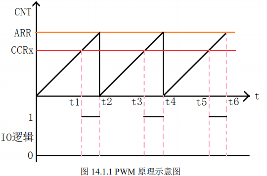
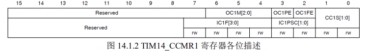
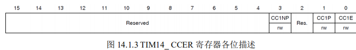
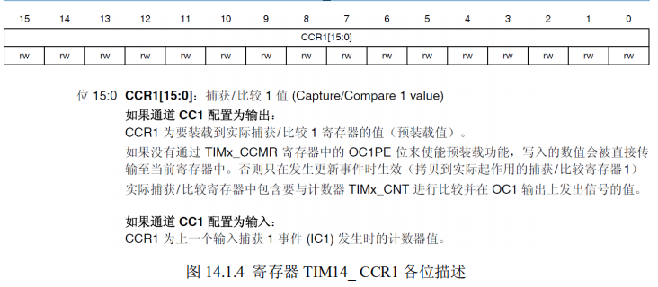
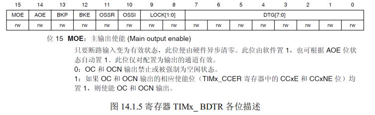
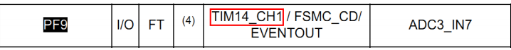

# **PWM** **输出实验** 

上一章，我们介绍了STM32F4的通用定时器TIM3，用该定时器的中断来控制DS1的闪烁， 

这一章，我们将向大家介绍如何使用 STM32F4 的 TIM3 来产生 PWM 输出。

## 1 PWM** **简介** 

脉冲宽度调制(PWM)，是英文“Pulse Width Modulation”的缩写，简称脉宽调制，是利用 微处理器的数字输出来对模拟电路进行控制的一种非常有效的技术。

简单一点，就是对脉冲宽 q度的控制，PWM 原理如图 14.1.1 所示：



图 14.1.1 就是一个简单的 PWM 原理示意图。

图中，我们假定定时器工作在向上计数 PWM 模式，且当 CNT<CCRx 时，输出 0，当 CNT>=CCRx 时输出 1。

那么就可以得到如上的 PWM 示意图：当 CNT 值小于 CCRx 的时候，IO 输出低电平(0)，当 CNT 值大于等于 CCRx 的时候， IO 输出高电平(1)，当 CNT 达到 ARR 值的时候，重新归零，然后重新向上计数，依次循环。 

**改变 CCRx 的值，就可以改变 PWM 输出的占空比，改变 ARR 的值，就可以改变 PWM 输出的 频率，这就是 PWM 输出的原理。** 

STM32F4 的定时器除了 TIM6 和 7。其他的定时器都可以用来产生 PWM 输出。

其中高级 定时器 TIM1 和 TIM8 可以同时产生多达 7 路的 PWM 输出。

而通用定时器也能同时产生多达 4 路的 PWM 输出！这里我们仅使用 TIM14 的 CH1 产生一路 PWM 输出。  

要使 STM32F4 的通用定时器 TIMx 产生 PWM 输出，除了上一章介绍的寄存器外，我们还会用到 3 个寄存器，来控制 PWM 的。

这三个寄存器分别是：

- 捕获/比较模式寄存器 （TIMx_CCMR1/2）
- 捕获/比较使能寄存器（TIMx_CCER）
- 捕获/比较寄存器（TIMx_CCR1~4）。 

接下来我们简单介绍一下这三个寄存器。 

首先是捕获/比较模式寄存器（TIMx_CCMR1/2），该寄存器一般有 2 个：

- TIMx _CCMR1
- TIMx _CCMR2

不过 TIM14 只有一个。

TIMx_CCMR1 控制 CH1 和 2

而 TIMx_CCMR2 控制 CH3 和 4。

以下我们将以 TIM14 为例进行介绍。TIM14_CCMR1 寄存器各位描述如图 14.1.2 

所示： 



该寄存器的有些位在不同模式下，功能不一样，所以在图 14.1.2 中，我们把寄存器分了 2 层，上面一层对应输出而下面的则对应输入。

关于该寄存器的详细说明，请参考《STM32F4xx 中文参考手册》第 476 页，16.6.4 节。

这里我们需要说明的是模式设置位 OC1M，此部分由 3 位组成。总共可以配置成 7 种模式，我们使用的是 PWM 模式，所以这 3 位必须设置为 110/111。

 这两种 PWM 模式的区别就是输出电平的极性相反。另外 CC1S 用于设置通道的方向（输入/输 出）默认设置为 0，就是设置通道作为输出使用。

注意：这里是因为我们的 TIM14 只有 1 个通道，所以才只有第八位有效，高八位无效，其他有多个通道的定时器，高八位也是有效的，具 体请参考《STM32F4xx 中文参考手册》对应定时器的寄存器描述。 

接下来，我们介绍 TIM14 的捕获/比较使能寄存器（TIM14_CCER），该寄存器控制着各个 输入输出通道的开关。

该寄存器的各位描述如图 14.1.3 所示： 



该寄存器比较简单，我们这里只用到了 CC1E 位，该位是输入/捕获 1 输出使能位，要想 PWM 从 IO 口输出，这个位必须设置为 1，所以我们需要设置该位为 1。

该寄存器更详细的介绍了，请参考《STM32F4xx 中文参考手册》第 478 页，16.6.5 这一节。

同样，因为 TIM14 只有 1 个通道，所以才只有低四位有效，如果是其他定时器，该寄存器的其他位也可能有效。 

最后，我们介绍一下捕获/比较寄存器（TIMx_CCR1~4），该寄存器总共有 4 个，对应 4 个 

通道 CH1~4。不过 TIM14 只有一个，即：TIM14_CCR1，该寄存器的各位描述如图 14.1.4 所示：



在输出模式下，该寄存器的值与 CNT 的值比较，根据比较结果产生相应动作。

利用这点， 我们通过修改这个寄存器的值，就可以控制 PWM 的输出脉宽了。 

如果是通用定时器，则配置以上三个寄存器就够了，但是如果是高级定时器，则还需要配 

置：刹车和死区寄存器（TIMx_BDTR），该寄存器各位描述如图 14.1.5 所示：



该寄存器，我们只需要关注最高位：MOE 位，要想高级定时器的 PWM 正常输出，则必须 设置 MOE 位为 1，否则不会有输出。

注意：通用定时器不需要配置这个。其他位我们这里就不 详细介绍了，请参考《STM32F4xx 中文参考手册》第 386 页，14.4.18 这一节。 

本章，我们使用的是 TIM14 的通道 1，所以我们需要修改 TIM14_CCR1 以实现脉宽控制 DS0 的亮度。

至此，我们把本章要用的几个相关寄存器都介绍完了，本章要实现通过 TIM14_CH1 输出 PWM 来控制 DS0 的亮度。

### 下面我们介绍通过库函数来配置该功能的步骤。 

首先要提到的是，PWM 实际跟上一章节一样使用的是定时器的功能，所以相关的函数设 置同样在库函数文件 stm32f4xx_tim.h 和 stm32f4xx_tim.c 文件中。 

#### **1****）开启** **TIM14** **和** **GPIO** **时钟，配置** **PF9** **选择复用功能** **AF9****（****TIM14****）输出。** 

要使用 TIM14，我们必须先开启 TIM14 的时钟，这点相信大家看了这么多代码，应该明白 了。

这里我们还要配置 PF9 为复用（AF9）输出，才可以实现 TIM14_CH1 的 PWM 经过 PF9 输出。 

库函数使能 TIM14 时钟的方法是： 

`RCC_APB1PeriphClockCmd(RCC_APB1Periph_TIM14,ENABLE); //TIM14 时钟使能 `

这在前面章节已经提到过。当然，这里我们还要使能 GPIOF 的时钟。然

后我们要配置 PF9 引脚 映射至 AF9，复用为定时器 14，调用的函数为： 

`GPIO_PinAFConfig(GPIOF,GPIO_PinSource9,GPIO_AF_TIM14); //GPIOF9 复用为定时器 14 `

这个方法跟我们串口实验讲解一样，调用的同一个函数，至于函数的使用，之前的串口 [ch4-serialPort](..\ch4-serialPort)  有详细的讲解。

最后设置 PF9 为复用功能输出这里我们只列出 GPIO 初始化为复用功能的一行 

`GPIO_InitStructure.GPIO_Mode = GPIO_Mode_AF; //复用功能 `

这里还需要说明一下，对于定时器通道的引脚关系，大家可以查看 STM32F4 对应的数据 手册，比如我们 PWM 实验，我们使用的是定时器 14 的通道 1，对应的引脚 PF9 可以从数据手 册表中查看： 



#### **2****）初始化** **TIM14,****设置** **TIM14** **的** **ARR** **和** **PSC** **等参数。** 

在开启了 TIM14 的时钟之后，我们要设置 ARR 和 PSC 两个寄存器的值来控制输出 PWM 的周期。

当 PWM 周期太慢（低于 50Hz）的时候，我们就会明显感觉到闪烁了。

因此，PWM 周期在这里不宜设置的太小。这在库函数是通过 TIM_TimeBaseInit 函数实现的，在上一节定时 

器中断章节我们已经有讲解，这里就不详细讲解，调用的格式为： 

```c
TIM_TimeBaseStructure.TIM_Period = arr; //设置自动重装载值 

TIM_TimeBaseStructure.TIM_Prescaler =psc; //设置预分频值 

TIM_TimeBaseStructure.TIM_ClockDivision = 0; //设置时钟分割:TDTS = Tck_tim
```

TIM_TimeBaseStructure.TIM_CounterMode = TIM_CounterMode_Up; //向上计数模式 

TIM_TimeBaseInit(TIM3, &TIM_TimeBaseStructure); //根据指定的参数初始化 TIMx 的 

#### **3****）设置** **TIM14_CH1** **的** **PWM** **模式，使能** **TIM14** **的** **CH1** **输出。** 

接下来，我们要设置 TIM14_CH1 为 PWM 模式（默认是冻结的），因为我们的 DS0 是低电 

平亮，而我们希望当 CCR1 的值小的时候，DS0 就暗，CCR1 值大的时候，DS0 就亮，所以我 

们要通过配置 TIM14_CCMR1 的相关位来控制 TIM14_CH1 的模式。在库函数中，PWM 通道 

设置是通过函数 TIM_OC1Init()~TIM_OC4Init()来设置的，不同的通道的设置函数不一样，这里 

我们使用的是通道 1，所以使用的函数是 TIM_OC1Init()。 

void TIM_OC1Init(TIM_TypeDef* TIMx, TIM_OCInitTypeDef* TIM_OCInitStruct)； 

这种初始化格式大家学到这里应该也熟悉了，所以我们直接来看看结构体 TIM_OCInitTypeDef 的定义： 

```c
typedef struct 
{ 
 uint16_t TIM_OCMode;  
 uint16_t TIM_OutputState;  
 uint16_t TIM_OutputNState; */ 
 uint16_t TIM_Pulse;  
 uint16_t TIM_OCPolarity;  
 uint16_t TIM_OCNPolarity;  
 uint16_t TIM_OCIdleState;  
 uint16_t TIM_OCNIdleState;  
} TIM_OCInitTypeDef; 
```

这里我们讲解一下与我们要求相关的几个成员变量： 

- 参数 TIM_OCMode 设置模式是 PWM 还是输出比较，这里我们是 PWM 模式。 
- 参数 TIM_OutputState 用来设置比较输出使能，也就是使能 PWM 输出到端口。 
- 参数 TIM_OCPolarity 用来设置极性是高还是低。 

其他的参数 TIM_OutputNState，TIM_OCNPolarity，TIM_OCIdleState 和 TIM_OCNIdleState 是 高级定时器才用到的。 

要实现我们上面提到的场景，方法是： 

```c
TIM_OCInitTypeDef TIM_OCInitStructure; 

TIM_OCInitStructure.TIM_OCMode = TIM_OCMode_PWM1; //选择模式 PWM 

TIM_OCInitStructure.TIM_OutputState = TIM_OutputState_Enable; //比较输出使能 

TIM_OCInitStructure.TIM_OCPolarity = TIM_OCPolarity_Low; //输出极性低 

TIM_OC1Init(TIM14, &TIM_OCInitStructure); //根据T指定的参数初始化外设TIM1 4OC1 
```

#### **4****）使能** **TIM14****。** 

在完成以上设置了之后，我们需要使能 TIM14。使能 TIM14 的方法前面已经讲解过： 

`TIM_Cmd(TIM14, ENABLE); //使能 TIM14 `

#### **5****）修改** **TIM14_CCR1** **来控制占空比。** 

最后，在经过以上设置之后，PWM 其实已经开始输出了，只是其占空比和频率都是固定 的，而我们通过修改 TIM14_CCR1 则可以控制 CH1 的输出占空比。

继而控制 DS0 的亮度。 

在库函数中，修改 TIM14_CCR1 占空比的函数是： 

`void TIM_SetCompare1(TIM_TypeDef* TIMx, uint16_t Compare2)； `

理所当然，对于其他通道，分别有一个函数名字，函数格式为 TIM_SetComparex(x=1,2,3,4)。

通过以上 5 个步骤，我们就可以控制 TIM14 的 CH1 输出 PWM 波了。

这里特别提醒一下 大家，高级定时器虽然和通用定时器类似，但是高级定时器要想输出 PWM，必须还要设置一 

个 MOE 位(TIMx_BDTR 的第 15 位)，以使能主输出，否则不会输出 PWM。

库函数设置的函数 为： 

`void TIM_CtrlPWMOutputs(TIM_TypeDef* TIMx, FunctionalState NewState)`

## 2 硬件设计

### 本实验用到的硬件资源有： 

1. #### 指示灯 DS0

2. #### 定时器 TIM14 

这两个我们前面都已经介绍了，因为 TIM14_CH1 可以通过 PF9 输出 PWM，而 DS0 就是 直接节在 PF9 上面的，所以电路上并没有任何变化。 

## 3 **软件设计**

打开实验 9 PWM 输出实验代码可以看到，我们相比上一节，并没有添加其他任何固件库 文件，而是添加了我们编写的 PWM 配置文件 pwm.c 和 pwm.h。 

### pwm.c 

源文件代码如下： 

```c

//TIM14 PWM部分初始化 
//PWM输出初始化
//arr：自动重装值
//psc：时钟预分频数
void TIM14_PWM_Init(u32 arr,u32 psc)
{		 					 
	//此部分需手动修改IO口设置
	
	GPIO_InitTypeDef GPIO_InitStructure;
	TIM_TimeBaseInitTypeDef  TIM_TimeBaseStructure;
	TIM_OCInitTypeDef  TIM_OCInitStructure;
	
	RCC_APB1PeriphClockCmd(RCC_APB1Periph_TIM14,ENABLE);  	//TIM14时钟使能    
	RCC_AHB1PeriphClockCmd(RCC_AHB1Periph_GPIOF, ENABLE); 	//使能PORTF时钟	
	
	GPIO_PinAFConfig(GPIOF,GPIO_PinSource9,GPIO_AF_TIM14); //GPIOF9复用为定时器14
	
	GPIO_InitStructure.GPIO_Pin = GPIO_Pin_9;           //GPIOF9
	GPIO_InitStructure.GPIO_Mode = GPIO_Mode_AF;        //复用功能
	GPIO_InitStructure.GPIO_Speed = GPIO_Speed_100MHz;	//速度100MHz
	GPIO_InitStructure.GPIO_OType = GPIO_OType_PP;      //推挽复用输出
	GPIO_InitStructure.GPIO_PuPd = GPIO_PuPd_UP;        //上拉
	GPIO_Init(GPIOF,&GPIO_InitStructure);              //初始化PF9
	  
	TIM_TimeBaseStructure.TIM_Prescaler=psc;  //定时器分频
	TIM_TimeBaseStructure.TIM_CounterMode=TIM_CounterMode_Up; //向上计数模式
	TIM_TimeBaseStructure.TIM_Period=arr;   //自动重装载值
	TIM_TimeBaseStructure.TIM_ClockDivision=TIM_CKD_DIV1; 
	
	TIM_TimeBaseInit(TIM14,&TIM_TimeBaseStructure);//初始化定时器14
	
	//初始化TIM14 Channel1 PWM模式	 
	TIM_OCInitStructure.TIM_OCMode = TIM_OCMode_PWM1; //选择定时器模式:TIM脉冲宽度调制模式2
 	TIM_OCInitStructure.TIM_OutputState = TIM_OutputState_Enable; //比较输出使能
	TIM_OCInitStructure.TIM_OCPolarity = TIM_OCPolarity_Low; //输出极性:TIM输出比较极性低
	TIM_OC1Init(TIM14, &TIM_OCInitStructure);  //根据T指定的参数初始化外设TIM1 4OC1

	TIM_OC1PreloadConfig(TIM14, TIM_OCPreload_Enable);  //使能TIM14在CCR1上的预装载寄存器
 
  TIM_ARRPreloadConfig(TIM14,ENABLE);//ARPE使能 
	
	TIM_Cmd(TIM14, ENABLE);  //使能TIM14
 
										  
}  
```

此部分代码包含了上面介绍的 PWM 输出设置的前 5 个步骤。这里我们关于 TIM14 的设置 就不再说了。 

### main.c

接下来，我们看看主程序里面的 main 函数如下：

```c
int main(void)
{ 
	u16 led0pwmval=0;    
	u8 dir=1;
	NVIC_PriorityGroupConfig(NVIC_PriorityGroup_2);//设置系统中断优先级分组2
	delay_init(168);  //初始化延时函数
	uart_init(115200);//初始化串口波特率为115200
 	TIM14_PWM_Init(500-1,84-1);	//84M/84=1Mhz的计数频率,重装载值500，所以PWM频率为 1M/500=2Khz.     
   while(1) //实现比较值从0-300递增，到300后从300-0递减，循环
	{
 		delay_ms(10);	 
		if(dir)led0pwmval++;//dir==1 led0pwmval递增
		else led0pwmval--;	//dir==0 led0pwmval递减 
 		if(led0pwmval>300)dir=0;//led0pwmval到达300后，方向为递减
		if(led0pwmval==0)dir=1;	//led0pwmval递减到0后，方向改为递增
 
		TIM_SetCompare1(TIM14,led0pwmval);	//修改比较值，修改占空比
	}
}

```

这里，我们从死循环函数可以看出，我们将 led0pwmval 这个值设置为 PWM 比较值，也就 是通过 led0pwmval 来控制 PWM 的占空比，然后控制 led0pwmval 的值从 0 变到 300，然后又 从 300 变到 0

如此循环，因此 DS0 的亮度也会跟着信号的占空比变化从暗变到亮，然后又从 亮变到暗。至于这里的值，我们为什么取 300，是因为 PWM 的输出占空比达到这个值的时候， 我们的 LED 亮度变化就不大了（虽然最大值可以设置到 499），因此设计过大的值在这里是没必要的。

**至此，我们的软件设计就完成了**

### 完结撒花✿✿ヽ(°▽°)ノ✿

  