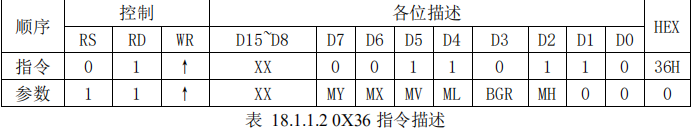
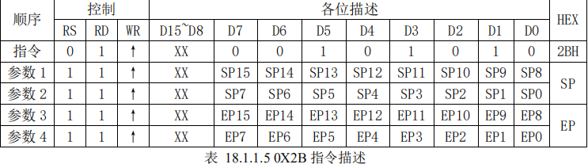
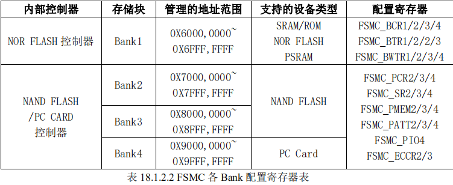

# TFTLCD 显示实验

上一章我们介绍了 OLED 模块及其显示，但是该模块只能显示单色/双色，不能显示彩色，
而且尺寸也较小。本章我们将介绍 ALIENTEK 2.8 寸 TFT LCD 模块，该模块采用 TFTLCD 面
板，可以显示 16 位色的真彩图片。

在本章中，我们将使用探索者 STM32F4 开发板上的 LCD接口，来点亮 TFTLCD，并实现 ASCII 字符和彩色的显示等功能，并在串口打印 LCD 控制器
ID，同时在 LCD 上面显示。

## LCD调用模板
```
#include "sys.h"
#include "delay.h"
#include "usart.h"
#include "led.h"
#include "lcd.h"
int main(void)
{ 
 	u8 x=0;
	u8 lcd_id[12];				//存放LCD ID字符串
	NVIC_PriorityGroupConfig(NVIC_PriorityGroup_2);//设置系统中断优先级分组2
	delay_init(168);      //初始化延时函数
	uart_init(115200);		//初始化串口波特率为115200
	
	LED_Init();					  //初始化LED
 	LCD_Init();           //初始化LCD FSMC接口
	POINT_COLOR=RED;      //画笔颜色：红色
	sprintf((char*)lcd_id,"LCD ID:%04X",lcddev.id);//将LCD ID打印到lcd_id数组。				 	
    //以上都可以不用动

    //主循环
  	while(1) 
	{		 
  
		...
	} 
}

```
## 前言
这一章很难，很多，很杂，如果不想看，根据上面模板在主循环里直接操作这几个重要的函数

### 设置画笔颜色
```
POINT_COLOR=RED;      //画笔颜色：红色
```
目前已经预定义了这么多颜色,当然也可以自己设计颜色
```
//画笔颜色
#define WHITE         	 0xFFFF
#define BLACK         	 0x0000	  
#define BLUE         	 0x001F  
#define BRED             0XF81F
#define GRED 			 0XFFE0
#define GBLUE			 0X07FF
#define RED           	 0xF800
#define MAGENTA       	 0xF81F
#define GREEN         	 0x07E0
#define CYAN          	 0x7FFF
#define YELLOW        	 0xFFE0
#define BROWN 			 0XBC40 //棕色
#define BRRED 			 0XFC07 //棕红色
#define GRAY  			 0X8430 //灰色
```
### 清屏填充函数
```
//清屏函数
//color:要清屏的填充色
void LCD_Clear(u16 color)
```
将LCD重置后传入再填充color
### 显示函数
```
//显示字符串
//x,y:起点坐标
//width,height:区域大小  
//size:字体大小
//*p:字符串起始地址		  
void LCD_ShowString(u16 x,u16 y,u16 width,u16 height,u8 size,u8 *p)
```
目前有如下的字体大小选择
```
		if(size==12)temp=asc2_1206[num][t]; 	 	//调用1206字体
		else if(size==16)temp=asc2_1608[num][t];	//调用1608字体
		else if(size==24)temp=asc2_2412[num][t];	//调用2412字体
```
当然还有像这样的函数
```
void LCD_ShowChar(u16 x,u16 y,u8 num,u8 size,u8 mode);						//显示一个字符
void LCD_ShowNum(u16 x,u16 y,u32 num,u8 len,u8 size);  						//显示一个数字
void LCD_ShowxNum(u16 x,u16 y,u32 num,u8 len,u8 size,u8 mode);				//显示 数字

```
### 设置光标位置
```
//Xpos:横坐标
//Ypos:纵坐标
void LCD_SetCursor(u16 Xpos, u16 Ypos)
```
### //画点
```
//x,y:坐标
//POINT_COLOR:此点的颜色
void LCD_DrawPoint(u16 x,u16 y)
```
### 快速画点
仅仅是带了颜色而已
```
//x,y:坐标
//color:颜色
void LCD_Fast_DrawPoint(u16 x,u16 y,u16 color)
```


### //读取个某点的颜色值
```
//x,y:坐标
//返回值:此点的颜色
u16 LCD_ReadPoint(u16 x,u16 y)
```
### 画常见图形
```
void LCD_Draw_Circle(u16 x0,u16 y0,u8 r);						 			//画圆
void LCD_DrawLine(u16 x1, u16 y1, u16 x2, u16 y2);							//画线
void LCD_DrawRectangle(u16 x1, u16 y1, u16 x2, u16 y2);		   				//画矩形
```
### 初始化LCD
```
void LCD_Init(void)
//该函数先初始化 STM32 与
TFTLCD 连接的 IO 口，并配置 FSMC 控制器，然后读取 LCD 控制器的型号，根据控制 IC 的
型号执行不同的初始化代码，其简化代码如下：
```

在保持其他代码不变的情况下，我们可以用以上面提及的函数写一个简单的程序

另外，在翻她的库之后，发现了这几个函数


## 1 TFTLCD&FSMC 简介
本章我们将通过STM32F4的FSMC接口来控制TFTLCD的显示，所以本节分为两个部分，
分别介绍 TFTLCD 和 FSMC。
### 1.1 TFTLCD 简介
TFT-LCD 即薄膜晶体管液晶显示器。其英文全称为：Thin Film Transistor-Liquid Crystal 
Display。

TFT-LCD 与无源 TN-LCD、STN-LCD 的简单矩阵不同，它在液晶显示屏的每一个象素上都设置有一个薄膜晶体管（TFT），可有效地克服非选通时的串扰，使显示液晶屏的静态特
性与扫描线数无关，因此大大提高了图像质量。TFT-LCD 也被叫做真彩液晶显示器。

上一章介绍了 OLED 模块，本章，我们给大家介绍 ALIENTEK TFTLCD 模块，该模块有
如下特点：
- 1，2.4’/2.8’/3.5’/4.3’/7’ 5 种大小的屏幕可选。
- 2，320×240 的分辨率（3.5’分辨率为:320*480，4.3’和 7’分辨率为：800*480）。 
- 3，16 位真彩显示。
- 4，自带触摸屏，可以用来作为控制输入。

本章，我们以 2.8 寸（其他 3.5 寸/4.3 寸等 LCD 方法类似，请参考 2.8 的即可）的ALIENTEK TFTLCD 模块为例介绍，该模块支持 65K 色显示，显示分辨率为 320×240，接口为 16 位的 80并口，自带触摸屏。

该模块的外观图如图 18.1.1.1 所示：  


模块原理图如图 18.1.1.2 所示：  


TFTLCD 模块采用 2*17 的 2.54 公排针与外部连接，接口定义如图 18.1.1.3 所示：  
  

从图 18.1.1.3 可以看出，ALIENTEK TFTLCD 模块采用 16 位的并方式与外部连接，之所以
不采用 8 位的方式，是因为彩屏的数据量比较大，尤其在显示图片的时候，如果用 8 位数据线，就会比 16 位方式慢一倍以上，我们当然希望速度越快越好，所以我们选择 16 位的接口。

图18.1.1.3 还列出了触摸屏芯片的接口，关于触摸屏本章我们不多介绍，后面的章节会有详细的介绍。


## 8080并行接口
首先我们介绍一下模块的 8080 并行接口，8080 并行接口的发明者是 INTEL，该总线也被
广泛应用于各类液晶显示器。

该模块的 80 并口有如下一些信号线：
- CS：TFTLCD 片选信号。
- WR：向 TFTLCD 写入数据。
- RD：从 TFTLCD 读取数据。
- D[15：0]：16 位双向数据线。
- RST：硬复位 TFTLCD。
- RS：命令/数据标志（0，读写命令；1，读写数据）

模块的 8080 并口读/写的过程为：先根据要写入/读取的数据的类型，设置 DC 为高（数据）
/低（命令），然后拉低片选，选中 SSD1306，接着我们根据是读数据，还是要写数据置 RD/WR
为低，然后：
- 在 RD 的上升沿， 使数据锁存到数据线（D[7：0]）上；
- 在 WR 的上升沿，使数据写入到 SSD1306 里面；
SSD1306 的 8080 并口写时序图如图 17.1.3 所示：
  
SSD1306 的 8080 并口读时序图如图 17.1.4 所示：
  
SSD1306 的 8080 接口方式下，控制脚的信号状态所对应的功能如表 17.1.2：
  

在 8080 方式下读数据操作的时候，我们有时候（例如读显存的时候）需要一个假读命
（Dummy Read），以使得微控制器的操作频率和显存的操作频率相匹配。

在读取真正的数据之前，由一个的假读的过程。这里的假读，其实就是第一个读到的字节丢弃不要，从第二个开始，才是我们真正要读的数据。

一个典型的读显存的时序图，如图 17.1.5 所示：
  


可以看到，在发送了列地址之后，开始读数据，第一个是 Dummy Read，也就是假读，我
们从第二个开始，才算是真正有效的数据。

***并行接口模式就介绍到这里***
***


需要说明的是，TFTLCD
模块的 RST 信号线是直接接到 STM32F4 的复位脚上，并不由软件控制，这样可以省下来一个
IO 口。

另外我们还需要一个背光控制线来控制 TFTLCD 的背光。所以，我们总共需要的 IO 口数目为 21 个。这里还需要注意，我们标注的 DB1~DB8，DB10~DB17，是相对于 LCD 控制 IC标注的，

__实际上大家可以把他们就等同于 D0~D15，这样理解起来就比较简单一点。__

ALIENTEK 提供 2.8/3.5/4.3/7 寸等不同尺寸的 TFTLCD 模块，其驱动芯片有很多种类型，
比如有：ILI9341/ILI9325/RM68042/RM68021/ILI9320/ILI9328/LGDP4531/LGDP4535/SPFD5408/SSD1289/1505/B505/C505/NT35310/NT35510/SSD1963 等

> 具体的型号，大家可以通过下载本章实验代码，通过串口或者 LCD 显示查看

这里我们仅以 ILI9341 控制器为例进行介绍，其他的控制基本都类似，我们就不详细阐述了。

ILI9341 液晶控制器自带显存，其显存总大小为 172800（240*320*18/8），即 18 位模式（26万色）下的显存量。

在 16 位模式下，ILI9341 采用 RGB565 格式存储颜色数据，此时 ILI9341的 18 位数据线与 MCU 的 16 位数据线以及 LCD GRAM 的对应关系如图 18.1.1.4 所示：


从图中可以看出，ILI9341 在 16 位模式下面，数据线有用的是：D17~D13 和 D11~D1，D0
和 D12 没有用到，实际上在我们 LCD 模块里面，ILI9341 的 D0 和 D12 压根就没有引出来，这样，ILI9341 的 D17~D13 和 D11~D1 对应 MCU 的 D15~D0。

_这样 MCU 的 16 位数据，最低 5 位代表蓝色，中间 6 位为绿色，最高 5 位为红色。_

数值越大，表示该颜色越深。另外，特别注意 ILI9341 所有的指令都是 8 位的（高 8 位无效），且参数除了读写 GRAM 的时候是 16 位，其他操作参数，都是 8 位的，这个和 ILI9320 等驱动器不一样，必须加以注意

接下来，我们介绍一下 ILI9341 的几个重要命令，因为 ILI9341 的命令很多，我们这里就
不全部介绍了，有兴趣的大家可以找到 ILI9341 的 datasheet 看看。里面对这些命令有详细的介绍。我们将介绍：0XD3，0X36，0X2A，0X2B，0X2C，0X2E 等 6 条指令。
#### 0XD3
首先来看指令：**0XD3**，这个是读 ID4 指令，用于读取 LCD 控制器的 ID，该指令如表 18.1.1.1
所示：

从上表可以看出，0XD3 指令后面跟了 4 个参数，最后 2 个参数，读出来是 0X93 和 0X41，

刚好是我们控制器 ILI9341 的数字部分，从而，通过该指令，即可判别所用的 LCD 驱动器是什
么型号，这样，我们的代码，就可以根据控制器的型号去执行对应驱动 IC 的初始化代码，从而
兼容不同驱动 IC 的屏，使得一个代码支持多款 LCD。
#### 0X36
接下来看指令：0X36，这是存储访问控制指令，可以控制 ILI9341 存储器的读写方向，简
单的说，就是在连续写 GRAM 的时候，可以控制 GRAM 指针的增长方向，从而控制显示方式
（读 GRAM 也是一样）。该指令如表 18.1.1.2 所示   


从上表可以看出，0X36 指令后面，紧跟一个参数，这里我们主要关注：MY、MX、MV
这三个位，通过这三个位的设置，我们可以控制整个 ILI9341 的全部扫描方向，如表 18.1.1.3
所示：


这样，我们在利用 ILI9341 显示内容的时候，就有很大灵活性了，比如显示 BMP 图片，
BMP 解码数据，就是从图片的左下角开始，慢慢显示到右上角，如果设置 LCD 扫描方向为从
左到右，从下到上，那么我们只需要设置一次坐标，然后就不停的往 LCD 填充颜色数据即可，
这样可以大大提高显示速度
#### 0X2A
接下来看指令：0X2A，这是列地址设置指令，在从左到右，从上到下的扫描方式（默认）
下面，该指令用于设置横坐标（x 坐标），该指令如表 18.1.1.4 所示：   


在默认扫描方式时，该指令用于设置 x 坐标，该指令带有 4 个参数，实际上是 2 个坐标值：
SC 和 EC，即列地址的起始值和结束值

*SC 必须小于等于 EC，且 0≤SC/EC≤239。* 

一般在设置 x 坐标的时候，我们只需要带 2 个参数即可，也就是设置 SC 即可，因为如果 EC 没有变化，我们只需要设置一次即可（在初始化 ILI9341 的时候设置），从而提高速度。

与 0X2A 指令类似，指令：0X2B，是页地址设置指令，在从左到右，从上到下的扫描方式
（默认）下面，该指令用于设置纵坐标（y 坐标）。该指令如表 18.1.1.5 所示：  
  
#### 0X2C
接下来看指令：0X2C，该指令是写 GRAM 指令，在发送该指令之后，我们便可以往 LCD
的 GRAM 里面写入颜色数据了，该指令支持连续写，指令描述如表 18.1.1.6 所示：
  
  

从上表可知，在收到指令 0X2C 之后，数据有效位宽变为 16 位，我们可以连续写入 LCD 
GRAM 值，而 GRAM 的地址将根据 MY/MX/MV 设置的扫描方向进行自增。

例如：假设设置的是从左到右，从上到下的扫描方式，那么设置好起始坐标（通过 SC，SP 设置）后，每写入一个颜色值，GRAM 地址将会自动自增 1（SC++），如果碰到 EC，则回到 SC，同时 SP++，一直到坐标：EC，EP 结束，其间无需再次设置的坐标，从而大大提高写入速度。

> yujiecong有话说 :"妙啊！！"
#### 0X2E
最后，来看看指令：0X2E，该指令是读 GRAM 指令，用于读取 ILI9341 的显存（GRAM），
该指令在 ILI9341 的数据手册上面的描述是有误的，真实的输出情况如表 18.1.1.7 所示：
  

该指令用于读取 GRAM，如表 18.1.1.7 所示，ILI9341 在收到该指令后，第一次输出的是
dummy 数据，也就是无效的数据，第二次开始，读取到的才是有效的 GRAM 数据（从坐标：
SC，SP 开始），输出规律为：每个颜色分量占 8 个位，一次输出 2 个颜色分量。

比如：第一次输出是 R1G1，随后的规律为：B1R2→G2B2→R3G3→B3R4→G4B4→R5G5... 以此类推。如果我们只需要读取一个点的颜色值，那么只需要接收到参数 3 即可，如果要连续读取（利用 GRAM地址自增，方法同上），那么就按照上述规律去接收颜色数据。

以上，就是操作 ILI9341 常用的几个指令，通过这几个指令，我们便可以很好的控制 ILI9341
显示我们所要显示的内容了。

# 一般 TFTLCD 模块的使用流程如图 18.1.1.5：
  
任何 LCD，使用流程都可以简单的用以上流程图表示。其中硬复位和初始化序列，只需要
执行一次即可。

而画点流程就是：设置坐标→写 GRAM 指令→写入颜色数据，然后在 LCD 上
面，我们就可以看到对应的点显示我们写入的颜色了。读点流程为：设置坐标→读 GRAM 指令
→读取颜色数据，这样就可以获取到对应点的颜色数据了。

以上只是最简单的操作，也是最常用的操作，有了这些操作，一般就可以正常使用 TFTLCD
了。接下来我们将该模块用来来显示字符和数字，通过以上介绍，我们可以得出 TFTLCD 显示
需要的相关设置步骤如下：

## 1）设置 STM32F4 与 TFTLCD 模块相连接的 IO。
这一步，先将我们与 TFTLCD 模块相连的 IO 口进行初始化，以便驱动 LCD。这里我们用
到的是 FSMC，FSMC 将在 后面向大家详细介绍。
## 2）初始化 TFTLCD 模块。
即图 18.1.1.5 的初始化序列，这里我们没有硬复位 LCD，因为探索者 STM32F4 开发板的
LCD 接口，将 TFTLCD 的 RST 同 STM32F4 的 RESET 连接在一起了，只要按下开发板的 RESET键，就会对 LCD 进行硬复位。

初始化序列，就是向 LCD 控制器写入一系列的设置值（比如伽马校准），这些初始化序列一般 LCD 供应商会提供给客户，我们直接使用这些序列即可，不需要深入研究。

*在初始化之后，LCD 才可以正常使用。*
## 3）通过函数将字符和数字显示到 TFTLCD 模块上。
这一步则通过图 18.1.1.5 左侧的流程，即：设置坐标→写 GRAM 指令→写 GRAM 来实现，
但是这个步骤，只是一个点的处理，我们要显示字符/数字，就必须要多次使用这个步骤，从而
达到显示字符/数字的目的，所以需要设计一个函数来实现数字/字符的显示，之后调用该函数，
就可以实现数字/字符的显示了
***
##  FSMC 简介
>FSMC(Flexible Static Memory Controller，可变静态存储控制器)是STM32系列采用的一种新型的存储器扩展技术。在外部存储器扩展方面具有独特的优势，可根据系统的应用需要，方便地进行不同类型大容量静态存储器的扩展。

STM32F407 或 STM32F417 系列芯片都带有 FSMC 接口，ALIENTEK 探索者 STM32F4 开
发板的主芯片为 STM32F407ZGT6，是带有 FSMC 接口的。

FSMC，即灵活的静态存储控制器，能够与同步或异步存储器和 16 位 PC 存储器卡连接，
STM32F4 的 FSMC 接口支持包括 SRAM、NAND FLASH、NOR FLASH 和 PSRAM 等存储器。

FSMC 的框图如图 18.1.2.1 所示：
  
从上图我们可以看出，STM32F4 的 FSMC 将外部设备分为 2 类：
- NOR/PSRAM 设备
- NAND/PC 卡设备

他们共用地址数据总线等信号，他们具有不同的 CS 以区分不同的设备，比如本章我们用到的 TFTLCD 就是用的 FSMC_NE4 做片选，其实就是将 TFTLCD 当成 SRAM 来控制。

>静态随机存取存储器（Static Random-Access Memory，SRAM）是随机存取存储器的一种。所谓的“静态”，是指这种存储器只要保持通电，里面储存的数据就可以恒常保持。相对之下，动态随机存取存储器（DRAM）里面所储存的数据就需要周期性地更新。然而，当电力供应停止时，SRAM储存的数据还是会消失（被称为volatile memory），这与在断电后还能储存资料的ROM或闪存是不同的。

这里我们介绍下为什么可以把 TFTLCD 当成 SRAM 设备用：首先我们了解下外部 SRAM
的连接，外部 SRAM 的控制一般有：
- 地址线（如 A0~A18）
- 数据线（如 D0~D15）
- 写信号（WE）
- 读信号（OE）
- 片选信号（CS）

如果 SRAM 支持字节控制，那么还有 UB/LB 信号..

而 TFTLCD的信号我们在 1.1 节有介绍，包括：RS、D0~D15、WR、RD、CS、RST 和 BL 等，其中真正在操作 LCD 的时候需要用到的就只有：RS、D0~D15、WR、RD 和 CS。

其操作时序和SRAM的控制完全类似，唯一不同就是 TFTLCD 有 RS 信号，但是没有地址信号。

TFTLCD 通过 RS 信号来决定传送的数据是数据还是命令，本质上可以理解为一个地址信
号，比如我们把 RS 接在 A0 上面，那么当 FSMC 控制器写地址 0 的时候，会使得 A0 变为 0， 对 TFTLCD 来说，就是写命令。

而 FSMC 写地址 1 的时候，A0 将会变为 1，对 TFTLCD 来说，就是写数据了。这样，就把数据和命令区分开了，他们其实就是对应 SRAM 操作的两个连续地址。

当然 RS 也可以接在其他地址线上，探索者 STM32F4 开发板是把 RS 连接在 A6 上面的。

STM32F4 的 FSMC 支持 8/16/32 位数据宽度，我们这里用到的 LCD 是 16 位宽度的，所以
在设置的时候，选择 16 位宽就 OK 了。我们再来看看 FSMC 的外部设备地址映像，STM32F4的 FSMC 将外部存储器划分为固定大小为 256M 字节的四个存储块，如图 18.1.2.2 所示：  
  

从上图可以看出，FSMC 总共管理 1GB 空间，拥有 4 个存储块（Bank），本章，我们用到
的是块 1，所以在本章我们仅讨论块 1 的相关配置，其他块的配置，请参考《STM32F4xx 中文
参考手册》第 32 章（1191 页）的相关介绍。

STM32F4 的 FSMC 存储块 1（Bank1）被分为 4 个区，每个区管理 64M 字节空间，每个区
都有独立的寄存器对所连接的存储器进行配置。Bank1 的 256M 字节空间由 28 根地址线
（HADDR[27:0]）寻址。

这 里 HADDR 是内 部 AHB 地址总 线，其 中 HADDR[25:0]来自外部存储器地址
FSMC_A[25:0]，而 HADDR[26:27]对 4 个区进行寻址。如表 18.1.2.1 所示：
  

*不论外部接 8 位/16 位宽设备，FSMC_A[0]永远接在外部设备地址 A[0]*。 
这里，TFTLCD
使用的是 16 位数据宽度，所以 HADDR[0]并没有用到，只有 HADDR[25:1]是有效的，
对应关系变为：**HADDR[25:1]→ FSMC_A[24:0]，相当于右移了一位，这里请大家特别留意**。

另外，HADDR[27:26]的设置，是不需要我们干预的，比如：当你选择使用 Bank1 的第三个区，即使用 FSMC_NE3 来连接外部设备的时候，即对应了 HADDR[27:26]=10，我们要做的就是配置对应第 3区的寄存器组，来适应外部设备即可。
STM32F4 的 FSMC 各Bank配置寄存器如表 18.1.2.2所示：
   
> NOR Flash是一种非易失闪存技术，是Intel在1988年创建

对于 NOR FLASH 控制器，主要是通过 FSMC_BCRx、FSMC_BTRx 和 FSMC_BWTRx 寄
存器设置（其中 x=1~4，对应 4 个区）。通过这 3 个寄存器，可以设置 FSMC 访问外部存储
的时序参数，拓宽了可选用的外部存储器的速度范围。

FSMC 的 NOR FLASH 控制器支持同步和异步突发两种访问方式。选用同步突发访问方式时，FSMC 将 HCLK(系统时钟)分频后，发送给外部存储器作为同步时钟信号 FSMC_CLK。此时需要的设置的时间参数有 2 个：
1. HCLK 与 FSMC_CLK 的分频系数(CLKDIV)，可以为 2～16 分频；
2. 同步突发访问中获得第 1 个数据所需要的等待延迟(DATLAT)。

对于异步突发访问方式，FSMC 主要设置 3 个时间参数：地址建立时间(ADDSET)、数据
建立时间(DATAST)和地址保持时间(ADDHLD)。

FSMC 综合了 SRAM／ROM、PSRAM 和 NOR Flash 产品的信号特点，定义了 4 种不同的异步时序模型。选用不同的时序模型时，需要设置不同的时序参数，如表 18.1.2.3 所列
  

在实际扩展时，根据选用存储器的特征确定时序模型，从而确定各时间参数与存储器读／
写周期参数指标之间的计算关系；利用该计算关系和存储芯片数据手册中给定的参数指标，可
计算出 FSMC 所需要的各时间参数，从而对时间参数寄存器进行合理的配置。

本章，我们使用异步模式 A（ModeA）方式来控制 TFTLCD，模式 A 的读操作时序如图
18.1.2.3 所示：  

  

模式 A 支持独立的读写时序控制，这个对我们驱动 TFTLCD 来说非常有用，因为 TFTLCD
在读的时候，一般比较慢，而在写的时候可以比较快，如果读写用一样的时序，那么只能以读
的时序为基准，从而导致写的速度变慢，或者在读数据的时候，重新配置 FSMC 的延时，在读
操作完成的时候，再配置回写的时序，这样虽然也不会降低写的速度，但是频繁配置，比较麻
烦。

而如果有独立的读写时序控制，那么我们只要初始化的时候配置好，之后就不用再配置，
既可以满足速度要求，又不需要频繁改配置。

模式 A 的写操作时序如图 18.1.2.4 所示
  

图 18.1.2.3 和图 18.1.2.4 中的 ADDSET 与 DATAST，是通过不同的寄存器设置的，接下来
我们讲解一下 Bank1 的几个控制寄存器

首先，我们介绍 SRAM/NOR 闪存片选控制寄存器：FSMC_BCRx（x=1~4），该寄存器各位
描述如图 18.1.2.5 所示：  

  

该寄存器我们在本章用到的设置有：EXTMOD、WREN、MWID、MTYP 和 MBKEN 这几
个设置，我们将逐个介绍。
- EXTMOD：
    - 扩展模式使能位，也就是是否允许读写不同的时序，很明显，我们本章需要读
写不同的时序，故该位需要设置为 1。
- WREN：
    - 写使能位。我们需要向 TFTLCD 写数据，故该位必须设置为 1。
- MWID[1:0]：
    - 存储器数据总线宽度。00，表示 8 位数据模式；01 表示 16 位数据模式；10和 11 保留。我们的 TFTLCD 是 16 位数据线，所以设置 WMID[1:0]=01。
- MTYP[1:0]：
    - 存储器类型。00 表示 SRAM、ROM；01 表示 PSRAM；10 表示 NOR FLASH;11保留。前面提到，我们把 TFTLCD 当成 SRAM 用，所以需要设置 MTYP[1:0]=00。
- MBKEN：
    - 存储块使能位。这个容易理解，我们需要用到该存储块控制 TFTLCD，当然要使能这个存储块了。
***
接下来，我们看看 SRAM/NOR 闪存片选时序寄存器：FSMC_BTRx（x=1~4），该寄存器各
位描述如图 18.1.2.6 所示
  

这个寄存器包含了每个存储器块的控制信息，可以用于 SRAM、ROM 和 NOR 闪存存储器。
如果 FSMC_BCRx 寄存器中设置了 EXTMOD 位，则有两个时序寄存器分别对应读(本寄存器)
和写操作(FSMC_BWTRx 寄存器)。

因为我们要求读写分开时序控制，所以 EXTMOD 是使能了的，也就是本寄存器是读操作时序寄存器，控制读操作的相关时序。本章我们要用到的设置有：
ACCMOD、DATAST 和 ADDSET 这三个设置

- ACCMOD[1:0]：
    - 访问模式。00 表示访问模式 A；01 表示访问模式 B；10 表示访问模式 C；
11 表示访问模式 D，本章我们用到模式 A，故设置为 00。
- DATAST[7:0]：
    - 数据保持时间。0 为保留设置，其他设置则代表保持时间为: DATAST 个
HCLK 时钟周期，最大为 255 个 HCLK 周期。
    - 对 ILI9341 来说，其实就是 RD 低电平持续时间，
一般为 355ns。而一个 HCLK 时钟周期为 6ns 左右（1/168Mhz），为了兼容其他屏，我们这里设
置 DATAST 为 60，也就是 60 个 HCLK 周期，时间大约是 360ns。
- ADDSET[3:0]：
    - 地址建立时间。其建立时间为：ADDSET 个 HCLK 周期，最大为 15 个 HCLK
周期。对 ILI9341 来说，这里相当于 RD 高电平持续时间，为 90ns，我们设置 ADDSET 为 15， 即 15*6=90ns。

最后，我们再来看看 SRAM/NOR 闪写时序寄存器：FSMC_BWTRx（x=1~4），该寄存器各
位描述如图 18.1.2.7 所示
  

该寄存器在本章用作写操作时序控制寄存器，需要用到的设置同样是：ACCMOD、DATAST
和 ADDSET 这三个设置。

这三个设置的方法同 FSMC_BTRx 一模一样，只是这里对应的是写操作的时序，ACCMOD 设置同 FSMC_BTRx 一模一样，同样是选择模式 A

另外 DATAST 和ADDSET 则对应低电平和高电平持续时间，对 ILI9341 来说，这两个时间只需要 15ns 就够了，比读操作快得多。所以我们这里设置 DATAST 为 2，即 3 个 HCLK 周期，时间约为 18ns。然后
ADDSET 设置为 3，即 3 个 HCLK 周期，时间为 18ns。

至此，我们对 STM32F4 的 FSMC 介绍就差不多了，通过以上两个小节的了解，我们可以
开始写 LCD 的驱动代码了。不过，这里还要给大家做下科普，在 MDK 的寄存器定义里面，并
没有定义 FSMC_BCRx、FSMC_BTRx、FSMC_BWTRx 等这个单独的寄存器，而是将他们进行
了一些组合。

FSMC_BCRx 和 FSMC_BTRx，组合成 BTCR[8]寄存器组，他们的对应关系如下：

- BTCR[0]对应 FSMC_BCR1，BTCR[1]对应 FSMC_BTR1 
- BTCR[2]对应 FSMC_BCR2，BTCR[3]对应 FSMC_BTR2 
- BTCR[4]对应 FSMC_BCR3，BTCR[5]对应 FSMC_BTR3 
- BTCR[6]对应 FSMC_BCR4，BTCR[7]对应 FSMC_BTR4 

FSMC_BWTRx 则组合成 BWTR[7]，他们的对应关系如下：

- BWTR[0]对应 FSMC_BWTR1
- BWTR[2]对应 FSMC_BWTR2
- BWTR[4]对应 FSMC_BWTR3 
- BWTR[6]对应 FSMC_BWTR4

BWTR[1]、BWTR[3]和 BWTR[5]保留，没有用到。

通过上面的讲解，通过对 FSMC 相关的寄存器的描述，大家对 FSMC 的原理有了一个初步
的认识，如果还不熟悉的朋友，请一定要搜索网络资料理解 FSMC 的原理。

*只有理解了原理，使用库函数才可以得心应手。那么在库函数中是怎么实现 FSMC 的配置的呢？*

*FSMC_BTRx 寄存器在库函数是通过什么函数来配置的呢？下面我们来讲解一下 FSMC 相关的库函数：*

### 1) FSMC 初始化函数
根据前面的讲解，初始化 FSMC 主要是初始化三个寄存器 FSMC_BCRx，FSMC_BTRx，
FSMC_BWTRx，那么在固件库中是怎么初始化这三个参数的呢？
固件库提供了 3 个 FSMC 初始化函数分别为
```
FSMC_NORSRAMInit()；
FSMC_NANDInit()；
FSMC_PCCARDInit()；
```
这三个函数分别用来初始化 4 种类型存储器。这里根据名字就很好判断对应关系。

用来初始化NOR 和 SRAM 使用同一个函数 FSMC_NORSRAMInit()。所以我们之后使用的 FSMC 初始化函数为 FSMC_NORSRAMInit()。

下面我们看看函数定义：
```
void FSMC_NORSRAMInit(FSMC_NORSRAMInitTypeDef* FSMC_NORSRAMInitStruct)；
```
这个函数只有一个入口参数，也就是 FSMC_NORSRAMInitTypeDef 类型指针变量，这个结构体
的成员变量非常多，因为 FSMC 相关的配置项非常多。
```
typedef struct
{
 uint32_t FSMC_Bank; 
 uint32_t FSMC_DataAddressMux; 
 uint32_t FSMC_MemoryType; 
 uint32_t FSMC_MemoryDataWidth;
 uint32_t FSMC_BurstAccessMode; 
 uint32_t FSMC_AsynchronousWait; 
 uint32_t FSMC_WaitSignalPolarity; 
 uint32_t FSMC_WrapMode; 
 uint32_t FSMC_WaitSignalActive; 
 uint32_t FSMC_WriteOperation; 
 uint32_t FSMC_WaitSignal; 
 uint32_t FSMC_ExtendedMode; 
 uint32_t FSMC_WriteBurst; 
 FSMC_NORSRAMTimingInitTypeDef* FSMC_ReadWriteTimingStruct; 
 FSMC_NORSRAMTimingInitTypeDef* FSMC_WriteTimingStruct; 
}FSMC_NORSRAMInitTypeDef;
```
从这个结构体我们可以看出，前面有 13 个基本类型（unit32_t）的成员变量，这 13 个参数是用来配置片选控制寄存器 FSMC_BCRx。

最后面还有两个SMC_NORSRAMTimingInitTypeDef 指针类型的成员变量。

前面我们讲到，FSMC 有读时序和写时序之分，所以这里就是用来设置读时序和写时序的参数了， 也就是说，这两个参数是用来配置寄存器 FSMC_BTRx 和 FSMC_BWTRx，后面我们会讲解到。下面我们主要来看看模式 A下的相关配置参数：

- 参数 FSMC_Bank 用来设置使用到的存储块标号和区号，前面讲过，我们是使用的存储块 1 区 号 4，所以选择值为 FSMC_Bank1_NORSRAM4。
- 参数 FSMC_MemoryType 用来设置存储器类型，我们这里是 SRAM，所以选择值为
FSMC_MemoryType_SRAM。
- 参数 FSMC_MemoryDataWidth 用来设置数据宽度，可选 8 位还是 16 位，这里我们是 16 位数据
宽度，所以选择值为 FSMC_MemoryDataWidth_16b。
- 参数 FSMC_WriteOperation 用来设置写使能，毫无疑问，我们前面讲解过我们要向 TFT 写数据，
所以要写使能，这里我们选择 FSMC_WriteOperation_Enable。
- 参数 FSMC_ExtendedMode 是设置扩展模式使能位，也就是是否允许读写不同的时序，这里我
们采取的读写不同时序，所以设置值为 FSMC_ExtendedMode_Enable。
上面的这些参数是与模式 A 相关的，下面我们也来稍微了解一下其他几个参数的意义吧：
- 参数 FSMC_DataAddressMux 用来设置地址/数据复用使能，若设置为使能，那么地址的低 16
位和数据将共用数据总线，仅对 NOR 和 PSRAM 有效，所以我们设置为默认值不复用，值
FSMC_DataAddressMux_Disable。
- 参 数 FSMC_BurstAccessMode ， FSMC_AsynchronousWait ， FSMC_WaitSignalPolarity ，
FSMC_WaitSignalActive ， FSMC_WrapMode ， FSMC_WaitSignal FSMC_WriteBurst 和
FSMC_WaitSignal 

这些参数在成组模式同步模式才需要设置，大家可以参考中文参考手册了解相关参数的意思。
接 下 来 我 们 看 看 设 置 读 写 时 序 参 数 的 两 个 变 量 

FSMC_ReadWriteTimingStruct 和FSMC_WriteTimingStruct，他们都是 FSMC_NORSRAMTimingInitTypeDef 结构体指针类型

这两个参数在初始化的时候分别用来初始化片选控制寄存器 FSMC_BTRx 和写操作时序控制寄存
器 FSMC_BWTRx。 

下面我们看看 FSMC_NORSRAMTimingInitTypeDef 类型的定义：
```
typedef struct
{
 uint32_t FSMC_AddressSetupTime; 
 uint32_t FSMC_AddressHoldTime; 
 uint32_t FSMC_DataSetupTime; 
 uint32_t FSMC_BusTurnAroundDuration; 
 uint32_t FSMC_CLKDivision; 
 uint32_t FSMC_DataLatency; 
 uint32_t FSMC_AccessMode; 
}FSMC_NORSRAMTimingInitTypeDef;
```

这个结构体有 7 个参数用来设置 FSMC 读写时序。其实这些参数的意思我们前面在讲解 FSMC
的时序的时候有提到，主要是设计地址建立保持时间，数据建立时间等等配置，对于我们的实
验中，读写时序不一样，读写速度要求不一样，所以对于参数 FSMC_DataSetupTime 设置了不
同的值，大家可以对照理解一下。

记住，这些参数的意义在前面讲解 FSMC_BTRx 和FSMC_BWTRx 寄存器的时候都有提到，大家可以翻过去看看。

### 2) FSMC 使能函数
FSMC 对不同的存储器类型同样提供了不同的使能函数：
```
void FSMC_NORSRAMCmd(uint32_t FSMC_Bank, FunctionalState NewState);
void FSMC_NANDCmd(uint32_t FSMC_Bank, FunctionalState NewState);
void FSMC_PCCARDCmd(FunctionalState NewState);
```
这个就比较好理解，我们这里不讲解，我们是 SRAM,所以使用的是第一个函数。

## 2 硬件设计
本实验用到的硬件资源有：
- 1） 指示灯 DS0 
- 2） TFTLCD 模块
TFTLCD 模块的电路见图 18.1.1.2，这里我们介绍 TFTLCD 模块与 ALIETEK 探索者
STM32F4 开发板的连接，探索者 STM32F4 开发板底板的 LCD 接口和 ALIENTEK TFTLCD 模
块直接可以对插，连接关系如图 18.2.1 所示：
  
图 18.2.1 中圈出来的部分就是连接 TFTLCD 模块的接口，液晶模块直接插上去即可。
在硬件上，TFTLCD 模块与探索者 STM32F4 开发板的 IO 口对应关系如下：
- LCD_BL(背光控制)对应 PB0;
- LCD_CS 对应 PG12 即 FSMC_NE4;
- LCD _RS 对应 PF12 即 FSMC_A6;
- LCD _WR 对应 PD5 即 FSMC_NWE;
- LCD _RD 对应 PD4 即 FSMC_NOE;

LCD _D[15:0]则直接连接在 FSMC_D15~FSMC_D0;
这些线的连接，探索者 STM32F4 开发板的内部已经连接好了，我们只需要将 TFTLCD 模
块插上去就好了。实物连接如图 18.2.2 所示


## 3 软件设计
打开我们光盘的 TFT LCD 显示实验工程可以看到我们添加了两个文件 lcd.c 和头文件 lcd.h。
同时，FSMC 相关的库函数分布在 stm32f4xx_fsmc.c 文件和头文件 stm32f4xx_fsmc.h 中。所以
我们在工程中要引入 stm32f4xx_fsmc.c 源文件。
在 lcd.c 里面代码比较多，我们这里就不贴出来了，只针对几个重要的函数进行讲解。完整
版的代码见光盘→4，程序源码→标准例程-库函数版本→实验 13 TFTLCD 显示实验的 lcd.c 文
件。
本实验，我们用到 FSMC 驱动 LCD，通过前面的介绍，我们知道 TFTLCD 的 RS 接在 FSMC
的 A6 上面，CS 接在 FSMC_NE4 上，并且是 16 位数据总线。即我们使用的是 FSMC 存储器 1
的第 4 区，我们定义如下 LCD 操作结构体（在 lcd.h 里面定义）：
```
//LCD 操作结构体
typedef struct
{
vu16 LCD_REG;
vu16 LCD_RAM;
} LCD_TypeDef;
//使用 NOR/SRAM 的 Bank1.sector4,地址位 HADDR[27,26]=11 A6 作为数据命令区分线
//注意 16 位数据总线时，STM32 内部地址会右移一位对齐! 
#define LCD_BASE ((u32)(0x6C000000 | 0x0000007E))
#define LCD ((LCD_TypeDef *) LCD_BASE)
```
其中 LCD_BASE，必须根据我们外部电路的连接来确定，我们使用 Bank1.sector4 就是从
地址 0X6C000000 开始，而 0X0000007E，则是 A6 的偏移量，这里很多朋友不理解这个偏移量
的概念，简单说明下：以 A6 为例，7E 转换成二进制就是：1111110

而 16 位数据时，地址右移一位对齐，那么实际对应到地址引脚的时候，就是：A6:A0=0111111，此时 A6 是 0，但是如果 16 位地址再加 1（注意：对应到 8 位地址是加 2，即 7E+0X02），那么：

A6:A0=1000000，此时 A6 就是 1 了，即实现了对 RS 的 0 和 1 的控制。

我们将这个地址强制转换为 LCD_TypeDef 结构体地址，那么可以得到 LCD->LCD_REG 的
地址就是 0X6C00,007E，对应 A6 的状态为 0(即 RS=0)，而 LCD-> LCD_RAM 的地址就是
0X6C00,0080（结构体地址自增），对应 A6 的状态为 1（即 RS=1）。

所以，有了这个定义，当我们要往 LCD 写命令/数据的时候，可以这样写：
```
LCD->LCD_REG=CMD; //写命令
LCD->LCD_RAM=DATA; //写数据
```
而读的时候反过来操作就可以了，如下所示：
```
CMD= LCD->LCD_REG;//读 LCD 寄存器
DATA = LCD->LCD_RAM;//读 LCD 数据
```
这其中，CS、WR、RD 和 IO 口方向都是由 FSMC 控制，不需要我们手动设置了。接下来，
我们先介绍一下 lcd.h 里面的另一个重要结构体:
```
//LCD 重要参数集
typedef struct 
{ 
u16 width; //LCD 宽度
u16 height; //LCD 高度
u16 id; //LCD ID
u8 dir; //横屏还是竖屏控制：0，竖屏；1，横屏。
u16 wramcmd; //开始写 gram 指令
u16 setxcmd; //设置 x 坐标指令
u16 setycmd; //设置 y 坐标指令
}_lcd_dev;
```
```
//LCD 参数
extern _lcd_dev lcddev; //管理 LCD 重要参数
```

该结构体用于保存一些 LCD 重要参数信息，比如 LCD 的长宽、LCD ID（驱动 IC 型号）、
LCD 横竖屏状态等，这个结构体虽然占用了十几个字节的内存，但是却可以让我们的驱动函数
支持不同尺寸的 LCD，同时可以实现 LCD 横竖屏切换等重要功能，所以还是利大于弊的。

有了以上了解，下面我们开始介绍 lcd.c 里面的一些重要函数。
先看 7 个简单，但是很重要的函数：
```
//写寄存器函数
//regval:寄存器值
void LCD_WR_REG(vu16 regval)
{ regval=regval; //使用-O2 优化的时候,必须插入的延时
LCD->LCD_REG=regval;//写入要写的寄存器序号
}
```
```
//写 LCD 数据
//data:要写入的值
void LCD_WR_DATA(vu16 data)
{ data=data; //使用-O2 优化的时候,必须插入的延时
LCD->LCD_RAM=data;
}
```
```
//读 LCD 数据
//返回值:读到的值
u16 LCD_RD_DATA(void)
{ vu16 ram; //防止被优化
ram=LCD->LCD_RAM;
return ram;
} 
```
```
//写寄存器
//LCD_Reg:寄存器地址
//LCD_RegValue:要写入的数据
void LCD_WriteReg(vu16 LCD_Reg, vu16 LCD_RegValue)
{ LCD->LCD_REG = LCD_Reg; //写入要写的寄存器序号
LCD->LCD_RAM = LCD_RegValue; //写入数据 
} 
```
```
//读寄存器
//LCD_Reg:寄存器地址
//返回值:读到的数据
u16 LCD_ReadReg(vu16 LCD_Reg)
{ LCD_WR_REG(LCD_Reg); //写入要读的寄存器序号
delay_us(5); 
return LCD_RD_DATA(); //返回读到的值
} 
```
```
//开始写 GRAM
void LCD_WriteRAM_Prepare(void)
{ LCD->LCD_REG=lcddev.wramcmd; 
}
```
```
//LCD 写 GRAM
//RGB_Code:颜色值
void LCD_WriteRAM(u16 RGB_Code)
{ LCD->LCD_RAM = RGB_Code;//写十六位 GRAM
}
```
因为 FSMC 自动控制了 WR/RD/CS 等这些信号，所以这 7 个函数实现起来都非常简单，我
们就不多说，注意，上面有几个函数，我们添加了一些对 MDK –O2 优化的支持，去掉的话，
在-O2 优化的时候会出问题。

这些函数实现功能见函数前面的备注，通过这几个简单函数的组合，我们就可以对 LCD 进行各种操作了。
第七个要介绍的函数是坐标设置函数，该函数代码如下：
```
//设置光标位置
//Xpos:横坐标
//Ypos:纵坐标
void LCD_SetCursor(u16 Xpos, u16 Ypos)
{	 
 	if(lcddev.id==0X9341||lcddev.id==0X5310)
	{		    
		LCD_WR_REG(lcddev.setxcmd); 
		LCD_WR_DATA(Xpos>>8);LCD_WR_DATA(Xpos&0XFF); 			 
		LCD_WR_REG(lcddev.setycmd); 
		LCD_WR_DATA(Ypos>>8);LCD_WR_DATA(Ypos&0XFF); 		
	}else if(lcddev.id==0X6804)
	{
		if(lcddev.dir==1)Xpos=lcddev.width-1-Xpos;//横屏时处理
		LCD_WR_REG(lcddev.setxcmd); 
		LCD_WR_DATA(Xpos>>8);LCD_WR_DATA(Xpos&0XFF); 
		LCD_WR_REG(lcddev.setycmd); 
		LCD_WR_DATA(Ypos>>8);LCD_WR_DATA(Ypos&0XFF); 
	}else if(lcddev.id==0X1963)
	{  			 		
		if(lcddev.dir==0)//x坐标需要变换
		{
			Xpos=lcddev.width-1-Xpos;
			LCD_WR_REG(lcddev.setxcmd); 
			LCD_WR_DATA(0);LCD_WR_DATA(0); 		
			LCD_WR_DATA(Xpos>>8);LCD_WR_DATA(Xpos&0XFF);		 	 
		}else
		{
			LCD_WR_REG(lcddev.setxcmd); 
			LCD_WR_DATA(Xpos>>8);LCD_WR_DATA(Xpos&0XFF); 		
			LCD_WR_DATA((lcddev.width-1)>>8);LCD_WR_DATA((lcddev.width-1)&0XFF);		 	 			
		}	
		LCD_WR_REG(lcddev.setycmd); 
		LCD_WR_DATA(Ypos>>8);LCD_WR_DATA(Ypos&0XFF); 		
		LCD_WR_DATA((lcddev.height-1)>>8);LCD_WR_DATA((lcddev.height-1)&0XFF); 			 		
		
	}else if(lcddev.id==0X5510)
	{
		LCD_WR_REG(lcddev.setxcmd);LCD_WR_DATA(Xpos>>8); 		
		LCD_WR_REG(lcddev.setxcmd+1);LCD_WR_DATA(Xpos&0XFF);			 
		LCD_WR_REG(lcddev.setycmd);LCD_WR_DATA(Ypos>>8);  		
		LCD_WR_REG(lcddev.setycmd+1);LCD_WR_DATA(Ypos&0XFF);			
	}else
	{
		if(lcddev.dir==1)Xpos=lcddev.width-1-Xpos;//横屏其实就是调转x,y坐标
		LCD_WriteReg(lcddev.setxcmd, Xpos);
		LCD_WriteReg(lcddev.setycmd, Ypos);
	}	 
} 		 
```
该函数实现将 LCD 的当前操作点设置到指定坐标(x,y)。因为 9341/5310/6804/5510 等的设
置同其他屏有些不太一样，所以进行了区别对待。
接下来我们介绍第八个函数：画点函数。该函数实现代码如下：
```
//画点
//x,y:坐标
//POINT_COLOR:此点的颜色
void LCD_DrawPoint(u16 x,u16 y)
{
	LCD_SetCursor(x,y);		//设置光标位置 
	LCD_WriteRAM_Prepare();	//开始写入GRAM
	LCD->LCD_RAM=POINT_COLOR; 
}
```
该函数实现比较简单，就是先设置坐标，然后往坐标写颜色。其中 POINT_COLOR 是我们
定义的一个全局变量，用于存放画笔颜色，顺带介绍一下另外一个全局变量：BACK_COLOR，
该变量代表 LCD 的背景色。

**LCD_DrawPoint 函数虽然简单  但是至关重要，其他几乎所有上层函数，都是通过调用这个函数实现的。**

有了画点，当然还需要有读点的函数，第九个介绍的函数就是读点函数，用于读取 LCD
的 GRAM，这里说明一下，为什么 OLED 模块没做读 GRAM 的函数，而这里做了。

因为 OLED模块是单色的，所需要全部 GRAM 也就 1K 个字节，而 TFTLCD 模块为彩色的，点数也比 OLED模块多很多，以 16 位色计算，一款 320×240 的液晶，需要 320×240×2 个字节来存储颜色值,也就是也需要 150K 字节，这对任何一款单片机来说，都不是一个小数目了。

而且我们在图形叠加的时候，可以先读回原来的值，然后写入新的值，在完成叠加后，我们又恢复原来的值。

这样在做一些简单菜单的时候，是很有用的。这里我们读取 TFTLCD 模块数据的函数为
LCD_ReadPoint，该函数直接返回读到的 GRAM 值。该函数使用之前要先设置读取的 GRAM
地址，通过 LCD_SetCursor 函数来实现。LCD_ReadPoint 的代码如下
```

u16 LCD_ReadPoint(u16 x,u16 y)
{
 	u16 r=0,g=0,b=0;
	if(x>=lcddev.width||y>=lcddev.height)return 0;	//超过了范围,直接返回		   
	LCD_SetCursor(x,y);	    
	if(lcddev.id==0X9341||lcddev.id==0X6804||lcddev.id==0X5310||lcddev.id==0X1963)LCD_WR_REG(0X2E);//9341/6804/3510/1963 发送读GRAM指令
	else if(lcddev.id==0X5510)LCD_WR_REG(0X2E00);	//5510 发送读GRAM指令
	else LCD_WR_REG(0X22);      		 			//其他IC发送读GRAM指令
	if(lcddev.id==0X9320)opt_delay(2);				//FOR 9320,延时2us	    
 	r=LCD_RD_DATA();								//dummy Read	   
	if(lcddev.id==0X1963)return r;					//1963直接读就可以 
	opt_delay(2);	  
 	r=LCD_RD_DATA();  		  						//实际坐标颜色
 	if(lcddev.id==0X9341||lcddev.id==0X5310||lcddev.id==0X5510)		//9341/NT35310/NT35510要分2次读出
 	{
		opt_delay(2);	  
		b=LCD_RD_DATA(); 
		g=r&0XFF;		//对于9341/5310/5510,第一次读取的是RG的值,R在前,G在后,各占8位
		g<<=8;
	} 
	if(lcddev.id==0X9325||lcddev.id==0X4535||lcddev.id==0X4531||lcddev.id==0XB505||lcddev.id==0XC505)return r;	//这几种IC直接返回颜色值
	else if(lcddev.id==0X9341||lcddev.id==0X5310||lcddev.id==0X5510)return (((r>>11)<<11)|((g>>10)<<5)|(b>>11));//ILI9341/NT35310/NT35510需要公式转换一下
	else return LCD_BGR2RGB(r);						//其他IC
}
```

在 LCD_ReadPoint 函数中，因为我们的代码不止支持一种 LCD 驱动器，所以，我们根据
不同的 LCD 驱动器（(lcddev.id）型号，执行不同的操作，以实现对各个驱动器兼容，提高函数的通用性。

第十个要介绍的是字符显示函数 LCD_ShowChar，该函数同前面 OLED 模块的字符显示函
数差不多，但是这里的字符显示函数多了 1 个功能，就是可以以叠加方式显示，或者以非叠加
方式显示。

叠加方式显示多用于在显示的图片上再显示字符。非叠加方式一般用于普通的显示。
该函数实现代码如下：
```

//在指定位置显示一个字符
//x,y:起始坐标
//num:要显示的字符:" "--->"~"
//size:字体大小 12/16/24
//mode:叠加方式(1)还是非叠加方式(0)
void LCD_ShowChar(u16 x,u16 y,u8 num,u8 size,u8 mode)
{  							  
    u8 temp,t1,t;
	u16 y0=y;
	u8 csize=(size/8+((size%8)?1:0))*(size/2);		//得到字体一个字符对应点阵集所占的字节数	
 	num=num-' ';//得到偏移后的值（ASCII字库是从空格开始取模，所以-' '就是对应字符的字库）
	for(t=0;t<csize;t++)
	{   
		if(size==12)temp=asc2_1206[num][t]; 	 	//调用1206字体
		else if(size==16)temp=asc2_1608[num][t];	//调用1608字体
		else if(size==24)temp=asc2_2412[num][t];	//调用2412字体
		else return;								//没有的字库
		for(t1=0;t1<8;t1++)
		{			    
			if(temp&0x80)LCD_Fast_DrawPoint(x,y,POINT_COLOR);
			else if(mode==0)LCD_Fast_DrawPoint(x,y,BACK_COLOR);
			temp<<=1;
			y++;
			if(y>=lcddev.height)return;		//超区域了
			if((y-y0)==size)
			{
				y=y0;
				x++;
				if(x>=lcddev.width)return;	//超区域了
				break;
			}
		}  	 
	}  	    	   	 	  
}   
```
在 LCD_ShowChar 函数里面，我们采用快速画点函数 LCD_Fast_DrawPoint 来画点显示字
符，该函数同 LCD_DrawPoint 一样，只是带了颜色参数，且减少了函数调用的时间，详见本例程源码。该代码中我们用到了三个字符集点阵数据数组 asc2_2412、asc2_1206 和 asc2_1608，

最后，我们再介绍一下 TFTLCD 模块的初始化函数 LCD_Init，该函数先初始化 STM32 与
TFTLCD 连接的 IO 口，并配置 FSMC 控制器，然后读取 LCD 控制器的型号，根据控制 IC 的
型号执行不同的初始化代码，其简化代码如下：

```

//初始化lcd
//该初始化函数可以初始化各种ILI93XX液晶,但是其他函数是基于ILI9320的!!!
//在其他型号的驱动芯片上没有测试! 
void LCD_Init(void)
{ 	
	vu32 i=0;
	
  GPIO_InitTypeDef  GPIO_InitStructure;
	FSMC_NORSRAMInitTypeDef  FSMC_NORSRAMInitStructure;
  FSMC_NORSRAMTimingInitTypeDef  readWriteTiming; 
	FSMC_NORSRAMTimingInitTypeDef  writeTiming;
	
	RCC_AHB1PeriphClockCmd(RCC_AHB1Periph_GPIOB|RCC_AHB1Periph_GPIOD|RCC_AHB1Periph_GPIOE|RCC_AHB1Periph_GPIOF|RCC_AHB1Periph_GPIOG, ENABLE);//使能PD,PE,PF,PG时钟  
  RCC_AHB3PeriphClockCmd(RCC_AHB3Periph_FSMC,ENABLE);//使能FSMC时钟  
	
 
	GPIO_InitStructure.GPIO_Pin = GPIO_Pin_15;//PB15 推挽输出,控制背光
  GPIO_InitStructure.GPIO_Mode = GPIO_Mode_OUT;//普通输出模式
  GPIO_InitStructure.GPIO_OType = GPIO_OType_PP;//推挽输出
  GPIO_InitStructure.GPIO_Speed = GPIO_Speed_50MHz;//100MHz
  GPIO_InitStructure.GPIO_PuPd = GPIO_PuPd_UP;//上拉
  GPIO_Init(GPIOB, &GPIO_InitStructure);//初始化 //PB15 推挽输出,控制背光
	
  GPIO_InitStructure.GPIO_Pin = (3<<0)|(3<<4)|(7<<8)|(3<<14);//PD0,1,4,5,8,9,10,14,15 AF OUT
  GPIO_InitStructure.GPIO_Mode = GPIO_Mode_AF;//复用输出
  GPIO_InitStructure.GPIO_OType = GPIO_OType_PP;//推挽输出
  GPIO_InitStructure.GPIO_Speed = GPIO_Speed_100MHz;//100MHz
  GPIO_InitStructure.GPIO_PuPd = GPIO_PuPd_UP;//上拉
  GPIO_Init(GPIOD, &GPIO_InitStructure);//初始化  
	
  GPIO_InitStructure.GPIO_Pin = (0X1FF<<7);//PE7~15,AF OUT
  GPIO_InitStructure.GPIO_Mode = GPIO_Mode_AF;//复用输出
  GPIO_InitStructure.GPIO_OType = GPIO_OType_PP;//推挽输出
  GPIO_InitStructure.GPIO_Speed = GPIO_Speed_100MHz;//100MHz
  GPIO_InitStructure.GPIO_PuPd = GPIO_PuPd_UP;//上拉
  GPIO_Init(GPIOE, &GPIO_InitStructure);//初始化  

	GPIO_InitStructure.GPIO_Pin = GPIO_Pin_12;//PF12,FSMC_A6
  GPIO_InitStructure.GPIO_Mode = GPIO_Mode_AF;//复用输出
  GPIO_InitStructure.GPIO_OType = GPIO_OType_PP;//推挽输出
  GPIO_InitStructure.GPIO_Speed = GPIO_Speed_100MHz;//100MHz
  GPIO_InitStructure.GPIO_PuPd = GPIO_PuPd_UP;//上拉
  GPIO_Init(GPIOF, &GPIO_InitStructure);//初始化  

	GPIO_InitStructure.GPIO_Pin = GPIO_Pin_12;//PF12,FSMC_A6
  GPIO_InitStructure.GPIO_Mode = GPIO_Mode_AF;//复用输出
  GPIO_InitStructure.GPIO_OType = GPIO_OType_PP;//推挽输出
  GPIO_InitStructure.GPIO_Speed = GPIO_Speed_100MHz;//100MHz
  GPIO_InitStructure.GPIO_PuPd = GPIO_PuPd_UP;//上拉
  GPIO_Init(GPIOG, &GPIO_InitStructure);//初始化 

  GPIO_PinAFConfig(GPIOD,GPIO_PinSource0,GPIO_AF_FSMC);//PD0,AF12
  GPIO_PinAFConfig(GPIOD,GPIO_PinSource1,GPIO_AF_FSMC);//PD1,AF12
  GPIO_PinAFConfig(GPIOD,GPIO_PinSource4,GPIO_AF_FSMC);
  GPIO_PinAFConfig(GPIOD,GPIO_PinSource5,GPIO_AF_FSMC); 
  GPIO_PinAFConfig(GPIOD,GPIO_PinSource8,GPIO_AF_FSMC); 
  GPIO_PinAFConfig(GPIOD,GPIO_PinSource9,GPIO_AF_FSMC);
  GPIO_PinAFConfig(GPIOD,GPIO_PinSource10,GPIO_AF_FSMC);
  GPIO_PinAFConfig(GPIOD,GPIO_PinSource14,GPIO_AF_FSMC);
  GPIO_PinAFConfig(GPIOD,GPIO_PinSource15,GPIO_AF_FSMC);//PD15,AF12
 
  GPIO_PinAFConfig(GPIOE,GPIO_PinSource7,GPIO_AF_FSMC);//PE7,AF12
  GPIO_PinAFConfig(GPIOE,GPIO_PinSource8,GPIO_AF_FSMC);
  GPIO_PinAFConfig(GPIOE,GPIO_PinSource9,GPIO_AF_FSMC);
  GPIO_PinAFConfig(GPIOE,GPIO_PinSource10,GPIO_AF_FSMC);
  GPIO_PinAFConfig(GPIOE,GPIO_PinSource11,GPIO_AF_FSMC);
  GPIO_PinAFConfig(GPIOE,GPIO_PinSource12,GPIO_AF_FSMC);
  GPIO_PinAFConfig(GPIOE,GPIO_PinSource13,GPIO_AF_FSMC);
  GPIO_PinAFConfig(GPIOE,GPIO_PinSource14,GPIO_AF_FSMC);
  GPIO_PinAFConfig(GPIOE,GPIO_PinSource15,GPIO_AF_FSMC);//PE15,AF12
 
  GPIO_PinAFConfig(GPIOF,GPIO_PinSource12,GPIO_AF_FSMC);//PF12,AF12
  GPIO_PinAFConfig(GPIOG,GPIO_PinSource12,GPIO_AF_FSMC);


  readWriteTiming.FSMC_AddressSetupTime = 0XF;	 //地址建立时间（ADDSET）为16个HCLK 1/168M=6ns*16=96ns	
  readWriteTiming.FSMC_AddressHoldTime = 0x00;	 //地址保持时间（ADDHLD）模式A未用到	
  readWriteTiming.FSMC_DataSetupTime = 60;			//数据保存时间为60个HCLK	=6*60=360ns
  readWriteTiming.FSMC_BusTurnAroundDuration = 0x00;
  readWriteTiming.FSMC_CLKDivision = 0x00;
  readWriteTiming.FSMC_DataLatency = 0x00;
  readWriteTiming.FSMC_AccessMode = FSMC_AccessMode_A;	 //模式A 
    

	writeTiming.FSMC_AddressSetupTime =9;	      //地址建立时间（ADDSET）为9个HCLK =54ns 
  writeTiming.FSMC_AddressHoldTime = 0x00;	 //地址保持时间（A		
  writeTiming.FSMC_DataSetupTime = 8;		 //数据保存时间为6ns*9个HCLK=54ns
  writeTiming.FSMC_BusTurnAroundDuration = 0x00;
  writeTiming.FSMC_CLKDivision = 0x00;
  writeTiming.FSMC_DataLatency = 0x00;
  writeTiming.FSMC_AccessMode = FSMC_AccessMode_A;	 //模式A 

 
  FSMC_NORSRAMInitStructure.FSMC_Bank = FSMC_Bank1_NORSRAM4;//  这里我们使用NE4 ，也就对应BTCR[6],[7]。
  FSMC_NORSRAMInitStructure.FSMC_DataAddressMux = FSMC_DataAddressMux_Disable; // 不复用数据地址
  FSMC_NORSRAMInitStructure.FSMC_MemoryType =FSMC_MemoryType_SRAM;// FSMC_MemoryType_SRAM;  //SRAM   
  FSMC_NORSRAMInitStructure.FSMC_MemoryDataWidth = FSMC_MemoryDataWidth_16b;//存储器数据宽度为16bit   
  FSMC_NORSRAMInitStructure.FSMC_BurstAccessMode =FSMC_BurstAccessMode_Disable;// FSMC_BurstAccessMode_Disable; 
  FSMC_NORSRAMInitStructure.FSMC_WaitSignalPolarity = FSMC_WaitSignalPolarity_Low;
	FSMC_NORSRAMInitStructure.FSMC_AsynchronousWait=FSMC_AsynchronousWait_Disable; 
  FSMC_NORSRAMInitStructure.FSMC_WrapMode = FSMC_WrapMode_Disable;   
  FSMC_NORSRAMInitStructure.FSMC_WaitSignalActive = FSMC_WaitSignalActive_BeforeWaitState;  
  FSMC_NORSRAMInitStructure.FSMC_WriteOperation = FSMC_WriteOperation_Enable;	//  存储器写使能
  FSMC_NORSRAMInitStructure.FSMC_WaitSignal = FSMC_WaitSignal_Disable;   
  FSMC_NORSRAMInitStructure.FSMC_ExtendedMode = FSMC_ExtendedMode_Enable; // 读写使用不同的时序
  FSMC_NORSRAMInitStructure.FSMC_WriteBurst = FSMC_WriteBurst_Disable; 
  FSMC_NORSRAMInitStructure.FSMC_ReadWriteTimingStruct = &readWriteTiming; //读写时序
  FSMC_NORSRAMInitStructure.FSMC_WriteTimingStruct = &writeTiming;  //写时序

  FSMC_NORSRAMInit(&FSMC_NORSRAMInitStructure);  //初始化FSMC配置

  FSMC_NORSRAMCmd(FSMC_Bank1_NORSRAM4, ENABLE);  // 使能BANK1 
		
 	delay_ms(50); // delay 50 ms 
 	LCD_WriteReg(0x0000,0x0001);
	delay_ms(50); // delay 50 ms 
  	lcddev.id = LCD_ReadReg(0x0000);   
```
从初始化代码可以看出，LCD 初始化步骤为①~⑥在代码中标注：

① GPIO,FSMC 使能。

② GPIO 初始化：GPIO_Init()函数。

③ 设置引脚复用映射。

④ FSMC 初始化：FSMC_NORSRAMInit()函数。

⑤ FSMC 使能：FSMC_NORSRAMCmd()函数。

⑥ 不同的 LCD 驱动器的初始化代码。

该函数先对 FSMC 相关 IO 进行初始化，然后是 FSMC 的初始化，这个我们在前面都有介
绍，最后根据读到的 LCD ID，对不同的驱动器执行不同的初始化代码，从上面的代码可以看
出，这个初始化函数可以针对十多款不同的驱动 IC 执行初始化操作，这样大大提高了整个程序
的通用性。

大家在以后的学习中应该多使用这样的方式，以提高程序的通用性、兼容性。
特别注意：本函数使用了 printf 来打印 LCD ID，所以，如果你在主函数里面没有初始化串
口，那么将导致程序死在 printf 里面！！如果不想用 printf，那么请注释掉它。

LCD 驱动相关的函数就给大家讲解到这里。接下来，我们看看主函数代码如下：
```
#include "sys.h"
#include "delay.h"
#include "usart.h"
#include "led.h"
#include "lcd.h"

//ALIENTEK 探索者STM32F407开发板 实验13
//LCD显示实验-库函数版本
//技术支持：www.openedv.com
//淘宝店铺：http://eboard.taobao.com  
//广州市星翼电子科技有限公司  
//作者：正点原子 @ALIENTEK

int main(void)
{ 
 	u8 x=0;
	u8 lcd_id[12];				//存放LCD ID字符串
	NVIC_PriorityGroupConfig(NVIC_PriorityGroup_2);//设置系统中断优先级分组2
	delay_init(168);      //初始化延时函数
	uart_init(115200);		//初始化串口波特率为115200
	
	LED_Init();					  //初始化LED
 	LCD_Init();           //初始化LCD FSMC接口
	POINT_COLOR=RED;      //画笔颜色：红色
	sprintf((char*)lcd_id,"LCD ID:%04X",lcddev.id);//将LCD ID打印到lcd_id数组。				 	
  	while(1) 
	{		 
		switch(x)
		{
			case 0:LCD_Clear(WHITE);break;
			case 1:LCD_Clear(BLACK);break;
			case 2:LCD_Clear(BLUE);break;
			case 3:LCD_Clear(RED);break;
			case 4:LCD_Clear(MAGENTA);break;
			case 5:LCD_Clear(GREEN);break;
			case 6:LCD_Clear(CYAN);break; 
			case 7:LCD_Clear(YELLOW);break;
			case 8:LCD_Clear(BRRED);break;
			case 9:LCD_Clear(GRAY);break;
			case 10:LCD_Clear(LGRAY);break;
			case 11:LCD_Clear(BROWN);break;
		}
		POINT_COLOR=RED;	  
		LCD_ShowString(30,40,210,24,24,"Explorer STM32F4");	
		LCD_ShowString(30,70,200,16,16,"TFTLCD TEST");
		LCD_ShowString(30,90,200,16,16,"ATOM@ALIENTEK");
 		LCD_ShowString(30,110,200,16,16,lcd_id);		//显示LCD ID	      					 
		LCD_ShowString(30,130,200,12,12,"2014/5/4");	      					 
	  x++;
		if(x==12)x=0;
		LED0=!LED0;	 
		delay_ms(1000);	
	} 
}

```
该部分代码将显示一些固定的字符，字体大小包括 24*12、16*8 和 12*6 等三种，同时显示LCD 驱动 IC 的型号，然后不停的切换背景颜色，每 1s 切换一次。而 LED0 也会不停的闪烁，

指示程序已经在运行了。其中我们用到一个 sprintf 的函数，该函数用法同 printf，只是 sprintf把打印内容输出到指定的内存区间上，sprintf 的详细用法，请百度。

> sprintf指的是字符串格式化命令，函数声明为 int sprintf(char *string, char *format [,argument,...]);，主要功能是把格式化的数据写入某个字符串中，即发送格式化输出到 string 所指向的字符串。

另外特别注意：uart_init 函数，不能去掉，因为在 LCD_Init 函数里面调用了 printf，所以

一旦你去掉这个初始化，就会死机了!实际上，只要你的代码有用到 printf，就必须初始化串口，否则都会死机，即停在 usart.c 里面的 fputc 函数，出不来。

在编译通过之后，我们开始下载验证代码
.4 下载验证
将程序下载到探索者 STM32F4 开发板后，可以看到 DS0 不停的闪烁，提示程序已经在运
行了。同时可以看到 TFTLCD 模块的显示如图 18.4.1 所示：

 

我们可以看到屏幕的背景是不停切换的，同时 DS0 不停的闪烁，证明我们的代码被正确的
执行了，达到了我们预期的目的