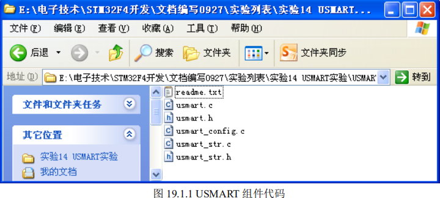
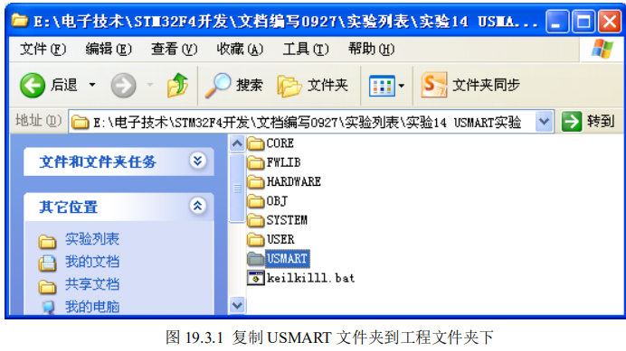
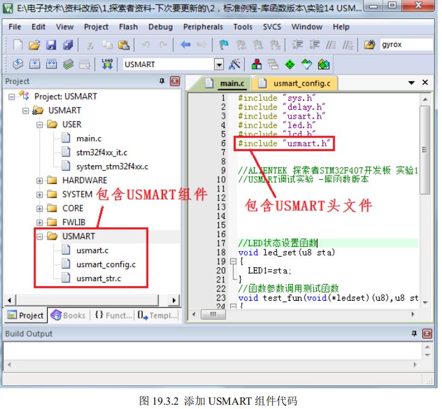
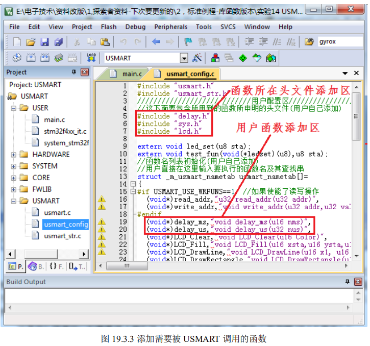
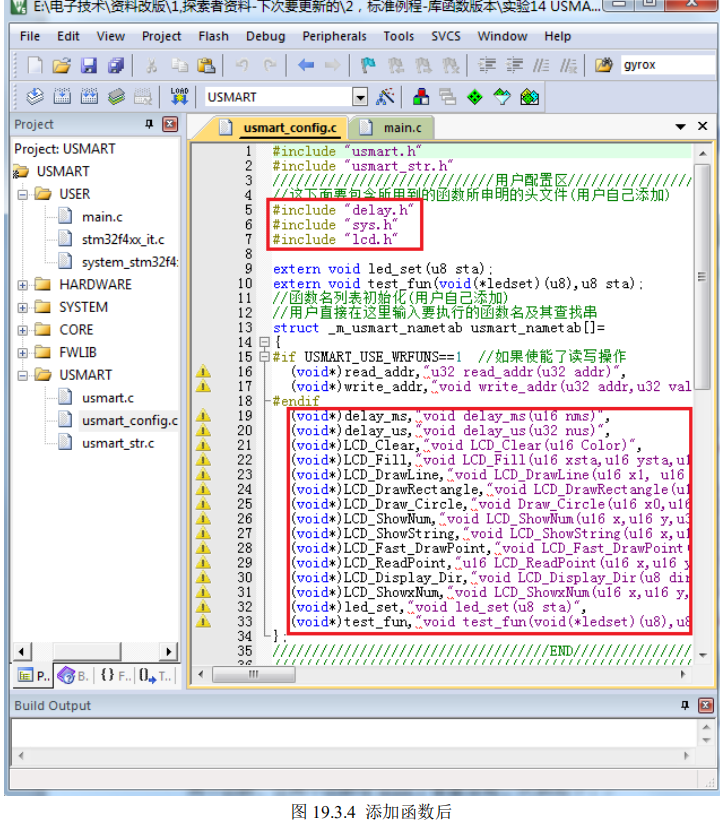
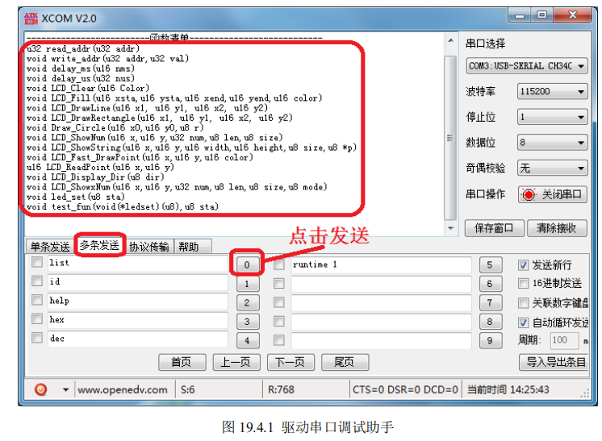
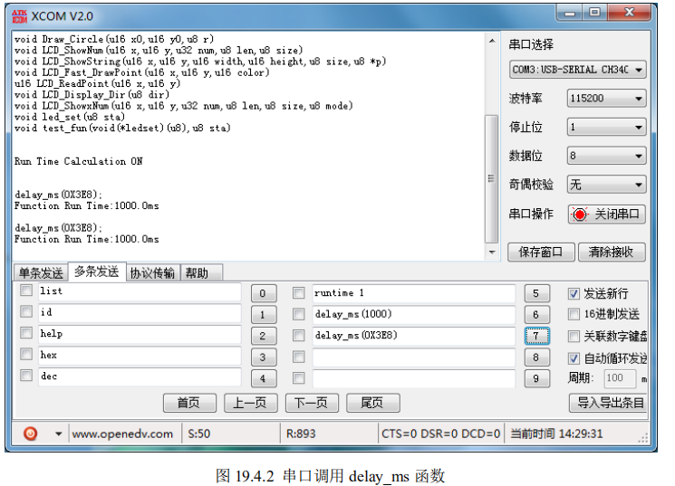
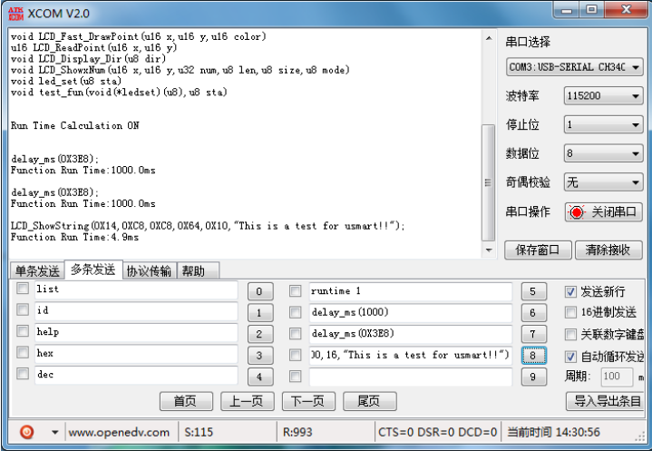
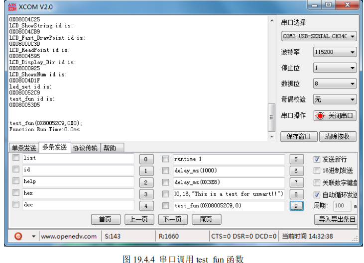

# **USMART** **调试组件实验**

本章，我们将向大家介绍一个十分重要的辅助调试工具：USMART 调试组件。该

组件由 ALIENTEK 开发提供，功能类似 linux 的 shell（RTT 的 finsh 也属于此类）。USMART 最主要 

的功能就是通过串口调用单片机里面的函数，并执行，对我们调试代码是很有帮助的。


## 1 USMART** **调试组件简介** 

USMART 是由 ALIENTEK 开发的一个灵巧的串口调试互交组件，通过它你可以通过串口 助手调用程序里面的任何函数，并执行。

因此，你可以随意更改函数的输入参数（支持数字（10/16 进制，支持负数)、字符串、函数入口地址等作为参数），单个函数最多支持 10 个输入参数，并支持函数返回值显示，目前最新版本为 V3.2。 

USMART 的特点如下： 

1. 可以调用绝大部分用户直接编写的函数。 
2.  资源占用极少（最少情况：FLASH:4K；SRAM:72B）。 
3.  支持参数类型多（数字（包含 10/16 进制，支持负数）、字符串、函数指针等）。 
4.  支持函数返回值显示。 
5.  支持参数及返回值格式设置。 
6.  支持函数执行时间计算（V3.1 版本新特性）。 
7.  使用方便。 

有了 USMART，你可以轻易的修改函数参数、查看函数运行结果，从而快速解决问题。

比 如你调试一个摄像头模块，需要修改其中的几个参数来得到最佳的效果，普通的做法：写函数 →修改参数→下载→看结果→不满意→修改参数→下载→看结果→不满意….不停的循环，直到 满意为止。

**这样做很麻烦不说，单片机也是有寿命的啊，老这样不停的刷，很折寿的。**

而利用 USMART，则只需要在串口调试助手里面输入函数及参数，然后直接串口发送给单片机，就执 行了一次参数调整，不满意的话，你在串口调试助手修改参数在发送就可以了，直到你满意为 止。

这样，修改参数十分方便，不需要编译、不需要下载、不会让单片机折寿。 

USMART 支持的参数类型基本满足任何调试了，支持的类型有：10 或者 16 进制数字、字符串指针（如果该参数是用作参数返回的话，可能会有问题！）、函数指针等。

因此绝大部分函数，可以直接被 USMART 调用，对于不能直接调用的，你只需要重写一个函数，把影响调用的参数去掉即可，这个重写后的函数，即可以被 USMART 调用了。 

### USMART 的实现流程简单概括就是：

1. 第一步，添加需要调用的函数（在 usmart_config.c 里 面的 usmart_nametab 数组里面添加）；
2. 第二步，初始化串口；
3. 第三步，初始化 USMART（通过 usmart_init 函数实现）；
4. 第四步，轮询 usmart_scan 函数，处理串口数据。 

经过以上简单介绍，我们对 USMART 有了个大概了解，接下来我们来简单介绍下 USMART 组件的移植。 

USMART 组件总共包含 6 文件如图 19.1.1 所示



其中 redeme.txt 是一个说明文件，不参与编译。其他五个文件，usmart.c 负责与外部互交等。 

usmat_str.c 主要负责命令和参数解析。usmart_config.c 主要由用户添加需要由 usmart 管理的函数。 

usmart.h 和 usmart_str.h 是两个头文件，其中 usmart.h 里面含有几个用户配置宏定义，可以 用来配置 usmart 的功能及总参数长度(直接和 SRAM 占用挂钩)、是否使能定时器扫描、是否使 用读写函数等。 

USMART 的移植，只需要实现 5 个函数。

其中 4 个函数都在 usmart.c 里面，另外一个是串口接收函数，必须由用户自己实现，用于接收串口发送过来的数据。 

第一个函数，串口接收函数。

第二个是 void usmart_init(void)函数，该函数的实现代码如下： 

```c
//初始化串口控制器
//sysclk:系统时钟（Mhz）
void usmart_init(u8 sysclk)
{
#if USMART_ENTIMX_SCAN==1
Timer4_Init(1000,(u32)sysclk*100-1); //分频,时钟为 10K ,100ms 中断一次,注意,计数频
//率必须为 10Khz,以和 runtime 单位(0.1ms)同步.
#endif
usmart_dev.sptype=1; //十六进制显示参数
}
```

该函数有一个参数 sysclk，就是用于定时器初始化。

另外 USMART_ENTIMX_SCAN 是在 usmart.h 里面定义的一个是否使能定时器中断扫描的宏定义。

- 如果为 1，就初始化定时器中断， 并在中断里面调用 usmart_scan 函数。
- 如果为 0，那么需要用户需要自行间隔一定时间（100ms 左右为宜）

调用一次 usmart_scan 函数，以实现串口数据处理。

### **注意：如果要使用函数执行时** 间统计功能（runtime 1），则必须设置** **USMART_ENTIMX_SCAN** **为** **1****。

另外，为了让统计时** 间精确到** **0.1ms****，定时器的计数时钟频率必须设置为** **10Khz****，否则时间就不是** **0.1ms** **了。**

第三和第四个函数仅用于服务 USMART 的函数执行时间统计功能（串口指令：runtime 1），分别是：

`usmart_reset_runtime` 和` usmart_get_runtime`

这两个函数代码如下： 

```c
//复位 runtime
//需要根据所移植到的 MCU 的定时器参数进行修改
void usmart_reset_runtime(void)
{
    TIM_ClearFlag(TIM4, TIM_FLAG_Update); //清除中断标志位
    TIM_SetAutoreload(TIM4, 0XFFFF);      //将重装载值设置到最大
    TIM_SetCounter(TIM4, 0);
    //清空定时器的 CNT
    usmart_dev.runtime = 0;
} //获得 runtime 时间
//返回值:执行时间,单位:0.1ms,最大延时时间为定时器 CNT 值的 2 倍*0.1ms
//需要根据所移植到的 MCU 的定时器参数进行修改
u32 usmart_get_runtime(void)
{
    if (TIM_GetFlagStatus(TIM4, TIM_FLAG_Update) == SET) //在运行期间,产生了定时器溢出
    {
        usmart_dev.runtime += 0XFFFF;
    }
    usmart_dev.runtime += TIM_GetCounter(TIM4);
    return usmart_dev.runtime;
    //返回计数值
}
```

这里我们利用定时器 4 来做执行时间计算，usmart_reset_runtime 函数在每次 USMART 调用函数之前执行，清除计数器，然后在函数执行完之后，调用 usmart_get_runtime 获取整个函数的运行时间。

由于 usmart 调用的函数，都是在中断里面执行的，所以我们不太方便再用定时器的中断功能来实现定时器溢出统计，因此，USMART 的函数执行时间统计功能，最多可以统 计定时器溢出 1 次的时间，对 STM32F4 的定时器 4，该定时器是 16 位的，最大计数是 65535， 而由于我们定时器设置的是 0.1ms 一个计时周期（10Khz），所以最长计时时间是： 

65535*2*0.1ms=13.1 秒。

也就是说，如果函数执行时间超过 13.1 秒，那么计时将不准确。 

最后一个是 usmart_scan 函数，该函数用于执行 usmart 扫描，该函数需要得到两个参量， 第一个是从串口接收到的数组（USART_RX_BUF），第二个是串口接收状态（USART_RX_STA）。 

接收状态包括接收到的数组大小，以及接收是否完成。

该函数代码如下：

```c
//usmart 扫描函数
//通过调用该函数,实现 usmart 的各个控制.该函数需要每隔一定时间被调用一次
//以及时执行从串口发过来的各个函数.
//本函数可以在中断里面调用,从而实现自动管理.
//非 ALIENTEK 开发板用户,则 USART_RX_STA 和 USART_RX_BUF[]需要用户自己实现
void usmart_scan(void)
{
    u8 sta, len;
    if (USART_RX_STA & 0x8000) //串口接收完成？
    {
        len = USART_RX_STA & 0x3fff;            //得到此次接收到的数据长度
        USART_RX_BUF[len] = '\0';               //在末尾加入结束符.
        sta = usmart_dev.cmd_rec(USART_RX_BUF); //得到函数各个信息
        if (sta == 0)
            usmart_dev.exe(); //执行函数
        else
        {
            len = usmart_sys_cmd_exe(USART_RX_BUF);
            if (len != USMART_FUNCERR)
                sta = len;
            if (sta)
            {
                switch (sta)
                {
                case USMART_FUNCERR:
                    printf("函数错误!\r\n");
                    break;
                case USMART_PARMERR:
                    printf("参数错误!\r\n");
                    break;
                case USMART_PARMOVER:
                    printf("参数太多!\r\n");
                    break;
                case USMART_NOFUNCFIND:
                    printf("未找到匹配的函数!\r\n");
                    break;
                }
            }
        }
        USART_RX_STA = 0; //状态寄存器清空
    }
}
```

该函数的执行过程：先判断串口接收是否完成（USART_RX_STA 的最高位是否为 1），如 果完成，则取得串口接收到的数据长度（USART_RX_STA 的低 14 位），并在末尾增加结束符， 

再执行解析，解析完之后清空接收标记（USART_RX_STA 置零）。

如果没执行完成，则直接跳过，不进行任何处理。 

完成这几个函数的移植，你就可以使用 USMART 了。

不过，需要注意的是，usmart 同外部的互交，一般是通过 usmart_dev 结构体实现，所以 usmart_init 和 usmart_scan 的调用分别是 

通过：`usmart_dev.init `和` usmart_dev.scan` 实现的。 

下面，我们将在 [cha-TFTLCD](..\cha-TFTLCD) 的基础上，移植USMART，并通过USMART调用一些TFTLCD 的内部函数，让大家初步了解 USMART 的使用。 


## **2** **硬件设计** 

### 本实验用到的硬件资源有： 

#### 1） 指示灯 DS0 和 DS1

#### 2） 串口 

#### 3） TFTLCD 模块 

这三个硬件在前面章节均有介绍，本章不再介绍

## **3** **软件设计** 

软件设计我们在上一章实验的基础上添加 USMART 组件相关的支持。




接着，我们打开工程，并新建 USMART 组，添加 USMART 组件代码，同时把 USMART 文件夹添加到头文件包含路径，在主函数里面加入 include“usmart.h”如图 19.3.2 所示：




由于 USMART 默认提供了 STM32F4 的 TIM4 中断初始化设置代码，我们只需要在 usmart.h 里面设置 `USMART_ENTIMX_SCAN `为 1，即可完成 TIM4 的设置，通过 TIM4 的中断服务函数，调用 `usmart_dev.scan()`（就是 `usmart_scan `函数），实现 usmart 的扫描。

此部分代码我们就不列出来了，请参考 usmart.c。 

此时，我们就可以使用 USMART 了，不过在主程序里面还得执行 usmart 的初始化，另外 还需要针对你自己想要被 USMART 调用的函数在 usmart_config.c 里面进行添加。下面先介绍 

如何添加自己想要被 USMART 调用的函数，打开 usmart_config.c，如图 19.3.3 所示：

​	


这里的添加函数很简单，只要把函数所在头文件添加进来，并把函数名按上图所示的方式增加即可，默认我们添加了两个函数：`delay_ms` 和` delay_us`。另外，`read_addr `和 `write_addr `属 于 usmart 自带的函数，用于读写指定地址的数据，通过配置 USMART_USE_WRFUNS，可以 使能或者禁止这两个函数。 

这里我们根据自己的需要按上图的格式添加其他函数，添加完之后如图 19.3.4 所示：



上图中，我们添加了 `lcd.h`，并添加了很多 `LCD `函数，最后我们还添加了 `led_set `和 `test_fun `

两个函数，这两个函数在 main.c 里面实现，代码如下：


```c
//LED 状态设置函数
void led_set(u8 sta)
{
	LED1=sta;
} 
//函数参数调用测试函数
void test_fun(void(*ledset)(u8),u8 sta)
{
	ledset(sta);
}
```

`led_set `函数，用于设置 LED1 的状态，而第二个函数 `test_fun `则是测试 USMART 对函数参数的支持的，test_fun 的第一个参数是函数，在 USMART 里面也是可以被调用的。 

在添加完函数之后，我们修改 main 函数，如下：

```c
int main(void)
{ 
 
	NVIC_PriorityGroupConfig(NVIC_PriorityGroup_2);//设置系统中断优先级分组2
	delay_init(168);      //初始化延时函数
	uart_init(115200);		//初始化串口波特率为115200
	usmart_dev.init(84); 	//初始化USMART			
	LED_Init();					  //初始化LED
 	LCD_Init();           //初始化LCD
	POINT_COLOR=RED;
	LCD_ShowString(30,50,200,16,16,"Explorer STM32F4");	
	LCD_ShowString(30,70,200,16,16,"USMART TEST");	
	LCD_ShowString(30,90,200,16,16,"ATOM@ALIENTEK");
	LCD_ShowString(30,110,200,16,16,"2014/5/5");	   
  	while(1) 
	{		 	  
		LED0=!LED0;					 
		delay_ms(500);	
	}
}
```

此代码显示简单的信息后，就是在死循环等待串口数据。至此，整个 usmart 的移植就完成 了。编译成功后，就可以下载程序到开发板，开始 USMART 的体验。 


## **4** **下载验证**

将程序下载到探索者 STM32F4 开发板后，可以看到 DS0 不停的闪烁，提示程序已经在运行了。同时，屏幕上显示了一些字符（就是主函数里面要显示的字符）。 

我们打开串口调试助手 XCOM，选择正确的串口号→多条发送→勾选发送新行（即发送回车键）选项，然后发送 list 指令，即可打印所有 usmart 可调用函数。如下图所示：



上图中

-  list
- id
- ？
- help
- hex
- dec
- runtime 

都属于 usmart 自带的系统命令。

下面我们简单介绍下这几个命令： 

上图中 list、id、help、hex、dec 和 runtime 都属于 usmart 自带的系统命令，点击后方的数 

字按钮，即可发送对应的指令。

下面我们简单介绍下这几个命令： 

- list
    - 该命令用于打印所有 usmart 可调用函数。发送该命令后，串口将受到所有能被 usmart 调用得到函数，如图 19.4.1 所示。 
- id
    - 该指令用于获取各个函数的入口地址。比如前面写的 test_fun 函数，就有一个函数参数， 
    - 我们需要先通过 id 指令，获取 led_set 函数的 id（即入口地址），然后将这个 id 作为函数参数， 传递给 test_fun。 
- help
    - （或者‘ ？’也可以），发送该指令后，串口将打印 usmart 使用的帮助信息。 
- hex 和 dec
    - 这两个指令可以带参数，也可以不带参数。
    - 当不带参数的时候
        - hex 和 dec 分别用于设置串口显示数据格式为 16 进制/10 进制。
    - 当带参数的时候
        - hex 和 dec 就执行进制转换
            - 比如输入：hex 1234，串口将打印：HEX:0X4D2，也就是将 1234 转换为 16 进制打印出来。 
            - 又比如输入：dec 0X1234，串口将打印：DEC:4660，就是将 0X1234 转换为 10 进制打印出来。 
- runtime 指令
    - 用于函数执行时间统计功能的开启和关闭
        - 发送：runtime 1，可以开启函数 执行时间统计功能；
        - 发送：runtime 0，可以关闭函数执行时间统计功能。函数执行时间统计功能，默认是关闭的。 

大家可以亲自体验下这几个系统指令，不过要注意，所有的指令都是大小写敏感的，不要写错哦。 

接下来，我们将介绍如何调用 list 所打印的这些函数，先来看一个简单的 delay_ms 的调用， 

我们分别输入 delay_ms(1000)和 delay_ms(0x3E8)，如图 19.4.2 所示：



从上图可以看出，delay_ms(1000)和 delay_ms(0x3E8)的调用结果是一样的，都是延时1000ms，因为 usmart 默认设置的是 hex 显示，所以看到串口打印的参数都是 16 进制格式的，

大家可以通过发送 dec 指令切换为十进制显示。

另外，由于 USMART 对调用函数的参数大小写不敏感，所以参数写成：0X3E8 或者 0x3e8 都是正确的。

另外，发送：runtime 1，开启运行时间统计功能，从测试结果看，USMART 的函数运行时间统计功能，是相当准确的。 

我们再看另外一个函数，LCD_ShowString 函数，该函数用于显示字符串，我们通过串口输入：

`LCD_ShowString(20,200,200,100,16,"This is a test for usmart!!")`

如图 19.4.3 所示：



该函数用于在指定区域，显示指定字符串，发送给开发板后，我们可以看到 LCD 在我们指定的地方显示了：This is a test for usmart!! 这个字符串。 

其他函数的调用，也都是一样的方法，这里我们就不多介绍了，最后说一下带有函数参数的函数的调用。

我们将 led_set 函数作为 test_fun 的参数，通过在 test_fun 里面调用 led_set 函数，实现对 DS1(LED1)的控制。

前面说过，我们要调用带有函数参数的函数，就必须先得到函数参数的入口地址（id），通过输入 id 指令，我们可以得到 led_set 的函数入口地址是：`0X080052C9`， 

所以，我们在串口输入：`test_fun(0X080052C9,0)`，就可以控制 DS1 亮了。如图 19.4.4 所示：



在开发板上，我们可以看到，收到串口发送的 test_fun(0X080052C9,0)后，开发板的 DS1 亮了，然后大家可以通过发送test_fun(0X080052C9,1)，来关闭DS1。

说明我们成功的通过test_fun 函数调用 led_set，实现了对 DS1 的控制。

也就验证了 USMART 对函数参数的支持。 USMART 调试组件的使用，就为大家介绍到这里。USMART 是一个非常不错的调试组件，

#### 希望大家能学会使用，可以达到事半功倍的效果

**用了一下， 挺不错的**