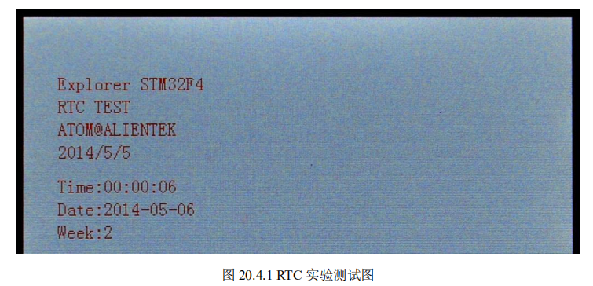
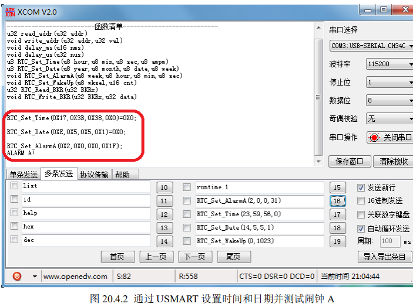

# **RTC** **实时时钟实验**

## **1 STM32F4 RTC** **时钟简介** 

## **2** **硬件设计**

## **3** **软件设计**

#### `My_RTC_Init`

该函数用来初始化 RTC 配置以及日期和时钟，但是只在第一次的时候设置时间，以后如果 重新上电/复位都不会再进行时间设置了（前提是备份电池有电）。

在第一次配置的时候，我们是按照上面介绍的 RTC 初始化步骤来做的，这里就不在多说了。 

```c
u8 My_RTC_Init(void)
{
RTC_InitTypeDef RTC_InitStructure;
u16 retry=0X1FFF; 
 RCC_APB1PeriphClockCmd(RCC_APB1Periph_PWR, ENABLE);//使能 PWR 时钟
PWR_BackupAccessCmd(ENABLE); //使能后备寄存器访问
if(RTC_ReadBackupRegister(RTC_BKP_DR0)!=0x5050)//是否第一次配置? {
RCC_LSEConfig(RCC_LSE_ON);//LSE 开启 
while (RCC_GetFlagStatus(RCC_FLAG_LSERDY) == RESET)
//检查指定的 RCC 标志位设置与否,等待低速晶振就绪
{ retry++;
delay_ms(10);
}
if(retry==0)return 1; //LSE 开启失败. 
RCC_RTCCLKConfig(RCC_RTCCLKSource_LSE); //选择 LSE 作为 RTC 时钟
RCC_RTCCLKCmd(ENABLE); //使能 RTC 时钟
 RTC_InitStructure.RTC_AsynchPrediv = 0x7F;//RTC 异步分频系数(1~0X7F)
 RTC_InitStructure.RTC_SynchPrediv = 0xFF;//RTC 同步分频系数(0~7FFF)
 RTC_InitStructure.RTC_HourFormat = RTC_HourFormat_24;//24 小时格式
 RTC_Init(&RTC_InitStructure);//初始化 RTC 参数
RTC_Set_Time(23,59,56,RTC_H12_AM); //设置时间
RTC_Set_Date(14,5,5,1); //设置日期
RTC_WriteBackupRegister(RTC_BKP_DR0,0x5050);//标记已经初始化过了
} 
return 0;
}
```


#### RTC_Set_Time RTC_Set_Date

这设置时间和日期，分别是通过 上面两个函数来实现的，这两个函数实际就是调用库函数里面的 RTC_SetTime 函数和 RTC_SetDate 函数来实现

这里我们之所 以要写两个这样的函数，目的是为了我们的 USMART 来调用，方便直接通过 USMART 来设置 时间和日期。 

#### RTC_Set_AlarmA

该函数用于设置闹钟 A，也就是设置 ALRMAR 和 ALRMASSR 寄存器的值，来设置闹钟 

时间，这里库函数中用来设置闹钟的函数为：

```c
void RTC_SetAlarm(uint32_t RTC_Format, uint32_t RTC_Alarm, RTC_AlarmTypeDef* RTC_AlarmStruct);
```

第一个参数 `RTC_Format `用来设置格式，这里前面我们讲解过，就不做过多讲解。 

第二个参数 `RTC_Alarm `用来设置是闹钟 A 还是闹钟 B，我们使用的是闹钟 A，所以值为 `RTC_Alarm_A`。 

第三个参数就是我们用来设置闹钟参数的结构体指针。接下来我们看看 

#### `RTC_AlarmTypeDef `结构体的定义：

```c
typedef struct 

{ 

 RTC_TimeTypeDef RTC_AlarmTime;  

 uint32_t RTC_AlarmMask; 

uint32_t RTC_AlarmDateWeekDaySel; 

 uint8_t RTC_AlarmDateWeekDay;  

}RTC_AlarmTypeDef;
```

第一个成员变量为 RTC_TimeTypeDef 类型的成员变量 RTC_AlarmTime，这个是 用来设置闹钟时间的，RTC_TimeTypeDef 结构体成员变量的含义我们在之前已经讲解，这里我 们就不做过多讲解。 

第二个参数 RTC_AlarmMask，使用来设置闹钟时间掩码，也就是在我们第一个参数设置的 时间中（包括后面参数 RTC_AlarmDateWeekDay 设置的星期几/哪一天），哪些是无关的。 

比  我 们 设 置 闹 钟 时 间 为 每 天 的 10 点 10 分 10 秒 ， 那 么 我 们 可 以 选 择 值 

`RTC_AlarmMask_DateWeekDay`，也就是我们不关心是星期几/每月哪一天。

这里我们选择为 `RTC_AlarmMask_None`，也就是精确匹配时间，所有的时分秒以及星期几/(或者每月哪一天)都 要精确匹配。 

第三个参数 `RTC_AlarmDateWeekDaySel`，用来选择是闹钟是按日期还是按星期。比如我们 选 择 RTC_AlarmDateWeekDaySel_WeekDay 那 么 闹 钟 就 是 按 星 期 。

 如 果 我 们 选 择 `RTC_AlarmDateWeekDaySel_Date `那么闹钟就是按日期。

这与后面第四个参数是有关联的，我们在后面第四个参数讲解。 

第四个参数 `RTC_AlarmDateWeekDay `用来设置闹钟的日期或者星期几。

比如我们第三个参 数 `RTC_AlarmDateWeekDaySel `设置了值为 `RTC_AlarmDateWeekDaySel_WeekDay`,也就是按星 期 ， 那 么 参 数 `RTC_AlarmDateWeekDay `的 取 值 范 围 就 为 星 期 一 ~ 星 期 天 ， 也 就 是 

`RTC_Weekday_Monday`~`RTC_Weekday_Sunday`。

如果第三个参数 `RTC_AlarmDateWeekDaySel `设置值为 `RTC_AlarmDateWeekDaySel_Date`，那么它的取值范围就为日期值，0~31。 

调用函数 RTC_SetAlarm 设置闹钟 A 的参数之后，最后，开启闹钟 A 中断（连接在外部中 

断线 17），并设置中断分组。当 RTC 的时间和闹钟 A 设置的时间完全匹配时，将产生闹钟中断。 

接着，我们介绍一下 `RTC_Set_WakeUp `函数，该函数代码如下： 

#### RTC_Set_WakeUp 

```c
//周期性唤醒定时器设置
//wksel: @ref RTC_Wakeup_Timer_Definitions
//cnt:自动重装载值.减到 0,产生中断.
void RTC_Set_WakeUp(u32 wksel,u16 cnt)
{ 
EXTI_InitTypeDef EXTI_InitStructure;
RTC_WakeUpCmd(DISABLE);//关闭 WAKE UP
RTC_WakeUpClockConfig(wksel);//唤醒时钟选择
RTC_SetWakeUpCounter(cnt);//设置 WAKE UP 自动重装载寄存器
RTC_ClearITPendingBit(RTC_IT_WUT); //清除 RTC WAKE UP 的标志
 EXTI_ClearITPendingBit(EXTI_Line22);//清除 LINE22 上的中断标志位
RTC_ITConfig(RTC_IT_WUT,ENABLE);//开启 WAKE UP 定时器中断
RTC_WakeUpCmd( ENABLE);//开启 WAKE UP 定时器
EXTI_InitStructure.EXTI_Line = EXTI_Line22;//LINE22
 EXTI_InitStructure.EXTI_Mode = EXTI_Mode_Interrupt;//中断事件
 EXTI_InitStructure.EXTI_Trigger = EXTI_Trigger_Rising; //上升沿触发
 EXTI_InitStructure.EXTI_LineCmd = ENABLE;//使能 LINE22
 EXTI_Init(&EXTI_InitStructure);//配置
 NVIC_InitStructure.NVIC_IRQChannel = RTC_WKUP_IRQn; 
 NVIC_InitStructure.NVIC_IRQChannelPreemptionPriority = 0x02;//抢占优先级 1
 NVIC_InitStructure.NVIC_IRQChannelSubPriority = 0x02;//响应优先级 2
 NVIC_InitStructure.NVIC_IRQChannelCmd = ENABLE;//使能外部中断通道
 NVIC_Init(&NVIC_InitStructure);//配置
}
```

该函数用于设置 RTC 周期性唤醒定时器，步骤同 RTC_Set_AlarmA 级别一样，只是周期性 唤醒中断，连接在外部中断线 22。 

有了中断设置函数，就必定有中断服务函数，接下来看这两个中断的中断服务函数，代码 如下：

```c
//RTC 闹钟中断服务函数
void RTC_Alarm_IRQHandler(void)
{ 
if(RTC_GetFlagStatus(RTC_FLAG_ALRAF)==SET)//ALARM A 中断? { RTC_ClearFlag(RTC_FLAG_ALRAF);//清除中断标志
printf("ALARM A!\r\n");
} 
EXTI_ClearITPendingBit(EXTI_Line17); //清除中断线 17 的中断标志
}
//RTC WAKE UP 中断服务函数
void RTC_WKUP_IRQHandler(void)
{ 
if(RTC_GetFlagStatus(RTC_FLAG_WUTF)==SET)//WK_UP 中断?
{ 
RTC_ClearFlag(RTC_FLAG_WUTF); //清除中断标志
LED1=!LED1; 
} 
EXTI_ClearITPendingBit(EXTI_Line22);//清除中断线 22 的中断标志
}
```

其中，RTC_Alarm_IRQHandler 函数用于闹钟中断，该函数先判断中断类型，然后执行对 应操作，每当闹钟 A 闹铃时，会从串口打印一个：ALARM A!的字符串。

RTC_WKUP_IRQHandler 函数用于 RTC 自动唤醒定时器中断，先判断中断类型，然后对 LED1 取反操作，可以通过观察 

LED1 的状态来查看 RTC 自动唤醒中断的情况。 

rtc.h 头文件中主要是一 些函数声明，我们就不多说了，有些函数在这里没有介绍，请大家参考本例程源码。 

最后我们看看 main 函数源码如下： 

```c

int main(void)
{ 

	RTC_TimeTypeDef RTC_TimeStruct;
	RTC_DateTypeDef RTC_DateStruct;

	u8 tbuf[40];
	u8 t=0;
	NVIC_PriorityGroupConfig(NVIC_PriorityGroup_2);//设置系统中断优先级分组2
	delay_init(168);      //初始化延时函数
	uart_init(115200);		//初始化串口波特率为115200
	
	usmart_dev.init(84); 	//初始化USMART	
	LED_Init();					  //初始化LED
 	LCD_Init();					  //初始化LCD
	My_RTC_Init();		 		//初始化RTC
 
	RTC_Set_WakeUp(RTC_WakeUpClock_CK_SPRE_16bits,0);		//配置WAKE UP中断,1秒钟中断一次
	
	POINT_COLOR=RED;
	LCD_ShowString(30,50,200,16,16,"Explorer STM32F4");	
	LCD_ShowString(30,70,200,16,16,"RTC TEST");	
	LCD_ShowString(30,90,200,16,16,"ATOM@ALIENTEK");
	LCD_ShowString(30,110,200,16,16,"2014/5/5");	
  	while(1) 
	{		
		t++;
		if((t%10)==0)	//每100ms更新一次显示数据
		{
;
			RTC_GetTime(RTC_Format_BIN,&RTC_TimeStruct);
			
			sprintf((char*)tbuf,"Time:%02d:%02d:%02d",RTC_TimeStruct.RTC_Hours,RTC_TimeStruct.RTC_Minutes,RTC_TimeStruct.RTC_Seconds); 
			LCD_ShowString(30,140,210,16,16,tbuf);	
			
			RTC_GetDate(RTC_Format_BIN, &RTC_DateStruct);
			
			sprintf((char*)tbuf,"Date:20%02d-%02d-%02d",RTC_DateStruct.RTC_Year,RTC_DateStruct.RTC_Month,RTC_DateStruct.RTC_Date); 
			LCD_ShowString(30,160,210,16,16,tbuf);	
			sprintf((char*)tbuf,"Week:%d",RTC_DateStruct.RTC_WeekDay); 
			LCD_ShowString(30,180,210,16,16,tbuf);
		} 
		if((t%20)==0)LED0=!LED0;	//每200ms,翻转一次LED0 
		delay_ms(10);
	}	
}

```

`RTC_Set_WakeUp(RTC_WakeUpClock_CK_SPRE_16bits,0);`

设置 RTC 周期性自动唤醒周期 为 1 秒钟，类似于 STM32F1 的秒钟中断。然后，在 main 函数不断的读取 RTC 的时间和日期（每 100ms 一次），并显示在 LCD 上面。

为了方便设置时间，我们在 usmart_config.c 里面，修改 usmart_nametab 如下： 

```c
struct _m_usmart_nametab usmart_nametab[]=
{
#if USMART_USE_WRFUNS==1 //如果使能了读写操作
(void*)read_addr,"u32 read_addr(u32 addr)",
(void*)write_addr,"void write_addr(u32 addr,u32 val)",
#endif 
(void*)RTC_Set_Time,"u8 RTC_Set_Time(u8 hour,u8 min,u8 sec,u8 ampm)",
(void*)RTC_Set_Date,"u8 RTC_Set_Date(u8 year,u8 month,u8 date,u8 week)",
(void*)RTC_Set_AlarmA,"void RTC_Set_AlarmA(u8 week,u8 hour,u8 min,u8 sec)",
(void*)RTC_Set_WakeUp,"void RTC_Set_WakeUp(u8 wksel,u16 cnt)", 
};
```

将 RTC 的一些相关函数加入了 usmart，这样通过串口就可以直接设置 RTC 时间、日期、 闹钟 A、周期性唤醒和备份寄存器读写等操作。 

至此，RTC 实时时钟的软件设计就完成了，接下来就让我们来检验一下，我们的程序是否 正确了。 

## **4** **下载验证** 

将程序下载到探索者 STM32F4 开发板后，可以看到 DS0 不停的闪烁，提示程序已经在运 行了。



同时可以看到 TFTLCD 模块开始显示时间，实际显示效果如图 20.4.1 所示：

如果时间和日期不正确，可以利用上一章介绍的 usmart 工具，通过串口来设置，并且可以 

设置闹钟时间等，如图 20.4.2 所示：



可以看到，设置闹钟 A 后，串口返回了 ALARM A!字符串，说明我们的闹钟 A 代码正常 运行了！