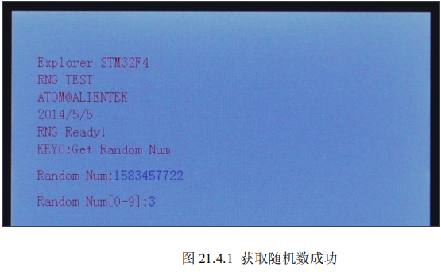

# **硬件随机数实验** 

本章我们将向大家介绍 STM32F4 的硬件随机数发生器。在本章中，我们将使用 KEY0 按 键来获取硬件随机数，并且将获取到的随机数值显示在 LCD 上面，同时，使用 DS0 指示程序 运行状态。

## **1 STM32F4** **随机数发生器简介**

### 随机数发生器操作步骤如下： 

1. 使能随机数发生器时钟。
2. **使能随机数发生器。** 
3. **判断** **DRDY** **位**
4. **读取随机数值。** 

## **2** **硬件设计** 

### 本实验用到的硬件资源有： 

1） 指示灯 DS0 

2） 串口 

3） TFTLCD 模块 

4） RTC 

前面 3 个都介绍过了，而 RTC 属于 STM32F4 内部资源，其配置也是通过软件设置好就可 以了。

不过 RTC 不能断电，否则数据就丢失了，我们如果想让时间在断电后还可以继续走，那 么必须确保开发板的电池有电（ALIENTEK 探索者 STM32F4 开发板标配是有电池的

## **3** **软件设计** 

打开本章的实验工程可以看到，我们在 FWLIB 下面添加了随机数发生器支持库函数 stm32f4xx_rng.c 和对应的头文件 stm32f4xx_rng.h。同时我们编写的随机数发生器相关的函数在 新增的文件 rng.c 中。 

```C
u8 RNG_Init(void)
{
	u16 retry=0; 
	
  RCC_AHB2PeriphClockCmd(RCC_AHB2Periph_RNG, ENABLE);//开启RNG时钟,来自PLL48CLK
	
	RNG_Cmd(ENABLE);	//使能RNG
	
	while(RNG_GetFlagStatus(RNG_FLAG_DRDY)==RESET&&retry<10000)	//等待随机数就绪
	{
		retry++;
		delay_us(100);
	}
	if(retry>=10000)return 1;//随机数产生器工作不正常
	return 0;
}
//得到随机数
//返回值:获取到的随机数
u32 RNG_Get_RandomNum(void)
{	 
	while(RNG_GetFlagStatus(RNG_FLAG_DRDY)==RESET);	//等待随机数就绪  
	return RNG_GetRandomNumber();	
}

//生成[min,max]范围的随机数
int RNG_Get_RandomRange(int min,int max)
{ 
   return RNG_Get_RandomNum()%(max-min+1) +min;
}

```

该部分总共 3 个函数，其中：

#### RNG_Init 

用于初始化随机数发生器；

#### RNG_Get_RandomNum

用于读取随机数值；

#### RNG_Get_RandomRange 

用于读取一个特定范围内的随机数，实际上也是 调用的前一个函数 `RNG_Get_RandomNum `来实现的。

这些函数的实现方法都比较好理解。 

rng.h 头文件内容就主要是三个函数申明，比较简单，这里我们就不做讲解。 

最后我们看看 main.c 文件内容：

```C
int main(void)
{ 
	u32 random;
	u8 t=0,key;
	NVIC_PriorityGroupConfig(NVIC_PriorityGroup_2);//设置系统中断优先级分组2
	delay_init(168);  //初始化延时函数
	uart_init(115200);		//初始化串口波特率为115200
	LED_Init();					//初始化LED
	KEY_Init();					//按键初始化
 	LCD_Init();         //初始化液晶接口
	POINT_COLOR=RED;
	LCD_ShowString(30,50,200,16,16,"Explorer STM32F4");	
	LCD_ShowString(30,70,200,16,16,"RNG TEST");	
	LCD_ShowString(30,90,200,16,16,"ATOM@ALIENTEK");
	LCD_ShowString(30,110,200,16,16,"2014/5/5");	 
	while(RNG_Init())	 		//初始化随机数发生器
	{
		LCD_ShowString(30,130,200,16,16,"  RNG Error! ");	 
		delay_ms(200);
		LCD_ShowString(30,130,200,16,16,"RNG Trying...");	 
	}                                 
	LCD_ShowString(30,130,200,16,16,"RNG Ready!   ");	 
	LCD_ShowString(30,150,200,16,16,"KEY0:Get Random Num");	 
	LCD_ShowString(30,180,200,16,16,"Random Num:");	 
	LCD_ShowString(30,210,200,16,16,"Random Num[0-9]:");	 	
  
	POINT_COLOR=BLUE;
	while(1) 
	{		
		delay_ms(10);
		key=KEY_Scan(0);
		if(key==KEY0_PRES)
		{
			random=RNG_Get_RandomNum(); //获得随机数
			LCD_ShowNum(30+8*11,180,random,10,16); //显示随机数

		} 
		if((t%20)==0)
		{ 
			LED0=!LED0;	//每200ms,翻转一次LED0 
			random=RNG_Get_RandomRange(0,9);//获取[0,9]区间的随机数
			LCD_ShowNum(30+8*16,210,random,1,16); //显示随机数
		 }
		delay_ms(10);
		t++;
	}	
}
```

该部分代码也比较简单，在所有外设初始化成功后，进入死循环，等待按键按下，如果 KEY0 按下，则调用 RNG_Get_RandomNum 函数，读取随机数值，并将读到的随机数显示在 LCD 上 面。

每隔 200ms 获取一次区间[0,9]的随机数，并实时显示在液晶上。同时 DS0，周期性闪烁， 400ms 闪烁一次。这就实现了前面我们所说的功能。 

至此，本实验的软件设计就完成了，接下来就让我们来检验一下，我们的程序是否正确了。 

## **4** **下载验证** 

将程序下载到探索者 STM32F4 开发板后，可以看到 DS0 不停的闪烁，提示程序已经在运 行了。

同时每隔 200ms，获取一次区间[0,9]的随机数，实时显示在液晶上。

然后我们也可以按 下 KEY0，就可以在屏幕上看到获取到的随机数，如图 21.4.1 所示： 



