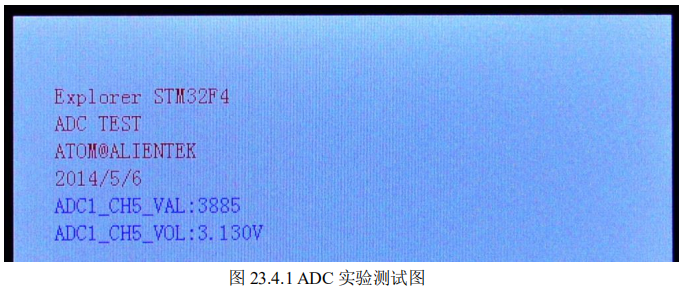

# **ADC** **实验**

## **1 STM32F4 ADC** **简介**

### 详细设置步骤：

1. **开启** **PA** **口时钟和** **ADC1** **时钟，设置** **PA5** **为模拟输入。** 
2. **设置** **ADC** **的通用控制寄存器** **CCR****，配置** **ADC** **输入时钟分频，模式为独立模式等。** 
3. **初始化** **ADC1** **参数，设置** **ADC1** **的转换分辨率，转换方式，对齐方式，以及规则序列** 
4. 开启** **AD** **转换器。** 
5. **读取** **ADC** **值。**

## **.2** **硬件设计** 

### 本实验用到的硬件资源有： 

#### 1） 指示灯 DS0 

#### 2） TFTLCD 模块 

#### 3） ADC 

#### 4） 杜邦线  

前面 2 个均已介绍过，而 ADC 属于 STM32F4 内部资源，实际上我们只需要软件设置就可 以正常工作，不过我们需要在外部连接其端口到被测电压上面。

本章，我们通过 ADC1 的通道 5（PA5）来读取外部电压值，探索者 STM32F4 开发板没有设计参考电压源在上面，但是板上 有几个可以提供测试的地方：1，3.3V 电源。2，GND。3，后备电池。注意：这里不能接到板上 5V 电源上去测试，这可能会烧坏 ADC!。 

因为要连接到其他地方测试电压，所以我们需要 1 跟杜邦线，或者自备的连接线也可以， 一头插在多功能端口 P12 的 ADC 插针上（与 PA5 连接），另外一头就接你要测试的电压点（确 保该电压不大于 3.3V 即可）。 

## **3** **软件设计** 

打开实验工程可以发现，我们在 FWLIB 分组下面新增了 stm32f4xx_adc.c 源文件，同时会 引入对应的头文件 stm32f4xx_adc.h。\

ADC 相关的库函数和宏定义都分布在这两个文件中。同时，我们在 HARDWARE 分组下面新建了 adc.c，也引入了对应的头文件 adc.h。这两个文件是 我们编写的 adc 相关的初始化函数和操作函数。 

打开 adc.c，代码如下

​													   

#### void  Adc_Init(void)

//初始化ADC		

```C
void  Adc_Init(void)
{    
  GPIO_InitTypeDef  GPIO_InitStructure;
	ADC_CommonInitTypeDef ADC_CommonInitStructure;
	ADC_InitTypeDef       ADC_InitStructure;
	
  RCC_AHB1PeriphClockCmd(RCC_AHB1Periph_GPIOA, ENABLE);//使能GPIOA时钟
  RCC_APB2PeriphClockCmd(RCC_APB2Periph_ADC1, ENABLE); //使能ADC1时钟

  //先初始化ADC1通道5 IO口
  GPIO_InitStructure.GPIO_Pin = GPIO_Pin_5;//PA5 通道5
  GPIO_InitStructure.GPIO_Mode = GPIO_Mode_AN;//模拟输入
  GPIO_InitStructure.GPIO_PuPd = GPIO_PuPd_NOPULL ;//不带上下拉
  GPIO_Init(GPIOA, &GPIO_InitStructure);//初始化  
 
	RCC_APB2PeriphResetCmd(RCC_APB2Periph_ADC1,ENABLE);	  //ADC1复位
	RCC_APB2PeriphResetCmd(RCC_APB2Periph_ADC1,DISABLE);	//复位结束	 
 
	
  ADC_CommonInitStructure.ADC_Mode = ADC_Mode_Independent;//独立模式
  ADC_CommonInitStructure.ADC_TwoSamplingDelay = ADC_TwoSamplingDelay_5Cycles;//两个采样阶段之间的延迟5个时钟
  ADC_CommonInitStructure.ADC_DMAAccessMode = ADC_DMAAccessMode_Disabled; //DMA失能
  ADC_CommonInitStructure.ADC_Prescaler = ADC_Prescaler_Div4;//预分频4分频。ADCCLK=PCLK2/4=84/4=21Mhz,ADC时钟最好不要超过36Mhz 
  ADC_CommonInit(&ADC_CommonInitStructure);//初始化
	
  ADC_InitStructure.ADC_Resolution = ADC_Resolution_12b;//12位模式
  ADC_InitStructure.ADC_ScanConvMode = DISABLE;//非扫描模式	
  ADC_InitStructure.ADC_ContinuousConvMode = DISABLE;//关闭连续转换
  ADC_InitStructure.ADC_ExternalTrigConvEdge = ADC_ExternalTrigConvEdge_None;//禁止触发检测，使用软件触发
  ADC_InitStructure.ADC_DataAlign = ADC_DataAlign_Right;//右对齐	
  ADC_InitStructure.ADC_NbrOfConversion = 1;//1个转换在规则序列中 也就是只转换规则序列1 
  ADC_Init(ADC1, &ADC_InitStructure);//ADC初始化
	
 
	ADC_Cmd(ADC1, ENABLE);//开启AD转换器	

}	


```


#### u16 Get_Adc(u8 ch)  

```
 
{
	  	//设置指定ADC的规则组通道，一个序列，采样时间
	ADC_RegularChannelConfig(ADC1, ch, 1, ADC_SampleTime_480Cycles );	//ADC1,ADC通道,480个周期,提高采样时间可以提高精确度			    
  
	ADC_SoftwareStartConv(ADC1);		//使能指定的ADC1的软件转换启动功能	
	 
	while(!ADC_GetFlagStatus(ADC1, ADC_FLAG_EOC ));//等待转换结束

	return ADC_GetConversionValue(ADC1);	//返回最近一次ADC1规则组的转换结果
}
```

//获得ADC值
//ch: @ref ADC_channels 
//通道值 0~16取值范围为：ADC_Channel_0~ADC_Channel_16
//返回值:转换结果


#### u16 Get_Adc_Average(u8 ch,u8 times)

//获取通道ch的转换值，取times次,然后平均 
//ch:通道编号
//times:获取次数
//返回值:通道ch的times次转换结果平均值

```
{
	u32 temp_val=0;
	u8 t;
	for(t=0;t<times;t++)
	{
		temp_val+=Get_Adc(ch);
		delay_ms(5);
	}
	return temp_val/times;
} 
```

​	 

此部分代码就 3 个函数，Adc_Init 函数用于初始化 ADC1。

这里基本上是按我们上面的步 骤来初始化的，我们用标号①~④标示出来步骤。这里我们仅开通了 1 个通道，即通道 5。第二 个函数 Get_Adc，用于读取某个通道的 ADC 值，例如我们读取通道 5 上的 ADC 值，就可以通 过 Get_Adc（ADC_Channel_5）得到。最后一个函数 `Get_Adc_Average`，用于多次获取 ADC 值， 取平均，用来提高准确度。 

头文件 adc.h 代码比较简单，主要是三个函数申明。接下来我们看看 main 函数内容：

```C

int main(void)
{ 
 	u16 adcx;
	float temp;
	NVIC_PriorityGroupConfig(NVIC_PriorityGroup_2);//设置系统中断优先级分组2
	delay_init(168);    //初始化延时函数
	uart_init(115200);	//初始化串口波特率为115200
	LED_Init();					//初始化LED 
 	LCD_Init();         //初始化LCD接口
	Adc_Init();         //初始化ADC
	POINT_COLOR=RED; 
	LCD_ShowString(30,50,200,16,16,"Explorer STM32F4");	
	LCD_ShowString(30,70,200,16,16,"ADC TEST");	
	LCD_ShowString(30,90,200,16,16,"ATOM@ALIENTEK");
	LCD_ShowString(30,110,200,16,16,"2014/5/6");	  
	POINT_COLOR=BLUE;//设置字体为蓝色
	LCD_ShowString(30,130,200,16,16,"ADC1_CH5_VAL:");	      
	LCD_ShowString(30,150,200,16,16,"ADC1_CH5_VOL:0.000V");	//先在固定位置显示小数点      
	while(1)
	{ 
		adcx=Get_Adc_Average(ADC_Channel_5,20);//获取通道5的转换值，20次取平均
		LCD_ShowxNum(134,130,adcx,4,16,0);    //显示ADCC采样后的原始值
		temp=(float)adcx*(3.3/4096);          //获取计算后的带小数的实际电压值，比如3.1111
		adcx=temp;                            //赋值整数部分给adcx变量，因为adcx为u16整形
		LCD_ShowxNum(134,150,adcx,1,16,0);    //显示电压值的整数部分，3.1111的话，这里就是显示3
		temp-=adcx;                           //把已经显示的整数部分去掉，留下小数部分，比如3.1111-3=0.1111
		temp*=1000;                           //小数部分乘以1000，例如：0.1111就转换为111.1，相当于保留三位小数。
		LCD_ShowxNum(150,150,temp,3,16,0X80); //显示小数部分（前面转换为了整形显示），这里显示的就是111.
		LED0=!LED0;
		delay_ms(250);	
	}
}

```

此部分代码，我们在 TFTLCD 模块上显示一些提示信息后，将每隔 250ms 读取一次 ADC 通道 5 的值，并显示读到的 ADC 值（数字量），以及其转换成模拟量后的电压值。

同时控制 LED0 闪烁，以提示程序正在运行。这里关于最后的 ADC 值的显示我们说明一下，首先我们在液晶 固定位置显示了小数点，然后后面计算步骤中，先计算出整数部分在小数点前面显示，然后计 算出小数部分，在小数点后面显示。这样就在液晶上面显示转换结果的整数和小数部分。 

## **4** **下载验证** 

在代码编译成功之后，我们通过下载代码到 ALIENTEK 探索者 STM32F4 开发板上，可以 看到 LCD 显示如图 23.4.1 所示



上图中，我们是将 ADC 和 TPAD 连接在一起，可以看到 TPAD 信号电平为 3V 左右，这是因为存在上拉电阻 R64 的缘故。 

同时伴随 DS0 的不停闪烁，提示程序在运行。大家可以试试把杜邦线接到其他地方，看看 电压值是否准确？但是一定别接到 5V 上面去，否则可能烧坏 ADC！ 

# **特别注意：**STM32F4 的 ADC 精度貌似不怎么好，ADC 引脚直接接 GND，都可以读到十 几的数值，相比 STM32F103 来说，要差了一些，在使用的时候，请大家注意下这个问题。 

通过这一章的学习，我们了解了 STM32F4 ADC 的使用，但这仅仅是 STM32F4 强大的 ADC 功能的一小点应用。

STM32F4 的 ADC 在很多地方都可以用到，其 ADC 的 DMA 功能是很不错的，建议有兴趣的大家深入研究下 STM32F4 的 ADC，相信会给你以后的开发带来方便。