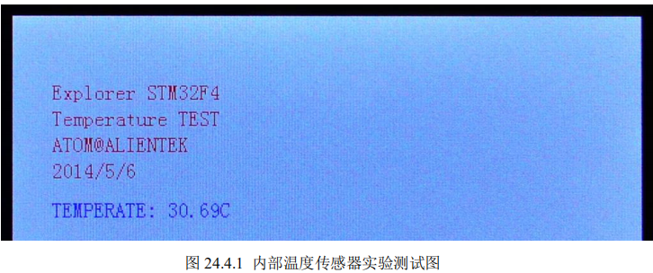

# **内部温度传感器实验**

## **1 STM32F4** **内部温度传感器简介**

### STM32F4 内部温度传感器使用的步骤了

1. **设置** **ADC1****，开启内部温度传感器。**
2. **读取通道** **16** **的** **AD** **值，计算结果。** 

## **2** **硬件设计**

### 本实验用到的硬件资源有： 

#### 1） 指示灯 DS0

#### 2） TFTLCD 模块 

#### 3） ADC 

#### 4） 内部温度传感器 

前三个之前均有介绍，而内部温度传感器也是在 STM32F4 内部，不需要外部设置，我 们只需要软件设置就 OK 了。 

## **3** **软件设计** 

打开本章实验工程中可以看到，我们并没有增加任何文件，而是在 adc.c 文件修改和添 加了一些函数，adc.c 文件中 Adc_Init 函数内容如下： 

#### void  Adc_Init(void)

```C
//初始化ADC
//这里我们仅以规则通道为例
//开启温度传感器通道																   
void  Adc_Init(void)
{    
  GPIO_InitTypeDef  GPIO_InitStructure;
	ADC_CommonInitTypeDef ADC_CommonInitStructure;
	ADC_InitTypeDef       ADC_InitStructure;
	
  RCC_AHB1PeriphClockCmd(RCC_AHB1Periph_GPIOA, ENABLE);//使能GPIOA时钟
  RCC_APB2PeriphClockCmd(RCC_APB2Periph_ADC1, ENABLE);//使能ADC1时钟

  //先初始化IO口
  GPIO_InitStructure.GPIO_Pin = GPIO_Pin_5;
  GPIO_InitStructure.GPIO_Mode = GPIO_Mode_AN;//模拟输入
  GPIO_InitStructure.GPIO_PuPd = GPIO_PuPd_UP;// 上拉
  GPIO_Init(GPIOA, &GPIO_InitStructure);//初始化  
 
	RCC_APB2PeriphResetCmd(RCC_APB2Periph_ADC1,ENABLE);	//ADC1复位
	RCC_APB2PeriphResetCmd(RCC_APB2Periph_ADC1,DISABLE);	//复位结束	 
 
  ADC_TempSensorVrefintCmd(ENABLE);//使能内部温度传感器
	
  ADC_CommonInitStructure.ADC_Mode = ADC_Mode_Independent;//独立模式
  ADC_CommonInitStructure.ADC_TwoSamplingDelay = ADC_TwoSamplingDelay_5Cycles;
  ADC_CommonInitStructure.ADC_DMAAccessMode = ADC_DMAAccessMode_Disabled; //DMA失能
  ADC_CommonInitStructure.ADC_Prescaler = ADC_Prescaler_Div4; //ADCCLK=PCLK2/4=84/4=21Mhz,ADC时钟最好不要超过36Mhz
  ADC_CommonInit(&ADC_CommonInitStructure);
	
  ADC_InitStructure.ADC_Resolution = ADC_Resolution_12b;//12位模式
  ADC_InitStructure.ADC_ScanConvMode = DISABLE;//非扫描模式	
  ADC_InitStructure.ADC_ContinuousConvMode = DISABLE;
  ADC_InitStructure.ADC_ExternalTrigConvEdge = ADC_ExternalTrigConvEdge_None;//禁止触发检测，使用软件触发
  ADC_InitStructure.ADC_DataAlign = ADC_DataAlign_Right;//右对齐	
  ADC_InitStructure.ADC_NbrOfConversion = 1;//1个转换在规则序列中 也就是只转换规则序列1 
  ADC_Init(ADC1, &ADC_InitStructure);
 
	ADC_RegularChannelConfig(ADC1, ADC_Channel_5, 1, ADC_SampleTime_480Cycles );	//ADC5,ADC通道,480个周期,提高采样时间可以提高精确度		
	ADC_RegularChannelConfig(ADC1, ADC_Channel_16, 1, ADC_SampleTime_480Cycles );	//ADC16,ADC通道,480个周期,提高采样时间可以提高精确度		
	ADC_Cmd(ADC1, ENABLE);//开启AD转换器	 			
 
}		
```

这部分代码与上一章的 Adc_Init 代码几乎一摸一样，我们仅仅在里面增加了如下一句 

代码： `ADC_TempSensorVrefintCmd(ENABLE);//使能内部温度传感器`

这句我们就是使能内部温度传感器。然后在 adc.c 里面添加了获取温度函数： 

`Get_Temprate`，该函数代码如下： 

#### short Get_Temprate(void)

```C
//得到温度值
//返回值:温度值(扩大了100倍,单位:℃.)
short Get_Temprate(void)
{
	u32 adcx;
	short result;
 	double temperate;
	adcx=Get_Adc_Average(ADC_Channel_16,10);	//读取通道16内部温度传感器通道,10次取平均
	temperate=(float)adcx*(3.3/4096);		//电压值
	temperate=(temperate-0.76)/0.0025 + 25; //转换为温度值 
	result=temperate*=100;					//扩大100倍.
	return result;
}
	 

```

该函数读取 ADC_Channel_16 通道（即通道 16）采集到的电压值，并根据前面的计算 公式，计算出当前温度，然后，返回扩大了 100 倍的温度值。 

adc.h 代码比较简单，我们就不多说了。接下来，我们看看 main 函数如下：

```C
int main(void)
{ 
	short temp; 
	NVIC_PriorityGroupConfig(NVIC_PriorityGroup_2);//设置系统中断优先级分组2
	delay_init(168);     //初始化延时函数
	uart_init(115200);	 //初始化串口波特率为115200

	LED_Init();					//初始化LED 
 	LCD_Init();         //液晶初始化
	Adc_Init();         //内部温度传感器ADC初始化
	POINT_COLOR=RED; 
	LCD_ShowString(30,50,200,16,16,"Explorer STM32F4");	
	LCD_ShowString(30,70,200,16,16,"Temperature TEST");
	LCD_ShowString(30,90,200,16,16,"ATOM@ALIENTEK");
	LCD_ShowString(30,110,200,16,16,"2014/5/6");	  
	POINT_COLOR=BLUE;//设置字体为蓝色      
	LCD_ShowString(30,140,200,16,16,"TEMPERATE: 00.00C");//先在固定位置显示小数点	      
	while(1)
	{
		temp=Get_Temprate();	//得到温度值 
		if(temp<0)
		{
			temp=-temp;
			LCD_ShowString(30+10*8,140,16,16,16,"-");	    //显示负号
		}else LCD_ShowString(30+10*8,140,16,16,16," ");	//无符号
		
		LCD_ShowxNum(30+11*8,140,temp/100,2,16,0);		//显示整数部分
		LCD_ShowxNum(30+14*8,140,temp%100,2,16,0);		//显示小数部分 
		 
		LED0=!LED0;
		delay_ms(250);	
	}
}
```

这里同上一章的主函数也大同小异，这里，我们通过 Get_Temprate 函数读取温度值， 

并通过 TFTLCD 模块显示出来。 

代码设计部分就为大家讲解到这里，下面我们开始下载验证。 

#### **4** **下载验证** 

在代码编译成功之后，我们通过下载代码到 ALIENTEK 探索者 STM32F4 开发板上， 可以看到 LCD 显示如图 24.4.1 所示



伴随 DS0 的不停闪烁，提示程序在运行。大家可以看看你的温度值与实际是否相符合 

（因为芯片会发热，而且貌似准确度也不怎么好，所以一般会比实际温度偏高）？