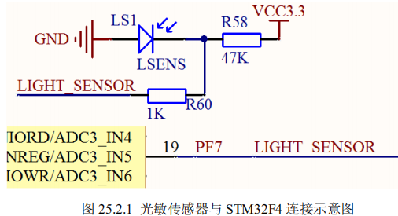

# **光敏传感器实验**

## **1** **光敏传感器简介**

读取` LIGHT_SENSOR（PF7）`上面的电压，即可得到环境光线的强弱。光线越强，电压越低，光 线越暗，电压越高。 

## **2** **硬件设计**

### 本实验用到的硬件资源有： 

#### 1） 指示灯 DS0 

#### 2） TFTLCD 模块 

#### 3） ADC 

#### 4） 光敏传感器 

前三个之前均有介绍，光敏传感器与 STM32F4 的连接如图 25.2.1 所示：



图中，LS1 是光敏二极管（实物在开发板摄像头接口右侧），R58 为其提供反向电压， 当环境光线变化时，LS1 两端的电压也会随之改变，从而通过 ADC3_IN5 通道，读取 LIGHT_SENSOR（PF7）上面的电压，即可得到环境光线的强弱。光线越强，电压越低，光 线越暗，电压越高。 

## **3** **软件设计** 

打开本章实验工程可以看到，在固件库文件中，我们跟上一讲的实验是一样的，添加了 adc 相关的库函数文件 stm32f4xx_adc.c 和对应头文件的支持。

同时，我们在 HARDWARE 分组下新建了 adc3.c 和 lsens.c 源文件，以及包含了它们对应的头文件。因为本实验我们主 要是使用 ADC3 去测量关敏二极管的电压变化，所以大部分知识我们在前面 ADC 实验部分 都有所讲解，这里我们就略带而过。

打开 lsens.c，代码如下：

//初始化光敏传感器

### void Lsens_Init(void)

```C
{
  GPIO_InitTypeDef  GPIO_InitStructure;
  RCC_AHB1PeriphClockCmd(RCC_AHB1Periph_GPIOF, ENABLE);//使能GPIOF时钟
	
  //先初始化ADC3通道7IO口
  GPIO_InitStructure.GPIO_Pin = GPIO_Pin_7;//PA7 通道7
  GPIO_InitStructure.GPIO_Mode = GPIO_Mode_AN;//模拟输入
  GPIO_InitStructure.GPIO_PuPd = GPIO_PuPd_NOPULL ;//不带上下拉
  GPIO_Init(GPIOF, &GPIO_InitStructure);//初始化  

	Adc3_Init();//初始化ADC3

}
```


//读取Light Sens的值
//0~100:0,最暗;100,最亮 

### u8 Lsens_Get_Val(void)

```C
{
	u32 temp_val=0;
	u8 t;
	for(t=0;t<LSENS_READ_TIMES;t++)
	{
		temp_val+=Get_Adc3(ADC_Channel_5);	//读取ADC值,通道5
		delay_ms(5);
	}
	temp_val/=LSENS_READ_TIMES;//得到平均值 
	if(temp_val>4000)temp_val=4000;
	return (u8)(100-(temp_val/40));
}
```

这里就 2 个函数，其中：Lsens_Init 用于初始化光敏传感器，其实就是初始化 PF7 为模 拟输入，然后通过 Adc3_Init 函数初始化 ADC3 的通道 `ADC_Channel_5`。

`Lsens_Get_Val `函 数用于获取当前光照强度，该函数通过 Get_Adc3 得到通道 ADC_Channel_5 转换的电压值， 经过简单量化后，处理成 0~100 的光强值。

**0 对应最暗，100 对应最亮。** 

接下来我们看看 adc3.c 源文件代码： 

```

//初始化ADC
//这里我们仅以规则通道为例														   
void  Adc3_Init(void)
{    
 
	ADC_CommonInitTypeDef ADC_CommonInitStructure;
	ADC_InitTypeDef       ADC_InitStructure;
 
  RCC_APB2PeriphClockCmd(RCC_APB2Periph_ADC3, ENABLE); //使能ADC3时钟

  
	RCC_APB2PeriphResetCmd(RCC_APB2Periph_ADC3,ENABLE);	  //ADC3复位
	RCC_APB2PeriphResetCmd(RCC_APB2Periph_ADC3,DISABLE);	//复位结束	 
 
 
  ADC_CommonInitStructure.ADC_Mode = ADC_Mode_Independent;//独立模式
  ADC_CommonInitStructure.ADC_TwoSamplingDelay = ADC_TwoSamplingDelay_5Cycles;//两个采样阶段之间的延迟5个时钟
  ADC_CommonInitStructure.ADC_DMAAccessMode = ADC_DMAAccessMode_Disabled; //DMA失能
  ADC_CommonInitStructure.ADC_Prescaler = ADC_Prescaler_Div4;//预分频4分频。ADCCLK=PCLK2/4=84/4=21Mhz,ADC时钟最好不要超过36Mhz 
  ADC_CommonInit(&ADC_CommonInitStructure);//初始化
	
  ADC_InitStructure.ADC_Resolution = ADC_Resolution_12b;//12位模式
  ADC_InitStructure.ADC_ScanConvMode = DISABLE;//非扫描模式	
  ADC_InitStructure.ADC_ContinuousConvMode = DISABLE;//关闭连续转换
  ADC_InitStructure.ADC_ExternalTrigConvEdge = ADC_ExternalTrigConvEdge_None;//禁止触发检测，使用软件触发
  ADC_InitStructure.ADC_DataAlign = ADC_DataAlign_Right;//右对齐	
  ADC_InitStructure.ADC_NbrOfConversion = 1;//1个转换在规则序列中 也就是只转换规则序列1 
  ADC_Init(ADC3, &ADC_InitStructure);//ADC初始化
	
 
	ADC_Cmd(ADC3, ENABLE);//开启AD转换器	 
}				  
//获得ADC值
//ch:通道值 0~16 ADC_Channel_0~ADC_Channel_16
//返回值:转换结果
u16 Get_Adc3(u8 ch)   
{
	  	//设置指定ADC的规则组通道，一个序列，采样时间
	ADC_RegularChannelConfig(ADC3, ch, 1, ADC_SampleTime_480Cycles );	//ADC3,ADC通道,480个周期,提高采样时间可以提高精确度			    
  
	ADC_SoftwareStartConv(ADC3);		//使能指定的ADC3的软件转换启动功能	
	 
	while(!ADC_GetFlagStatus(ADC3, ADC_FLAG_EOC ));//等待转换结束

	return ADC_GetConversionValue(ADC3);	//返回最近一次ADC3规则组的转换结果
}
```

这里，Adc3_Init 函数几乎和 ADC_Init 函数一模一样，这里我们设置了 ADC3_CH5 的 相关参数，但是没有设置对应 IO为模拟输入，因为这个在Lsens_Init函数已经实现。

`Get_Adc3` 用于获取 ADC3 某个通道的转换结果。 

因为我们前面对 ADC 有了详细的讲解，所以本章实验源码部分讲解就比较简单。

接下 来我们看看主函数：

```C

int main(void)
{ 
 	u8 adcx;
	NVIC_PriorityGroupConfig(NVIC_PriorityGroup_2);//设置系统中断优先级分组2
	delay_init(168);    //初始化延时函数
	uart_init(115200);	//初始化串口波特率为115200
	LED_Init();					//初始化LED 
 	LCD_Init();					//初始化LCD
	Lsens_Init(); 			//初始化光敏传感器
	POINT_COLOR=RED; 
	LCD_ShowString(30,50,200,16,16,"Explorer STM32F4");	
	LCD_ShowString(30,70,200,16,16,"LSENS TEST");	
	LCD_ShowString(30,90,200,16,16,"ATOM@ALIENTEK");
	LCD_ShowString(30,110,200,16,16,"2014/5/7");	  
	POINT_COLOR=BLUE;//设置字体为蓝色
	LCD_ShowString(30,130,200,16,16,"LSENS_VAL:");	             
	while(1)
	{
		adcx=Lsens_Get_Val();
		LCD_ShowxNum(30+10*8,130,adcx,3,16,0);//显示ADC的值 
		LED0=!LED0;
		delay_ms(250);	
	}
}
```

