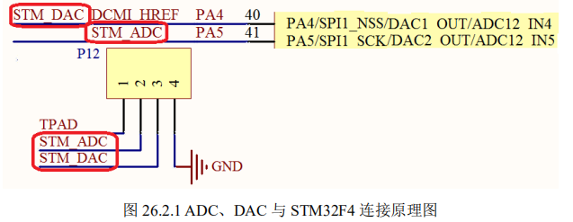
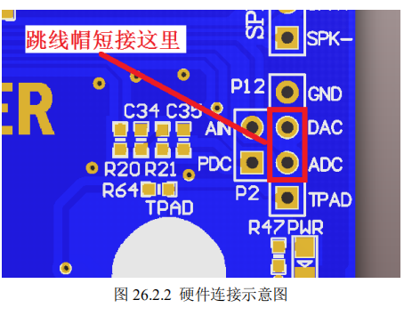
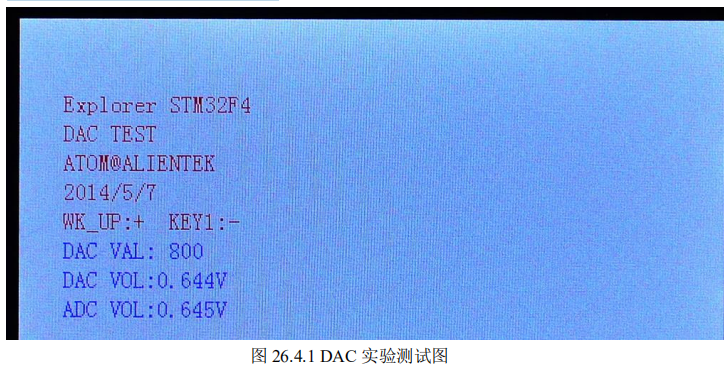

# **DAC** **实验**

上几章，我们介绍了 STM32F4 的 ADC 使用，本章我们将向大家介绍 STM32F4 的 DAC 功能。

在本章中，我们将利用按键（或 USMART）控制 STM32F4 内部 DAC1 来输出电压， 通过 ADC1 的通道 5 采集 DAC 的输出电压，在 LCD 模块上面显示 ADC 获取到的电压值以 及 DAC 的设定输出电压值等信息。

## **1 STM32F4 DAC** **简介** 

### STM32F4 的 DAC 模块主要特点有： 

**① 2 个 DAC 转换器：每个转换器对应 1 个输出通道** 

**② 8 位或者 12 位单调输出** 

**③ 12 位模式下数据左对齐或者右对齐** 

**④ 同步更新功能** 

**⑤ 噪声波形生成** 

**⑥ 三角波形生成** 

**⑦ 双 DAC 通道同时或者分别转换** 

**⑧ 每个通道都有 DMA 功能** 

### 详细设置步骤如下：

1. #### **开启** **PA** **口时钟，设置** **PA4** **为模拟输入。**

2. **使能** **DAC1** **时钟。** 

3. **初始化** **DAC,****设置** **DAC** **的工作模式。** 

4. **使能** **DAC** **转换通道**

5. **设置** **DAC** **的输出值。** 


## **2** **硬件设计**

### 本章用到的硬件资源有： 

#### 1） 指示灯 DS0 

#### 2） KEY_UP 和 KEY1 按键 

#### 3） 串口 

#### 4） TFTLCD 模块 

#### 5） ADC 

#### 6） DAC  

本章，我们使用 DAC 通道 1 输出模拟电压，然后通过 ADC1 的通道 1 对该输出电压进 行读取，并显示在 LCD 模块上面，DAC 的输出电压，我们通过按键（或 USMART）进行 设置。 

我们需要用到 ADC 采集 DAC 的输出电压，所以需要在硬件上把他们短接起来。

ADC 和 DAC 的连接原理图如图 26.2.1 所示： 




P12 是多功能端口，我们只需要通过跳线帽短接 P14 的 ADC 和 DAC，就可以开始做本 章实验了。

如图 26.2.2 所示：




**3** **软件设计** 

打开本章实验工程可以发现，我们相比 ADC 实验，在库函数中主要是添加了 dac 支持 的相关文件 stm32f4xx_dac.c 以及包含头文件 stm32f4xx_dac.h。

同时我们在 HARDWARE 分组下面新建了 dac.c 源文件以及包含对应的头文件 dac.h。这两个文件用来存放我们编写的 

ADC 相关函数和定义。

打开 dac.c，代码如下：


#### void Dac1_Init(void)

```c
{  
  GPIO_InitTypeDef  GPIO_InitStructure;
	DAC_InitTypeDef DAC_InitType;
	
  RCC_AHB1PeriphClockCmd(RCC_AHB1Periph_GPIOA, ENABLE);//使能GPIOA时钟
  RCC_APB1PeriphClockCmd(RCC_APB1Periph_DAC, ENABLE);//使能DAC时钟
	   
  GPIO_InitStructure.GPIO_Pin = GPIO_Pin_4;
  GPIO_InitStructure.GPIO_Mode = GPIO_Mode_AN;//模拟输入
  GPIO_InitStructure.GPIO_PuPd = GPIO_PuPd_DOWN;//下拉
  GPIO_Init(GPIOA, &GPIO_InitStructure);//初始化

	DAC_InitType.DAC_Trigger=DAC_Trigger_None;	//不使用触发功能 TEN1=0
	DAC_InitType.DAC_WaveGeneration=DAC_WaveGeneration_None;//不使用波形发生
	DAC_InitType.DAC_LFSRUnmask_TriangleAmplitude=DAC_LFSRUnmask_Bit0;//屏蔽、幅值设置
	DAC_InitType.DAC_OutputBuffer=DAC_OutputBuffer_Disable ;	//DAC1输出缓存关闭 BOFF1=1

  DAC_Init(DAC_Channel_1,&DAC_InitType);	 //初始化DAC通道1

	DAC_Cmd(DAC_Channel_1, ENABLE);  //使能DAC通道1

  DAC_SetChannel1Data(DAC_Align_12b_R, 0);  //12位右对齐数据格式设置DAC值
}
```

//DAC通道1输出初始化

#### void Dac1_Set_Vol(u16 vol)

```
{
	double temp=vol;
	temp/=1000;
	temp=temp*4096/3.3;
	DAC_SetChannel1Data(DAC_Align_12b_R,temp);//12位右对齐数据格式设置DAC值
}
```

//设置通道1输出电压
//vol:0~3300,代表0~3.3V

此部分代码就 2 个函数，`Dac1_Init `函数用于初始化 DAC 通道 1。

这里基本上是按我们 上面的步骤来初始化的，我们用序号①~⑤已经标示这些步骤。

经过这个初始化之后，我们 就可以正常使用 DAC 通道 1 了。

第二个函数 Dac1_Set_Vol，用于设置 DAC 通道 1 的输出 电压，实际就是将电压值转换为 DAC 输入值。 

其他头文件代码就比较简单，这里我们不做过多讲解，接下来我们来看看主函数代码：

```c


int main(void)
{ 
	u16 adcx;
	float temp;
 	u8 t=0;	 
	u16 dacval=0;
	u8 key;	
	NVIC_PriorityGroupConfig(NVIC_PriorityGroup_2);//设置系统中断优先级分组2
	delay_init(168);      //初始化延时函数
	uart_init(115200);		//初始化串口波特率为115200
	
	LED_Init();					//初始化LED 
 	LCD_Init();					//LCD初始化
	Adc_Init(); 				//adc初始化
	KEY_Init(); 				//按键初始化
	Dac1_Init();		 		//DAC通道1初始化	
	POINT_COLOR=RED; 
	LCD_ShowString(30,50,200,16,16,"Explorer STM32F4");	
	LCD_ShowString(30,70,200,16,16,"DAC TEST");	
	LCD_ShowString(30,90,200,16,16,"ATOM@ALIENTEK");
	LCD_ShowString(30,110,200,16,16,"2014/5/6");	 
	LCD_ShowString(30,130,200,16,16,"WK_UP:+  KEY1:-");	 
	POINT_COLOR=BLUE;//设置字体为蓝色      	 
	LCD_ShowString(30,150,200,16,16,"DAC VAL:");	      
	LCD_ShowString(30,170,200,16,16,"DAC VOL:0.000V");	      
	LCD_ShowString(30,190,200,16,16,"ADC VOL:0.000V");
 	
  DAC_SetChannel1Data(DAC_Align_12b_R,dacval);//初始值为0	
	while(1)
	{
		t++;
		key=KEY_Scan(0);			  
		if(key==WKUP_PRES)
		{		 
			if(dacval<4000)dacval+=200;
			DAC_SetChannel1Data(DAC_Align_12b_R, dacval);//设置DAC值
		}else if(key==2)	
		{
			if(dacval>200)dacval-=200;
			else dacval=0;
			DAC_SetChannel1Data(DAC_Align_12b_R, dacval);//设置DAC值
		}	 
		if(t==10||key==KEY1_PRES||key==WKUP_PRES) 	//WKUP/KEY1按下了,或者定时时间到了
		{	  
 			adcx=DAC_GetDataOutputValue(DAC_Channel_1);//读取前面设置DAC的值
			LCD_ShowxNum(94,150,adcx,4,16,0);     	   //显示DAC寄存器值
			temp=(float)adcx*(3.3/4096);			         //得到DAC电压值
			adcx=temp;
 			LCD_ShowxNum(94,170,temp,1,16,0);     	   //显示电压值整数部分
 			temp-=adcx;
			temp*=1000;
			LCD_ShowxNum(110,170,temp,3,16,0X80); 	   //显示电压值的小数部分
 			adcx=Get_Adc_Average(ADC_Channel_5,10);		//得到ADC转换值	  
			temp=(float)adcx*(3.3/4096);			        //得到ADC电压值
			adcx=temp;
 			LCD_ShowxNum(94,190,temp,1,16,0);     	  //显示电压值整数部分
 			temp-=adcx;
			temp*=1000;
			LCD_ShowxNum(110,190,temp,3,16,0X80); 	  //显示电压值的小数部分
			LED0=!LED0;	   
			t=0;
		}	    
		delay_ms(10);	 
	}	
}
```

此部分代码，我们先对需要用到的模块进行初始化，然后显示一些提示信息，本章我们 通过 KEY_UP（WKUP 按键）和 KEY1（也就是上下键）来实现对 DAC 输出的幅值控制。 

按下 KEY_UP 增加，按 KEY1 减小。同时在 LCD 上面显示 DHR12R1 寄存器的值、DAC 设计输出电压以及 ADC 采集到的 DAC 输出电压。


## **4** **下载验证** 

在代码编译成功之后，我们通过下载代码到 ALIENTEK 探索者 STM32F4 开发板上， 

可以看到 LCD 显示如图 26.4.1 所示



同时伴随 DS0 的不停闪烁，提示程序在运行。此时，我们通过按 KEY_UP 按键，可以 看到输出电压增大，按 KEY1 则变小。

