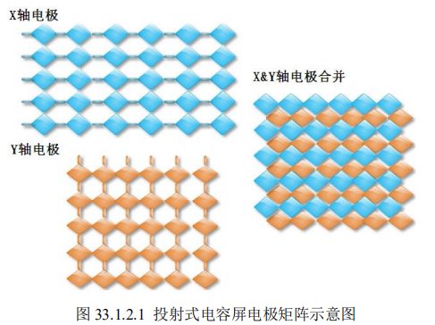
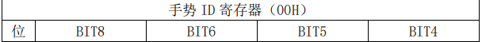
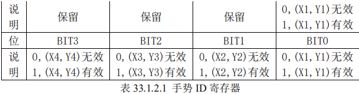
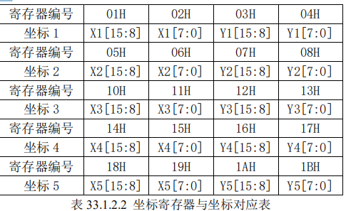
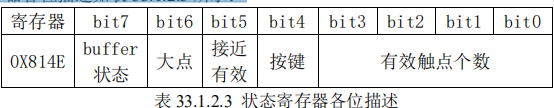
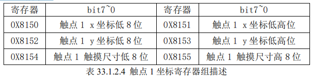
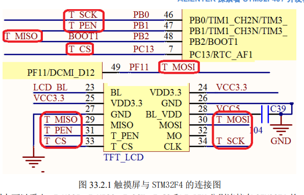
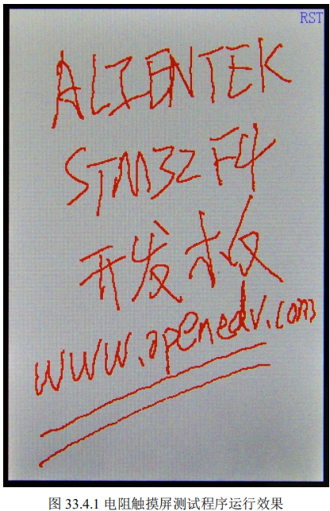
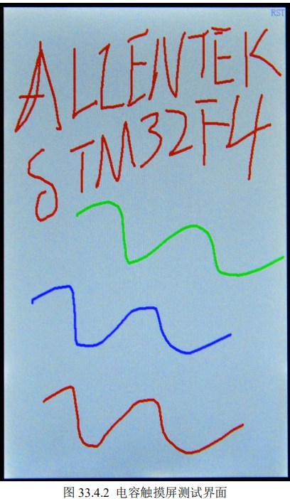

# **触摸屏实验** 

本章，我们将介绍如何使用 STM32F4 来驱动触摸屏，ALIENTEK 探索者 STM32F4 开发板本身并没有触摸屏控制器，但是它支持触摸屏，可以通过外接带触摸屏的 LCD 模块（比如 ALIENTEK TFTLCD 模块），来实现触摸屏控制。

在本章中，我们将向大家介绍 STM32 控制 ALIENTKE TFTLCD 模块（包括电阻触摸与电容触摸），实现触摸屏驱动，最终实现一个手写 板的功能。


## **1** **触摸屏简介** 

目前最常用的触摸屏有两种：电阻式触摸屏与电容式触摸屏。下面，我们来分别介绍。 

### 1.1** **电阻式触摸屏** 

在 Iphone 面世之前，几乎清一色的都是使用电阻式触摸屏，电阻式触摸屏利用压力感应进 行触点检测控制，需要直接应力接触，通过检测电阻来定位触摸位置。 

下面简单介绍下电阻式触摸屏的原理。 

电阻触摸屏的主要部分是一块与显示器表面非常配合的电阻薄膜屏，这是一种多层的复合 薄膜，它以一层玻璃或硬塑料平板作为基层，表面涂有一层透明氧化金属（透明的导电电阻） 导电层，上面再盖有一层外表面硬化处理、光滑防擦的塑料层、它的内表面也涂有一层涂层、 在他们之间有许多细小的（小于 1/1000 英寸）的透明隔离点把两层导电层隔开绝缘。

当手指 触摸屏幕时，两层导电层在触摸点位置就有了接触，电阻发生变化，在 X 和 Y 两个方向上产生 信号，然后送触摸屏控制器。

控制器侦测到这一接触并计算出（X，Y）的位置，再根据获得的位置模拟鼠标的方式运作。这就是电阻技术触摸屏的最基本的原理。  

- 电阻触摸屏的优点：
    - 精度高、
    - 价格便宜、
    - 抗干扰能力强、
    - 稳定性好。 
- 电阻触摸屏的缺点：
    - 容易被划伤、
    - 透光性不太好、
    - 不支持多点触摸。  

从以上介绍可知，触摸屏都需要一个 AD 转换器， 一般来说是需要一个控制器的。 

ALIENTEK TFTLCD 模块选择的是四线电阻式触摸屏，这种触摸屏的控制芯片有很多，包括： ADS7843、ADS7846、TSC2046、XPT2046 和 AK4182 等。

这几款芯片的驱动基本上是一样的， 也就是你只要写出了 ADS7843 的驱动，这个驱动对其他几个芯片也是有效的。而且封装也有一 样的，完全 PIN TO PIN 兼容。所以在替换起来，很方便。 

ALIENTEK TFTLCD 模块自带的触摸屏控制芯片为 XPT2046。

XPT2046 是一款 4 导线制触 摸屏控制器，内含 12 位分辨率 125KHz 转换速率逐步逼近型 A/D 转换器。XPT2046 支持从 1.5V 到 5.25V 的低电压 I/O 接口。

XPT2046 能通过执行两次 A/D 转换查出被按的屏幕位置， 除此 之外，还可以测量加在触摸屏上的压力。

内部自带 2.5V 参考电压可以作为辅助输入、温度测量 和电池监测模式之用，电池监测的电压范围可以从 0V 到 6V。

XPT2046 片内集成有一个温度传感器。 在 2.7V 的典型工作状态下，关闭参考电压，功耗可小于 0.75mW。

XPT2046 采用微小 的封装形式：TSSOP-16,QFN-16(0.75mm 厚度)和 VFBGA－48。

工作温度范围为-40℃～+85℃。

该芯片完全是兼容 ADS7843 和 ADS7846 的，关于这个芯片的详细使用，可以参考这两个 芯片的 datasheet。 

电阻式触摸屏就介绍到这里。 

### 1.2** **电容式触摸屏** 

现在几乎所有智能手机，包括平板电脑都是采用电容屏作为触摸屏，电容屏是利用人体感 

应进行触点检测控制，不需要直接接触或只需要轻微接触，通过检测感应电流来定位触摸坐标。 

ALIENTEK 4.3/7 寸 TFTLCD 模块自带的触摸屏采用的是电容式触摸屏，下面简单介绍下 电容式触摸屏的原理。 

电容式触摸屏主要分为两种： 

#### 1、 表面电容式电容触摸屏。 

表面电容式触摸屏技术是利用 ITO(铟锡氧化物，是一种透明的导电材料)导电膜，通过电 场感应方式感测屏幕表面的触摸行为进行。

但是表面电容式触摸屏有一些局限性，它只能识别 一个手指或者一次触摸。 

#### 2、 投射式电容触摸屏。 

投射电容式触摸屏是传感器利用触摸屏电极发射出静电场线。

一般用于投射电容传感技术 的电容类型有两种：自我电容和交互电容。 

自我电容又称绝对电容，是最广为采用的一种方法，自我电容通常是指扫描电极与地构成 的电容。

在玻璃表面有用 ITO 制成的横向与纵向的扫描电极，这些电极和地之间就构成一个电容的两极。当用手或触摸笔触摸的时候就会并联一个电容到电路中去，从而使在该条扫描线上 的总体的电容量有所改变。

在扫描的时候，控制 IC 依次扫描纵向和横向电极，并根据扫描前后 的电容变化来确定触摸点坐标位置。笔记本电脑触摸输入板就是采用的这种方式，笔记本电脑 的输入板采用 X*Y 的传感电极阵列形成一个传感格子，当手指靠近触摸输入板时，在手指和传 感电极之间产生一个小量电荷。采用特定的运算法则处理来自行、列传感器的信号来确定手指 的位置。 

交互电容又叫做跨越电容，它是在玻璃表面的横向和纵向的 ITO 电极的交叉处形成电容。 

交互电容的扫描方式就是扫描每个交叉处的电容变化，来判定触摸点的位置。当触摸的时候就 会影响到相邻电极的耦合，从而改变交叉处的电容量，交互电容的扫面方法可以侦测到每个交 叉点的电容值和触摸后电容变化，因而它需要的扫描时间与自我电容的扫描方式相比要长一些， 需要扫描检测 X*Y 根电极。目前智能手机/平板电脑等的触摸屏，都是采用交互电容技术。 

ALIENTEK 所选择的电容触摸屏，也是采用的是投射式电容屏（交互电容类型），所以后 面仅以投射式电容屏作为介绍。 

透射式电容触摸屏采用纵横两列电极组成感应矩阵，来感应触摸。以两个交叉的电极矩阵， 

即： X 轴电极和 Y 轴电极，来检测每一格感应单元的电容变化，如图 33.1.2.1 所示：



示意图中的电极，实际是透明的，这里是为了方便大家理解。图中，X、Y 轴的透明电极电容屏的精度、分辨率与 X、Y 轴的通道数有关，通道数越多，精度越高。以上就是电容触摸 屏的基本原理，接下来看看电容触摸屏的优缺点： 

- 电容触摸屏的优点：
    - 手感好、
    - 无需校准、
    - 支持多点触摸、
    - 透光性好。 
- 电容触摸屏的缺点：
    - 成本高、
    - 精度不高、
    - 抗干扰能力差。 

这里特别提醒大家电容触摸屏对工作环境的要求是比较高的，在潮湿、多尘、高低温环境 下面，都是不适合使用电容屏的。  

电容触摸屏一般都需要一个驱动 IC 来检测电容触摸，且一般是通过 IIC 接口输出触摸数据 的。

ALIENTEK 7’ TFTLCD 模块的电容触摸屏，采用的是 15*10 的驱动结构（10 个感应通道， 15 个驱动通道），采用的是 GT811/FT5206 做为驱动 IC。ALIENTEK 4.3’ TFTLCD 模块有两种 成触摸屏：*

*1，使用 OTT2001A 作为驱动 IC，采用 13*8 的驱动结构（8 个感应通道，13 个驱动 通道）；

2，使用 GT9147 作为驱动 IC，采用 17*10 的驱动结构（10 个感应通道，17 个驱动通 道）。 

这两个模块都只支持最多 5 点触摸，本例程支持 ALIENTEK 的 4.3 寸屏模块和新版的 7 寸 屏模块（采用 SSD1963+FT5206 方案），电容触摸驱动 IC，这里只介绍 OTT2001A 和 GT9147， GT811/FT5206 的驱动方法同这两款 IC 是类似的，大家可以参考着学习即可。 

OTT2001A 是台湾旭曜科技生产的一颗电容触摸屏驱动 IC，最多支持 208 个通道。

支持 SPI/IIC 接口，在 ALIENTEK 4.3’ TFTLCD 电容触摸屏上，OTT2001A 只用了 104 个通道

采 用 IIC 接口。IIC 接口模式下，该驱动 IC 与 STM32F4 的连接仅需要 4 根线：SDA、SCL、RST 和 INT，SDA 和 SCL 是 IIC 通信用的，RST 是复位脚（低电平有效），INT 是中断输出信号， 关于 IIC 我们就不详细介绍了

OTT2001A 的器件地址为 0X59（不含最低位，换算成读写命令则是读：0XB3，写：0XB2）， 接下来

#### 介绍一下 OTT2001A 的几个重要的寄存器。 

##### 1， 手势 ID 寄存器

手势 ID 寄存器（00H）用于告诉 MCU，哪些点有效，哪些点无效，从而读取对应的数据， 该寄存器各位描述如表 33.1.2.1 所示： 





OTT2001A 支持最多 5 点触摸，所以表中只有 5 个位用来表示对应点坐标是否有效，其余位为保留位（读为 0），通过读取该寄存器，我们可以知道哪些点有数据，哪些点无数据，如果 读到的全是 0，则说明没有任何触摸。 

##### 2， 传感器控制寄存器（ODH）

传感器控制寄存器（ODH），该寄存器也是 8 位，仅最高位有效，其他位都是保留，当最 高位为 1 的时候，打开传感器（开始检测），当最高位设置为 0 的时候，关闭传感器（停止检测）。 

##### 3， 坐标数据寄存器（共 20 个） 

坐标数据寄存器总共有 20 个，每个坐标占用 4 个寄存器，坐标寄存器与坐标的对应关系如 表 33.1.2.2 所示：



从表中可以看出，每个坐标的值，可以通过 4 个寄存器读出，比如读取坐标 1（X1，Y1）， 我们则可以读取 01H~04H，就可以知道当前坐标 1 的具体数值了，这里我们也可以只发送寄存器 01，然后连续读取 4 个字节，也可以正常读取坐标 1，寄存器地址会自动增加，从而提高读取速度。 

OTT2001A 相关寄存器的介绍就介绍到这里，更详细的资料，请参考：OTT2001A IIC 协议 指导.pdf 这个文档。

OTT2001A 只需要经过简单的初始化就可以正常使用了

##### 初始化流程：

- 复 位
- 延时 100ms
- 释放复位
- 设置传感器控制寄存器的最高位位 1
- 开启传感器检查。

就可以 正常使用了。 

另外，OTT2001A 有两个地方需要特别注意一下： 

1， OTT2001A 的寄存器是 8 位的，但是发送的时候要发送 16 位（高八位有效），才可 以正常使用。 

2， OTT2001A 的输出坐标，默认是以：X 坐标最大值是 2700，Y 坐标最大值是 1500 的分辨率输出的，也就是输出范围为：X：0~2700，Y：0~1500；MCU 在读取到坐 标后，必须根据 LCD 分辨率做一个换算，才能得到真实的 LCD 坐标。 

下面我们简单介绍下 GT9147，该芯片是深圳汇顶科技研发的一颗电容触摸屏驱动 IC，支持 100Hz 触点扫描频率，支持 5 点触摸，支持 18*10 个检测通道，适合小于 4.5 寸的电容触摸 屏使用。

和 OTT2001A 一样，GT9147 与 MCU 连接也是通过 4 根线：SDA、SCL、RST 和 INT。

不 过，GT9147 的 IIC 地址，可以是 0X14 或者 0X5D，当复位结束后的 5ms 内，如果 INT 是高电 平，则使用 0X14 作为地址，否则使用 0X5D 作为地址，具体的设置过程，请看：GT9147 数据 手册.pdf 这个文档。

本章我们使用 0X14 作为器件地址（不含最低位，换算成读写命令则是读： 0X29，写：0X28），接下来，介绍一下 GT9147 的几个重要的寄存器。 

#### GT9147

##### 1，控制命令寄存器（0X8040） 

该寄存器可以写入不同值，实现不同的控制，我们一般使用 0 和 2 这两个值，写入 2，即 可软复位 GT9147，在硬复位之后，一般要往该寄存器写 2，实行软复位。然后，写入 0，即可 正常读取坐标数据（并且会结束软复位）。 

##### 2，配置寄存器组（0X8047~0X8100） 

这里共 186 个寄存器，用于配置 GT9147 的各个参数，这些配置一般由厂家提供给我们（一 个数组），所以我们只需要将厂家给我们的配置，写入到这些寄存器里面，即可完成 GT9147 的 配置。

由于 GT9147可以保存配置信息（可写入内部FLASH，从而不需要每次上电都更新配置）， 我们有几点注意的地方提醒大家：

- 1，0X8047 寄存器用于指示配置文件版本号，程序写入的版 本号，必须大于等于 GT9147 本地保存的版本号，才可以更新配置。
- 2，0X80FF 寄存器用于存 储校验和，使得 0X8047~0X80FF 之间所有数据之和为 0。
- 3，0X8100 用于控制是否将配置保存 在本地，写 0，则不保存配置，写 1 则保存配置。 
- 4，产品 ID 寄存器（0X8140~0X8143） 这里总共由 4 个寄存器组成，用于保存产品 ID，对于 GT9147，这 4 个寄存器读出来就是： 9，1，4，7 四个字符（ASCII 码格式）。因此，我们可以通过这 4 个寄存器的值，来判断驱动 IC 的型号，从而判断是 OTT2001A 还是 GT9147，以便执行不同的初始化。 
- 5，状态寄存器（0X814E） 

该寄存器各位描述如表 33.1.2.3 所示： 



这里，我们仅关心最高位和最低 4 位，最高位用于表示 buffer 状态，如果有数据（坐标/ 按键），buffer 就会是 1，最低 4 位用于表示有效触点的个数，范围是：0~5，0，表示没有触摸， 5 表示有 5 点触摸。这和前面 OTT2001A 的表示方法稍微有点区别，OTT2001A 是每个位表示 一个触点，这里是有多少有效触点值就是多少。

最后，该寄存器在每次读取后，如果 bit7 有效， 则必须写 0，清除这个位，否则不会输出下一次数据！！这个要特别注意！！！ 

- 6，坐标数据寄存器（共 30 个） 

这里共分成 5 组（5 个点），每组 6 个寄存器存储数据，以触点 1 的坐标数据寄存器组为例， 如表 33.1.2.4 所示： 



我们一般只用到触点的 x，y 坐标，所以只需要读取 0X8150~0X8153 的数据，组合即可得 到触点坐标。其他 4 组分别是：0X8158、0X8160、0X8168 和 0X8170 等开头的 16 个寄存器组成，分别针对触点 2~4 的坐标。

同样 GT9147 也支持寄存器地址自增，我们只需要发送寄存器组的首地址，然后连续读取即可，GT9147 会自动地址自增，从而提高读取速度。 

GT9147 相关寄存器的介绍就介绍到这里，更详细的资料，请参考：GT9147 编程指南.pdf 这个文档。 

GT9147 只需要经过简单的初始化就可以正常使用了，

##### 初始化流程：

硬复位→延时 10ms→ 结束硬复位→设置 IIC 地址→延时 100ms→软复位→更新配置（需要时）→结束软复位。

此时 GT9147 即可正常使用了。 

然后，我们不停的查询 0X814E 寄存器，判断是否有有效触点，如果有，则读取坐标数据 寄存器，得到触点坐标，特别注意，如果 0X814E 读到的值最高位为 1，就必须对该位写 0，否 则无法读到下一次坐标数据。 

电容式触摸屏部分，就介绍到这里。 

## **2** **硬件设计** 

本章实验功能简介：开机的时候先初始化 LCD，读取 LCD ID，随后，根据 LCD ID 判断 是电阻触摸屏还是电容触摸屏，如果是电阻触摸屏，则先读取 24C02 的数据判断触摸屏是否已 经校准过，如果没有校准，则执行校准程序，校准过后再进入电阻触摸屏测试程序，如果已经 校准了，就直接进入电阻触摸屏测试程序。 

如果是 4.3 寸电容触摸屏，则先读取芯片 ID，判断是不是 GT9147，如果是则执行 GT9147 的初始化代码，如果不是，则执行 OTT2001A 的初始化代码；如果是 7 寸电容触摸屏（仅支持 新款 7 寸屏，使用 SSD1963+FT5206 方案），则执行 FT5206 的初始化代码，在初始化电容触 摸屏完成后，进入电容触摸屏测试程序（电容触摸屏无需校准！！）。 

电阻触摸屏测试程序和电容触摸屏测试程序基本一样，只是电容触摸屏支持最多 5 点同时 触摸，电阻触摸屏只支持一点触摸，其他一模一样。

测试界面的右上角会有一个清空的操作区 域（RST），点击这个地方就会将输入全部清除，恢复白板状态。使用电阻触摸屏的时候，可 以通过按 KEY0 来实现强制触摸屏校准，只要按下 KEY0 就会进入强制校准程序。 

### 所要用到的硬件资源如下： 

#### 1） 指示灯 DS0 

#### 2） KEY0 按键 

#### 3） TFTLCD 模块（带电阻/电容式触摸屏） 

#### 4） 24C02 

所有这些资源与 STM32F4 的连接图，在前面都已经介绍了，这里我们只针对 TFTLCD 模 块与 STM32F4 的连接端口再说明一下，TFTLCD 模块的触摸屏（电阻触摸屏）总共有 5 跟线 与 STM32F4 连接，连接电路图如图 33.2.1 所示：



从图中可以看出, T_MOSI、T_MISO、T_SCK、T_CS 和 T_PEN 分别连接在 STM32F4 的：PF11、 PB2、PB0、PC13 和 PB1 上。 

如果是电容式触摸屏，我们的接口和电阻式触摸屏一样（上图右侧接口），只是没有用到 五根线了，而是四根线，分别是： T_PEN(CT_INT) 、 T_CS(CT_RST) 、 T_CLK(CT_SCL) 和 T_MOSI(CT_SDA)。其中：CT_INT、CT_RST、CT_SCL 和 CT_SDA 分别是 OTT2001A/GT9147/FT5206 的：中断输出信号、复位信号，IIC 的 SCL 和 SDA 信号。

这里，我们用查询的方式读取 OTT2001A/GT9147/FT5206 的数据，对于 OTT2001A/FT5206 没有用到中断信号（CT_INT），所以 同 STM32F4 的连接，只需要 3 根线即可，不过 GT9147 还需要用到 CT_INT 做 IIC 地址设定，所以需要 4 根线连接。


## **3** **软件设计** 

打开本章实验工程目录可以看到，我们在 HARDWARE 文件夹下新建了一个 TOUCH 文件 夹，然后新建了 touch.c、touch.h、ctiic.c、ctiic.h、ott2001a.c、ott2001a.h、gt9147.c、gt9147.h、 ft5206.c 和 ft5206.h 等十个文件用来存放触摸屏相关的代码。

同时引入这些源文件到工程 HARDWARE 分组之下，并将 TOUCH 文件夹加入头文件包含路径。

其中，touch.c 和 touch.h 是电阻触摸屏部分的代码，顺带兼电容触摸屏的管理控制，其他则是电容触摸屏部分的代码。 

打开 touch.c 文件，里面主要是与触摸屏相关的代码（主要是电阻触摸屏的代码），这里我 们也不全部贴出来了，仅介绍几个重要的函数。 

首先我们要介绍的是 TP_Read_XY2 这个函数，该函数专门用于从电阻式触摸屏控制 IC 读取 坐标的值（0~4095），TP_Read_XY2 的代码如下：

```c
//连续2次读取触摸屏IC,且这两次的偏差不能超过
//ERR_RANGE,满足条件,则认为读数正确,否则读数错误.	   
//该函数能大大提高准确度
//x,y:读取到的坐标值
//返回值:0,失败;1,成功。
#define ERR_RANGE 50 //误差范围 
u8 TP_Read_XY2(u16 *x,u16 *y) 
{
	u16 x1,y1;
 	u16 x2,y2;
 	u8 flag;    
    flag=TP_Read_XY(&x1,&y1);   
    if(flag==0)return(0);
    flag=TP_Read_XY(&x2,&y2);	   
    if(flag==0)return(0);   
    if(((x2<=x1&&x1<x2+ERR_RANGE)||(x1<=x2&&x2<x1+ERR_RANGE))//前后两次采样在+-50内
    &&((y2<=y1&&y1<y2+ERR_RANGE)||(y1<=y2&&y2<y1+ERR_RANGE)))
    {
        *x=(x1+x2)/2;
        *y=(y1+y2)/2;
        return 1;
    }else return 0;	  
}  
```

该函数采用了一个非常好的办法来读取屏幕坐标值，就是连续读两次，两次读取的值之差 不能超过一个特定的值（ERR_RANGE），通过这种方式，我们可以大大提高触摸屏的准确度。

另 外该函数调用的 `TP_Read_XY `函数，用于单次读取坐标值。`TP_Read_XY `也采用了一些软件滤波 算法，具体见光盘的源码。接下来，我们介绍另外一个函数 TP_Adjust，该函数源码如下： 

```c

		 
//触摸屏校准代码
//得到四个校准参数
void TP_Adjust(void)
{								 
	u16 pos_temp[4][2];//坐标缓存值
	u8  cnt=0;	
	u16 d1,d2;
	u32 tem1,tem2;
	double fac; 	
	u16 outtime=0;
 	cnt=0;				
	POINT_COLOR=BLUE;
	BACK_COLOR =WHITE;
	LCD_Clear(WHITE);//清屏   
	POINT_COLOR=RED;//红色 
	LCD_Clear(WHITE);//清屏 	   
	POINT_COLOR=BLACK;
	LCD_ShowString(40,40,160,100,16,(u8*)TP_REMIND_MSG_TBL);//显示提示信息
	TP_Drow_Touch_Point(20,20,RED);//画点1 
	tp_dev.sta=0;//消除触发信号 
	tp_dev.xfac=0;//xfac用来标记是否校准过,所以校准之前必须清掉!以免错误	 
	while(1)//如果连续10秒钟没有按下,则自动退出
	{
		tp_dev.scan(1);//扫描物理坐标
		if((tp_dev.sta&0xc0)==TP_CATH_PRES)//按键按下了一次(此时按键松开了.)
		{	
			outtime=0;		
			tp_dev.sta&=~(1<<6);//标记按键已经被处理过了.
						   			   
			pos_temp[cnt][0]=tp_dev.x[0];
			pos_temp[cnt][1]=tp_dev.y[0];
			cnt++;	  
			switch(cnt)
			{			   
				case 1:						 
					TP_Drow_Touch_Point(20,20,WHITE);				//清除点1 
					TP_Drow_Touch_Point(lcddev.width-20,20,RED);	//画点2
					break;
				case 2:
 					TP_Drow_Touch_Point(lcddev.width-20,20,WHITE);	//清除点2
					TP_Drow_Touch_Point(20,lcddev.height-20,RED);	//画点3
					break;
				case 3:
 					TP_Drow_Touch_Point(20,lcddev.height-20,WHITE);			//清除点3
 					TP_Drow_Touch_Point(lcddev.width-20,lcddev.height-20,RED);	//画点4
					break;
				case 4:	 //全部四个点已经得到
	    		    //对边相等
					tem1=abs(pos_temp[0][0]-pos_temp[1][0]);//x1-x2
					tem2=abs(pos_temp[0][1]-pos_temp[1][1]);//y1-y2
					tem1*=tem1;
					tem2*=tem2;
					d1=sqrt(tem1+tem2);//得到1,2的距离
					
					tem1=abs(pos_temp[2][0]-pos_temp[3][0]);//x3-x4
					tem2=abs(pos_temp[2][1]-pos_temp[3][1]);//y3-y4
					tem1*=tem1;
					tem2*=tem2;
					d2=sqrt(tem1+tem2);//得到3,4的距离
					fac=(float)d1/d2;
					if(fac<0.95||fac>1.05||d1==0||d2==0)//不合格
					{
						cnt=0;
 				    	TP_Drow_Touch_Point(lcddev.width-20,lcddev.height-20,WHITE);	//清除点4
   	 					TP_Drow_Touch_Point(20,20,RED);								//画点1
 						TP_Adj_Info_Show(pos_temp[0][0],pos_temp[0][1],pos_temp[1][0],pos_temp[1][1],pos_temp[2][0],pos_temp[2][1],pos_temp[3][0],pos_temp[3][1],fac*100);//显示数据   
 						continue;
					}
					tem1=abs(pos_temp[0][0]-pos_temp[2][0]);//x1-x3
					tem2=abs(pos_temp[0][1]-pos_temp[2][1]);//y1-y3
					tem1*=tem1;
					tem2*=tem2;
					d1=sqrt(tem1+tem2);//得到1,3的距离
					
					tem1=abs(pos_temp[1][0]-pos_temp[3][0]);//x2-x4
					tem2=abs(pos_temp[1][1]-pos_temp[3][1]);//y2-y4
					tem1*=tem1;
					tem2*=tem2;
					d2=sqrt(tem1+tem2);//得到2,4的距离
					fac=(float)d1/d2;
					if(fac<0.95||fac>1.05)//不合格
					{
						cnt=0;
 				    	TP_Drow_Touch_Point(lcddev.width-20,lcddev.height-20,WHITE);	//清除点4
   	 					TP_Drow_Touch_Point(20,20,RED);								//画点1
 						TP_Adj_Info_Show(pos_temp[0][0],pos_temp[0][1],pos_temp[1][0],pos_temp[1][1],pos_temp[2][0],pos_temp[2][1],pos_temp[3][0],pos_temp[3][1],fac*100);//显示数据   
						continue;
					}//正确了
								   
					//对角线相等
					tem1=abs(pos_temp[1][0]-pos_temp[2][0]);//x1-x3
					tem2=abs(pos_temp[1][1]-pos_temp[2][1]);//y1-y3
					tem1*=tem1;
					tem2*=tem2;
					d1=sqrt(tem1+tem2);//得到1,4的距离
	
					tem1=abs(pos_temp[0][0]-pos_temp[3][0]);//x2-x4
					tem2=abs(pos_temp[0][1]-pos_temp[3][1]);//y2-y4
					tem1*=tem1;
					tem2*=tem2;
					d2=sqrt(tem1+tem2);//得到2,3的距离
					fac=(float)d1/d2;
					if(fac<0.95||fac>1.05)//不合格
					{
						cnt=0;
 				    	TP_Drow_Touch_Point(lcddev.width-20,lcddev.height-20,WHITE);	//清除点4
   	 					TP_Drow_Touch_Point(20,20,RED);								//画点1
 						TP_Adj_Info_Show(pos_temp[0][0],pos_temp[0][1],pos_temp[1][0],pos_temp[1][1],pos_temp[2][0],pos_temp[2][1],pos_temp[3][0],pos_temp[3][1],fac*100);//显示数据   
						continue;
					}//正确了
					//计算结果
					tp_dev.xfac=(float)(lcddev.width-40)/(pos_temp[1][0]-pos_temp[0][0]);//得到xfac		 
					tp_dev.xoff=(lcddev.width-tp_dev.xfac*(pos_temp[1][0]+pos_temp[0][0]))/2;//得到xoff
						  
					tp_dev.yfac=(float)(lcddev.height-40)/(pos_temp[2][1]-pos_temp[0][1]);//得到yfac
					tp_dev.yoff=(lcddev.height-tp_dev.yfac*(pos_temp[2][1]+pos_temp[0][1]))/2;//得到yoff  
					if(abs(tp_dev.xfac)>2||abs(tp_dev.yfac)>2)//触屏和预设的相反了.
					{
						cnt=0;
 				    	TP_Drow_Touch_Point(lcddev.width-20,lcddev.height-20,WHITE);	//清除点4
   	 					TP_Drow_Touch_Point(20,20,RED);								//画点1
						LCD_ShowString(40,26,lcddev.width,lcddev.height,16,"TP Need readjust!");
						tp_dev.touchtype=!tp_dev.touchtype;//修改触屏类型.
						if(tp_dev.touchtype)//X,Y方向与屏幕相反
						{
							CMD_RDX=0X90;
							CMD_RDY=0XD0;	 
						}else				   //X,Y方向与屏幕相同
						{
							CMD_RDX=0XD0;
							CMD_RDY=0X90;	 
						}			    
						continue;
					}		
					POINT_COLOR=BLUE;
					LCD_Clear(WHITE);//清屏
					LCD_ShowString(35,110,lcddev.width,lcddev.height,16,"Touch Screen Adjust OK!");//校正完成
					delay_ms(1000);
					TP_Save_Adjdata();  
 					LCD_Clear(WHITE);//清屏   
					return;//校正完成				 
			}
		}
		delay_ms(10);
		outtime++;
		if(outtime>1000)
		{
			TP_Get_Adjdata();
			break;
	 	} 
 	}
}	
```

TP_Adjust 是此部分最核心的代码，在这里，给大家介绍一下我们这里所使用的触摸屏校 正原理：我们传统的鼠标是一种相对定位系统，只和前一次鼠标的位置坐标有关。

而触摸屏则 是一种绝对坐标系统，要选哪就直接点哪，与相对定位系统有着本质的区别。

绝对坐标系统的 特点是每一次定位坐标与上一次定位坐标没有关系，每次触摸的数据通过校准转为屏幕上的坐 标，不管在什么情况下，触摸屏这套坐标在同一点的输出数据是稳定的。

不过由于技术原理的 原因，并不能保证同一点触摸每一次采样数据相同，不能保证绝对坐标定位，点不准，这就是 触摸屏最怕出现的问题：漂移。

对于性能质量好的触摸屏来说，漂移的情况出现并不是很严重。 所以很多应用触摸屏的系统启动后，进入应用程序前，先要执行校准程序。 

通常应用程序中使用的 LCD 坐标是以像素为单位的。

比如说：左上角的坐标是一组非 0 的数值，比如（20，20）， 而右下角的坐标为（220，300）。这些点的坐标都是以像素为单位的，而从触摸屏中读出的是点 的物理坐标，其坐标轴的方向、XY 值的比例因子、偏移量都与 LCD 坐标不同，所以，需要在 程序中把物理坐标首先转换为像素坐标，然后再赋给 POS 结构，达到坐标转换的目的。 

校正思路：在了解了校正原理之后，我们可以得出下面的一个从物理坐标到像素坐标的转 

换关系式：

$LCDx=xfac*Px+xoff； $

$LCDy=yfac*Py+yoff； $

其中(LCDx,LCDy)是在 LCD 上的像素坐标，（Px,Py）是从触摸屏读到的物理坐标。xfac， yfac 分别是 X 轴方向和 Y 轴方向的比例因子，而 xoff 和 yoff 则是这两个方向的偏移量。 

这样我们只要事先在屏幕上面显示 4 个点（这四个点的坐标是已知的），分别按这四个点就 可以从触摸屏读到 4 个物理坐标，这样就可以通过待定系数法求出 xfac、yfac、xoff、yoff 这四 个参数。

我们保存好这四个参数，在以后的使用中，我们把所有得到的物理坐标都按照这个关 系式来计算，得到的就是准确的屏幕坐标。

达到了触摸屏校准的目的。 

`TP_Adjust `就 是根 据 上面 的 原理 设 计的 校准函 数 ，注 意 该函 数里面 多 次使 用 了` lcddev.width`和`lcddev.height`，用于坐标设置，主要是为了兼容不同尺寸的LCD（比如320*240、 480*320 和 800*480 的屏都可以兼容）。 

接下来看看触摸屏初始化函数：`TP_Init`，该函数根据 LCD 的 ID（即 lcddev.id）判别是电 阻屏还是电容屏，执行不同的初始化，该函数代码如下

```c

//触摸屏初始化  		    
//返回值:0,没有进行校准
//       1,进行过校准
u8 TP_Init(void)
{
  GPIO_InitTypeDef  GPIO_InitStructure;	
	
	if(lcddev.id==0X5510)		//电容触摸屏
	{
		if(GT9147_Init()==0)	//是GT9147
		{ 
			tp_dev.scan=GT9147_Scan;	//扫描函数指向GT9147触摸屏扫描
		}else
		{
			OTT2001A_Init();
			tp_dev.scan=OTT2001A_Scan;	//扫描函数指向OTT2001A触摸屏扫描
		}
		tp_dev.touchtype|=0X80;	//电容屏 
		tp_dev.touchtype|=lcddev.dir&0X01;//横屏还是竖屏 
		return 0;
	}else if(lcddev.id==0X1963)
	{
		FT5206_Init();
		tp_dev.scan=FT5206_Scan;		//扫描函数指向GT9147触摸屏扫描		
		tp_dev.touchtype|=0X80;			//电容屏 
		tp_dev.touchtype|=lcddev.dir&0X01;//横屏还是竖屏 
		return 0;
	}else
	{
		
	  RCC_AHB1PeriphClockCmd(RCC_AHB1Periph_GPIOB|RCC_AHB1Periph_GPIOC|RCC_AHB1Periph_GPIOF, ENABLE);//使能GPIOB,C,F时钟

    //GPIOB1,2初始化设置
    GPIO_InitStructure.GPIO_Pin = GPIO_Pin_1 | GPIO_Pin_2;//PB1/PB2 设置为上拉输入
    GPIO_InitStructure.GPIO_Mode = GPIO_Mode_IN;//输入模式
    GPIO_InitStructure.GPIO_OType = GPIO_OType_PP;//推挽输出
    GPIO_InitStructure.GPIO_Speed = GPIO_Speed_100MHz;//100MHz
    GPIO_InitStructure.GPIO_PuPd = GPIO_PuPd_UP;//上拉
    GPIO_Init(GPIOB, &GPIO_InitStructure);//初始化
		
		GPIO_InitStructure.GPIO_Pin = GPIO_Pin_0;//PB0设置为推挽输出
		GPIO_InitStructure.GPIO_Mode = GPIO_Mode_OUT;//输出模式
	  GPIO_Init(GPIOB, &GPIO_InitStructure);//初始化
		
		GPIO_InitStructure.GPIO_Pin = GPIO_Pin_13;//PC13设置为推挽输出
		GPIO_InitStructure.GPIO_Mode = GPIO_Mode_OUT;//输出模式
	  GPIO_Init(GPIOC, &GPIO_InitStructure);//初始化	
		
		GPIO_InitStructure.GPIO_Pin = GPIO_Pin_11;//PF11设置推挽输出
		GPIO_InitStructure.GPIO_Mode = GPIO_Mode_OUT;//输出模式
	  GPIO_Init(GPIOF, &GPIO_InitStructure);//初始化			
		
   
		TP_Read_XY(&tp_dev.x[0],&tp_dev.y[0]);//第一次读取初始化	 
		AT24CXX_Init();		//初始化24CXX
		if(TP_Get_Adjdata())return 0;//已经校准
		else			   //未校准?
		{ 										    
			LCD_Clear(WHITE);//清屏
			TP_Adjust();  	//屏幕校准 
			TP_Save_Adjdata();	 
		}			
		TP_Get_Adjdata();	
	}
	return 1; 									 
}

```

该函数比较简单，重点说一下：tp_dev.scan，这个结构体函数指针，默认是指向 TP_Scan 的，如果是电阻屏则用默认的即可，如果是电容屏，则指向新的扫描函数 GT9147_Scan、 OTT2001A_Scan 或 FT5206_Scan（根据芯片 ID 判断到底指向那个），执行电容触摸屏的扫描函 数，这几个函数在后续会介绍。 

其他的函数我们这里就不多介绍了，接下来打开 touch.h 文件，代码如下： 

```c
#ifndef __TOUCH_H__
#define __TOUCH_H__
#include "sys.h"
#include "ott2001a.h"	    
#include "gt9147.h"	    
#include "ft5206.h"	    
//////////////////////////////////////////////////////////////////////////////////	 
//本程序只供学习使用，未经作者许可，不得用于其它任何用途
//ALIENTEK STM32F407开发板
//触摸屏驱动（支持ADS7843/7846/UH7843/7846/XPT2046/TSC2046/OTT2001A等） 代码	   
//正点原子@ALIENTEK
//技术论坛:www.openedv.com
//创建日期:2014/5/7
//版本：V1.2
//版权所有，盗版必究。
//Copyright(C) 广州市星翼电子科技有限公司 2014-2024
//All rights reserved									   
//********************************************************************************
//修改说明
//V1.1 20140721
//修正MDK在-O2优化时,触摸屏数据无法读取的bug.在TP_Write_Byte函数添加一个延时,解决问题.
//V1.2 20141130 
//电容触摸屏增加FT5206的支持
//////////////////////////////////////////////////////////////////////////////////


#define TP_PRES_DOWN 0x80  //触屏被按下	  
#define TP_CATH_PRES 0x40  //有按键按下了 
#define CT_MAX_TOUCH  5    //电容屏支持的点数,固定为5点

//触摸屏控制器
typedef struct
{
	u8 (*init)(void);			//初始化触摸屏控制器
	u8 (*scan)(u8);				//扫描触摸屏.0,屏幕扫描;1,物理坐标;	 
	void (*adjust)(void);		//触摸屏校准 
	u16 x[CT_MAX_TOUCH]; 		//当前坐标
	u16 y[CT_MAX_TOUCH];		//电容屏有最多5组坐标,电阻屏则用x[0],y[0]代表:此次扫描时,触屏的坐标,用
								//x[4],y[4]存储第一次按下时的坐标. 
	u8  sta;					//笔的状态 
								//b7:按下1/松开0; 
	                            //b6:0,没有按键按下;1,有按键按下. 
								//b5:保留
								//b4~b0:电容触摸屏按下的点数(0,表示未按下,1表示按下)
/////////////////////触摸屏校准参数(电容屏不需要校准)//////////////////////								
	float xfac;					
	float yfac;
	short xoff;
	short yoff;	   
//新增的参数,当触摸屏的左右上下完全颠倒时需要用到.
//b0:0,竖屏(适合左右为X坐标,上下为Y坐标的TP)
//   1,横屏(适合左右为Y坐标,上下为X坐标的TP) 
//b1~6:保留.
//b7:0,电阻屏
//   1,电容屏 
	u8 touchtype;
}_m_tp_dev;

extern _m_tp_dev tp_dev;	 	//触屏控制器在touch.c里面定义

//电阻屏芯片连接引脚	   
#define PEN  		PBin(1)  	//T_PEN
#define DOUT 		PBin(2)   	//T_MISO
#define TDIN 		PFout(11)  	//T_MOSI
#define TCLK 		PBout(0)  	//T_SCK
#define TCS  		PCout(13)  	//T_CS  
   
//电阻屏函数
void TP_Write_Byte(u8 num);						//向控制芯片写入一个数据
u16 TP_Read_AD(u8 CMD);							//读取AD转换值
u16 TP_Read_XOY(u8 xy);							//带滤波的坐标读取(X/Y)
u8 TP_Read_XY(u16 *x,u16 *y);					//双方向读取(X+Y)
u8 TP_Read_XY2(u16 *x,u16 *y);					//带加强滤波的双方向坐标读取
void TP_Drow_Touch_Point(u16 x,u16 y,u16 color);//画一个坐标校准点
void TP_Draw_Big_Point(u16 x,u16 y,u16 color);	//画一个大点
void TP_Save_Adjdata(void);						//保存校准参数
u8 TP_Get_Adjdata(void);						//读取校准参数
void TP_Adjust(void);							//触摸屏校准
void TP_Adj_Info_Show(u16 x0,u16 y0,u16 x1,u16 y1,u16 x2,u16 y2,u16 x3,u16 y3,u16 fac);//显示校准信息
//电阻屏/电容屏 共用函数
u8 TP_Scan(u8 tp);								//扫描
u8 TP_Init(void);								//初始化
 
#endif
```

上述代码，我们重点看看_m_tp_dev 结构体，改结构体用于管理和记录触摸屏（包括电阻触摸屏与电容触摸屏）相关信息。通过结构体，在使用的时候，我们一般直接调用 tp_dev 的相 关成员函数/变量屏即可达到需要的效果，这种设计简化了接口，且方便管理和维护，大家可以 效仿一下。 

ctiic.c 和 ctiic.h 是电容触摸屏的 IIC 接口部分代码，与第二十九章的 myiic.c 和 myiic.h 基本 一样，这里就不单独介绍了。接下来看看文件 ott2001a.c 代码如下： 


```c
#include "ott2001a.h"
#include "touch.h"
#include "ctiic.h"
#include "usart.h"
#include "delay.h" 
//////////////////////////////////////////////////////////////////////////////////	 
//本程序只供学习使用，未经作者许可，不得用于其它任何用途
//ALIENTEK STM32F407开发板
//4.3寸电容触摸屏-OTT2001A 驱动代码	   
//正点原子@ALIENTEK
//技术论坛:www.openedv.com
//创建日期:2014/5/7
//版本：V1.0
//版权所有，盗版必究。
//Copyright(C) 广州市星翼电子科技有限公司 2014-2024
//All rights reserved									  
////////////////////////////////////////////////////////////////////////////////// 


//向OTT2001A写入一次数据
//reg:起始寄存器地址
//buf:数据缓缓存区
//len:写数据长度
//返回值:0,成功;1,失败.
u8 OTT2001A_WR_Reg(u16 reg,u8 *buf,u8 len)
{
	u8 i;
	u8 ret=0;
	CT_IIC_Start();	
 	CT_IIC_Send_Byte(OTT_CMD_WR);   //发送写命令 	 
	CT_IIC_Wait_Ack();
	CT_IIC_Send_Byte(reg>>8);   	//发送高8位地址
	CT_IIC_Wait_Ack(); 	 										  		   
	CT_IIC_Send_Byte(reg&0XFF);   	//发送低8位地址
	CT_IIC_Wait_Ack();  
	for(i=0;i<len;i++)
	{	   
    	CT_IIC_Send_Byte(buf[i]);  	//发数据
		ret=CT_IIC_Wait_Ack();
		if(ret)break;  
	}
    CT_IIC_Stop();					//产生一个停止条件	    
	return ret; 
}
//从OTT2001A读出一次数据
//reg:起始寄存器地址
//buf:数据缓缓存区
//len:读数据长度			  
void OTT2001A_RD_Reg(u16 reg,u8 *buf,u8 len)
{
	u8 i; 
 	CT_IIC_Start();	
 	CT_IIC_Send_Byte(OTT_CMD_WR);   //发送写命令 	 
	CT_IIC_Wait_Ack();
 	CT_IIC_Send_Byte(reg>>8);   	//发送高8位地址
	CT_IIC_Wait_Ack(); 	 										  		   
 	CT_IIC_Send_Byte(reg&0XFF);   	//发送低8位地址
	CT_IIC_Wait_Ack();  
 	CT_IIC_Start();  	 	   
	CT_IIC_Send_Byte(OTT_CMD_RD);   //发送读命令		   
	CT_IIC_Wait_Ack();	   
	for(i=0;i<len;i++)
	{	   
    	buf[i]=CT_IIC_Read_Byte(i==(len-1)?0:1); //发数据	  
	} 
    CT_IIC_Stop();//产生一个停止条件    
}
//传感器打开/关闭操作
//cmd:1,打开传感器;0,关闭传感器
void OTT2001A_SensorControl(u8 cmd)
{
	u8 regval=0X00;
	if(cmd)regval=0X80;
	OTT2001A_WR_Reg(OTT_CTRL_REG,&regval,1); 
} 
//初始化触摸屏
//返回值:0,初始化成功;1,初始化失败 
u8 OTT2001A_Init(void)
{
 	u8 regval=0; 
  GPIO_InitTypeDef  GPIO_InitStructure;	
	
  RCC_AHB1PeriphClockCmd(RCC_AHB1Periph_GPIOB|RCC_AHB1Periph_GPIOC, ENABLE);//使能GPIOB,C时钟
	
    //GPIOB1初始化设置
  GPIO_InitStructure.GPIO_Pin = GPIO_Pin_1;//PB1设置为上拉输入
  GPIO_InitStructure.GPIO_Mode = GPIO_Mode_IN;//输入模式
  GPIO_InitStructure.GPIO_OType = GPIO_OType_PP;//推挽输出
  GPIO_InitStructure.GPIO_Speed = GPIO_Speed_100MHz;//100MHz
  GPIO_InitStructure.GPIO_PuPd = GPIO_PuPd_UP;//上拉
  GPIO_Init(GPIOB, &GPIO_InitStructure);//初始化
		
	GPIO_InitStructure.GPIO_Pin = GPIO_Pin_13;//PC13设置为推挽输出
	GPIO_InitStructure.GPIO_Mode = GPIO_Mode_OUT;//输出模式
	GPIO_Init(GPIOC, &GPIO_InitStructure);//初始化	
 
	CT_IIC_Init();      	//初始化电容屏的I2C总线  
	OTT_RST=0;				//复位
	delay_ms(100);
 	OTT_RST=1;				//释放复位		    
	delay_ms(100); 
	OTT2001A_SensorControl(1);	//打开传感器 
	OTT2001A_RD_Reg(OTT_CTRL_REG,&regval,1);//读取传感器运行寄存器的值来判断I2C通信是否正常
	printf("CTP ID:%x\r\n",regval);
    if(regval==0x80)return 0;
	return 1;
}

const u16 OTT_TPX_TBL[5]={OTT_TP1_REG,OTT_TP2_REG,OTT_TP3_REG,OTT_TP4_REG,OTT_TP5_REG};
//扫描触摸屏(采用查询方式)
//mode:0,正常扫描.
//返回值:当前触屏状态.
//0,触屏无触摸;1,触屏有触摸
u8 OTT2001A_Scan(u8 mode)
{
	u8 buf[4];
	u8 i=0;
	u8 res=0;
	static u8 t=0;//控制查询间隔,从而降低CPU占用率   
	t++;
	if((t%10)==0||t<10)//空闲时,每进入10次CTP_Scan函数才检测1次,从而节省CPU使用率
	{
		OTT2001A_RD_Reg(OTT_GSTID_REG,&mode,1);//读取触摸点的状态  
		if(mode&0X1F)
		{
			tp_dev.sta=(mode&0X1F)|TP_PRES_DOWN|TP_CATH_PRES;
			for(i=0;i<5;i++)
			{
				if(tp_dev.sta&(1<<i))	//触摸有效?
				{
					OTT2001A_RD_Reg(OTT_TPX_TBL[i],buf,4);	//读取XY坐标值
					if(tp_dev.touchtype&0X01)//横屏
					{
						tp_dev.y[i]=(((u16)buf[2]<<8)+buf[3])*OTT_SCAL_Y;
						tp_dev.x[i]=800-((((u16)buf[0]<<8)+buf[1])*OTT_SCAL_X);
					}else
					{
						tp_dev.x[i]=(((u16)buf[2]<<8)+buf[3])*OTT_SCAL_Y;
						tp_dev.y[i]=(((u16)buf[0]<<8)+buf[1])*OTT_SCAL_X;
					}  
					//printf("x[%d]:%d,y[%d]:%d\r\n",i,tp_dev.x[i],i,tp_dev.y[i]);
				}			
			} 
			res=1;
			if(tp_dev.x[0]==0 && tp_dev.y[0]==0)mode=0;	//读到的数据都是0,则忽略此次数据
			t=0;		//触发一次,则会最少连续监测10次,从而提高命中率
		}
	}
	if((mode&0X1F)==0)//无触摸点按下
	{ 
		if(tp_dev.sta&TP_PRES_DOWN)	//之前是被按下的
		{
			tp_dev.sta&=~(1<<7);	//标记按键松开
		}else						//之前就没有被按下
		{ 
			tp_dev.x[0]=0xffff;
			tp_dev.y[0]=0xffff;
			tp_dev.sta&=0XE0;	//清除点有效标记	
		}	 
	} 	
	if(t>240)t=10;//重新从10开始计数
	return res;
}
 
```

此部分总共 5 个函数，其中 OTT2001A_WR_Reg 和 OTT2001A_RD_Reg 分别用于读写 OTT2001A 芯片，这里特别注意寄存器地址是 16 位的，与 OTT2001A 手册介绍的是有出入的， 必须 16 位才能正常操作。另外，重点介绍下 OTT2001A_Scan 函数，OTT2001A_Scan 函数用于扫描电容触摸屏是否有按键按下，由于我们不是用的中断方式来读取 OTT2001A 的数据的， 而是采用查询的方式，所以这里使用了一个静态变量来提高效率，当无触摸的时候，尽量减少 对 CPU 的占用，当有触摸的时候，又保证能迅速检测到。

至于对 OTT2001A 数据的读取，则完全是我们在上面介绍的方法，先读取手势 ID 寄存器（OTT_GSTID_REG），判断是不是有有 效数据，如果有，则读取，否则直接忽略，继续后面的处理。 

其他的函数我们这里就不多介绍了，接下来看下 gt9147.c 里面的代码，这里我们仅介绍 

`GT9147_Init `和 `GT9147_Scan `两个函数，代码如下： 

```c
//扫描触摸屏(采用查询方式)
//mode:0,正常扫描.
//返回值:当前触屏状态.
//0,触屏无触摸;1,触屏有触摸
u8 GT9147_Scan(u8 mode)
{
	u8 buf[4];
	u8 i=0;
	u8 res=0;
	u8 temp;
	u8 tempsta;
 	static u8 t=0;//控制查询间隔,从而降低CPU占用率   
	t++;
	if((t%10)==0||t<10)//空闲时,每进入10次CTP_Scan函数才检测1次,从而节省CPU使用率
	{
		GT9147_RD_Reg(GT_GSTID_REG,&mode,1);	//读取触摸点的状态  
		temp=0;
		GT9147_WR_Reg(GT_GSTID_REG,&temp,1);//清标志 			
		if((mode&0XF)&&((mode&0XF)<6))
		{
			temp=0XFF<<(mode&0XF);		//将点的个数转换为1的位数,匹配tp_dev.sta定义 
			tempsta=tp_dev.sta;			//保存当前的tp_dev.sta值
			tp_dev.sta=(~temp)|TP_PRES_DOWN|TP_CATH_PRES; 
			tp_dev.x[4]=tp_dev.x[0];	//保存触点0的数据
			tp_dev.y[4]=tp_dev.y[0];
			for(i=0;i<5;i++)
			{
				if(tp_dev.sta&(1<<i))	//触摸有效?
				{
					GT9147_RD_Reg(GT9147_TPX_TBL[i],buf,4);	//读取XY坐标值
					if(tp_dev.touchtype&0X01)//横屏
					{
						tp_dev.y[i]=((u16)buf[1]<<8)+buf[0];
						tp_dev.x[i]=800-(((u16)buf[3]<<8)+buf[2]);
					}else
					{
						tp_dev.x[i]=((u16)buf[1]<<8)+buf[0];
						tp_dev.y[i]=((u16)buf[3]<<8)+buf[2];
					}  
					//printf("x[%d]:%d,y[%d]:%d\r\n",i,tp_dev.x[i],i,tp_dev.y[i]);
				}			
			} 
			res=1;
			if(tp_dev.x[0]>lcddev.width||tp_dev.y[0]>lcddev.height)//非法数据(坐标超出了)
			{ 
				if((mode&0XF)>1)		//有其他点有数据,则复第二个触点的数据到第一个触点.
				{
					tp_dev.x[0]=tp_dev.x[1];
					tp_dev.y[0]=tp_dev.y[1];
					t=0;				//触发一次,则会最少连续监测10次,从而提高命中率
				}else					//非法数据,则忽略此次数据(还原原来的)  
				{
					tp_dev.x[0]=tp_dev.x[4];
					tp_dev.y[0]=tp_dev.y[4];
					mode=0X80;		
					tp_dev.sta=tempsta;	//恢复tp_dev.sta
				}
			}else t=0;					//触发一次,则会最少连续监测10次,从而提高命中率
		}
	}
	if((mode&0X8F)==0X80)//无触摸点按下
	{ 
		if(tp_dev.sta&TP_PRES_DOWN)	//之前是被按下的
		{
			tp_dev.sta&=~(1<<7);	//标记按键松开
		}
		tp_dev.x[0]=0xffff;
		tp_dev.y[0]=0xffff;
		tp_dev.sta&=0XE0;	//清除点有效标记	
		 
	} 	
	if(t>240)t=10;//重新从10开始计数
	return res;
}
 
```

```c
//初始化GT9147触摸屏
//返回值:0,初始化成功;1,初始化失败 
u8 GT9147_Init(void)
{
	u8 temp[5]; 
	GPIO_InitTypeDef  GPIO_InitStructure;	
	
  RCC_AHB1PeriphClockCmd(RCC_AHB1Periph_GPIOB|RCC_AHB1Periph_GPIOC, ENABLE);//使能GPIOB,C时钟

  GPIO_InitStructure.GPIO_Pin = GPIO_Pin_1 ;//PB1设置为上拉输入
  GPIO_InitStructure.GPIO_Mode = GPIO_Mode_IN;//输入模式
  GPIO_InitStructure.GPIO_OType = GPIO_OType_PP;//推挽输出
  GPIO_InitStructure.GPIO_Speed = GPIO_Speed_100MHz;//100MHz
  GPIO_InitStructure.GPIO_PuPd = GPIO_PuPd_UP;//上拉
  GPIO_Init(GPIOB, &GPIO_InitStructure);//初始化
		
	GPIO_InitStructure.GPIO_Pin = GPIO_Pin_13;//PC13设置为推挽输出
	GPIO_InitStructure.GPIO_Mode = GPIO_Mode_OUT;//输出模式
	GPIO_Init(GPIOC, &GPIO_InitStructure);//初始化	
	
	CT_IIC_Init();      	//初始化电容屏的I2C总线  
	GT_RST=0;				//复位
	delay_ms(10);
 	GT_RST=1;				//释放复位		    
	delay_ms(10); 
	
	GPIO_InitStructure.GPIO_Pin = GPIO_Pin_1;//PB1设置为浮空输入
	GPIO_InitStructure.GPIO_Mode = GPIO_Mode_OUT;//输出模式
  GPIO_InitStructure.GPIO_PuPd = GPIO_PuPd_NOPULL;
	GPIO_Init(GPIOB, &GPIO_InitStructure);//初始化	
	
	delay_ms(100);  
	GT9147_RD_Reg(GT_PID_REG,temp,4);//读取产品ID
	temp[4]=0;
	printf("CTP ID:%s\r\n",temp);	//打印ID
	if(strcmp((char*)temp,"9147")==0)//ID==9147
	{
		temp[0]=0X02;			
		GT9147_WR_Reg(GT_CTRL_REG,temp,1);//软复位GT9147
		GT9147_RD_Reg(GT_CFGS_REG,temp,1);//读取GT_CFGS_REG寄存器
		if(temp[0]<0X60)//默认版本比较低,需要更新flash配置
		{
			printf("Default Ver:%d\r\n",temp[0]);
			GT9147_Send_Cfg(1);//更新并保存配置
		}
		delay_ms(10);
		temp[0]=0X00;	 
		GT9147_WR_Reg(GT_CTRL_REG,temp,1);//结束复位   
		return 0;
	} 
	return 0;
}
```

以上代码，GT9147_Init 用于初始化 GT9147，该函数通过读取 0X8140~0X8143 这 4 个寄存 器，并判断是否是：“9147”,来确定是不是 GT9147 芯片，在读取到正确的 ID 后，软复位 GT9147， 然后根据当前芯片版本号，确定是否需要更新配置，通过 GT9147_Send_Cfg 函数，发送配置信 息（一个数组）

配置完后，结束软复位，即完成 GT9147 初始化。GT9147_Scan 函数，用于读 取触摸屏坐标数据，这个和前面的 OTT2001A_Scan 大同小异，大家看源码即可。 

最后我们打开 main.c，修改部分代码，这里就不全部贴出来了，仅介绍三个重要的函数： 

```c

//电阻触摸屏测试函数
void rtp_test(void)
{
	u8 key;
	u8 i=0;	  
	while(1)
	{
	 	key=KEY_Scan(0);
		tp_dev.scan(0); 		 
		if(tp_dev.sta&TP_PRES_DOWN)			//触摸屏被按下
		{	
		 	if(tp_dev.x[0]<lcddev.width&&tp_dev.y[0]<lcddev.height)
			{	
				if(tp_dev.x[0]>(lcddev.width-24)&&tp_dev.y[0]<16)Load_Drow_Dialog();//清除
				else TP_Draw_Big_Point(tp_dev.x[0],tp_dev.y[0],RED);		//画图	  			   
			}
		}else delay_ms(10);	//没有按键按下的时候 	    
		if(key==KEY0_PRES)	//KEY0按下,则执行校准程序
		{
			LCD_Clear(WHITE);	//清屏
		    TP_Adjust();  		//屏幕校准 
			TP_Save_Adjdata();	 
			Load_Drow_Dialog();
		}
		i++;
		if(i%20==0)LED0=!LED0;
	}
}
//电容触摸屏测试函数
void ctp_test(void)
{
	u8 t=0;
	u8 i=0;	  	    
 	u16 lastpos[5][2];		//最后一次的数据 
	while(1)
	{
		tp_dev.scan(0);
		for(t=0;t<5;t++)
		{
			if((tp_dev.sta)&(1<<t))
			{
				if(tp_dev.x[t]<lcddev.width&&tp_dev.y[t]<lcddev.height)
				{
					if(lastpos[t][0]==0XFFFF)
					{
						lastpos[t][0] = tp_dev.x[t];
						lastpos[t][1] = tp_dev.y[t];
					}
					lcd_draw_bline(lastpos[t][0],lastpos[t][1],tp_dev.x[t],tp_dev.y[t],2,POINT_COLOR_TBL[t]);//画线
					lastpos[t][0]=tp_dev.x[t];
					lastpos[t][1]=tp_dev.y[t];
					if(tp_dev.x[t]>(lcddev.width-24)&&tp_dev.y[t]<20)
					{
						Load_Drow_Dialog();//清除
					}
				}
			}else lastpos[t][0]=0XFFFF;
		}
		
		delay_ms(5);i++;
		if(i%20==0)LED0=!LED0;
	}	
}
	
```

下面分别介绍一下这三个函数。 

rtp_test，该函数用于电阻触摸屏的测试，该函数代码比较简单，就是扫描按键和触摸屏， 如果触摸屏有按下，则在触摸屏上面划线，如果按中“RST”区域，则执行清屏。

如果按键 KEY0 按下，则执行触摸屏校准。 

ctp_test，该函数用于电容触摸屏的测试，由于我们采用 tp_dev.sta 来标记当前按下的触摸 屏点数，所以判断是否有电容触摸屏按下，也就是判断 tp_dev.sta 的最低 5 位，如果有数据， 则划线，如果没数据则忽略，且 5 个点划线的颜色各不一样，方便区分。

另外，电容触摸屏不 需要校准，所以没有校准程序。 

main 函数，则比较简单，初始化相关外设，然后根据触摸屏类型，去选择执行 ctp_test 还 是 rtp_test。 

软件部分就介绍到这里，接下来看看下载验证。

```c
int main(void)
{ 

	NVIC_PriorityGroupConfig(NVIC_PriorityGroup_2);//设置系统中断优先级分组2
	delay_init(168);  //初始化延时函数
	uart_init(115200);		//初始化串口波特率为115200
	
	LED_Init();					//初始化LED 
 	LCD_Init();					//LCD初始化 
	KEY_Init(); 				//按键初始化  
	tp_dev.init();				//触摸屏初始化
 	POINT_COLOR=RED;//设置字体为红色 
	LCD_ShowString(30,50,200,16,16,"Explorer STM32F4");	
	LCD_ShowString(30,70,200,16,16,"TOUCH TEST");	
	LCD_ShowString(30,90,200,16,16,"ATOM@ALIENTEK");
	LCD_ShowString(30,110,200,16,16,"2014/5/7");
   	if(tp_dev.touchtype!=0XFF)LCD_ShowString(30,130,200,16,16,"Press KEY0 to Adjust");//电阻屏才显示
	delay_ms(1500);
 	Load_Drow_Dialog();	 	
	
	if(tp_dev.touchtype&0X80)ctp_test();//电容屏测试
	else rtp_test(); 					//电阻屏测试
}

```

## **4** **下载验证** 

在代码编译成功之后，我们通过下载代码到 ALIENTEK 探索者 STM32F4 开发板上，电阻 触摸屏测试如图 33.4.1 所示界面



图中我们在电阻屏上画了一些内容，右上角的 RST 可以用来清屏，点击该区域，即可清屏 重画。另外，按 KEY0 可以进入校准模式，如果发现触摸屏不准，则可以按 KEY0，进入校准， 重新校准一下，即可正常使用。 

如果是电容触摸屏，测试界面如图 33.4.2 所示：



图中，同样输入了一些内容。电容屏支持多点触摸，每个点的颜色都不一样，图中的波浪 线就是三点触摸画出来的，最多可以 5 点触摸。

注意：电容触摸屏支持：ALIENTEK 4.3 寸电 容触摸屏模块或者 ALIENTEK 新款 7 寸电容触摸屏模块（SSD1963+FT5206 方案），老款的 7 寸电容触摸屏模块（CPLD+GT811 方案）本例程不支持！！ 

同样，按右上角的 RST 标志，可以清屏。电容屏无需校准，所以按 KEY0 无效。KEY0 校 准仅对电阻屏有效。