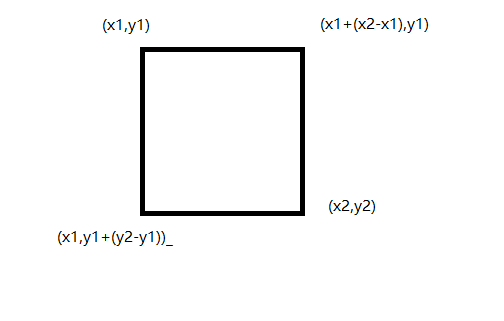

# 动画效果

动画效果是游戏的灵魂，没有动画就失去了许多乐趣，这里的动画指的是

_一个物体在连续帧下实现移动的过程_

例如有个小方块从左到右开始移动，中间的过程应该怎么绘画？  

比较直观的想是，把小方块左边的像素点先绘制为background颜色，再向右增加相应的像素点，中间的像素点先不变，这样既节省性能又不会导致操作冗余。

先来初步计算一下，例如每秒走10个像素点，那么在这1秒内。

小方块的变化是


左边少了10列像素点，右边多了10列，那么移动的算法就是

用

$x1$，$y1$，$x2$，$y2$

代表一个rectangle对角坐标，容易得出rectangle的四个角坐标分别是



**注意坐标系是左上角，向下为Y轴，向左为X轴**

现在设要移动的距离为$s$，移动时间为$t$，有$v=\frac{s}{t}$，现在设$v_x$是向水平方向的速度，记$v_x1$是向右移动的速度，且方向为正。

*此处$s$是像素点的距离(单位为pixel)*

假设$t_x1$为1$s$，$s_x1=100p$，所以$v_x1=\frac{100p}{1s}=100p/s$，即$v_x1=0.1p/ms=0.0001p/us$，现在得出了速度关系，根据以下函数

```c
//读取个某点的颜色值
//x,y:坐标
//返回值:此点的颜色
u16 LCD_ReadPoint(u16 x, u16 y)
```

```c
//快速画点
//x,y:坐标
//color:颜色
void LCD_Fast_DrawPoint(u16 x, u16 y, u16 color)
```

```c
void LCD_Fill(u16 sx,u16 sy,u16 ex,u16 ey,u16 color);		   				//填充单色
void LCD_Color_Fill(u16 sx,u16 sy,u16 ex,u16 ey,u16 *color);				//填充指定颜色
```

将尝试做一个让某个区域动起来的函数,*以毫秒为时间尺度*

```c


#include "animation.h"

//最大支持一下绘制65536行
//xru yru 是右上角的xy坐标
//column就是要移动的列像素
void verticalPixelsUpdate(short row, u16 x1, u16 y1, u16 x2, u16 y2, u16 ms)
{
    //首先获取某点的颜色,范围是
    short i, j;
    u16 color; //nextcolor//小优化,判断是否颜色相等,若相等则不draw
    u16 width = y2 - y1;

    if (row >= 0)
    {
        short end = y1 + row;
        if (end > 800)
        {
            end = 800;
        }
        for (i = y1; i <= y2, y1 <= end; i++, y1++, y2++)
        {
            for (j = x1; j <= x2; j++)
            {
                //读取坐标颜色后
                color = LCD_ReadPoint(j, i);
                // nextcolor = LCD_ReadPoint(i + length + 1, j);
                // color = RED;
                //向右画点
                LCD_Fast_DrawPoint(j, i + 1 + width, color);
                LCD_Fast_DrawPoint(j, i, BACK_COLOR);
            }
            delay_ms(ms);
        }
    }
    else
    {
        short end = y2 + row;
        if (end <= 0)
        {
            end = 0;
        }
        for (i = y2; i >= y1, y2 >= end; i--, y1--, y2--)
        {
            for (j = x1; j <= x2; j++)
            {
                //读取坐标颜色后
                color = LCD_ReadPoint(j, i);
                // nextcolor = LCD_ReadPoint(i + length + 1, j);
                // color = RED;
                //向右画点
                LCD_Fast_DrawPoint(j, i - 1 - width, color);
                LCD_Fast_DrawPoint(j, i, BACK_COLOR);
            }
            delay_ms(ms);
        }
    }
}
void horizontalPixelsUpdate(short column, u16 x1, u16 y1, u16 x2, u16 y2, u16 ms)
{
    //首先获取某点的颜色,范围是
    short i, j;
    u16 color; //nextcolor//小优化,判断是否颜色相等,若相等则不draw
    u16 length = x2 - x1;
    if (column >= 0)
    {
        short end = x1 + column;
        if (end > 800)
        {
            end = 800;
        }
        for (i = x1; i <= x2, x1 <= end; i++, x1++, x2++)
        {
            for (j = y1; j <= y2; j++)
            {
                //读取坐标颜色后
                color = LCD_ReadPoint(i, j);
                // nextcolor = LCD_ReadPoint(i + length + 1, j);
                // color = RED;
                //向右画点
                LCD_Fast_DrawPoint(i + 1 + length, j, color);
                LCD_Fast_DrawPoint(i, j, BACK_COLOR);
            }
            delay_ms(ms);
        }
    }
    else
    {
        short end = x2 + column;
        if (end < 0)
        {
            end = 0;
        }
        for (i = x2; i >= x1, x2 >= end; i--, x1--, x2--)
        {
            for (j = y1; j <= y2; j++)
            {
                //读取坐标颜色后
                color = LCD_ReadPoint(i, j);
                // nextcolor = LCD_ReadPoint(i + length + 1, j);
                // color = RED;
                //向右画点
                LCD_Fast_DrawPoint(i - 1 - length, j, color);
                LCD_Fast_DrawPoint(i, j, BACK_COLOR);
            }
            delay_ms(ms);
        }
    }
}
```

获取哪个方向的函数

```c
void animationMove(u16 x1, u16 y1, u16 x2, u16 y2, short s, float ts, u8 direction)
{

    float tms;       //
    u16 v_;
    tms = ts * 1000; //1000
    v_=s<0?tms/-s:tms/s;
    if (direction == 'x')
    {
        horizontalPixelsUpdate(s, x1, y1, x2, y2, v_);
    }
    else if (direction == 'y')
    {
        verticalPixelsUpdate(s, x1, y1, x2, y2,v_);
    }
}
```

最后效果

main函数是

```c
#include "sys.h"
#include "delay.h"
#include "usart.h"
#include "led.h"
#include "lcd.h"
#include "key.h"
#include "animation.h"
int main(void)
{
	u8 x = 0;
	// u8 lcd_id[12]; //存放LCD ID字符串
	NVIC_PriorityGroupConfig(NVIC_PriorityGroup_2); //设置系统中断优先级分组2
	delay_init(168);								//初始化延时函数
	uart_init(115200);								//初始化串口波特率为115200

	LED_Init(); //初始化LED
	LCD_Init(); //初始化LCD FSMC接口

	// POINT_COLOR = RED;								   //画笔颜色：红色
	// sprintf((char *)lcd_id, "LCD ID:%04X", lcddev.id); //将LCD ID打印到lcd_id数组。

	// POINT_COLOR=RED;
	KEY_Init();

	// LCD_Fill(200, 100, 250, 150, BLACK);
	while (1)
	{
		delay_ms(1000);
		LCD_Fill(200, 100, 250, 150, BLACK);
		animationMove(200, 100, 250, 150, -100, 1, 'y');
		LCD_Fill(200, 100, 250, 150, BLACK);
		animationMove(200, 100, 250, 150, 100, 1, 'y');
		LCD_Fill(200, 100, 250, 150, BLACK);
		animationMove(200, 100, 250, 150, -100, 1, 'x');
		LCD_Fill(200, 100, 250, 150, BLACK);
		animationMove(200, 100, 250, 150, 100, 1, 'x');
	}
}
```

最后效果

